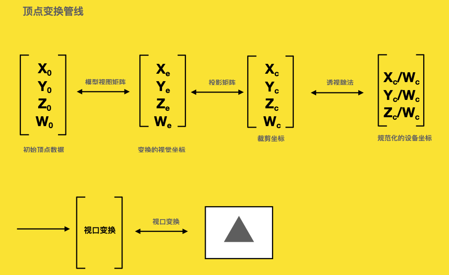
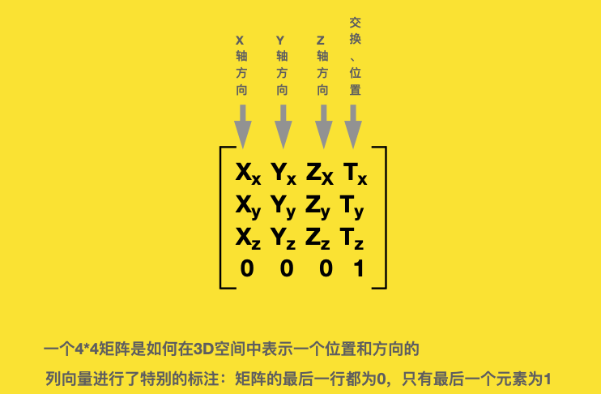
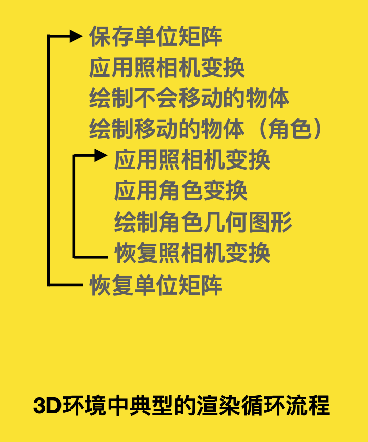

# 7.OpenGL顶点变化管线详解

## 一、顶点变化管线



## 二、使用矩阵堆栈

```cpp
// 类型
GLMatrixStack::GLMatrixStack(int iStackDepth = 64);

// 在堆栈顶部载⼊一个单元矩阵
void GLMatrixStack::LoadIdentity(void);

// 在堆栈顶部载⼊任何矩阵 
// 参数:4*4矩阵
void GLMatrixStack::LoadMatrix(const M3DMatrix44f m);

// 矩阵乘以矩阵堆栈顶部矩阵，相乘结果存储到堆栈的顶部
void GLMatrixStack::MultMatrix(const M3DMatrix44f);

// 获取矩阵堆栈顶部的值 GetMatrix 函数 
// 为了适应GLShaderMananger的使⽤，或者获取顶部矩阵的副本
const M3DMatrix44f & GLMatrixStack::GetMatrix(void);
void GLMatrixStack::GetMatrix(M3DMatrix44f mMatrix);
```

## 三、压栈、出栈

压栈: 存储⼀个状态 

出栈: 恢复⼀个状态

```cpp
// 将当前矩阵压⼊堆栈
void GLMatrixStack::PushMatrix(void);
// 将M3DMatrix44f 矩阵对象压入当前矩阵堆栈
void PushMatrix(const M3DMatrix44f mMatrix);
// 将GLFame对象压入矩阵对象
void PushMatrix(GLFame &frame);
// 出栈(出栈指的是移除顶部的矩阵对象) 
void GLMatrixStack::PopMatrix(void);
```

## 四、仿射变换

```cpp
//Rotate 函数angle参数是传递的度数，⽽不是弧度
void MatrixStack::Rotate(GLfloat angle,GLfloat x,GLfloat y,GLfloat z);
void MatrixStack::Translate(GLfloat x,GLfloat y,GLfloat z);
void MatrixStack::Scale(GLfloat x,GLfloat y,GLfloat z);
```

## 五、GLFrame

使⽤照相机(摄像机) 和 ⻆色帧 进⾏移动

```cpp
class GLFrame {
	protected:
	// Where am I? 
	M3DVector3f vOrigin; 
	// Where am I going?
	M3DVector3f vForward; 
	// Which way is up?
	M3DVector3f vUp;
}
// 将堆栈的顶部压入任何矩阵
void GLMatrixStack::LoadMatrix(GLFrame &frame);
// 矩阵乘以矩阵堆栈顶部的矩阵。相乘结果存储在堆栈的顶部
void GLMatrixStack::MultMatrix(GLFrame &frame);
// 将当前的矩阵压栈
void GLMatrixStack::PushMatrix(GLFrame &frame);
// GLFrame函数，这个函数⽤来检索条件适合的照相矩阵
void GetCameraMatrix(M3DMatrix44f m,bool bRotationOnly = flase);
```



