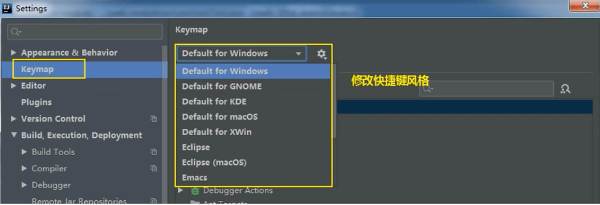
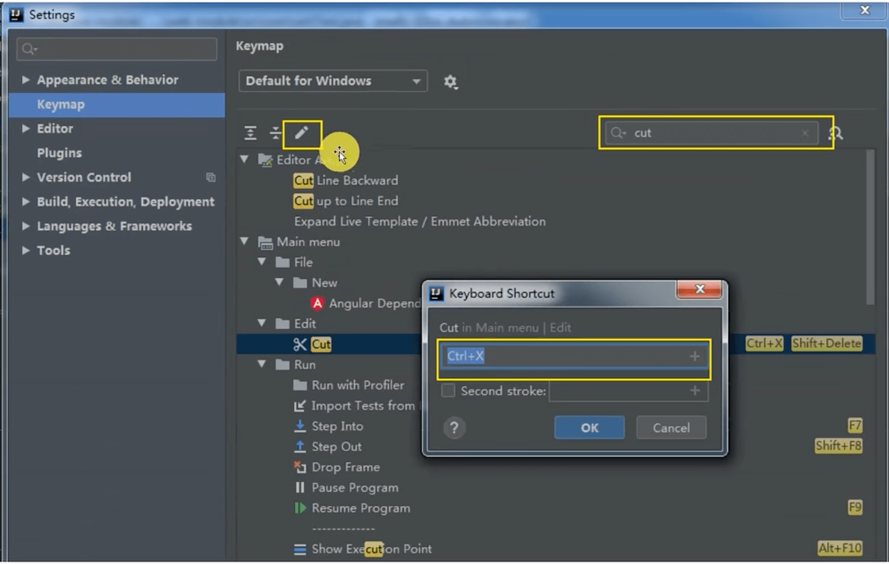
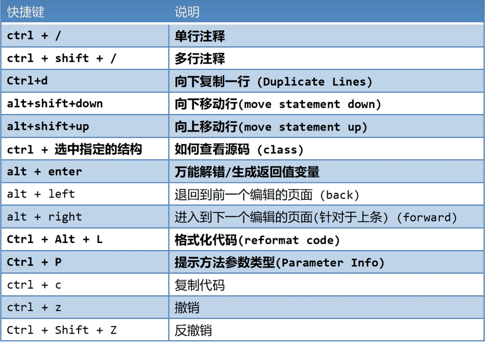
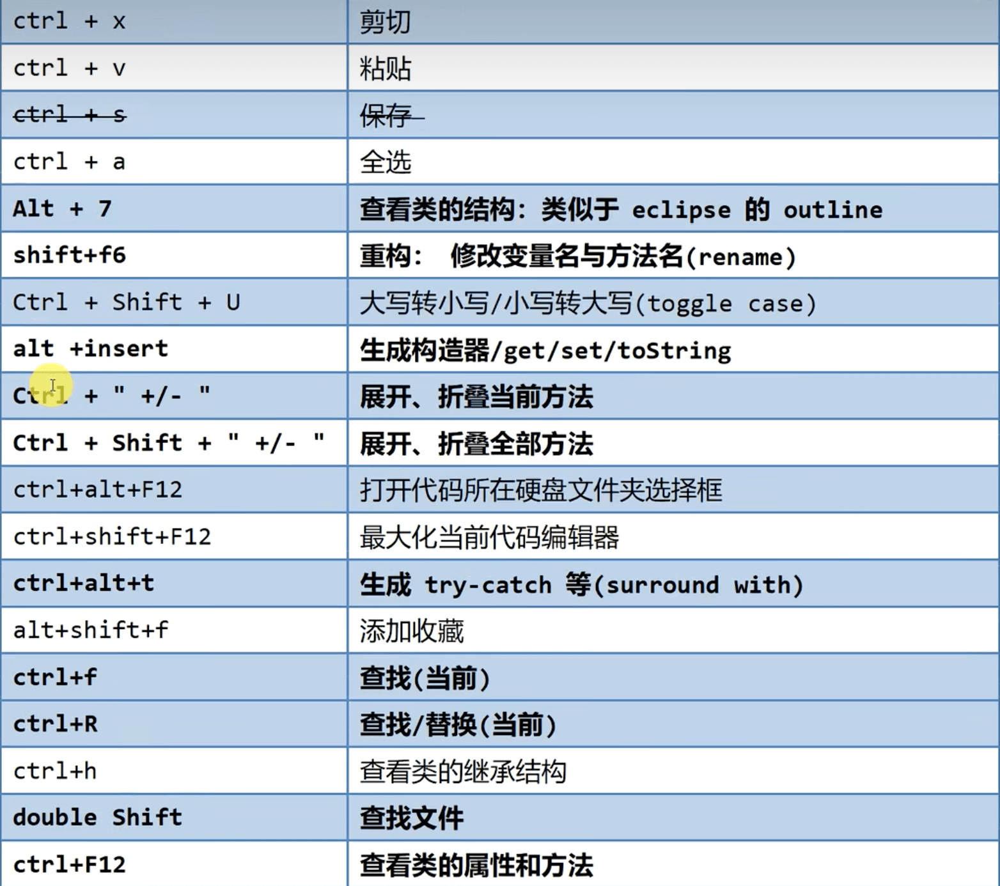

# IDEA快捷键

<object data="pages/idea/pdfs/ReferenceCardForMac.pdf" type="application/pdf" width="700px" height="555px"> 
    <embed src="pages/idea/pdfs/ReferenceCardForMac.pdf"> 
     This browser does not support PDFs. Please download the PDF to view it: <a href="pages/idea/pdfs/ReferenceCardForMac.pdf">Download PDF</a>.
 
    </embed>
</object> 

### 设置快捷键风格

### 修改快捷键

### 常用快捷键

Alt + 7 改为 Alt + F12
    

    备案号：
    <a href="https://beian.miit.gov.cn/" target="_blank">
        <!--  -->沪ICP备2022002183号-1
    </a >

