# IDEA创建项目

### 创建Java项目
--- 
1. 打开IDEA
2. 点击NewProject，显示NewProject窗口
3. 左边菜单默认选中New Project
4. 输入项目名称，指定项目路径、语言、Build System、JDK
5. 点击Create

### 创建Java中的package
---
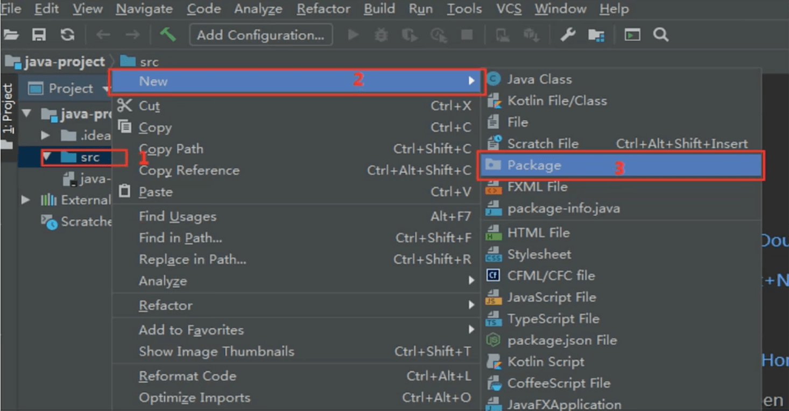

### 创建类、接口、枚举、注解
---
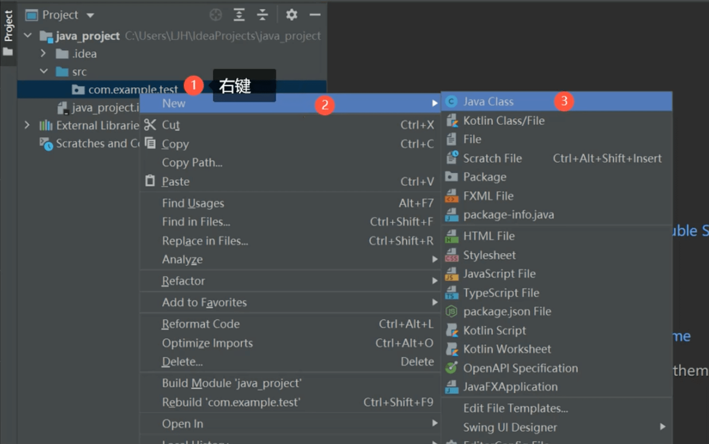

### 创建空项目和Module及相关操作
---
1. 打开IDEA
2. 点击NewProject，显示NewProject窗口
3. 左边菜单默认选中Empty Project
4. 输入项目名称
5. 点击Create

>创建Module

方式一：
1. 点击File->New->Module
2. 输入Module名称->点击Create

方式二：
1. 点击右上角设置
2. 点击Project Structure
3. 选中Modules，点击+
4. 输入Module名称->点击Create

>项目支持web

1. 右键module名称
2. Add Framework Support
3. 勾选Java EE->Web Application(4.0)
4. 点击OK

>删除Module

方式一：
1. 右键module名称
2. Remove Module

方式二：
1. 点击右上角设置
2. 点击Project Structure
3. 选中Modules，点击-

注意：Remove Module后，需要删除硬盘里的Module文件夹。

### 创建Java空项目和Module及相关操作
---

1. 创建一个Java项目
2. 删除src
3. 右键项目名称，New->Module

### 创建Maven的Java项目
---
>新建项目

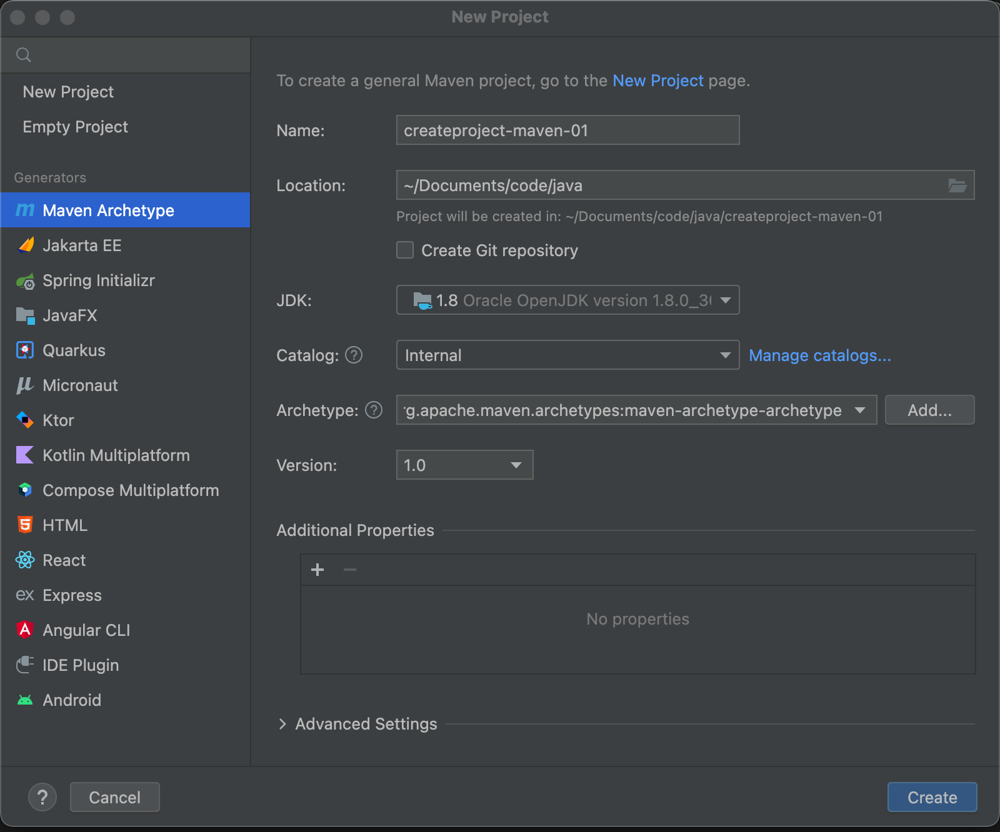

>编辑pom.xml

输入：
```
<dependencies>
    <dependency>
      <groupId>org.springframework</groupId>
      <artifactId>spring-context</artifactId>
      <version>5.3.16</version>
    </dependency>
    <dependency>
      <groupId>com.alibaba</groupId>
      <artifactId>druid</artifactId>
      <version>1.2.8</version>
    </dependency>
</dependencies>
```
点击右上角的刷新，即可自动下载对应版本的jar，查看如下：

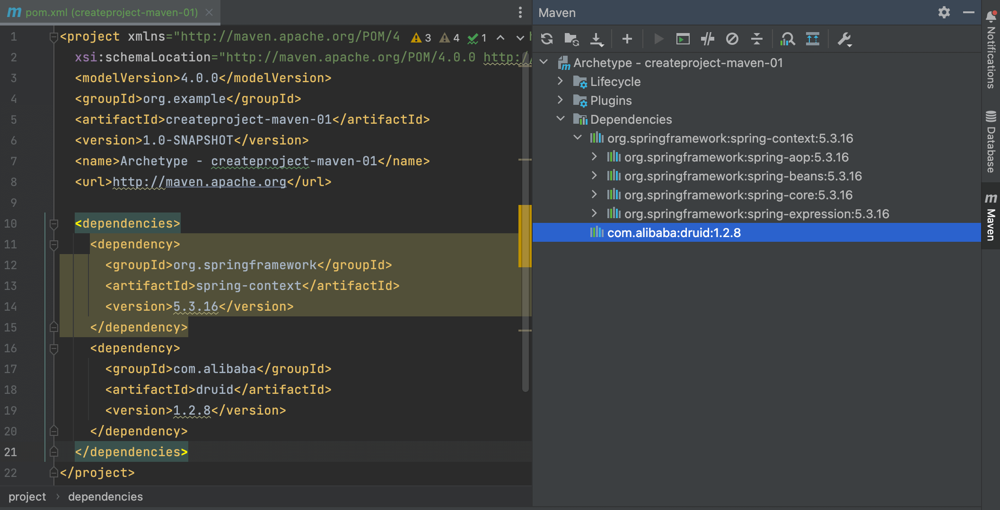

### 创建Maven的Web项目
---
>新建Module

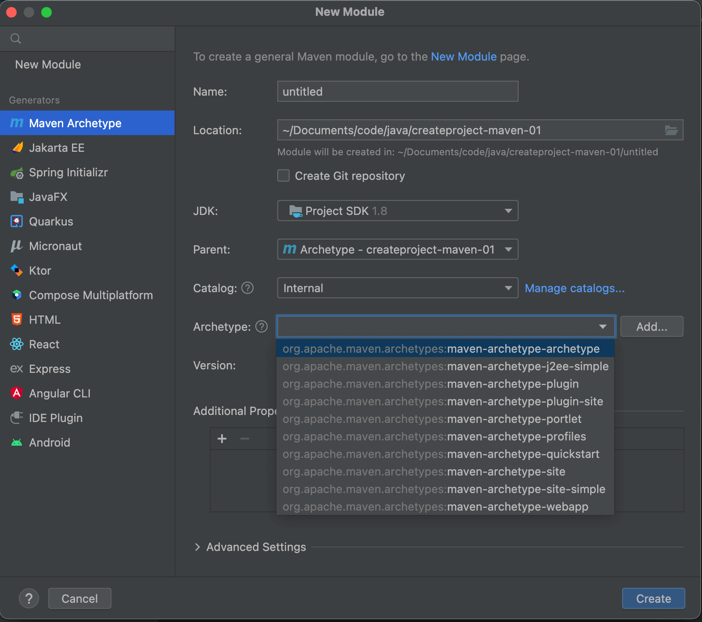
选中maven-archetype-webapp

>新建java文件夹

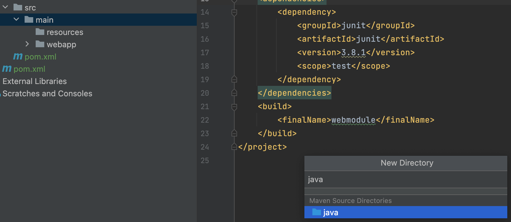

>运行

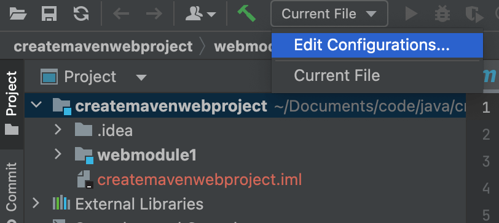

点击 Add new run configuration，选择Tomcat Local

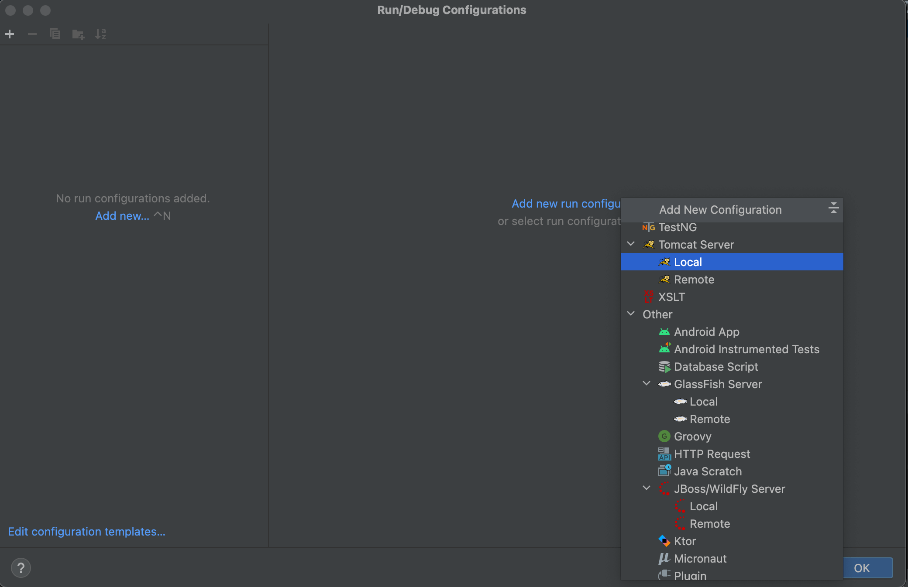
点击fix，点击xxx war，点击apply，点击OK，点击运行。
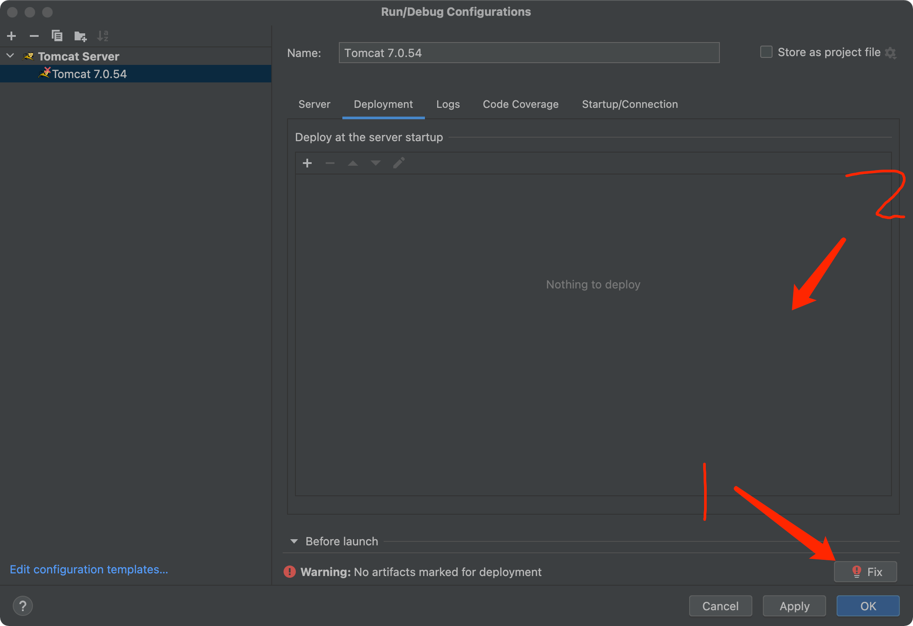

### 使用Maven创建SpringBoot项目
---
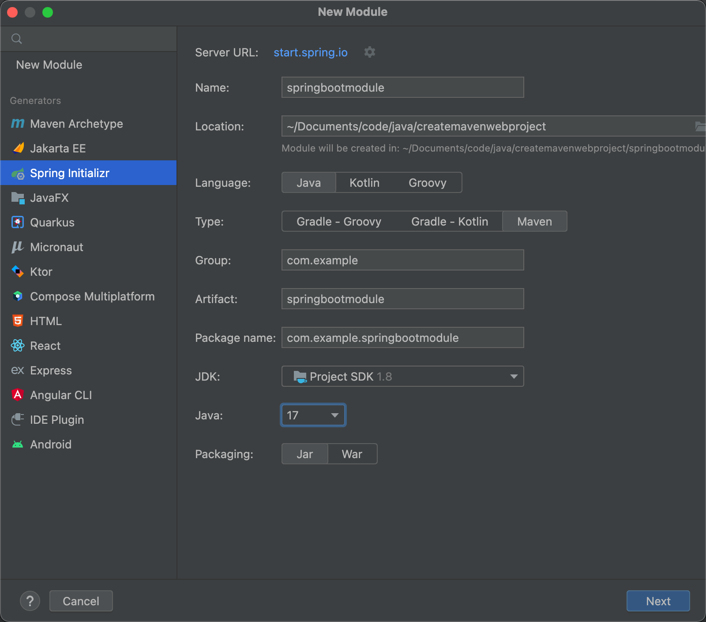
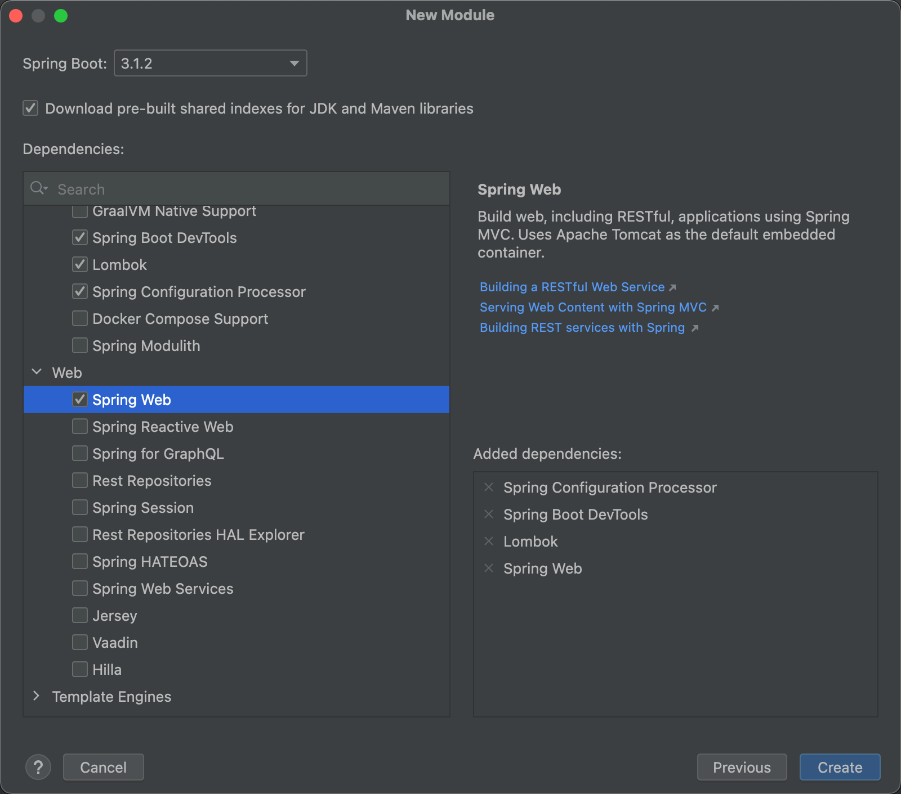

[IntelliJ IDEA右键无法创建Java Class文件](https://www.jianshu.com/p/3951df1c2a4d)

[错误:(3, 32) java: 程序包org.springframework.boot不存在的解决访问](http://www.ganhuopu.run/archives/%E9%94%99%E8%AF%AF332java%E7%A8%8B%E5%BA%8F%E5%8C%85orgspringframeworkboot%E4%B8%8D%E5%AD%98%E5%9C%A8%E7%9A%84%E8%A7%A3%E5%86%B3%E8%AE%BF%E9%97%AE)

[java 程序包org.springframework.boot不存在](https://juejin.cn/s/java%20%E7%A8%8B%E5%BA%8F%E5%8C%85org.springframework.boot%E4%B8%8D%E5%AD%98%E5%9C%A8)

[HttpMessageNotWritableException: No converter for [...] with preset Content-Type 'null'] with OpenApi Spring generator](https://stackoverflow.com/questions/63832966/httpmessagenotwritableexception-no-converter-for-with-preset-content-type)

[HttpMessageNotWritableException: No Converter for [class …] With Preset Content-Type](https://www.baeldung.com/spring-no-converter-with-preset)


<div style="margin: 0px;">
    备案号：
    <a href="https://beian.miit.gov.cn/" target="_blank">
        <!--  -->沪ICP备2022002183号-1
    </a >
</div>

