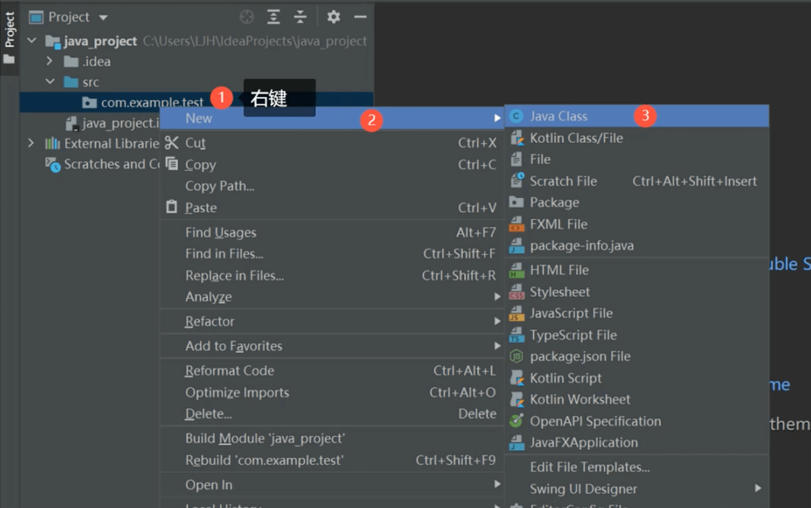

# IDEA创建项目

### 创建Java项目
--- 
1. 打开IDEA
2. 点击NewProject，显示NewProject窗口
3. 左边菜单默认选中New Project
4. 输入项目名称，指定项目路径、语言、Build System、JDK
5. 点击Create

### 设置常规视图界面
---

**注意**：由于项目具体的不同，展示的界面也不尽相同。

### 创建Java中的package
---

### 创建类、接口、枚举、注解
---

### 常用配置
---
>设置主题

>设置启动时是否打开项目

    

    备案号：
    <a href="https://beian.miit.gov.cn/" target="_blank">
        <!--  -->沪ICP备2022002183号-1
    </a >

