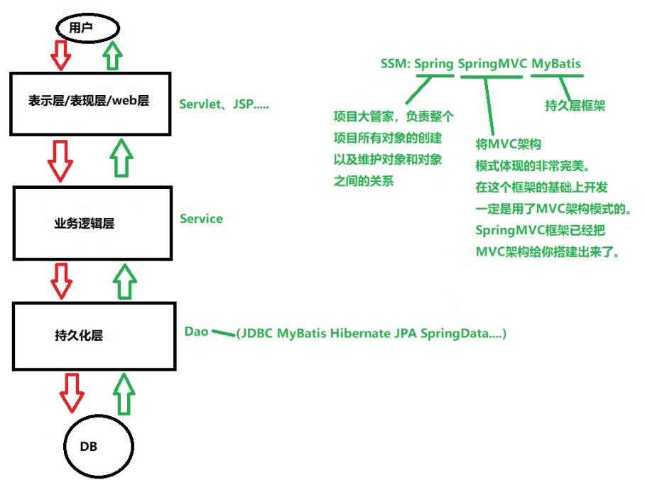

# 三层架构
---
* 23.12.18 23:47开始
* 23.12.19 23:42更新

## 三层架构图解

## 代码结构

* dao（包）
	* AccountDao
	* impl（包）
		* AccountDaoImpl
* exceptions（包）
	* AppException
* pojo（包）
	* Account
* service（包）
	* AccountService
	* impl（包）
		* AccountServiceImpl
* utils（包）
	* DBUtils
* web（包）
	* AccountServlet

## 视频

* start：https://www.bilibili.com/video/BV1Z3411C7NZ?p=71
