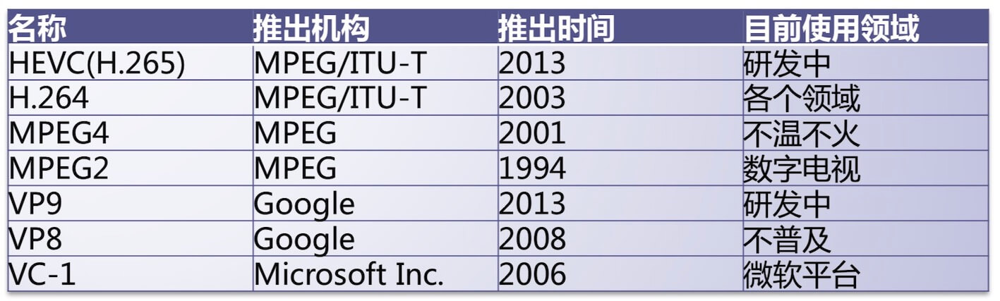

# FFmpeg基础知识

## 一、视频播放

### 1. 视频播放流程

通常看到视频格式：mp4、mov、flv、wmv等等…，称之为：封装格式。


### 2. 视频播放器

两种模式播放器：

#### (1) 可视化界面播放器

直接用户直观操作、简单易懂。例如腾讯视频、爱奇艺视频、QQ影音、暴风影音、快播、优酷等等。

#### (2) 非可视化界面播放器

命令操作播放器，用户看不懂，使用起来非常麻烦。例如FFmpeg的fplay（命令）播放器（内置播放器）、vlc播放器、mplayer播放器。

### 3. 视频信息查看工具

[MediaInfo](https://mediaarea.net/en/MediaInfo/Download/Mac_OS)：帮助我们查看视频完整信息，直接去AppStore下载即可，不过要3块钱。

ULtraEdit：直接查看视频二进制数据。
                
视频单项信息：

Elecard Format Analyzer：封装格式信息工具。

Elecard Stream Eye：视频编码信息工具。
                        
GLYUVPlayer：视频像素信息工具，最新的mac系统不支持了，这里用[YuvEye](https://www.zzsin.com/)替换。
        
Adobe Audition：音频采样数据工具。

## 二、音视频封装格式

### 1. 封装格式

mp4、mov、flv、wmv、avi、ts、mkv等等。


### 2. 封装格式作用
                        
视频流+音频流按照格式进行存储在一个文件中。
                
### 3.MPEG2-TS格式
                        
视频压缩数据格式：MPEG2-TS。特定：数据排版，不包含头文件，数据大小固定（188byte）的TS-Packet。


### 4. FLV格式
                        
#### (1) 优势

由于它形成的文件极小、加载速度极快，使得网络观看视频文件成为可能，它的出现有效地解决了视频文件导入Flash后，使导出的SWF文件体积庞大，不能在网络上很好的使用等问题。
 
#### (2) 文件结构

FLV是一个二进制文件，由文件头（FLV header）和很多tag组成。tag又可以分成三类：audio,video,script，分别代表音频流，视频流，脚本流（关键字或者文件信息之类）。


#### (3) FLV文件

FLV文件=FLV头文件+ tag1+tag内容1 + tag2+tag内容2 + ...+... + tagN+tag内容N。
                        
#### (4) FLV头文件

1-3： 前3个字节是文件格式标识(FLV 0x46 0x4C 0x56)。

4-4： 第4个字节是版本（0x01）。

5-5： 第5个字节的前5个bit是保留的必须是0。

6-9: 第6-9的四个字节还是保留的.其数据为 00000009。

整个文件头的长度，一般是9（3+1+1+4）。

## 三、视频编码数据

### 1. 视频编码作用
                                
将视频像素数据（YUV、RGB）进行压缩成为视频码流，从而降低视频数据量。（减小内存暂用）
                        
### 2. 视频编码格式


                                
### 3. H.264视频压缩数据格式

非常复杂算法->压缩->占用内存那么少？（例如：帧间预测、帧内预测…）->提高压缩性能。


## 四、音频编码数据

### 1. 音频编码作用

将音频采样数据（PCM格式）进行压缩成为音频码流，从而降低音频数据量。（减小内存暂用）

### 2. 音频编码格式


### 3. AAC格式

AAC，全称Advanced Audio Coding，是一种专为声音数据设计的文件压缩格式。与MP3不同，它采用了全新的算法进行编码，更加高效，具有更高的“性价比”。利用AAC格式，可使人感觉声音质量没有明显降低的前提下，更加小巧。苹果ipod、诺基亚手机支持AAC格式的音频文件。

#### (1) 优点

相对于mp3，AAC格式的音质更佳，文件更小。

#### (2) 不足

AAC属于有损压缩的格式，与时下流行的APE、FLAC等无损格式相比音质存在“本质上”的差距。加之，传输速度更快的USB3.0和16G以上大容量MP3正在加速普及，也使得AAC头上“小巧”的光环不复存在。

#### (3) 特点

①提升的压缩率：可以以更小的文件大小获得更高的音质；

②支持多声道：可提供最多48个全音域声道；

③更高的解析度：最高支持96KHz的采样频率；

④提升的解码效率：解码播放所占的资源更少；

## 五、视频像素数据

### 1. 作用

保存了屏幕上面每一个像素点的值。

### 2. 数据格式

常见格式：RGB24、RGB32、YUV420P、YUV422P、YUV444P等等…一般最常见：YUV420P。

RGB格式：


### 3. 数据文件大小

例如：RGB24高清视频体积？（1个小时时长）。

体积：3600 x 25 x 1920 x 1080 * 3 = 559GB（非常大）。

假设：帧率25HZ，采样精度8bit，3个字节。

### 4. YUV播放器

人类：对色度不敏感，对亮度敏感。

Y表示：亮度，UV表示：色度。

## 六、音频采样数据

### 1. 作用

保存了音频中的每一个采样点值。

### 2. 数据文件大小

例如：1分钟PCM格式歌曲。

体积：60 x 44100 x 2 x 2 = 11MB。

分析：60表示时间，44100表示采样率（一般情况下，都是这个采样率，人的耳朵能够分辨的声音），2表示声道数量，2表示采样精度16位 = 2字节。

### 3. 工具

Audition
                                
### 4. PCM格式
                                


## 七、FFmpeg安装

### 1. 安装弯路

参考这片文章（[mac下ffmpeg安装](https://www.jianshu.com/p/f6990aee6c7f)），我没搞成功。

执行命令：
```
brew install ffmpeg
```
出现错误：
```
Error: Xcode alone is not sufficient on Big Sur.
Install the Command Line Tools:
  xcode-select --install
```
开始执行`xcode-select --install`，安装xcode命令行，这里又个问题，为啥[我有xcode还得装这个](https://stackoverflow.com/questions/47460085/error-message-xcode-alone-is-not-sufficient-on-sierra)。
出现错误：
```
Error: No such file or directory @ rb_sysopen - /Users/chenchangqing/Library/Caches/Homebrew/downloads/c1e04fd8a5516a3a63dd106e38df40a2d44af18cc3f3d366e5ba0563d2f95570--openexr-3.1.4.big_sur.bottle.tar.gz
```
查[资料](https://blog.csdn.net/weixin_40509040/article/details/121221676)后，先后执行了以下命令：
```
brew install openexr
brew install libvmaf
brew install freetype
```
一直处于：

又卡住了：
```
==> Applying configure-big_sur.diff
patching file configure
Hunk #1 succeeded at 9513 (offset 780 lines).
==> ./configure --prefix=/usr/local/Homebrew/Cellar/gettext/0.21 --with-included-glib --w
==> make
```
出现错误，依次执行：
```
brew install sqlite
brew install meson
brew install harfbuzz
```
放弃...

### 2. 正确方法

最后看了这篇文章，[Mac OS上使用ffmpeg的“血泪”总结](https://zhuanlan.zhihu.com/p/90099862)，按文章执行如下步骤：

```
brew tap homebrew-ffmpeg/ffmpeg
brew install homebrew-ffmpeg/ffmpeg/ffmpeg
```
安装成功。

## 八、FFmpeg应用

提供了一套比较完整代码，开源免费。核心架构设计思想：（核心 + 插件）设计。

### 1. ffmpeg

#### (1) 作用

用于对视频进行转码，将mp4->mov，mov->mp4，wmv->mp4等等。

#### (2) 命令格式

ffmpeg -i {指定输入文件路径} -b:v {输出视频码率} {输出文件路径}。

#### (3) 测试运行

下载[test.mov](https://gitee.com/learnany/ffmpeg/tree/master/resources/test.mov)，修改码率，mov转mp4。
```
ffmpeg -i test.mov -b:v 234k -b:a 64k test.mp4
```
#### (4) 常用脚本

[topmp4.sh](https://gitee.com/learnany/ffmpeg/blob/master/03_ffmpeg_base_knowledge/topmp4.sh)，[to1080pmp4.sh](https://gitee.com/learnany/ffmpeg/blob/master/03_ffmpeg_base_knowledge/to1080pmp4.sh)

#### (4) 案例：视频转为高质量GIF动图

```
ffmpeg -ss 00:00:03 -t 3 -i Test.mov -s 640x360 -r “15” dongtu.gif
```

1) -ss 00:00:03 表示从第 00 分钟 03 秒开始制作 GIF，如果你想从第 9 秒开始，则输入 -ss 00:00:09，或者 -ss 9，支持小数点，所以也可以输入 -ss 00:00:11.3，或者 -ss 34.6 之类的，如果不加该命令，则从 0 秒开始制作；

2) -t 3 表示把持续 3 秒的视频转换为 GIF，你可以把它改为其他数字，例如 1.5，7 等等，时间越长，GIF 体积越大，如果不加该命令，则把整个视频转为 GIF；

3) -i 表示 invert 的意思吧，转换；

4) Test.mov 就是你要转换的视频，名称最好不要有中文，不要留空格，支持多种视频格式；

5) -s 640x360 是 GIF 的分辨率，视频分辨率可能是 1080p，但你制作的 GIF 可以转为 720p 等，允许自定义，分辨率越高体积越大，如果不加该命令，则保持分辨率不变；

6) -r “15” 表示帧率，网上下载的视频帧率通常为 24，设为 15 效果挺好了，帧率越高体积越大，如果不加该命令，则保持帧率不变；

7) dongtu.gif：就是你要输出的文件，你也可以把它命名为 hello.gif 等等。

### 2. ffplay

格式：ffplay {文件路径}，如下：
```
ffplay test.mov
```

