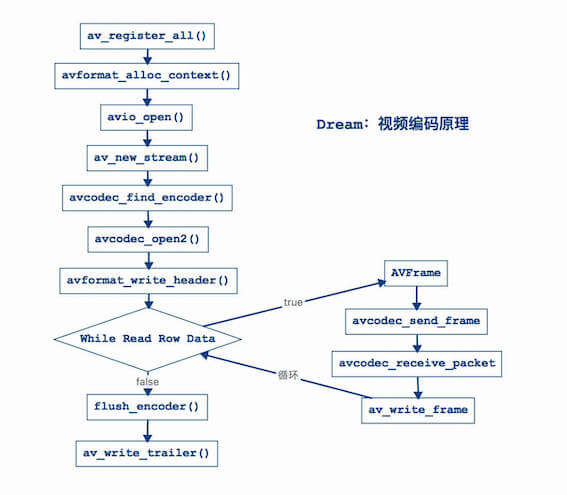

# FFmpeg视频编码

[Android代码工程](https://gitee.com/learnany/ffmpeg/tree/master/06_ffmpeg_video_encoding/AndroidFFmpegEncodingVideo)

[iOS代码工程](https://gitee.com/learnany/ffmpeg/tree/master/06_ffmpeg_video_encoding/iOSFFmpegEncodingVideo)

## 一、视频编码流程



### 第一步：注册组件

`av_register_all`：例如：编码器、解码器等等。

```c
// 第一步：注册组件
av_register_all();
```
        
### 第二步：初始化封装格式上下文

```c
// 第二步：初始化封装格式上下文
AVFormatContext *avformat_context = avformat_alloc_context();
const char *coutFilePath = env->GetStringUTFChars(out_file_path, NULL);
// iOS使用
// const char *coutFilePath = [outFilePath UTF8String];
AVOutputFormat *avoutput_format = av_guess_format(NULL, coutFilePath, NULL);
// 设置视频压缩数据格式类型(h264、h265、mpeg2等等...)
avformat_context->oformat = avoutput_format;
```

### 第三步：打开输出文件

```c
// 第三步：打开输出文件
// 参数一：输出流
// 参数二：输出文件
// 参数三：权限->输出到文件中
if (avio_open(&avformat_context->pb, coutFilePath, AVIO_FLAG_WRITE) < 0) {
    __android_log_print(ANDROID_LOG_INFO, "main", "打开输出文件失败");
    // iOS使用
    // NSLog(@"打开输出文件失败");
    return;
}
```

### 第四步：创建输出码流

```c
// 第四步：创建输出码流
// 注意：创建了一块内存空间，并不知道他是什么类型流，希望他是视频流
AVStream *av_video_stream = avformat_new_stream(avformat_context, NULL);
```

### 第五步：初始化编码器上下文

#### 1. 获取编码器上下文

```c
// 5.1 获取编码器上下文
AVCodecContext *avcodec_context = av_video_stream->codec;
```

#### 2. 设置视频编码器ID

```c
// 5.2 设置视频编码器ID
avcodec_context->codec_id = avoutput_format->video_codec;
```

#### 3. 设置为视频编码器

```c
// 5.3 设置为视频编码器
avcodec_context->codec_type = AVMEDIA_TYPE_VIDEO;
```

#### 4. 设置像素数据格式

```c
// 5.4 设置像素数据格式
// 编码的是像素数据格式，视频像素数据格式为YUV420P(YUV422P、YUV444P等等...)
// 注意：这个类型是根据你解码的时候指定的解码的视频像素数据格式类型
avcodec_context->pix_fmt = AV_PIX_FMT_YUV420P;
```

#### 5. 设置视频尺寸

```c
// 5.5 设置视频尺寸
avcodec_context->width = 640;
avcodec_context->height = 352;
```

#### 6. 设置视频帧率

```c
// 5.6 设置视频帧率
// 视频帧率：25fps（每秒25帧）
// 单位：fps，"f"表示帧数，"ps"表示每秒
avcodec_context->time_base.num = 1;
avcodec_context->time_base.den = 25;
```

#### 7. 设置视频码率

```c
// 5.7 设置视频码率

//（1）什么是码率？
// 含义：每秒传送的比特(bit)数单位为 bps(Bit Per Second)，比特率越高，传送数据速度越快。
// 单位：bps，"b"表示数据量，"ps"表示每秒。

//（2）什么是视频码率?
// 含义：视频码率就是数据传输时单位时间传送的数据位数，一般我们用的单位是kbps即千位每秒。

//（3）视频码率计算如下？
// 基本的算法是：码率（kbps）= 视频大小 - 音频大小（bit位）/ 时间（秒）。
// 例如：Test.mov时间 = 24秒，文件大小（视频+音频） = 1.73MB。
// 视频大小 = 1.34MB（文件占比：77%）= 1.34MB * 1024 * 1024 * 8 / 24 = 字节大小 = 468365字节 = 468Kbps。
// 音频大小 = 376KB（文件占比：21%）。
// 计算出来的码率 : 468Kbps，K表示1000，b表示位（bit）。
// 总结：码率越大，视频越大。
avcodec_context->bit_rate = 468000;
```

#### 8. 设置GOP

```c
// 5.8 设置GOP
// 影响到视频质量问题，是一组连续画面

//（1）MPEG格式画面类型
// 3种类型：I帧、P帧、B帧。

//（2）I帧：
// 内部编码帧，是原始帧（原始视频数据）
// 是完整画面，是关键帧（必需的有，如果没有I，那么你无法进行编码，解码）。
// 视频第1帧：视频序列中的第一个帧始终都是I帧，因为它是关键帧。

//（3）P帧
// 向前预测帧
// 预测前面的一帧类型，处理前面的一阵数据(->I帧、B帧)。
// P帧数据根据前面的一帧数据进行处理得到了P帧。

//（4）B帧
// 前后预测帧（双向预测帧），前面一帧和后面一帧的差别。
// B帧压缩率高，但是对解码性能要求较高。

//（5）总结
// I只需要考虑自己 = 1帧，P帧考虑自己+前面一帧 = 2帧，B帧考虑自己+前后帧 = 3帧
// 说白了，P帧和B帧是对I帧压缩。
// 每250帧，插入1个I帧，I帧越少，视频越小
avcodec_context->gop_size = 250;
```

#### 9. 设置量化参数

```c
// 5.9 设置量化参数
// 数学算法（高级算法），量化系数越小，视频越是清晰
// 一般情况下都是默认值，最小量化系数默认值是10，最大量化系数默认值是51
avcodec_context->qmin = 10;
avcodec_context->qmax = 51;
```

#### 10. 设置b帧最大值

```c
// 5.10 设置b帧最大值
// 设置不需要B帧
avcodec_context->max_b_frames = 0;
```

### 第六步：查找视频编码器

```c
// 第六步：查找视频编码器
AVCodec *avcodec = avcodec_find_encoder(avcodec_context->codec_id);
if (avcodec == NULL) {
    __android_log_print(ANDROID_LOG_INFO, "main", "找不到编码器");
    // iOS使用
    // NSLog(@"找不到编码器");
    return;
}

__android_log_print(ANDROID_LOG_INFO, "main", "编码器名称为：%s", avcodec->name);
// iOS使用
// NSLog(@"编码器名称为：%s", avcodec->name);
```

#### 1. 出现问题

新建测试工程（稍后会介绍建工程测试），代码运行到这一步会出现“找不到编码器”，因为编译库没有依赖x264库（默认情况下FFmpeg没有编译进行h264库）。

#### 2. 解决问题

##### (1) 下载源码

[x264库](https://www.videolan.org/developers/x264.html)，翻墙更快。

```
git clone https://code.videolan.org/videolan/x264.git
```

##### (2) 下载ndk

https://developer.android.google.cn/ndk/downloads/older_releases.html

我这里使用的是[ndkr10e](https://dl.google.com/android/repository/android-ndk-r10e-darwin-x86_64.zip?hl=zh-cn)。

在x264源码的同目录下新建ndk文件交，将下载好的ndk放入ndk文件夹。

##### (3) 编译x264脚本

编译x264的.a静态库，指定编译平台类型：iOS平台、安卓平台、Mac平台、Windows平台等等。

[android_build_x264.sh](https://gitee.com/learnany/ffmpeg/blob/master/06_ffmpeg_video_encoding/android-build-x264.sh)是编译脚本，将编译脚本放在和源码的同一目录，执行：

```
sh android-build-x264.sh
```
执行过程会提示开机密码，看到`Android h264 builds finished`说明编译成功。

##### (4) 编译FFmpeg

修改Android的FFmpeg动态库编译脚本，将x264库其编译进去。[android-build-ffmpeg.sh](https://gitee.com/learnany/ffmpeg/blob/master/01_ffmpeg_compiled/android-build-ffmpeg.sh)是原来的编译脚本，在原来的编译脚本./configure增加如下选项。

```
# 以下是编译x264库增加的
# 禁用所有编码器
--disable-encoders \
# 通过libx264库启用H.264编码
--enable-libx264 \
# 启用编码器名称
--enable-encoder=libx264 \
# 启用几个图片编码，由于生成视频预览
--enable-encoder=mjpeg \
--enable-encoder=png \
#和FFmpeg动态库一起编译，指定你之前编译好的x264静态库和头文件
--extra-cflags="-I/Users/chenchangqing/Documents/code/ffmpeg/06_ffmpeg_video_encoding/android_build_x264/include" \
--extra-ldflags="-L/Users/chenchangqing/Documents/code/ffmpeg/06_ffmpeg_video_encoding/android_build_x264/lib" \
```
[android-build-ffmpeg-x264.sh](https://gitee.com/learnany/ffmpeg/blob/master/06_ffmpeg_video_encoding/android-build-ffmpeg-x264.sh)是修改后的脚本，再次[编译FFmpeg库](http://www.1221.site/FFmpeg/01_FFmpeg%E7%BC%96%E8%AF%91.html)，重新生成.so动态库。

重新编译，发现错误：
```
libavcodec/libx264.c: In function 'X264_frame':
libavcodec/libx264.c:282:9: error: 'x264_bit_depth' undeclared (first use in this function)
     if (x264_bit_depth > 8)
         ^
libavcodec/libx264.c:282:9: note: each undeclared identifier is reported only once for each function it appears in
libavcodec/libx264.c: In function 'X264_init_static':
libavcodec/libx264.c:892:9: error: 'x264_bit_depth' undeclared (first use in this function)
     if (x264_bit_depth == 8)
         ^
make: *** [libavcodec/libx264.o] Error 1
```
查询资料（[“x264_bit_depth”未声明](https://serverok.in/error-x264_bit_depth-undeclared)），是因为ffmpeg和x264不兼容，这里不使用最新版本的x264，尝试另一个版本的[x264](https://gitee.com/learnany/ffmpeg/blob/master/06_ffmpeg_video_encoding/x264.zip)，重新编译，再重新生成.so动态库。

再次运行测试工程，成功输出：
```
I/main: 编码器名称为：libx264
```
问题解决。

#### 3. 解决问题（iOS）

这个问题在iOS上也是存在的，这里也列出解决步骤。

##### (1) 下载源码

[x264库](https://www.videolan.org/developers/x264.html)，翻墙更快。

```
git clone https://code.videolan.org/videolan/x264.git
```

##### (2) 编译x264脚本

[ios-build-x264.sh](https://gitee.com/learnany/ffmpeg/blob/master/06_ffmpeg_video_encoding/ios-build-x264.sh)是编译脚本，将编译脚本放在和源码的同一目录，执行：

```
sh ios-build-x264.sh
```
注意：如果使用旧版本的x264，比如这个[x264](https://gitee.com/learnany/ffmpeg/blob/master/06_ffmpeg_video_encoding/x264.zip)，会出现下面的问题，所以我这里使用的当时最新的x264。
```
Out of tree builds are impossible with config.h/x264_config.h in source dir.
```

##### (3) 编译FFmpeg

修改iOS的FFmpeg库编译脚本，将x264库其编译进去。[ios-build-ffmpeg.sh](https://gitee.com/learnany/ffmpeg/blob/master/01_ffmpeg_compiled/ios-build-ffmpeg.sh)是原来的编译脚本，在原来的编译脚本./configure增加如下选项。

```
# 以下是编译x264库增加的
--enable-gpl \
--disable-encoders \
--enable-libx264 \
--enable-encoder=libx264 \
--enable-encoder=mjpeg \
--enable-encoder=png \
--extra-cflags="-I/Users/yangshaohong/Desktop/ffmpeg-test/test/thin-x264/arm64/include" \
--extra-ldflags="-L/Users/yangshaohong/Desktop/ffmpeg-test/test/thin-x264/arm64/lib" \
```
[ios-build-ffmpeg-x264.sh](https://gitee.com/learnany/ffmpeg/blob/master/06_ffmpeg_video_encoding/ios-build-ffmpeg-x264.sh)是修改后的脚本，再次[编译FFmpeg库](http://www.1221.site/FFmpeg/01_FFmpeg%E7%BC%96%E8%AF%91.html)，重新生成.a静态库。

用了最新的x264，还是出现了问题：
```
src/libavcodec/libx264.c:282:9: error: use of undeclared identifier 'x264_bit_depth'
    if (x264_bit_depth > 8)
        ^
src/libavcodec/libx264.c:892:9: error: use of undeclared identifier 'x264_bit_depth'
    if (x264_bit_depth == 8)
        ^
src/libavcodec/libx264.c:894:14: error: use of undeclared identifier 'x264_bit_depth'
    else if (x264_bit_depth == 9)
             ^
src/libavcodec/libx264.c:896:14: error: use of undeclared identifier 'x264_bit_depth'
    else if (x264_bit_depth == 10)
             ^
4 errors generated.
make: *** [libavcodec/libx264.o] Error 1
make: *** Waiting for unfinished jobs....
```
查询资料（[“x264_bit_depth”未声明](https://serverok.in/error-x264_bit_depth-undeclared)），是因为ffmpeg和x264不兼容，这里不使用最新版本的x264，尝试另一个版本的[x264-snapshot-20180730-2245-stable.tar.bz2](https://gitee.com/learnany/ffmpeg/blob/master/06_ffmpeg_video_encoding/x264-snapshot-20180730-2245-stable.tar.bz2)，重新编译，成功生成了支持h264编码的FFmpeg静态库。

注意：这里x264和ffmpeg都指定了arm64的架构。

### 第七步：打开视频编码器

注意：代码中的“优化步骤”是必须的，要不然编码过程会有坑。

```c
// 第七步：打开视频编码器
// 以下是编码优化步骤，必须有，要不然编码会出问题
// 编码延时问题，编码选项->编码设置
AVDictionary *param = 0;
if (avcodec_context->codec_id == AV_CODEC_ID_H264) {
    // 需要查看x264源码->x264.c文件
    // 第一个值：预备参数
    // key: preset
    // value: slow->慢
    // value: superfast->超快
    av_dict_set(&param, "preset", "slow", 0);
    // 第二个值：调优
    // key: tune->调优
    // value: zerolatency->零延迟
    av_dict_set(&param, "tune", "zerolatency", 0);
}
// 打开编码器
if (avcodec_open2(avcodec_context, avcodec, &param) < 0) {
    __android_log_print(ANDROID_LOG_INFO, "main", "打开编码器失败");
    // iOS使用
    // NSLog(@"打开编码器失败");
    return;
}
```

### 第八步：写入文件头信息

```c
// 第八步：写入文件头信息
avformat_write_header(avformat_context, NULL);
```

### 第九步：打开yuv文件

```c
// 第九步：打开yuv文件
// 遇到问题：fopen Permission denied
const char *cinFilePath = env->GetStringUTFChars(in_file_path, NULL);
// iOS使用
// const char *cinFilePath = [inFilePath UTF8String];
int errNum = 0;
FILE *in_file = fopen(cinFilePath, "rb");
if (in_file == NULL) {
    errNum = errno;
    __android_log_print(ANDROID_LOG_INFO, "main", "文件不存在:%s,in_file:%s,errNum:%d,reason:%s", cinFilePath, in_file, errNum, strerror(errNum));
    // iOS使用
    // NSLog(@"文件不存在");
    return;
}
```

这一步有坑，打开yuv文件（fopen）一直出现“Permission denied”错误，困扰了有一天，最后还是没有找到很好的办法，但是有个临时解决办法，就是先执行视频解码为.yuv文件，这个时候去打开（fopen）刚生成的.yuv文件，是可以成功的。

### 第十步：视频编码准备

```c
// 第十步：视频编码准备
// 10.1 创建视频原始数据帧
// 作用：存储视频原始数据帧
AVFrame *av_frame = av_frame_alloc();

// 10.2 创建一个缓冲区
// 作用：用于缓存读取视频数据
// 先获取缓冲区大小
int buffer_size = av_image_get_buffer_size(avcodec_context->pix_fmt,
                                           avcodec_context->width,
                                           avcodec_context->height,
                                           1);
// 创建一个缓冲区，作用是缓存一帧视频像素数据
uint8_t *out_buffer = (uint8_t *) av_malloc(buffer_size);

// 10.3 填充视频原始数据帧
av_image_fill_arrays(av_frame->data,
                     av_frame->linesize,
                     out_buffer,
                     avcodec_context->pix_fmt,
                     avcodec_context->width,
                     avcodec_context->height,
                     1);

// 10.4 创建压缩数据帧数据
// 作用：接收压缩数据帧数据
AVPacket *av_packet = (AVPacket *) av_malloc(buffer_size);
```

### 第十一步：循环读取视频像素数据

视频编码读取视频像素数据问题分析？

>答案如下：

    比例规范：y : u : v = 4 : 1 : 1
    然后规范：y = width（视频宽）* height（高）
    假设：width = 100，height = 10
    所以：y = width * height = 1000
    所以：u = y / 4 = 1000 / 4 = 250，v = y / 4 = 1000 / 4 = 250
    也就是说：一帧yuv大小 = 1500
    编码的时候读取一帧数据：fread(out_buffer, 1, y_size * 3 / 2, in_file)
    y_size * 3 / 2 = 1000 * 3 / 2 = 1500
    代码：av_frame->data[0] = out_buffer
    解释：指针是从out_buffer = 0开始，所以data[0]读取范围：0-1000
    代码：av_frame->data[1] = out_buffer + y_size
    解释：指针是从out_buffer + y_size = 0 + 1000 = 1000开始，所以data[1]读取范围：1000-1250
    代码：av_frame->data[2] = out_buffer + y_size * 5 / 4
    解释：指针是从out_buffer + y_size * 5 / 4 = 0 + 1000 * 5 / 4 = 1250开始，所以data[2]读取范围：1250-1500

    一帧数据->大小 = Y大小 + U大小 + V大小
    假设：width = 100，height = 10
        Y大小：y = width * height = 100 * 10 = 1000
        U大小：u = y / 4 = 1000 / 4 = 250
        V大小：v = y / 4 = 1000 / 4 = 250
        一帧数据大小 = Y + U + V = 1500
    视频解码计算->指针位移处理
        保存Y大小：
            fwrite(avframe_yuv420p->data[0], 1, y_size, file_yuv420p);
            avframe_yuv420p->data[0]->表示Y值
            读取：0->1000
        保存U大小
            fwrite(avframe_yuv420p->data[1], 1, u_size, file_yuv420p);
            avframe_yuv420p->data[1]->表示U值
            读取：1000->1250
        保存V大小
            fwrite(avframe_yuv420p->data[2], 1, v_size, file_yuv420p);
            avframe_yuv420p->data[2]->表示V值
            读取：1250->1500
    视频编码计算->指针位移计算
        分析读取数据大小？
            y = 1000
            数据大小 = 一帧YUV数据 = Y + U + V = 1500
            数据大小 = y * 3 / 2 = 1000 * 3 / 2 = 1500
            现在我们视频编码根据Y大小，求出YUV大小计算公式
            out_buffer = 1500（总的数据量）
        保存Y大小
            av_frame->data[0] = out_buffer;
            读取Y数据->1000
            读取：0->1000
        保存U大小
            av_frame->data[1] = out_buffer + y_size;
            读取U数据->250
            读取：0 + 1000 -> 1250
        保存V大小
            av_frame->data[2] = out_buffer + y_size * 5 / 4;
            读取V数据->250
            读取：0 + 1000 * 5 / 4 = 1250->1500
        说白了：通过Y值得到V读取起点位置

```c
// 第十一步：循环读取视频像素数据
// 编码是否成功
int result = 0;
int current_frame_index = 1;
int i = 0;
// 计算y的大小
int y_size = avcodec_context->width * avcodec_context->height;
while (true) {
    // 从yuv文件里面读取缓冲区
    // 读取大小：y_size * 3 / 2
    if (fread(out_buffer, 1, y_size * 3 / 2, in_file) <= 0) {
        __android_log_print(ANDROID_LOG_INFO, "main", "读取完毕...");
        // iOS使用
        // NSLog(@"读取完毕...");
        break;
    } else if (feof(in_file)) {
        break;
    }

    // 将缓冲区数据转成AVFrame类型
    // Y值
    av_frame->data[0] = out_buffer;
    // U值
    av_frame->data[1] = out_buffer + y_size;
    // V值
    av_frame->data[2] = out_buffer + y_size * 5 / 4;
    // 帧数
    av_frame->pts = i;
    // 注意时间戳
    i++;

    // 第十二步：视频编码处理
    // ...
    current_frame_index++;
}
```

### 第十二步：视频编码处理

代码位置在第十一步。

```c
// 第十二步：视频编码处理
// 发送一帧视频像素数据
avcodec_send_frame(avcodec_context, av_frame);
// 接收一帧视频像素数据，编码为视频压缩数据格式
result = avcodec_receive_packet(avcodec_context, av_packet);
// 判定是否编码成功
if (result == 0) {
    // 编码成功

    // 第十三步：将视频压缩数据写入到输出文件中
    // ...
} else {
    __android_log_print(ANDROID_LOG_INFO, "main", "编码第%d帧失败2", current_frame_index);
    // iOS使用
    // NSLog(@"编码第%d帧失败2", current_frame_index);
    return;
}
```

### 第十三步：将视频压缩数据写入到输出文件中

代码位置在第十二步。

```c
// 第十三步：将视频压缩数据写入到输出文件中
av_packet->stream_index = av_video_stream->index;
result = av_write_frame(avformat_context, av_packet);
current_frame_index++;
// 是否输出成功
if (result < 0) {
    __android_log_print(ANDROID_LOG_INFO, "main", "编码第%d帧失败", current_frame_index);
    // iOS使用
    // NSLog(@"编码第%d帧失败", current_frame_index);
    return;
} else {
    __android_log_print(ANDROID_LOG_INFO, "main", "编码第%d帧成功", current_frame_index);
    // iOS使用
    // NSLog(@"编码第%d帧成功", current_frame_index);
}
```

### 第十四步：写入剩余帧数据

```c
// 第十四步：写入剩余帧数据
// 作用：输出编码器中剩余AVPacket，可能没有
flush_encoder(avformat_context, 0);
```

### 第十五步：写入文件尾部信息

```c
// 第十五步：写入文件尾部信息
av_write_trailer(avformat_context);
```

### 第十六步：释放内存，关闭编码器

```c
// 第十六步：释放内存，关闭编码器
avcodec_close(avcodec_context);
av_free(av_frame);
av_free(out_buffer);
av_packet_free(&av_packet);
avio_close(avformat_context->pb);
avformat_free_context(avformat_context);
fclose(in_file);
```   

## 二、新建Android视频编码工程

### 1. 新建工程

参考之前[FFmpeg集成](http://www.1221.site/FFmpeg/02_FFmpeg%E9%9B%86%E6%88%90.html)，新建ndk工程AndroidFFmpegEncodingVideo。

### 2. 定义java方法

寻找MainActivity：app->src->main->java->MainActivity，增加代码如下：
```java
public native void ffmpegVideoEncode(String inFilePath, String outFilePath);
public native void ffmepgDecodeVideo(String inFilePath, String outFilePath);
```

### 3. 定义NDK方法

增加android打印。
```c
#include <android/log.h>
```

在native-lib.cpp中，导入FFmpeg头文件。
```c
extern "C" {
// 引入头文件
// 核心库->音视频编解码库
#include <libavcodec/avcodec.h>
// 封装格式处理库
#include "libavformat/avformat.h"
// 工具库
#include "libavutil/imgutils.h"
// 视频像素数据格式库
#include "libswscale/swscale.h"}
```

在native-lib.cpp中新增java方法flush_encoder、ffmepgVideoEncode、ffmepgDecodeVideo的C++实现，输入`MainActivity.`就会有代码提示，选择正确ffmepgVideoEncode方法补全代码。

ffmepgDecodeVideo方法实现参考[FFmpeg视频解码](http://www.1221.site/FFmpeg/04_FFmpeg%E8%A7%86%E9%A2%91%E8%A7%A3%E7%A0%81.html)。
```c
int flush_encoder(AVFormatContext *fmt_ctx, unsigned int stream_index) {
    int ret;
    int got_frame;
    AVPacket enc_pkt;
    if (!(fmt_ctx->streams[stream_index]->codec->codec->capabilities &
          CODEC_CAP_DELAY))
        return 0;
    while (1) {
        enc_pkt.data = NULL;
        enc_pkt.size = 0;
        av_init_packet(&enc_pkt);
        ret = avcodec_encode_video2(fmt_ctx->streams[stream_index]->codec, &enc_pkt,
                                    NULL, &got_frame);
        av_frame_free(NULL);
        if (ret < 0)
            break;
        if (!got_frame) {
            ret = 0;
            break;
        }
        __android_log_print(ANDROID_LOG_INFO, "main",
                            "Flush Encoder: Succeed to encode 1 frame!\tsize:%5d\n", enc_pkt.size);
        /* mux encoded frame */
        ret = av_write_frame(fmt_ctx, &enc_pkt);
        if (ret < 0)
            break;
    }
    return ret;
}

extern "C"
JNIEXPORT void JNICALL
Java_com_ccq_androidffmpegencodingvideo_MainActivity_ffmpegVideoEncode(JNIEnv *env, jobject thiz,
                                                                       jstring in_file_path,
                                                                       jstring out_file_path) {
    // 这里拷贝上面的视频编码流程的代码即可。
}

extern "C"
JNIEXPORT void JNICALL
Java_com_ccq_androidffmpegdecodingaudio_MainActivity_ffmepgDecodeVideo(JNIEnv *env, jobject thiz,
                                                                       jstring in_file_path,
                                                                       jstring out_file_path) {
}
``` 

## 三、测试Android视频编码工程

准备视频文件：[test.mov](https://gitee.com/learnany/ffmpeg/tree/master/resources/test.mov)

在AndroidManifest.xml增加SD卡的读写权限。

```
<uses-permission android:name="android.permission.WRITE_EXTERNAL_STORAGE"/>
<uses-permission android:name="android.permission.READ_EXTERNAL_STORAGE"/>
```

MainActivity增加测试代码，这里先进行视频解码，生成的.yuv文件后，直接对.yuv文件再进行编码。

注意：如果打开失败，可能读写存储设备的权限被禁用。

摩托罗拉·刀锋：设置->应用和通知->高级->权限管理器->隐私相关·读写存储设备->找到应用->如果禁用，则修改为允许。

```java
import android.os.Environment;
import java.io.File;
import java.io.IOException;
import android.util.Log;

private void ffmpegVideoEncode() {
    String rootPath = Environment.getExternalStorageDirectory().getAbsolutePath();
    String downloadPath = Environment.getExternalStoragePublicDirectory(Environment.DIRECTORY_DOWNLOADS).getAbsolutePath();
    String inFilePath = downloadPath.concat("/test.yuv");
    String outFilePath = downloadPath.concat("/test.h264");

    // 文件不存在我创建一个文件
    File file = new File(outFilePath);
    if (file.exists()) {
        Log.i("日志：","存在");
    } else {
        try {
            file.createNewFile();
        } catch (IOException e) {
            e.printStackTrace();
        }
    }
    ffmpegVideoEncode(inFilePath, outFilePath);
}

private void ffmepgDecodeVideo() {
    String rootPath = Environment.getExternalStorageDirectory().getAbsolutePath();
    String downloadPath = Environment.getExternalStoragePublicDirectory(Environment.DIRECTORY_DOWNLOADS).getAbsolutePath();
    String inFilePath = downloadPath.concat("/test.mov");
    String outFilePath = downloadPath.concat("/test.yuv");

    // 文件不存在我创建一个文件
    File file = new File(outFilePath);
    if (file.exists()){
        Log.i("日志：","存在");
    }else {
        try {
            file.createNewFile();
        } catch (IOException e) {
            e.printStackTrace();
        }
    }

    ffmepgDecodeVideo(inFilePath, outFilePath);
}

ffmepgDecodeVideo();
ffmpegVideoEncode();
```
run工程代码，正确打印，同时正确生成.h264文件。
```
I/日志：: 存在
I/main: 解码器名称：h264
I/main: 当前解码第1帧
.
.
.
I/main: 当前解码第600帧
I/日志：: 存在
I/main: 编码器名称为：libx264
I/main: 编码第1帧成功
.
.
.
I/main: 编码第598帧成功
读取完毕...
```
[h264文件](https://gitee.com/learnany/ffmpeg/tree/master/resources/test.h264)播放：
```
ffplay test.h264
```

## 四、新建iOS视频编码工程

### 1. 新建工程

参考之前[FFmpeg集成](http://www.1221.site/FFmpeg/02_FFmpeg%E9%9B%86%E6%88%90.html)，新建ndk工程iOSFFmpegEncodingVideo。

注意：工程使用的是支持h264编码的FFmpeg库文件。

### 2. 导入资源文件

资源文件就是视频解码后的.yuv文件。先将.yuv文件拷贝至工程目录下，再通过add files的方式加入工程。

### 3. 导入x264静态库

在工程目录新建x264，拷贝编译好的thin-x264文件夹至x264目录，只保留arm64的文件夹，删除lib文件夹中的pkgconfig，再通过add files的方式加入工程。

配置x264头文件，参考[FFmpeg集成](http://www.1221.site/FFmpeg/02_FFmpeg%E9%9B%86%E6%88%90.html)。

### 4. 增加视频编码方法

#### (1) 导入FFmpeg头文件

修改`FFmpegTest.h`，新增如下：
```c
//核心库
#include "libavcodec/avcodec.h"
//封装格式处理库
#include "libavformat/avformat.h"
//工具库
#include "libavutil/imgutils.h"
```

#### (2) 新增视频编码方法

修改`FFmpegTest.h`，新增如下：
```c
/// FFmpeg视频编码
+ (void)ffmpegVideoEncode:(NSString*)filePath outFilePath:(NSString*)outFilePath;
```
修改`FFmpegTest.m`，新增如下：
```c
int flush_encoder(AVFormatContext *fmt_ctx, unsigned int stream_index) {
    int ret;
    int got_frame;
    AVPacket enc_pkt;
    if (!(fmt_ctx->streams[stream_index]->codec->codec->capabilities &
          CODEC_CAP_DELAY))
        return 0;
    while (1) {
        enc_pkt.data = NULL;
        enc_pkt.size = 0;
        av_init_packet(&enc_pkt);
        ret = avcodec_encode_video2(fmt_ctx->streams[stream_index]->codec, &enc_pkt,
                                    NULL, &got_frame);
        av_frame_free(NULL);
        if (ret < 0)
            break;
        if (!got_frame) {
            ret = 0;
            break;
        }
        NSLog(@"Flush Encoder: Succeed to encode 1 frame!\tsize:%5d\n", enc_pkt.size);
        /* mux encoded frame */
        ret = av_write_frame(fmt_ctx, &enc_pkt);
        if (ret < 0)
            break;
    }
    return ret;
}

+ (void)ffmpegVideoEncode:(NSString*)inFilePath outFilePath:(NSString*)outFilePath {
    // 代码复制视频编码流程中的代码
    // 将备注`iOS使用`的代码打开
}
```

#### (3) 增加方法测试

修改ViewController.m，新增测试代码如下：
```c
NSString* inPath = [[NSBundle mainBundle] pathForResource:@"test" ofType:@"yuv"];
NSArray* paths = NSSearchPathForDirectoriesInDomains(NSDocumentDirectory,
                                                     
                                                     NSUserDomainMask, YES);
NSString* path = [paths objectAtIndex:0];
NSString* tmpPath = [path stringByAppendingPathComponent:@"temp"];
[[NSFileManager defaultManager] createDirectoryAtPath:tmpPath withIntermediateDirectories:YES attributes:nil error:NULL];
NSString* outFilePath = [tmpPath stringByAppendingPathComponent:[NSString stringWithFormat:@"test.h264"]];
[FFmpegTest ffmpegVideoEncode:inPath outFilePath:outFilePath];
```
run工程代码，正确打印，同时正确生成.h264文件。
```
iOSFFmpegEncodingVideo[828:210395] 编码器名称为：libx264
[libx264 @ 0x107021e00] using cpu capabilities: ARMv8 NEON
[libx264 @ 0x107021e00] profile High, level 3.0
[h264 @ 0x10701c200] Using AVStream.codec.time_base as a timebase hint to the muxer is deprecated. Set AVStream.time_base instead.
[h264 @ 0x10701c200] Using AVStream.codec to pass codec parameters to muxers is deprecated, use AVStream.codecpar instead.
[libx264 @ 0x107021e00] AVFrame.format is not set
[libx264 @ 0x107021e00] AVFrame.width or height is not set
2022-04-23 00:16:34.170713+0800 iOSFFmpegEncodingVideo[828:210395] 编码第1帧成功
[libx264 @ 0x107021e00] AVFrame.format is not set
[libx264 @ 0x107021e00] AVFrame.width or height is not set
2022-04-23 00:16:34.175975+0800 iOSFFmpegEncodingVideo[828:210395] 编码第2帧成功
[libx264 @ 0x107021e00] AVFrame.format is not set
[libx264 @ 0x107021e00] AVFrame.width or height is not set
.
.
.
2022-04-23 00:16:39.831069+0800 iOSFFmpegEncodingVideo[828:210395] 编码第598帧成功
2022-04-23 00:16:39.831365+0800 iOSFFmpegEncodingVideo[828:210395] 读取完毕...
[libx264 @ 0x107021e00] frame I:3     Avg QP:24.64  size: 20162
[libx264 @ 0x107021e00] frame P:595   Avg QP:25.38  size:  2245
[libx264 @ 0x107021e00] mb I  I16..4: 13.5% 50.9% 35.6%
[libx264 @ 0x107021e00] mb P  I16..4:  0.3%  0.5%  0.4%  P16..4: 40.8% 12.2%  4.0%  0.0%  0.0%    skip:41.7%
[libx264 @ 0x107021e00] final ratefactor: 23.64
[libx264 @ 0x107021e00] 8x8 transform intra:43.8% inter:54.5%
[libx264 @ 0x107021e00] coded y,uvDC,uvAC intra: 64.8% 75.5% 30.8% inter: 9.9% 13.2% 0.3%
[libx264 @ 0x107021e00] i16 v,h,dc,p: 21% 21%  7% 52%
[libx264 @ 0x107021e00] i8 v,h,dc,ddl,ddr,vr,hd,vl,hu: 15% 13%  8%  8% 10% 11% 11% 10% 14%
[libx264 @ 0x107021e00] i4 v,h,dc,ddl,ddr,vr,hd,vl,hu: 17% 15%  8%  9% 10% 11% 11%  8% 11%
[libx264 @ 0x107021e00] i8c dc,h,v,p: 46% 21% 24% 10%
[libx264 @ 0x107021e00] Weighted P-Frames: Y:0.3% UV:0.2%
[libx264 @ 0x107021e00] kb/s:466.92
```


