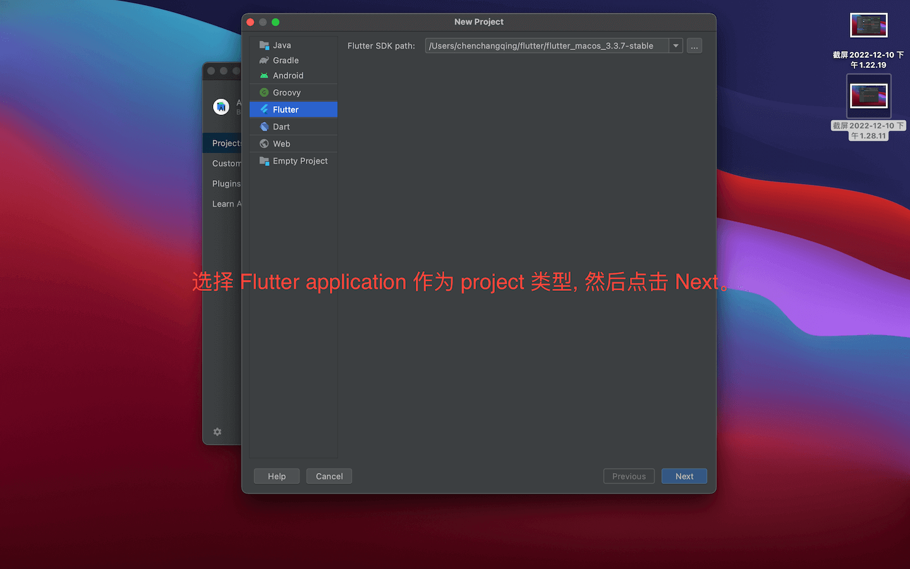
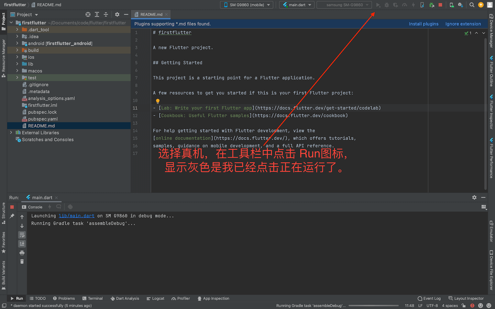

# 创建Flutter应用

## 1）安装Flutter和Dart插件  

## 2）创建Flutter应用  

## 3）Organization命名不规范错误  
  
发现一个错误，Organization命名不规范，不能出现纯数字，修改如下：  

## 4）Android真机运行  

## 5）iOS模拟器运行  
  

## 6）在Android Studio上选择多设备运行
  
效果：  
  
 

> [《Flutter实战·第二版》1.3.2 ～ 1.3.3](https://book.flutterchina.club/chapter1/install_flutter.html#_1-3-2-ide%E9%85%8D%E7%BD%AE%E4%B8%8E%E4%BD%BF%E7%94%A8)
