# Coincap

* 24.8.9 created
* 24.8.10 updated

## 创建项目

```
localhost:flutter chenchangqing$ flutter create coincap
Creating project coincap...
Running "flutter pub get" in coincap...                          2,996ms
Wrote 127 files.

All done!
In order to run your application, type:

  $ cd coincap
  $ flutter run

Your application code is in coincap/lib/main.dart.
```

## 创建首页

新建`pages/home_page.dart`:
```c
import 'package:flutter/material.dart';

class HomePage extends StatefulWidget {
  const HomePage({Key? key}) : super(key: key);

  @override
  State<HomePage> createState() => _HomePageState();
}

class _HomePageState extends State<HomePage> {
  @override
  Widget build(BuildContext context) {
    return const Scaffold();
  }
}
```
修改`main.dart`:
```c
import 'package:coincap/pages/home_page.dart';
import 'package:flutter/material.dart';

void main() {
  runApp(const MyApp());
}

class MyApp extends StatelessWidget {
  const MyApp({super.key});

  // This widget is the root of your application.
  @override
  Widget build(BuildContext context) {
    return MaterialApp(
      title: 'Flutter Demo',
      theme: ThemeData(
        primarySwatch: Colors.blue,
        scaffoldBackgroundColor: const Color.fromRGBO(88, 60, 197, 1.0),
      ),
      home: const HomePage(),
    );
  }
}
```

## 新增依赖

修改`.yaml`：
```c
dio: "4.0.4"
get_it: "7.2.0"
```

## 加载配置文件

### 新建配置文件

1、新建`assets/config/main.json`配置文件：
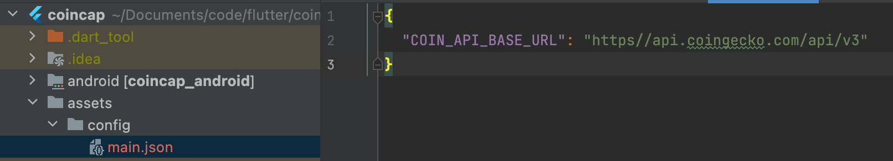
```c
{
  "COIN_API_BASE_URL": "https://api.coingecko.com/api/v3"
}
```
2、修改`.yaml`文件：
```
assets:
  - assets/config/
```

### 新建配置文件类

新建`models/app_config.dart`：
```c
class AppConfig {
  String COIN_API_BASE_URL;

  AppConfig({required this.COIN_API_BASE_URL});
}
```

### 加载配置文件

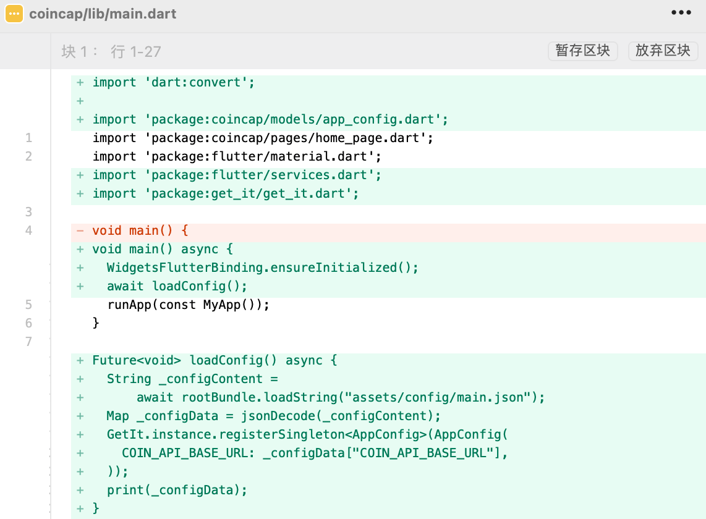
```c
Future<void> loadConfig() async {
  String _configContent =
      await rootBundle.loadString("assets/config/main.json");
  Map _configData = jsonDecode(_configContent);
  GetIt.instance.registerSingleton<AppConfig>(AppConfig(
    COIN_API_BASE_URL: _configData["COIN_API_BASE_URL"],
  ));
  print(_configData);
}
```

## 新增HTTPService

### 新建`services/HTTPService.dart`

```c
import 'package:coincap/models/app_config.dart';
import 'package:dio/dio.dart';
import 'package:get_it/get_it.dart';

class HTTPService {
  final Dio dio = Dio();

  AppConfig? _appConfig;
  String? _base_url;

  HTTPService() {
    _appConfig = GetIt.instance.get<AppConfig>();
    _base_url = _appConfig!.COIN_API_BASE_URL;
    print(_base_url);
  }
}
```

### 注册HTTPService

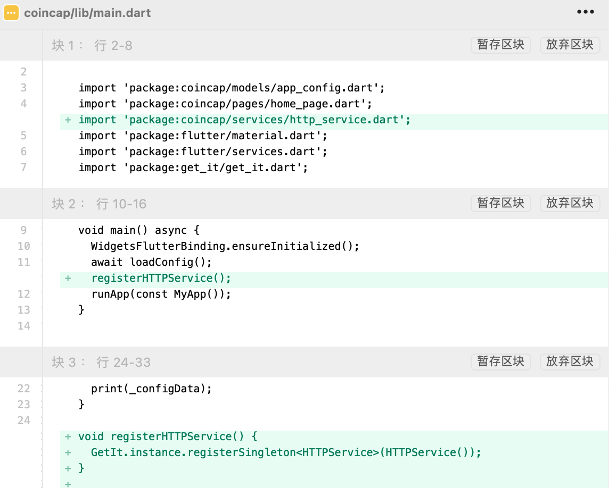

```c
void registerHTTPService() {
  GetIt.instance.registerSingleton<HTTPService>(HTTPService());
}
```

### HTTPService增加Get方法

```c
  Future<Response?> get(String _path) async {
    try {
      String _url = "$_base_url$_path";
      Response? _response = await dio.get(_url);
      print('HTTPService: $_response');
      return _response;
    } catch (e) {
      print('HTTPService: Unable to perform get request.');
      print(e);
    }
  }
```
使用：
```c
await GetIt.instance.get<HTTPService>().get("/coins/list");
```
我测试 https://docs.coingecko.com/v3.0.1/reference/coins-list 这个请求的时候，发现`dio`总是超时，待解决。

参考：https://medium.com/@huguesarnold/networking-with-dio-how-to-develop-a-feature-in-flutter-project-part-4-eb6e0f3beef6

### 增加http

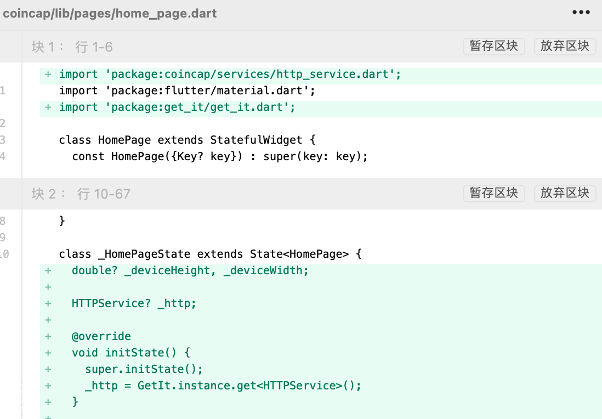

## 增加下拉

`home_page.dart`增加：
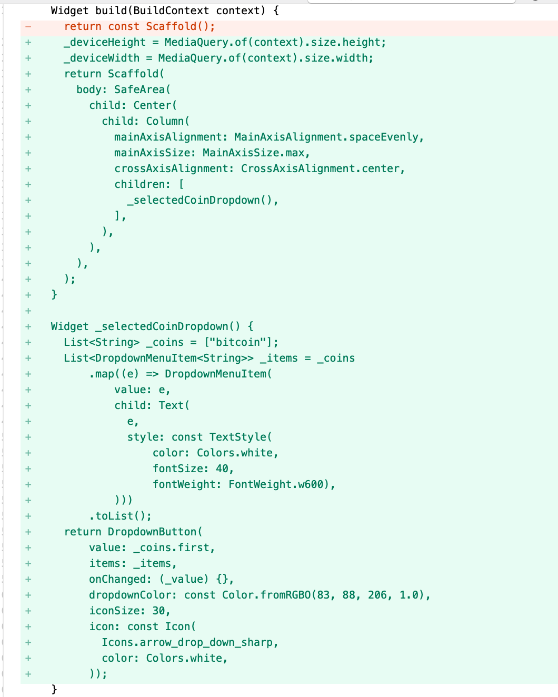
```c
  @override
  Widget build(BuildContext context) {
    _deviceHeight = MediaQuery.of(context).size.height;
    _deviceWidth = MediaQuery.of(context).size.width;
    return Scaffold(
      body: SafeArea(
        child: Center(
          child: Column(
            mainAxisAlignment: MainAxisAlignment.spaceEvenly,
            mainAxisSize: MainAxisSize.max,
            crossAxisAlignment: CrossAxisAlignment.center,
            children: [
              _selectedCoinDropdown(),
            ],
          ),
        ),
      ),
    );
  }

  Widget _selectedCoinDropdown() {
    List<String> _coins = ["bitcoin"];
    List<DropdownMenuItem<String>> _items = _coins
        .map((e) => DropdownMenuItem(
            value: e,
            child: Text(
              e,
              style: const TextStyle(
                  color: Colors.white,
                  fontSize: 40,
                  fontWeight: FontWeight.w600),
            )))
        .toList();
    return DropdownButton(
        value: _coins.first,
        items: _items,
        onChanged: (_value) {},
        dropdownColor: const Color.fromRGBO(83, 88, 206, 1.0),
        iconSize: 30,
        icon: const Icon(
          Icons.arrow_drop_down_sharp,
          color: Colors.white,
        ),
        underline: Container(),
    );
  }
```

## 网络数据组件

`home_page.dart`增加：
```c
  Widget _dataWidgets() {
    return FutureBuilder(
      future: _http!.get("/coins/bitcoin"),
      builder: (BuildContext _context, AsyncSnapshot _snapshot) {
        if (_snapshot.hasData) {
          Map _data = jsonDecode(_snapshot.data.toString());
          num _usdPrice = _data["market_data"]["current_price"]["usd"];
          return Text(_usdPrice.toString());
        } else {
          return const Center(
            child: CircularProgressIndicator(
              color: Colors.white,
            ),
          );
        }
      },
    );
  }
```
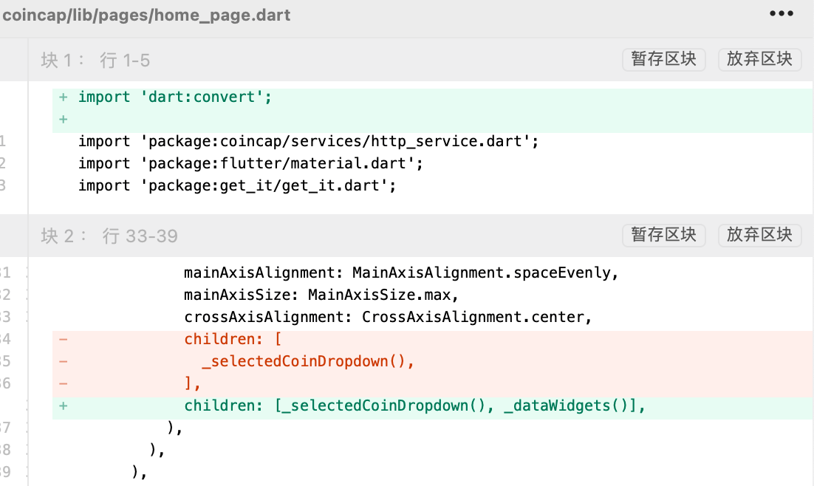

## 模拟网络请求

`HTTPService`注释原来的`get`方法，新增：

```c
  Future<Response?> get(String _path) async {
    String data = "";
    if (_path == "/coins/bitcoin") {
      // ["market_data"]["current_price"]["usd"];
      data = "{\"market_data\": { \"current_price\": {\"usd\": 100} }}";
    }
    return Future.delayed(const Duration(seconds: 1), () {
      return Response(data: data, requestOptions: RequestOptions(path: ''));
    });
  }
```

## 金额组件

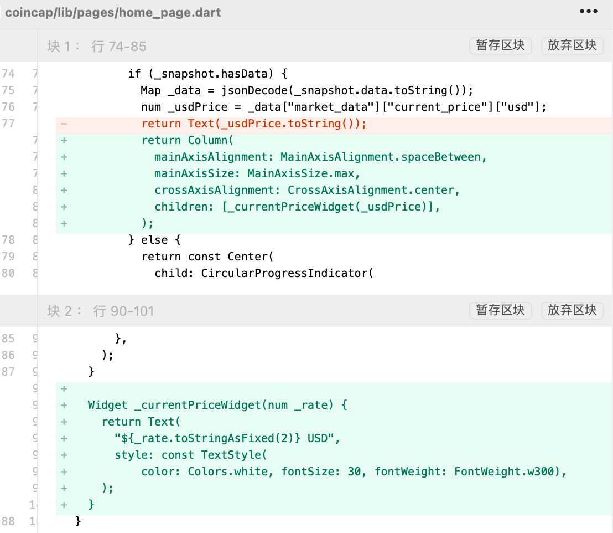
```c
  Widget _currentPriceWidget(num _rate) {
    return Text(
      "${_rate.toStringAsFixed(2)} USD",
      style: const TextStyle(
          color: Colors.white, fontSize: 30, fontWeight: FontWeight.w300),
    );
  }
```

## 百分比

修改`home_page.dart`：
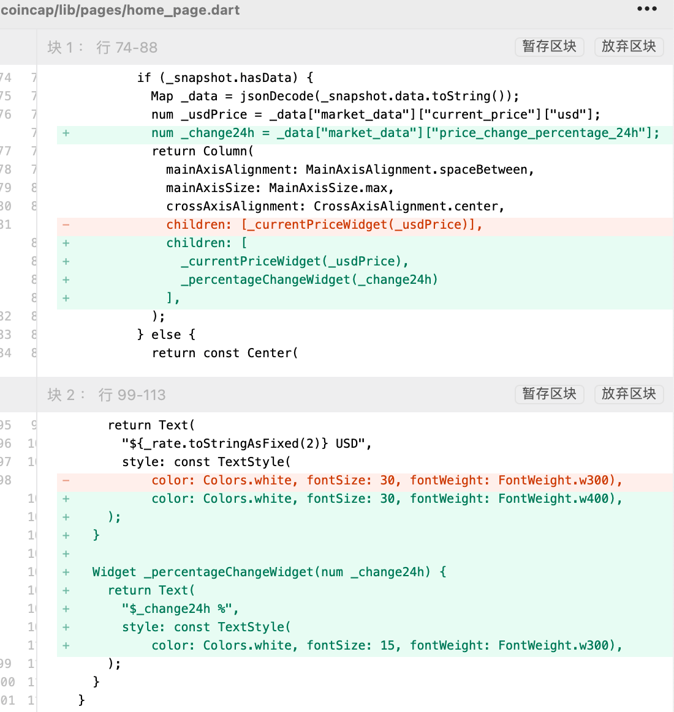
```c
  Widget _percentageChangeWidget(num _change24h) {
    return Text(
      "$_change24h %",
      style: const TextStyle(
          color: Colors.white, fontSize: 15, fontWeight: FontWeight.w300),
    );
  }
```
修改`HttpService.dart`:
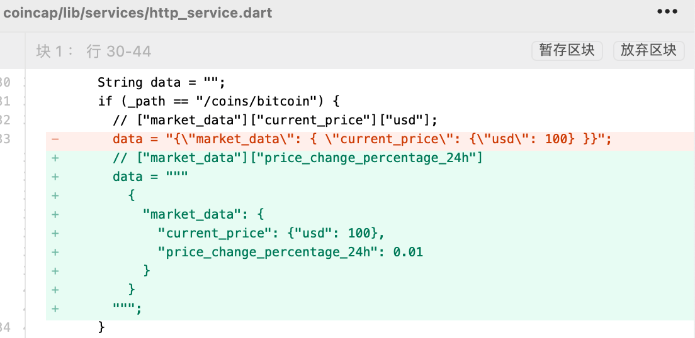
```c
      data = """
        {
          "market_data": { 
            "current_price": {"usd": 100}, 
            "price_change_percentage_24h": 0.01 
          }
        }
      """
```

## 增加图片

1、新建`assets/images/flutter_coincap_10.png`:


2、修改`.yaml`：
```
  assets:
    - assets/config/
    - assets/images/
```
3、修改`home_page.dart`：
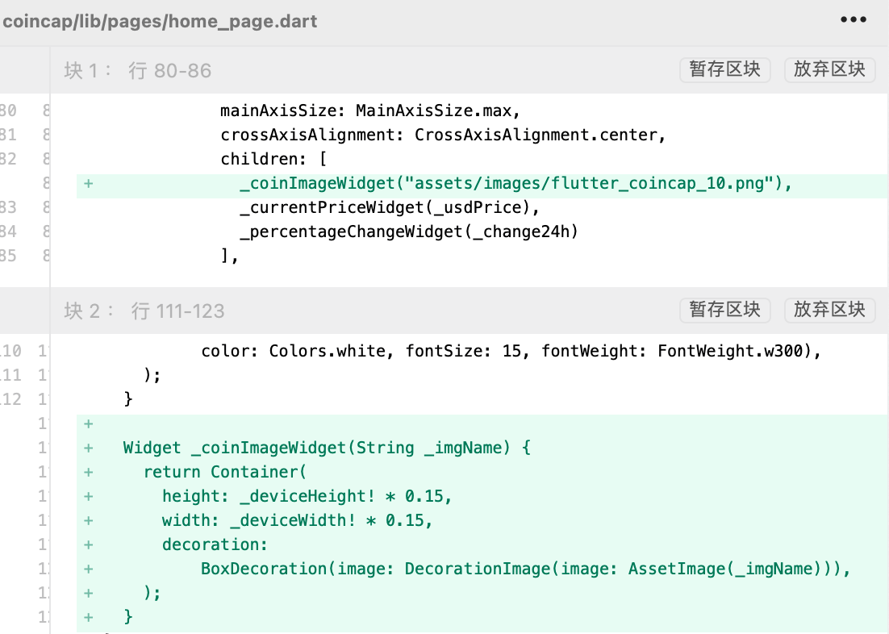
```c
  Widget _coinImageWidget(String _imgName) {
    return Container(
      height: _deviceHeight! * 0.15,
      width: _deviceWidth! * 0.15,
      decoration:
          BoxDecoration(image: DecorationImage(image: AssetImage(_imgName))),
    );
  }
```
4、当前效果：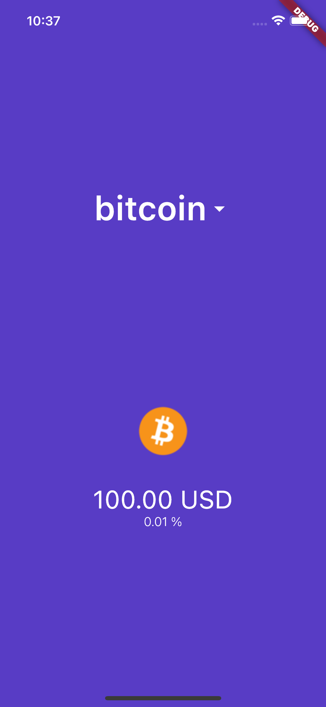

## 增加描述

1、在`home_page.dart`增加描述组件方法：
```c
  Widget _descriptionCardWidget(String _description) {
    return Container(
      height: _deviceHeight! * 0.45,
      width: _deviceWidth! * 0.90,
      margin: EdgeInsets.symmetric(vertical: _deviceHeight! * 0.05),
      padding: EdgeInsets.symmetric(
          vertical: _deviceHeight! * 0.01, horizontal: _deviceHeight! * 0.01),
      color: const Color.fromRGBO(82, 88, 206, 0.5),
      child: Text(
        _description,
        style: const TextStyle(color: Colors.white),
      ),
    );
  }
```
2、增加描述组件：
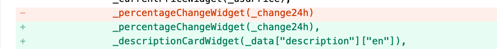
3、修改`HTTPService`：

4、当前UI：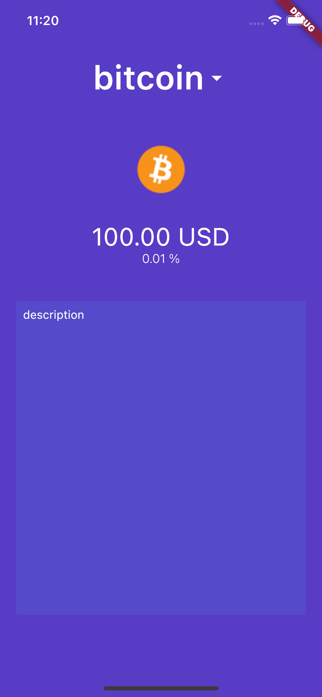

## 跳转详情

### 新增详情页

新建`pages/details_page.dart`：
```c
import 'package:flutter/material.dart';

class DetailsPage extends StatefulWidget {
  const DetailsPage({Key? key}) : super(key: key);

  @override
  State<DetailsPage> createState() => _DetailsPageState();
}

class _DetailsPageState extends State<DetailsPage> {
  @override
  Widget build(BuildContext context) {
    return const Scaffold();
  }
}
```

### 增加跳转事件

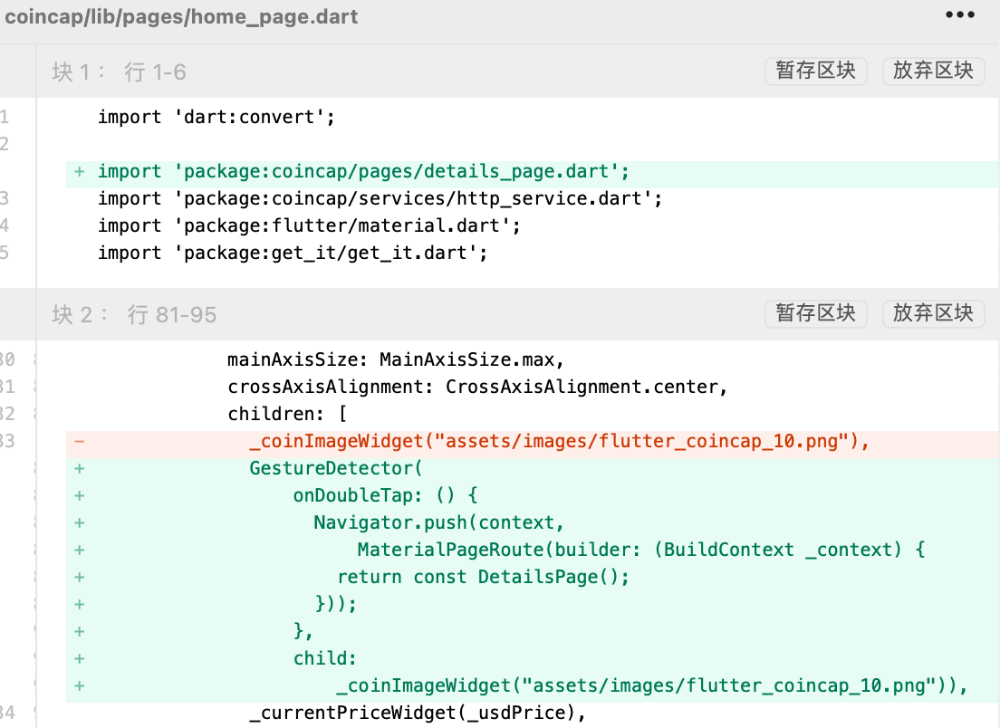
```c
GestureDetector(
    onDoubleTap: () {
      Navigator.push(context,
          MaterialPageRoute(builder: (BuildContext _context) {
        return const DetailsPage();
      }));
    },
    child:
        _coinImageWidget("assets/images/flutter_coincap_10.png")),
```

## 下拉选中

### 新增ICON

新增`assets/images/flutter_coincap_17.png`：


### 修改HTTPService

```c
    if (_path == "/coins/bitcoin") {
      // ["market_data"]["current_price"]["usd"];
      // ["market_data"]["price_change_percentage_24h"]
      data = """
        {
          "market_data": { 
            "current_price": {"usd": 100}, 
            "price_change_percentage_24h": 0.01 
          },
          "description": {
            "en": "bitcoin description"
          },
          "image": "assets/images/flutter_coincap_10.png"
        }
      """;
    }
    if (_path == "/coins/ethereum") {
      data = """
        {
          "market_data": { 
            "current_price": {"usd": 200}, 
            "price_change_percentage_24h": 0.02
          },
          "description": {
            "en": "ethereum description"
          },
          "image": "assets/images/flutter_coincap_17.png"
        }
      """;
    }
```

### 修改`home_page.dart`

1、增加`String? _selectedCoin = "bitcoin";`属性

2、修改`_selectedCoinDropdown`方法：
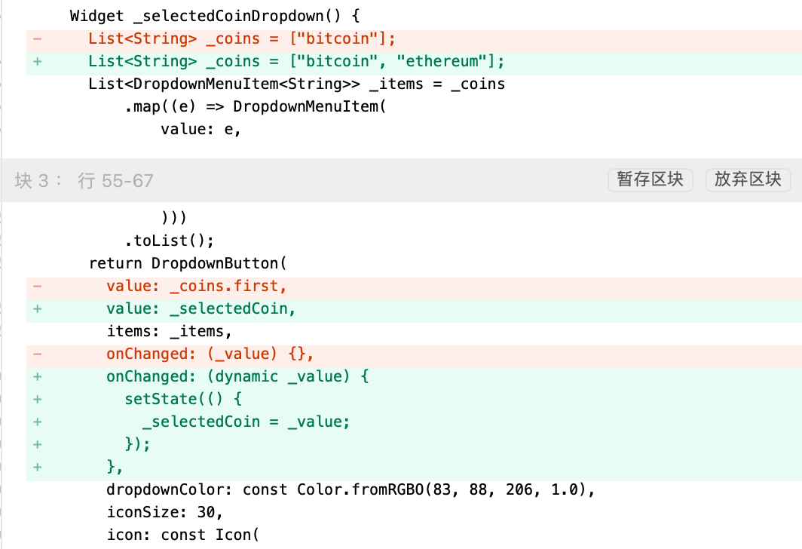

3、修改`_dataWidgets`方法：
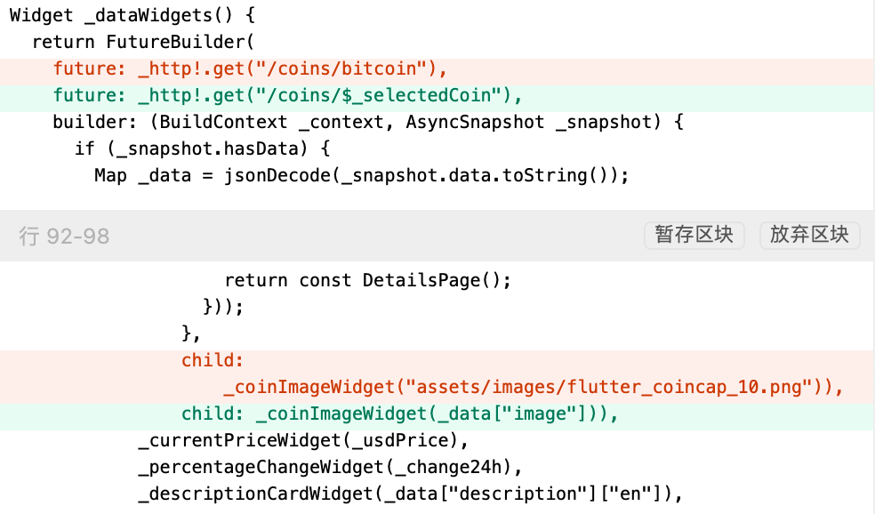

## 更新详情

### 修改`details_page.dart`:

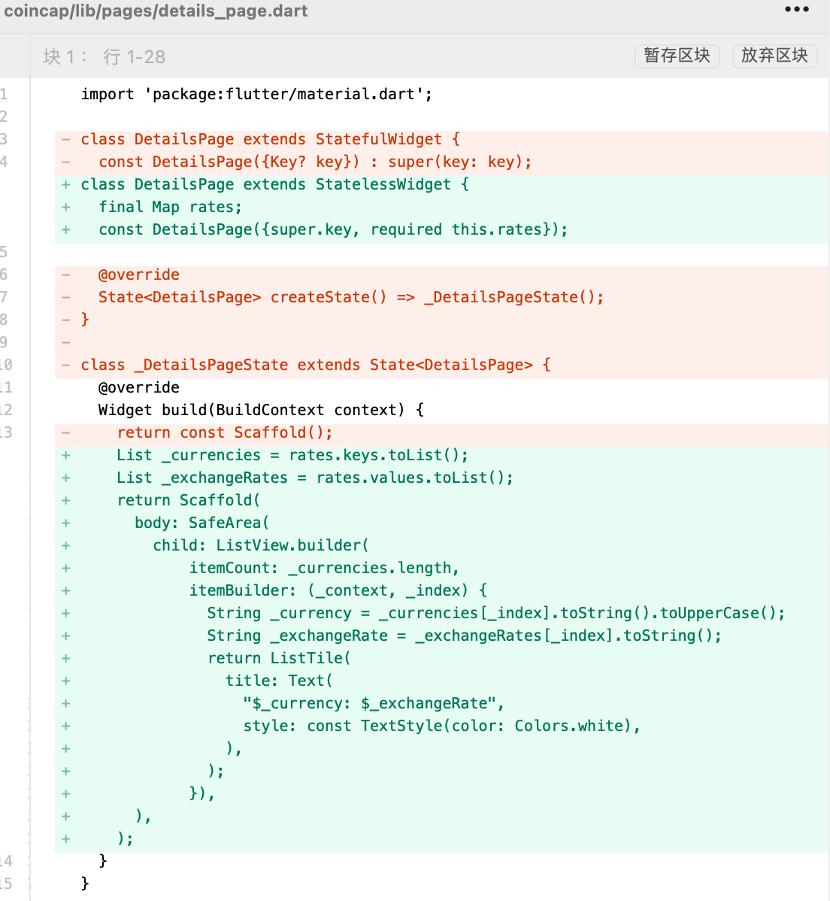
```c
import 'package:flutter/material.dart';

class DetailsPage extends StatelessWidget {
  final Map rates;
  const DetailsPage({super.key, required this.rates});

  @override
  Widget build(BuildContext context) {
    List _currencies = rates.keys.toList();
    List _exchangeRates = rates.values.toList();
    return Scaffold(
      body: SafeArea(
        child: ListView.builder(
            itemCount: _currencies.length,
            itemBuilder: (_context, _index) {
              String _currency = _currencies[_index].toString().toUpperCase();
              String _exchangeRate = _exchangeRates[_index].toString();
              return ListTile(
                title: Text(
                  "$_currency: $_exchangeRate",
                  style: const TextStyle(color: Colors.white),
                ),
              );
            }),
      ),
    );
  }
}
```

### 修改`home_page.dart`

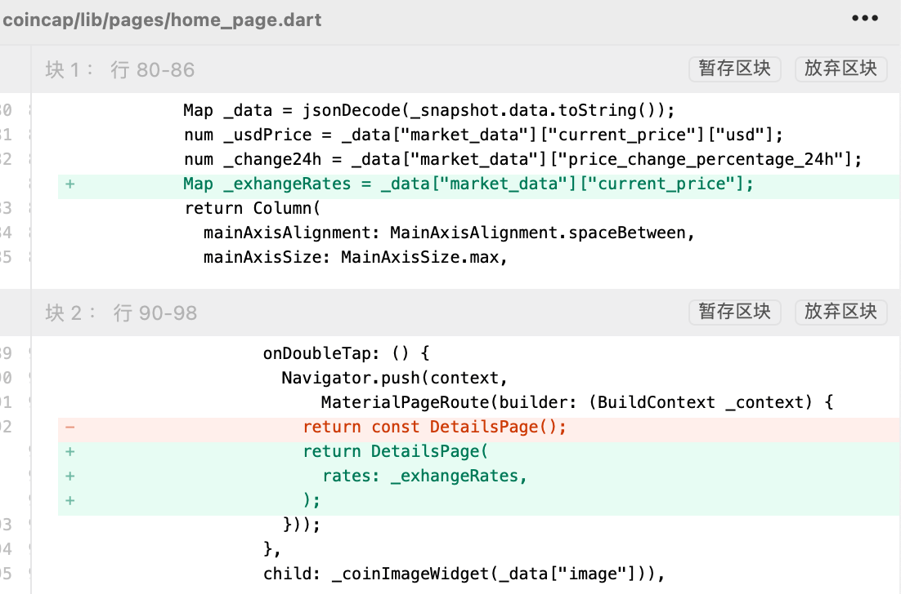

## 源码

https://gitee.com/learnany/flutter/blob/master/coincap.zip
