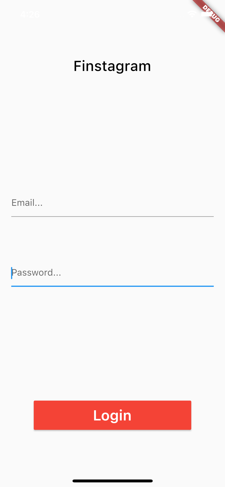
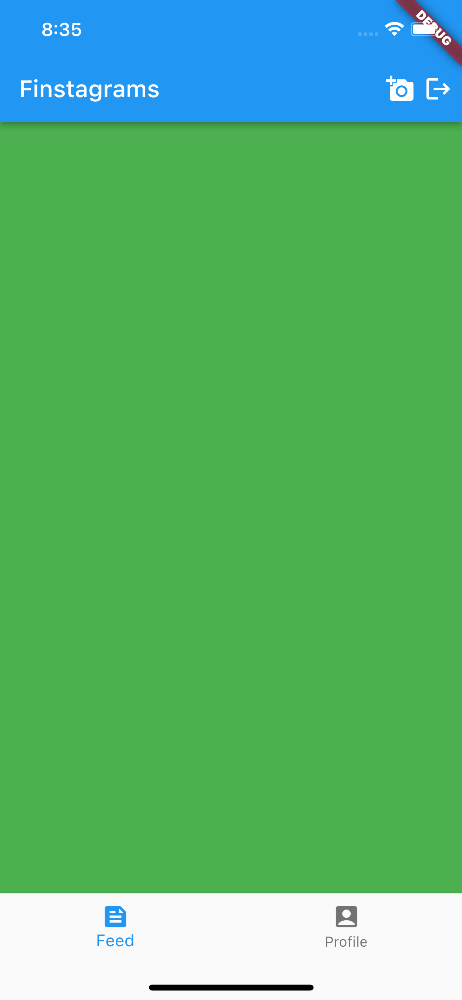
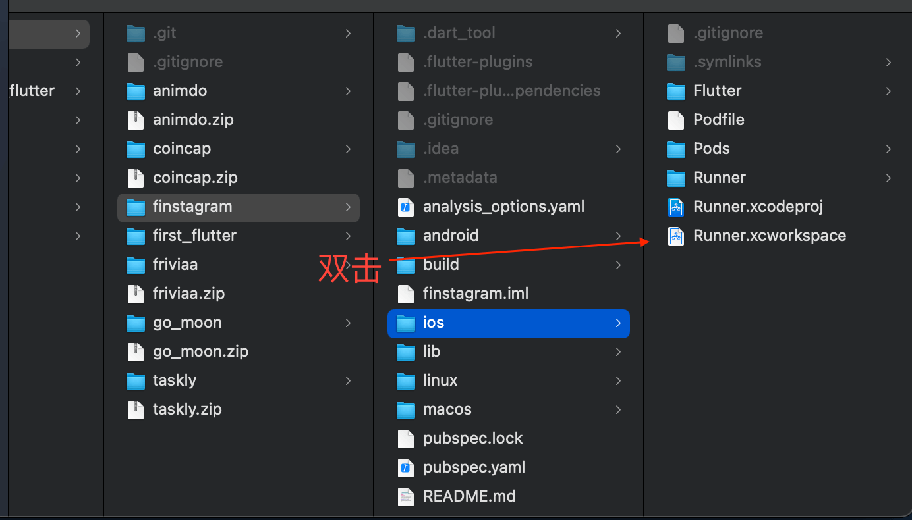
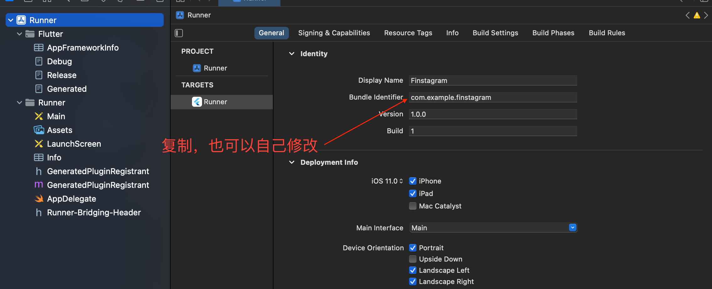
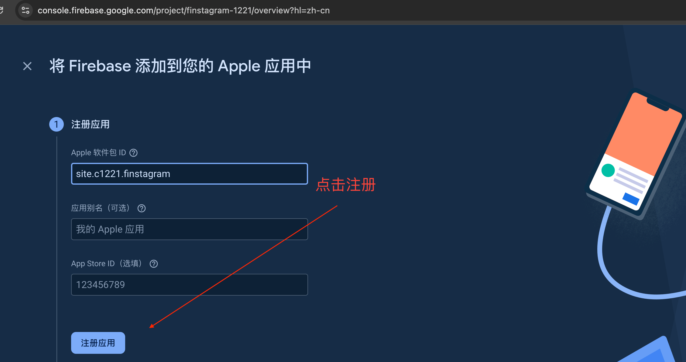
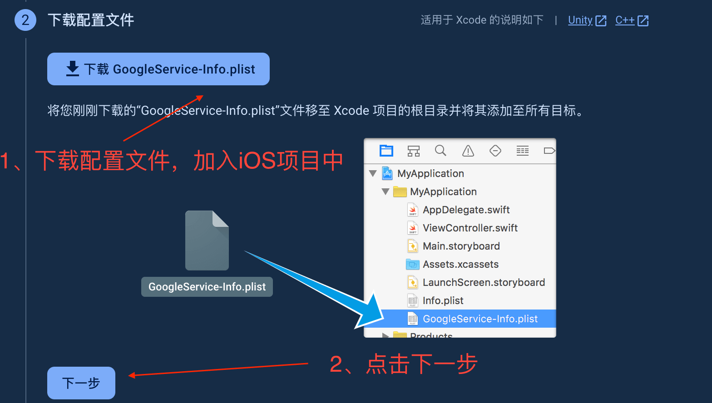
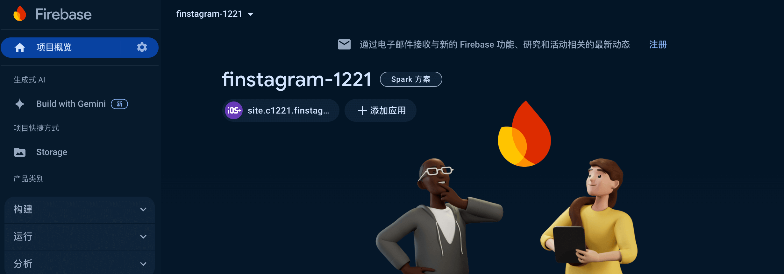

# Finstagram

* 24.8.11 created

## 创建项目

```
localhost:flutter chenchangqing$ flutter create finstagram
Creating project finstagram...
Running "flutter pub get" in finstagram...                          4.5s
Wrote 127 files.

All done!
In order to run your application, type:

  $ cd finstagram
  $ flutter run

Your application code is in finstagram/lib/main.dart.
```

## 初始化路由

### 新建注册页面

新建`pages/register_page.dart`:

```c
import 'package:flutter/material.dart';

class RegisterPage extends StatefulWidget {
  const RegisterPage({Key? key}) : super(key: key);

  @override
  State<RegisterPage> createState() => _RegisterPageState();
}

class _RegisterPageState extends State<RegisterPage> {
  @override
  Widget build(BuildContext context) {
    return Scaffold(
      body: Container(
        color: Colors.red,
      ),
    );
  }
}
```

### 新建登录页面

新建`pages/login_page.dart`:
```c
import 'package:flutter/material.dart';

class LoginPage extends StatefulWidget {
  const LoginPage({Key? key}) : super(key: key);

  @override
  State<LoginPage> createState() => _LoginPageState();
}

class _LoginPageState extends State<LoginPage> {
  @override
  Widget build(BuildContext context) {
    return Scaffold(
      body: Container(
        color: Colors.green,
      ),
    );
  }
}
```

### 初始化路由

修改`main.dart`:
```c
      initialRoute: 'login',
      routes: {
        'register': (context) => RegisterPage(),
        'login': (context) => LoginPage()
      },
```

## 登录标题/按钮

### 新增属性

`login_page.dart`新增属性：
```c
double? _deviceHeight, _deviceWidth;
```
修改`build`方法，初始化`_deviceHeight, _deviceWidth`：
```c
  Widget build(BuildContext context) {
    _deviceHeight = MediaQuery.of(context).size.height;
    _deviceWidth = MediaQuery.of(context).size.width;
    ...
```

### 新增标题/按钮组件

`login_page.dart`新增方法：
```c
  Widget _titleWidget() {
    return const Text(
      "Finstagram",
      style: TextStyle(
          color: Colors.black, fontSize: 25, fontWeight: FontWeight.w500),
    );
  }

  Widget _loginButton() {
    return MaterialButton(
      onPressed: () {},
      minWidth: _deviceWidth! * 0.70,
      height: _deviceHeight! * 0.06,
      color: Colors.red,
      child: const Text(
        "Login",
        style: TextStyle(
            color: Colors.white, fontSize: 25, fontWeight: FontWeight.w600),
      ),
    );
  }
```
修改`build`方法：
```c
  Container(
    padding: EdgeInsets.symmetric(horizontal: _deviceWidth! * 0.05),
    child: Center(
      child: Column(
        mainAxisAlignment: MainAxisAlignment.spaceAround,
        mainAxisSize: MainAxisSize.max,
        crossAxisAlignment: CrossAxisAlignment.center,
        children: [_titleWidget(), _loginButton()],
      ),
    ),
  )
```

## 新增Form输入

### 增加属性

`login_page.dart`增加loginFormKey`和`_email`、`_password`属性：
```
final GlobalKey<FormState> _loginFormKey = GlobalKey<FormState>();
String? _email, _password;
```

### 增加邮箱输入

`login_page.dart`增加方法`_emailTextField`:
```c
  Widget _emailTextField() {
    return TextFormField(
      decoration: const InputDecoration(hintText: "Email..."),
      onSaved: (_value) {
        setState(() {
          _email = _value;
        });
      },
      validator: (_value) {
        bool _result = _value!.contains(RegExp(
            r"^[a-zA-Z0-9.!#$%&`*+/=?^_`{|}~-]+@[a-zA-Z0-9](?:[a-zA-Z0-9](?:[a-zA-Z0-9]{0,61}[a-zA-Z0-9])?)*$"));
        _result ? null : "Please enter a valid email";
      },
    );
  }
```

### 增加密码输入

`login_page.dart`增加方法`_passwordTextField`:
```c
  Widget _passwordTextField() {
    return TextFormField(
      obscureText: true,
      decoration: const InputDecoration(hintText: "Password..."),
      onSaved: (_value) {
        setState(() {
          _password = _value;
        });
      },
      validator: (_value) => _value!.length > 6
          ? null
          : "Please enter a password greater than 6 characters.",
    );
  }
```

### 增加Form

`login_page.dart`增加方法`_loginForm`:
```c
  Widget _loginForm() {
    return Container(
      height: _deviceHeight! * 0.20,
      child: Form(
        key: _loginFormKey,
        child: Column(
          mainAxisAlignment: MainAxisAlignment.spaceBetween,
          mainAxisSize: MainAxisSize.max,
          crossAxisAlignment: CrossAxisAlignment.center,
          children: [_emailTextField(), _passwordTextField()],
        ),
      ),
    );
  }
```

### 修改build

```c
children: [_titleWidget(), _loginForm(), _loginButton()],
```

### 当前UI



## 登录事件

### 修正邮箱正则

参考：https: //gist.github.com/cgkio/7268045

```
	  validator: (_value) {
        bool _result = _value!.contains(RegExp(
            r"^[_A-Za-z0-9-+]+(.[_A-Za-z0-9-]+)*@[A-Za-z0-9-]+(.[A-Za-z0-9]+)*(.[A-Za-z]{2,})$"));
        return _result ? null : "Please enter a valid email";
      }
```

### Form校验
`login_page.dart`新增`_loginUser`方法：
```c
  void _loginUser() {
    if (_loginFormKey.currentState!.validate()) {}
  }
```

`login_page.dart`修改`_loginButton`方法：
```c
      onPressed: () {
        _loginUser();
      }
```

## 注册按钮

### 增加注册手势

`login_page.dart`增加`_registerPageLink`方法：
```c
  Widget _registerPageLink() {
    return GestureDetector(
      onTap: () => Navigator.pushNamed(context, "register"),
      child: const Text(
        "Don`t have an account?",
        style: TextStyle(
            color: Colors.blue, fontSize: 15, fontWeight: FontWeight.w200),
      ),
    );
  }
```

### 修改build方法

```c
            children: [
              _titleWidget(),
              _loginForm(),
              _loginButton(),
              _registerPageLink()
            ]
```

## 注册页面标题和按钮

### 增加宽高属性

`register_page.dart`新增属性：

```c
double? _deviceHeight, _deviceWidth;
```

### 注册标题

`register_page.dart`新增方法：
```c
  Widget _titleWidget() {
    return const Text(
      "Finstagram",
      style: TextStyle(fontSize: 25, fontWeight: FontWeight.w600),
    );
  }
```

### 注册按钮

`register_page.dart`新增方法：
```c
  Widget _registerButton() {
    return MaterialButton(
      onPressed: () {},
      minWidth: _deviceWidth! * 0.50,
      height: _deviceHeight! * 0.05,
      color: Colors.red,
      child: const Text(
        "Register",
        style: TextStyle(
            color: Colors.white, fontSize: 20, fontWeight: FontWeight.w400),
      ),
    );
  }
```

### build

`register_page.dart`修改`build`:

```c
  @override
  Widget build(BuildContext context) {
    _deviceHeight = MediaQuery.of(context).size.height;
    _deviceWidth = MediaQuery.of(context).size.width;
    return Scaffold(
      body: SafeArea(
        child: Container(
          padding: EdgeInsets.symmetric(horizontal: _deviceWidth! * 0.05),
          child: Center(
            child: Column(
              mainAxisAlignment: MainAxisAlignment.spaceAround,
              mainAxisSize: MainAxisSize.max,
              crossAxisAlignment: CrossAxisAlignment.center,
              children: [_titleWidget(), _registerButton()],
            ),
          ),
        ),
      ),
    );
  }
```

## 注册表单

### 新增GlobalKey

`register_page.dart`新增`GlobalKey`属性：
```c
final GlobalKey<FormState> _registerFormKey = GlobalKey<FormState>();
```

### 新增name/email/password

`register_page.dart`新增`_name`、`_email`、`_password`属性：
```c
String? _name, _email, _password;
```

### 增加form

`register_page.dart`新增form：
```c
  Widget _registrationForm() {
    return Container(
      height: _deviceHeight! * 0.30,
      child: Form(
        key: _registerFormKey,
        child: Column(
          mainAxisAlignment: MainAxisAlignment.spaceBetween,
          mainAxisSize: MainAxisSize.max,
          crossAxisAlignment: CrossAxisAlignment.center,
          children: [_nameTextField(), _emailTextField(), _passwordTextField()],
        ),
      ),
    );
  }

  Widget _nameTextField() {
    return TextFormField(
      decoration: const InputDecoration(hintText: "Name..."),
      validator: (_value) => _value!.length > 0 ? null : "Please enter a name.",
      onSaved: (_value) {
        setState(() {
          _name = _value;
        });
      },
    );
  }

  Widget _emailTextField() {
    return TextFormField(
      decoration: const InputDecoration(hintText: "Email..."),
      onSaved: (_value) {
        setState(() {
          _email = _value;
        });
      },
      validator: (_value) {
        bool _result = _value!.contains(RegExp(
            r"^[_A-Za-z0-9-+]+(.[_A-Za-z0-9-]+)*@[A-Za-z0-9-]+(.[A-Za-z0-9]+)*(.[A-Za-z]{2,})$"));
        return _result ? null : "Please enter a valid email";
      },
    );
  }

  Widget _passwordTextField() {
    return TextFormField(
      obscureText: true,
      decoration: const InputDecoration(hintText: "Password..."),
      onSaved: (_value) {
        setState(() {
          _password = _value;
        });
      },
      validator: (_value) => _value!.length > 6
          ? null
          : "Please enter a password greater than 6 characters.",
    );
  }
```

### 修改build

`register_page.dart`修改`build`:
```c
              children: [
                _titleWidget(),
                _registrationForm(),
                _registerButton()
              ]
```

## 头像选择

### 网络图片地址

https://pravatar.cc/

### 引入file_picker

因为这里使用`file_picker`的时候，无法正常运行iOS模拟器，所以先注释掉

```
  #file_picker: "6.0.0"
```

### 增加import和_image属性

`register_page.dart`增加`import`和`_image`属性

```
import 'dart:io';

// import 'package:file_picker/file_picker.dart';

class _RegisterPageState extends State<RegisterPage> {
  ...
  File? _image;
  ...
```

### 增加图片组件

`register_page.dart`增加`_profileImageWidget`方法：
```c
  Widget _profileImageWidget() {
    var _imageProvider = _image != null
        ? FileImage(_image!)
        : const NetworkImage("https://i.pravatar.cc/300");
    return GestureDetector(
      onTap: () {
        // FilePicker.platform.pickFiles(type: FileType.image).then((_result) {
        //   setState(() {
        //     _image = File(_result!.files.first.path!);
        //   });
        // });
      },
      child: Container(
        height: _deviceHeight! * 0.15,
        width: _deviceHeight! * 0.15,
        decoration: BoxDecoration(
            image: DecorationImage(
                fit: BoxFit.cover, image: _imageProvider as ImageProvider)),
      ),
    );
  }
```

## 点击注册

### 增加注册方法

`register_page.dart`增加注册方法:

```c
  void _registerUser() {
    if (_registerFormKey.currentState!.validate() && _image != null) {
      _registerFormKey.currentState!.save();
    }
  }
```

### 增加点击事件

`register_page.dart`修改`_registerButton`:
```c
      onPressed: () {
        _registerUser();
      }
```

## 增加首页

### 新增`pages/home_page.dart`

```c
import 'package:flutter/material.dart';

class HomePage extends StatefulWidget {
  const HomePage({Key? key}) : super(key: key);

  @override
  State<HomePage> createState() => _HomePageState();
}

class _HomePageState extends State<HomePage> {
  @override
  Widget build(BuildContext context) {
    return Scaffold(
      appBar: AppBar(
        title: const Text("Finstagrams"),
        actions: [
          GestureDetector(
            onTap: () {},
            child: const Icon(Icons.add_a_photo),
          ),
          Padding(
            padding: const EdgeInsets.only(left: 8.0, right: 8.0),
            child: GestureDetector(
              onTap: () {},
              child: const Icon(Icons.logout),
            ),
          )
        ],
      ),
    );
  }
}
```

### 修改`main.dart`

```c
import 'package:finstagram/pages/home_page.dart';

      ...
      initialRoute: 'home',
      routes: {
        'register': (context) => RegisterPage(),
        'login': (context) => LoginPage(),
        'home': (context) => HomePage()
      },
      home: const Scaffold(),
    );
  }
}
```

## 增加Tabbar

### 底部Tabbar

`home_page.dart`增加`_bottomNavigationBar`方法：
```c
  Widget _bottomNavigationBar() {
    return BottomNavigationBar(
        currentIndex: _currentPage,
        onTap: (_index) {
          setState(() {
            _currentPage = _index;
          });
        },
        items: const [
          BottomNavigationBarItem(label: 'Feed', icon: Icon(Icons.feed)),
          BottomNavigationBarItem(
              label: 'Profile', icon: Icon(Icons.account_box))
        ]);
  }
```

### 增加属性

`home_page.dart`增加`_currentPage`和`_pages`：
```c
  int _currentPage = 0;
  final List<Widget> _pages = [
    Container(
      color: Colors.green,
    ),
    Container(
      color: Colors.blue,
    )
  ];
```

### 修改`build`方法

`home_page.dart`修改`build`方法:
```c
  Widget build(BuildContext context) {
      ...
      bottomNavigationBar: _bottomNavigationBar(),
      body: _pages[_currentPage],
    );
  }
```

### 当前UI



## 增加FeedPage和ProfilePage

### 增加FeedPage

新增`pages/feed_page.dart`:
```c
import 'package:flutter/material.dart';

class FeedPage extends StatefulWidget {
  const FeedPage({Key? key}) : super(key: key);

  @override
  State<FeedPage> createState() => _FeedPageState();
}

class _FeedPageState extends State<FeedPage> {
  @override
  Widget build(BuildContext context) {
    return Container(
      color: Colors.purple,
    );
  }
}
```

### 增加ProfilePage

新增`pages/profile_page.dart`:
```c
import 'package:flutter/material.dart';

class ProfilePage extends StatefulWidget {
  const ProfilePage({Key? key}) : super(key: key);

  @override
  State<ProfilePage> createState() => _ProfilePageState();
}

class _ProfilePageState extends State<ProfilePage> {
  @override
  Widget build(BuildContext context) {
    return Container(
      color: Colors.orange,
    );
  }
}
```

### 修改HomePage

```c
import 'package:finstagram/pages/feed_page.dart';
import 'package:finstagram/pages/profile_page.dart';
...
final List<Widget> _pages = [FeedPage(), ProfilePage()];
...
```

## 创建firebase项目

### 创建firebase项目

打开 https://firebase.com，进入控制台，创建项目。

### 依赖firebase

```
  firebase_core: "1.11.0"
  firebase_auth: "3.3.5"
  firebase_analytics: "9.0.5"
  cloud_firestore: "3.1.6"
  firebase_storage: "10.2.5"
  get_it: "7.2.0"
```

## 注册iOS应用

### 打开iOS注册


### 找到iOS bundleId

打开finder:


双击`.workspace`，等到xcode打开:


复制`bundleId`:


### 填写bundleId


### 下载配置文件


### 点击下一步

然后，一直点击“下一步”，直到进入控制台。


### 修改iOS系统版本

1. 检查Podfile中`# platform :ios, '11.0'`，如果低于11，需要修改为10或11。
2. 同时需要点击`.workspace`进入iOS项目修改`target`和项目的iOS版本。

### 运行flutter项目

因为需要下载`firebase`sdk，需要长时间等待。

### 解决问题

遇到pod install失败问题

1. 检查命令行是否可以访问外网
2. 检查cocoapods版本是否最新，当前最新是1.15.2

[Cocoapods的版本升级和降级](https://kukumalucn.github.io/blog/2018/09/20/Cocoapods%E7%9A%84%E7%89%88%E6%9C%AC%E5%8D%87%E7%BA%A7%E5%92%8C%E9%99%8D%E7%BA%A7/)

[(Xcode): Undefined symbol: leveldb::WriteBatch::Put(leveldb::Slice const&, leveldb::Slice const&) errors](https://stackoverflow.com/questions/74879685/xcode-undefined-symbol-leveldbwritebatchputleveldbslice-const-level)

注释后才可以编译：

//  FIRTransactionOptions *options = [[FIRTransactionOptions alloc] init];
//  options.maxAttempts = maxAttempts.integerValue;
//
//  [firestore runTransactionWithOptions:options
//                                 block:transactionRunBlock
//                            completion:transactionCompleteBlock];


## 新增FirebaseService

### 新建`services/firebase_service.dart`:
```c
// import 'package:cloud_firestore/cloud_firestore.dart';
// import 'package:firebase_auth/firebase_auth.dart';
// import 'package:firebase_storage/firebase_storage.dart';

class FirebaseService {
  // FirebaseAuth _auth = FirebaseAuth.instance;
  // FirebaseStorage _storage = FirebaseStorage.instance;
  // FirebaseFirestore _db = FirebaseFirestore.instance;

  FirebaseService();
}
```
由于依赖存在问题，暂时先注释。

### 修改`main.dart`:

```c
import 'package:finstagram/services/firebase_service.dart';
...
// import 'package:firebase_core/firebase_core.dart';
import 'package:get_it/get_it.dart';

void main() async {
  WidgetsFlutterBinding.ensureInitialized();
  // await Firebase.initializeApp();
  GetIt.instance.registerSingleton<FirebaseService>(FirebaseService());
  runApp(const MyApp());
}
```

## 登录

### 新增FirebaseService

新增`services/firebase_service.dart`，真实实现一注释，firebase集成有问题。
```c
// import 'package:cloud_firestore/cloud_firestore.dart';
// import 'package:firebase_auth/firebase_auth.dart';
// import 'package:firebase_storage/firebase_storage.dart';

final String USER_COLLECTION = 'users';

class FirebaseService {
  // FirebaseAuth _auth = FirebaseAuth.instance;
  // FirebaseStorage _storage = FirebaseStorage.instance;
  // FirebaseFirestore _db = FirebaseFirestore.instance;

  Map? currentUser;

  FirebaseService();

  // Future<bool> loginUser(
  //     {required String email, required String password}) async {
  //   try {
  //     UserCredential _userCredential = await _auth.signInWithEmailAndPassword(
  //         email: email, password: password);
  //     if (_userCredential.user != null) {
  //       currentUser = await getUserData(uid: _userCredential.user!.uid);
  //       return true;
  //     } else {
  //       return false;
  //     }
  //   } catch (e) {
  //     print(e);
  //     return false;
  //   }
  // }

  // Future<Map> getUserData({required String uid}) async {
  //   DocumentSnapshot _doc =
  //       await _db.collection(USER_COLLECTION).doc(uid).get();
  //   return _doc.data() as Map;
  // }

  Future<bool> loginUser(
      {required String email, required String password}) async {
    return Future.delayed(const Duration(seconds: 1), () {
      return true;
    });
  }

  Future<Map> getUserData({required String uid}) async {
    return Future.delayed(const Duration(seconds: 1), () {
      return {"": ""};
    });
  }
}
```

### 修改`login_page.dart`，新增import：
```c
import 'package:finstagram/services/firebase_service.dart';
...
import 'package:get_it/get_it.dart';
```
### 修改`login_Page.dart`，增加`_firebaseService`属性：
```c
  FirebaseService? _firebaseService;
  ...
  @override
  void initState() {
    super.initState();
    _firebaseService = GetIt.instance.get<FirebaseService>();
  }
```

### 修改`login_Page.dart`，`_loginUser`:
```c
  void _loginUser() async {
    if (_loginFormKey.currentState!.validate()) {
      _loginFormKey.currentState!.save();
      bool _result = await _firebaseService!
          .loginUser(email: _email!, password: _password!);
      if (_result) Navigator.popAndPushNamed(context, "home");
    }
  }
```

### 修改`main.dart`

```c
      initialRoute: 'login',
```

## 注册

### 新增注册方法

`firebase_service.dart`新增`registerUser`方法：
```c
// import 'package:path/path.dart' as p;
// Future<bool> registerUser(
//     {required String name,
//     required String email,
//     required String password,
//     required File image}) async {
//   try {
//     UserCredential _userCredential = await _auth
//         .createUserWithEmailAndPassword(email: email, password: password);
//     String _userId = _userCredential.user!.uid;
//     String _fileName = Timestamp.now().millisecondsSinceEpoch.toString() +
//         p.extension(image.path);
//     UploadTask _task =
//         _storage.ref('images/$_userId/$_fileName').putFile(image);
//     return _task.then((_snapshot) async {
//       String _downloadURL = await _snapshot.ref.getDownloadURL();
//       await _db
//           .collection(USER_COLLECTION)
//           .doc(_userId)
//           .set({"name": name, "email": email, "image": _downloadURL});
//     });
//   } catch (e) {
//     print(e);
//     return false;
//   }
// }
  Future<bool> registerUser(
      {required String name,
      required String email,
      required String password}) async {
    return Future.delayed(const Duration(seconds: 1), () {
      return true;
    });
  }
```

### 增加FirebaseService属性

`register_page.dart`新增`_firebaseService`：
```c
import 'package:finstagram/services/firebase_service.dart';
...
import 'package:get_it/get_it.dart';

  FirebaseService? _firebaseService;

  @override
  void initState() {
    super.initState();
    _firebaseService = GetIt.instance.get<FirebaseService>();
  }
```
`register_page.dart`修改`_registerUser`:
```c
  void _registerUser() async {
    // if (_registerFormKey.currentState!.validate() && _image != null) {
    if (_registerFormKey.currentState!.validate()) {
      // 图片选择暂时忽略
      _registerFormKey.currentState!.save();
      var _result = await _firebaseService!
          .registerUser(name: _name!, email: _email!, password: _password!);
      if (_result) Navigator.pop(context);
    }
  }
```

## 发布图片

### 增加上传图片方法

修改`firebase_service.dart`，新增`postImage`方法：
```c
import 'dart:io';
...
final String POSTS_COLLECTION = 'posts';
...
// Future<bool> postImage(File _image) async {
//   try {
//     String _userId = _auth.currentUser!.uid;
//     String _fileName = Timestamp.now().millisecondsSinceEpoch.toString() +
//         p.extension(_image.path);
//     UploadTask _task =
//         _storage.ref('images/$_userId/$_fileName').putFile(_image);
//     return _task.then((_snapshot) async {
//       String _downloadURL = await _snapshot.ref.getDownloadURL();
//       await _db.collection(POSTS_COLLECTION).add({
//         "useId": _userId,
//         "timestamp": Timestamp.now(),
//         "image": _downloadURL
//       });
//       return true;
//     });
//   } catch (e) {
//     print(e);
//     return false;
//   }
// }
  Future<bool> postImage(File _image) async {
    return Future.delayed(const Duration(seconds: 1), () {
      return true;
    });
  }
```

### 增加FirebaseService属性

修改`home_page.dart`增加`_firebaseService`属性：
```c
// import 'package:file_picker/file_picker.dart';
...
import 'package:finstagram/services/firebase_service.dart';
...
import 'package:get_it/get_it.dart';
  FirebaseService? _firebaseService;

  @override
  void initState() {
    super.initState();
    _firebaseService = GetIt.instance.get<FirebaseService>();
  }
```

### 调用发布图片

修改`home_page.dart`新增`_postImage`：
```c
  // void _postImage() async {
  //   FilePickerResult? _result =
  //       await FilePicker.platform.pickFiles(type: FileType.image);
  //   File _image = File(_result!.files.first.path!);
  //   await _firebaseService!.postImage(_image);
  // }
  void _postImage() async {}

  @override
  Widget build(BuildContext context) {
    return Scaffold(
      appBar: AppBar(
        title: const Text("Finstagrams"),
        actions: [
          GestureDetector(
            onTap: () {
              _postImage();// add
            },
            ...
  }
```

## 照片流

### 查询照片流

修改`firebase_service.dart`，新增`getLastestPosts`方法：
```c
  // Stream<QuerySnapshot> getLastestPosts() {
  //   return _db
  //       .collection(POSTS_COLLECTION)
  //       .orderBy('timestamp', descending: true)
  //       .snapshots();
  // }
  Stream<List<String>> getLastestPosts() {
    // https://blog.csdn.net/mqdxiaoxiao/article/details/102570225
    return Stream<List<String>>.fromFutures([
      Future.delayed(Duration(seconds: 1), () {
        return [
          "https://marketplace.canva.cn/EAGE6DsWb24/1/0/1600w/canva-cFjPThAyvu8.jpg"
        ];
      })
    ]);
  }
```

### 显示照片流

修改`feed_page.dart`:
```c
// import 'package:cloud_firestore/cloud_firestore.dart';
import 'package:finstagram/services/firebase_service.dart';
import 'package:flutter/material.dart';
import 'package:get_it/get_it.dart';

class FeedPage extends StatefulWidget {
  const FeedPage({Key? key}) : super(key: key);

  @override
  State<FeedPage> createState() => _FeedPageState();
}

class _FeedPageState extends State<FeedPage> {
  double? _deviceHeight, _deviceWidth;
  FirebaseService? _firebaseService;

  @override
  void initState() {
    super.initState();
    _firebaseService = GetIt.instance.get<FirebaseService>();
  }

  @override
  Widget build(BuildContext context) {
    _deviceHeight = MediaQuery.of(context).size.height;
    _deviceWidth = MediaQuery.of(context).size.width;
    return Container(
      height: _deviceHeight!,
      width: _deviceWidth!,
      child: _postsListView(),
    );
  }

  // Widget _postsListView() {
  //   return StreamBuilder<QuerySnapshot>(
  //     stream: _firebaseService!.getLastestPosts(),
  //     builder: (BuildContext _context, AsyncSnapshot _snapshot) {
  //       if (_snapshot.hasData) {
  //         List _posts = _snapshot.data!.docs.map((e) => e.data()).toList();
  //         print(_posts);
  //         return ListView.builder(
  //             itemCount: _posts.length,
  //             itemBuilder: (BuildContext context, int index) {
  //               Map _post = _posts[index];
  //               return Container(
  //                 height: _deviceHeight! * 0.30,
  //                 margin: EdgeInsets.symmetric(
  //                     vertical: _deviceHeight! * 0.01,
  //                     horizontal: _deviceWidth! * 0.05),
  //                 decoration: BoxDecoration(
  //                     image: DecorationImage(
  //                         fit: BoxFit.cover,
  //                         image: NetworkImage(_post["image"]))),
  //               );
  //             });
  //       } else {
  //         return const Center(
  //           child: CircularProgressIndicator(),
  //         );
  //       }
  //     },
  //   );
  // }
  Widget _postsListView() {
    return StreamBuilder<List<String>>(
      stream: _firebaseService!.getLastestPosts(),
      builder: (BuildContext _context, AsyncSnapshot _snapshot) {
        if (_snapshot.hasData) {
          print(_snapshot.data);
          List<String> _posts = _snapshot.data!;
          print(_posts);
          return ListView.builder(
              itemCount: _posts.length,
              itemBuilder: (BuildContext context, int index) {
                return Container(
                  height: _deviceHeight! * 0.30,
                  margin: EdgeInsets.symmetric(
                      vertical: _deviceHeight! * 0.01,
                      horizontal: _deviceWidth! * 0.05),
                  decoration: BoxDecoration(
                      image: DecorationImage(
                          fit: BoxFit.cover,
                          image: NetworkImage(_posts[index]))),
                );
              });
        } else {
          return const Center(
            child: CircularProgressIndicator(),
          );
        }
      },
    );
  }
}
```

## 显示头像

### 修改`firebase_service.dart`，头像写死下
```c
  // Map? currentUser
  Map? currentUser = {
    "image":
        "https://marketplace.canva.cn/EAGE6DsWb24/1/0/1600w/canva-cFjPThAyvu8.jpg"
  };
```

### 修改`profile_page.dart`:
```c
import 'package:flutter/material.dart';
import 'package:get_it/get_it.dart';

import '../services/firebase_service.dart';

class ProfilePage extends StatefulWidget {
  const ProfilePage({Key? key}) : super(key: key);

  @override
  State<ProfilePage> createState() => _ProfilePageState();
}

class _ProfilePageState extends State<ProfilePage> {
  double? _deviceHeight, _deviceWidth;
  FirebaseService? _firebaseService;

  @override
  void initState() {
    super.initState();
    _firebaseService = GetIt.instance.get<FirebaseService>();
  }

  @override
  Widget build(BuildContext context) {
    _deviceHeight = MediaQuery.of(context).size.height;
    _deviceWidth = MediaQuery.of(context).size.width;
    return Container(
      padding: EdgeInsets.symmetric(
          horizontal: _deviceWidth! * 0.05, vertical: _deviceHeight! * 0.02),
      child: Column(
        mainAxisSize: MainAxisSize.max,
        mainAxisAlignment: MainAxisAlignment.spaceBetween,
        crossAxisAlignment: CrossAxisAlignment.center,
        children: [_profileImage()],
      ),
    );
  }

  Widget _profileImage() {
    return Container(
      margin: EdgeInsets.only(bottom: _deviceHeight! * 0.02),
      height: _deviceHeight! * 0.15,
      width: _deviceHeight! * 0.15,
      decoration: BoxDecoration(
          borderRadius: BorderRadius.circular(100),
          image: DecorationImage(
              fit: BoxFit.cover,
              image: NetworkImage(_firebaseService!.currentUser!["image"]))),
    );
  }
}
```

## 自己发布的照片

### 查询用户发布的照片

修改`firebase_service.dart`
```c
  // Stream<QuerySnapshot> getPostsForUser() {
  //   String _userID = _auth.currentUser!.uid;
  //   return _db
  //       .collection(POSTS_COLLECTION)
  //       .where('userId', isEqualTo: _userID)
  //       .snapshots();
  // }
  Stream<List<String>> getPostsForUser() {
    return Stream<List<String>>.fromFutures([
      Future.delayed(Duration(seconds: 1), () {
        return [
          "https://marketplace.canva.cn/EAGE6DsWb24/1/0/1600w/canva-cFjPThAyvu8.jpg",
          "https://marketplace.canva.cn/EAGE6DsWb24/1/0/1600w/canva-cFjPThAyvu8.jpg",
          "https://marketplace.canva.cn/EAGE6DsWb24/1/0/1600w/canva-cFjPThAyvu8.jpg",
          "https://marketplace.canva.cn/EAGE6DsWb24/1/0/1600w/canva-cFjPThAyvu8.jpg",
          "https://marketplace.canva.cn/EAGE6DsWb24/1/0/1600w/canva-cFjPThAyvu8.jpg"
        ];
      })
    ]);
  }
```

### 显示用户发布的照片

修改`profile_page.dart`：
```c
  Widget build(BuildContext context) {
    ...
        children: [_profileImage(), _postsGridView()],

  // Widget _postsGridView() {
  //   return Expanded(
  //       child: StreamBuilder<QuerySnapshot>(
  //     stream: _firebaseService!.getPostsForUser(),
  //     builder: (context, snapshot) {
  //       if (snapshot.hasData) {
  //         List _posts = snapshot.data!.docs.map((e) => e.data()).toList();
  //         return GridView.builder(
  //             gridDelegate: const SliverGridDelegateWithFixedCrossAxisCount(
  //                 crossAxisCount: 2, mainAxisSpacing: 2, crossAxisSpacing: 2),
  //             itemCount: _posts.length,
  //             itemBuilder: (context, index) {
  //               Map _post = _posts[index];
  //               return Container(
  //                 decoration: BoxDecoration(
  //                     image: DecorationImage(
  //                         fit: BoxFit.cover,
  //                         image: NetworkImage(_post["image"]))),
  //               );
  //             });
  //       } else {
  //         return const Center(
  //           child: CircularProgressIndicator(),
  //         );
  //       }
  //     },
  //   ));
  // }

  Widget _postsGridView() {
    return Expanded(
        child: StreamBuilder<List<String>>(
      stream: _firebaseService!.getPostsForUser(),
      builder: (context, snapshot) {
        if (snapshot.hasData) {
          List _posts = snapshot.data!;
          return GridView.builder(
              gridDelegate: const SliverGridDelegateWithFixedCrossAxisCount(
                  crossAxisCount: 2, mainAxisSpacing: 2, crossAxisSpacing: 2),
              itemCount: _posts.length,
              itemBuilder: (context, index) {
                return Container(
                  decoration: BoxDecoration(
                      image: DecorationImage(
                          fit: BoxFit.cover,
                          image: NetworkImage(_posts[index]))),
                );
              });
        } else {
          return const Center(
            child: CircularProgressIndicator(),
          );
        }
      },
    ));
  }
```

## 登出

### 增加登出方法

修改`firebase_service.dart`，增加`logout`：
```c
  // Future<void> logout() async {
  //   await _auth.signOut();
  // }

  Future<void> logout() async {
    return Future.delayed(const Duration(seconds: 1), () {});
  }
```

### 调用登出方法

修改`home_page.dart`：
```c
  Widget build(BuildContext context) {
    ...
              onTap: () async {
                await _firebaseService!.logout();
                Navigator.popAndPushNamed(context, 'login');
              }
  }
```

## 源码

https://gitee.com/learnany/flutter/blob/master/finstagram.zip
