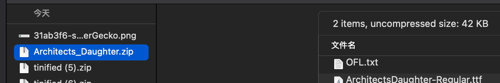
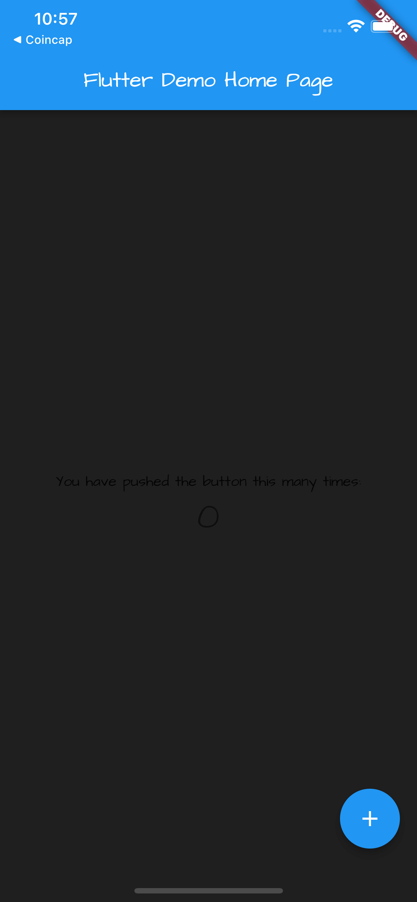
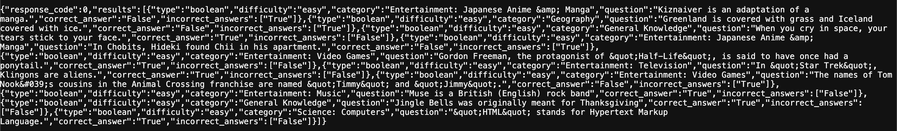
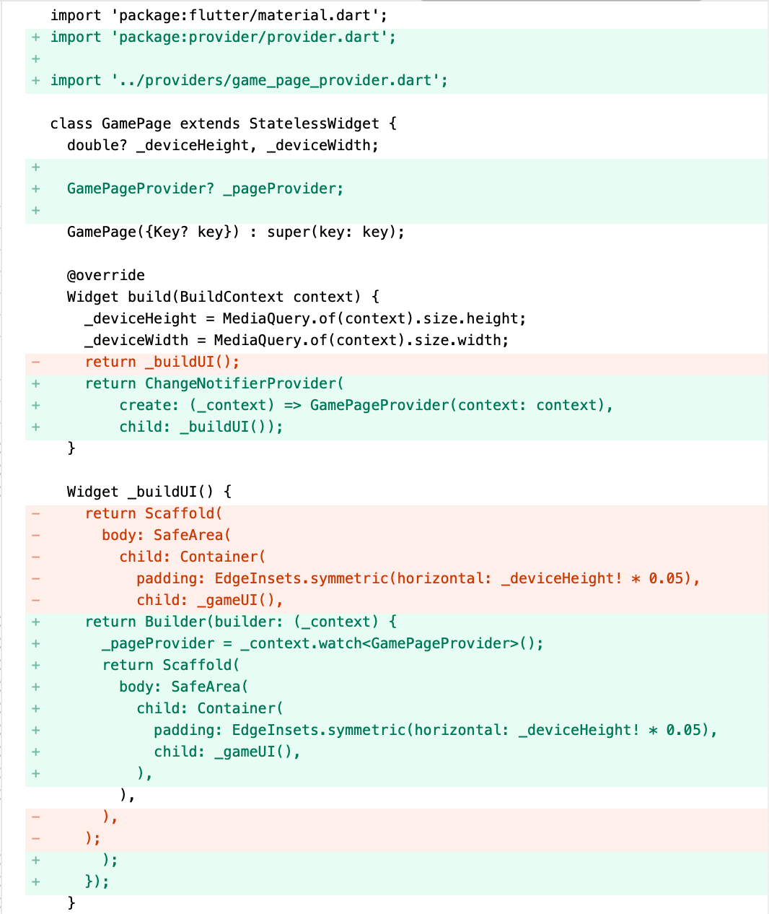
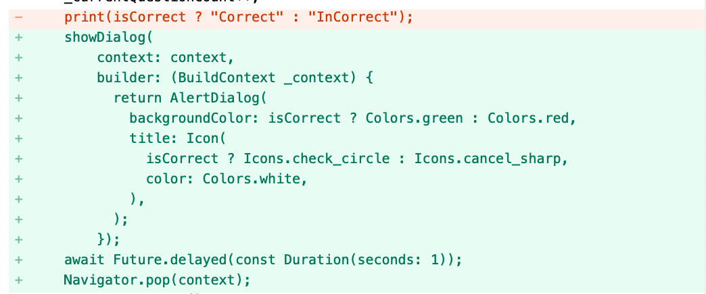
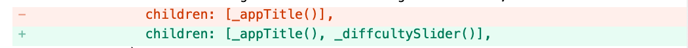

# Friviaa

* 24.8.10 created
* 24.8.11 updated

## 创建项目

```c
localhost:flutter chenchangqing$ flutter create friviaa
Creating project friviaa...
Running "flutter pub get" in friviaa...                             3.3s
Wrote 127 files.

All done!
In order to run your application, type:

  $ cd friviaa
  $ flutter run

Your application code is in friviaa/lib/main.dart.
```

增加依赖：
```c
  get_it: "7.2.0"
  dio: "4.0.4"
  provider: "6.0.2"
```

## 自定义字体

### 下载字体

1. 打开 https://fonts.google.com
2. 搜索`architects`，点击`Architects Daughter`
3. 在字体详情页面右上角，点击`Get font`下载
4. 下载结果为`Architects_Daughter.zip`


### 加载字体

1. 新建`assets/fonts`
2. 解压`Architects_Daughter.zip`
3. 将解压后的文件`ArchitectsDaughter-Regular.ttf`粘贴至`assets/fonts`
4. 修改`.yaml`：
```
  fonts:
    - family: ArchitectsDaughter
      fonts:
        - asset: assets/fonts/ArchitectsDaughter-Regular.ttf
```

### 应用字体

修改`main.dart`:


```c
  @override
  Widget build(BuildContext context) {
    return MaterialApp(
      title: 'Frivia',
      theme: ThemeData(
        fontFamily: 'ArchitectsDaughter',
        scaffoldBackgroundColor: const Color.fromRGBO(31, 31, 31, 1.0),
        primarySwatch: Colors.blue,
      ),
      home: const MyHomePage(title: 'Flutter Demo Home Page'),
    );
  }
```

### 当前UI



## 生成API

1. 打开 https://opentdb.com/api_config.php
2. Select Difficulty: Easy
3. Select Type: True/False
4. 点击`GENERATE API URL`
5. 生成 https://opentdb.com/api.php?amount=10&difficulty=easy&type=boolean API


{
  "response_code": 0,
  "results": [
    {
      "type": "boolean",
      "difficulty": "easy",
      "category": "Entertainment: Video Games",
      "question": "In Splatoon, the Squid Sisters are named Tako and Yaki.",
      "correct_answer": "False",
      "incorrect_answers": [
        "True"
      ]
    },
    {
      "type": "boolean",
      "difficulty": "easy",
      "category": "Entertainment: Japanese Anime &amp; Manga",
      "question": "Kiznaiver is an adaptation of a manga.",
      "correct_answer": "False",
      "incorrect_answers": [
        "True"
      ]
    },
    {
      "type": "boolean",
      "difficulty": "easy",
      "category": "Sports",
      "question": "In Rugby League, performing a &quot;40-20&quot; is punished by a free kick for the opposing team.",
      "correct_answer": "False",
      "incorrect_answers": [
        "True"
      ]
    },
    {
      "type": "boolean",
      "difficulty": "easy",
      "category": "Entertainment: Books",
      "question": "Shub-Niggurath is a creature that was created by \tJ. R. R. Tolkien in his novel &quot;The Lord of The Rings&quot;.",
      "correct_answer": "False",
      "incorrect_answers": [
        "True"
      ]
    },
    {
      "type": "boolean",
      "difficulty": "easy",
      "category": "Science: Mathematics",
      "question": "An isosceles triangle has two sides of equal length as opposed to three.",
      "correct_answer": "True",
      "incorrect_answers": [
        "False"
      ]
    },
    {
      "type": "boolean",
      "difficulty": "easy",
      "category": "Entertainment: Video Games",
      "question": "In RuneScape, one must complete the &quot;Dragon Slayer&quot; quest before equipping Rune Platelegs.",
      "correct_answer": "False",
      "incorrect_answers": [
        "True"
      ]
    },
    {
      "type": "boolean",
      "difficulty": "easy",
      "category": "Entertainment: Video Games",
      "question": "Watch_Dogs 2 is a prequel.",
      "correct_answer": "False",
      "incorrect_answers": [
        "True"
      ]
    },
    {
      "type": "boolean",
      "difficulty": "easy",
      "category": "Entertainment: Video Games",
      "question": "Peter Molyneux was the founder of Bullfrog Productions.",
      "correct_answer": "True",
      "incorrect_answers": [
        "False"
      ]
    },
    {
      "type": "boolean",
      "difficulty": "easy",
      "category": "History",
      "question": "The Spitfire originated from a racing plane.",
      "correct_answer": "True",
      "incorrect_answers": [
        "False"
      ]
    },
    {
      "type": "boolean",
      "difficulty": "easy",
      "category": "Animals",
      "question": "In 2016, the IUCN reclassified the status of Giant Pandas from endangered to vulnerable.",
      "correct_answer": "True",
      "incorrect_answers": [
        "False"
      ]
    }
  ]
}

## GamePage

### 新建`pages/game_page.dart`

```c
import 'package:flutter/material.dart';

class GamePage extends StatelessWidget {
  double? _deviceHeight, _deviceWidth;
  GamePage({Key? key}) : super(key: key);

  @override
  Widget build(BuildContext context) {
    _deviceHeight = MediaQuery.of(context).size.height;
    _deviceWidth = MediaQuery.of(context).size.width;
    return _buildUI();
  }

  Widget _buildUI() {
    return Scaffold(
      body: SafeArea(
        child: Container(
          padding: EdgeInsets.symmetric(horizontal: _deviceHeight! * 0.05),
          child: _gameUI(),
        ),
      ),
    );
  }

  Widget _gameUI() {
    return Column(
      mainAxisAlignment: MainAxisAlignment.spaceEvenly,
      mainAxisSize: MainAxisSize.max,
      crossAxisAlignment: CrossAxisAlignment.center,
      children: [_questionText()],
    );
  }

  Widget _questionText() {
    return const Text(
      "Test Question 1, Nothing Interesting",
      style: TextStyle(
          color: Colors.white, fontSize: 25, fontWeight: FontWeight.w400),
    );
  }
}
```
### 修改`main.dart`

```c
import 'package:flutter/material.dart';
import 'package:friviaa/pages/game_page.dart';

void main() {
  runApp(const MyApp());
}

class MyApp extends StatelessWidget {
  const MyApp({super.key});

  // This widget is the root of your application.
  @override
  Widget build(BuildContext context) {
    return MaterialApp(
      title: 'Frivia',
      theme: ThemeData(
        fontFamily: 'ArchitectsDaughter',
        scaffoldBackgroundColor: const Color.fromRGBO(31, 31, 31, 1.0),
        primarySwatch: Colors.blue,
      ),
      home: GamePage(),
    );
  }
}
```

### 当前UI


## 增加True/False按钮

### 增加按钮组件

```c
  Widget _trueButton() {
    return MaterialButton(
      onPressed: () {},
      color: Colors.green,
      minWidth: _deviceWidth! * 0.80,
      height: _deviceHeight! * 0.10,
      child: const Text(
        "True",
        style: TextStyle(
          color: Colors.white,
          fontSize: 25,
        ),
      ),
    );
  }

  Widget _falseButton() {
    return MaterialButton(
      onPressed: () {},
      color: Colors.red,
      minWidth: _deviceWidth! * 0.80,
      height: _deviceHeight! * 0.10,
      child: const Text(
        "False",
        style: TextStyle(
          color: Colors.white,
          fontSize: 25,
        ),
      ),
    );
  }
```

### 修改`_gameUI`方法


```c
  Widget _gameUI() {
    return Column(
      mainAxisAlignment: MainAxisAlignment.spaceEvenly,
      mainAxisSize: MainAxisSize.max,
      crossAxisAlignment: CrossAxisAlignment.center,
      children: [
        _questionText(),
        Column(
          children: [
            _trueButton(),
            SizedBox(
              height: _deviceHeight! * 0.01,
            ),
            _falseButton(),
          ],
        )
      ],
    );
  }
```

### 当前UI


## Use Provider

### 新增`providers/game_page_provider.dart`

```c
import 'package:dio/dio.dart';
import 'package:flutter/material.dart';

class GamePageProvider extends ChangeNotifier {
  final Dio _dio = Dio();

  BuildContext context;
  GamePageProvider({required this.context}) {
    _dio.options.baseUrl = 'https://opentdb.com/api.php';
    print("Hello");
  }
}
```

### 修改`game_page.dart`




## 请求数据

修改`game_page_provider.dart`:

```c
  Future<void> _getQuestionsFromAPI() async {
    var _response = await _dio.get('', queryParameters: {
      'amount': _maxQuestions,
      'type': 'boolean',
      'difficulty': 'easy',
    });
    var _data = jsonDecode(_response.toString());
    questions = _data["results"];
  }
```

## 显示问题名称

### 修改`game_page_provider.dart`


### 修改`game_page.dart`中`_buildUI`:
```c
  Widget _buildUI() {
    return Builder(builder: (_context) {
      _pageProvider = _context.watch<GamePageProvider>();
      if (_pageProvider!.questions != null) {
        return Scaffold(
          body: SafeArea(
            child: Container(
              padding: EdgeInsets.symmetric(horizontal: _deviceHeight! * 0.05),
              child: _gameUI(),
            ),
          ),
        );
      } else {
        return const Center(
          child: CircularProgressIndicator(
            color: Colors.white,
          ),
        );
      }
    });
  }
```

### 修改`game_page.dart`中`_questionText`

```c
  Widget _questionText() {
    return Text(
      _pageProvider!.getCurrentQuestionText(),
      style: const TextStyle(
          color: Colors.white, fontSize: 25, fontWeight: FontWeight.w400),
    );
  }
```

## 点击True/False

### 回答问题

修改`game_page_provider.dart`，新增方法：
```c
  void answerQuestion(String _answer) async {
    bool isCorrect =
        questions![_currentQuestionCount]["correct_answer"] == _answer;
    _currentQuestionCount++;
    print(isCorrect ? "Correct" : "InCorrect");
    notifyListeners();
  }
```

### 点击回答

修改`game_page.dart`中`_trueButton`、`_falseButton`的`onPressed`:
```c
_pageProvider?.answerQuestion("True");
_pageProvider?.answerQuestion("False");
```

## 显示回答结果

修改`game_page_provider.dart`中`answerQuestion`方法：

```c
    showDialog(
        context: context,
        builder: (BuildContext _context) {
          return AlertDialog(
            backgroundColor: isCorrect ? Colors.green : Colors.red,
            title: Icon(
              isCorrect ? Icons.check_circle : Icons.cancel_sharp,
              color: Colors.white,
            ),
          );
        });
    await Future.delayed(const Duration(seconds: 1));
    Navigator.pop(context);
```

## 显示回答比分
1. 修改`game_page_provider.dart`，新增`int _correctCount = 0;`属性
2. 修改`game_page_provider.dart`中`answerQuestion`回答方法
```c
  void answerQuestion(String _answer) async {
    bool isCorrect =
        questions![_currentQuestionCount]["correct_answer"] == _answer;
    _correctCount += isCorrect ? 1 : 0;
    _currentQuestionCount++;
    showDialog(
        context: context,
        builder: (BuildContext _context) {
          return AlertDialog(
            backgroundColor: isCorrect ? Colors.green : Colors.red,
            title: Icon(
              isCorrect ? Icons.check_circle : Icons.cancel_sharp,
              color: Colors.white,
            ),
          );
        });
    await Future.delayed(const Duration(seconds: 1));
    Navigator.pop(context);
    if (_currentQuestionCount == _maxQuestions) {
      endGame();
    } else {
      notifyListeners();
    }
  }
```
3. 新增方法`endGame`;
```c
  Future<void> endGame() async {
    showDialog(
        context: context,
        builder: (BuildContext builder) {
          return AlertDialog(
            backgroundColor: Colors.blue,
            title: const Text(
              "End Game!",
              style: TextStyle(fontSize: 25, color: Colors.white),
            ),
            content: Text("Score: $_correctCount/$_maxQuestions"),
          );
        });
    await Future.delayed(const Duration(seconds: 3));
    Navigator.pop(context);
    Navigator.pop(context);
  }
```

## 新增首页

新增`pages/home_page.dart`:

```c
import 'package:flutter/material.dart';

class HomePage extends StatefulWidget {
  const HomePage({Key? key}) : super(key: key);

  @override
  State<HomePage> createState() => _HomePageState();
}

class _HomePageState extends State<HomePage> {
  double? _deviceHeight, _deviceWidth;

  @override
  Widget build(BuildContext context) {
    _deviceHeight = MediaQuery.of(context).size.height;
    _deviceWidth = MediaQuery.of(context).size.width;
    return Scaffold(
      body: SafeArea(
        child: Container(
          padding: EdgeInsets.symmetric(horizontal: _deviceWidth! * 0.10),
          child: Center(
            child: Column(
              mainAxisAlignment: MainAxisAlignment.spaceEvenly,
              mainAxisSize: MainAxisSize.max,
              crossAxisAlignment: CrossAxisAlignment.center,
              children: [_appTitle()],
            ),
          ),
        ),
      ),
    );
  }

  Widget _appTitle() {
    return Column(children: const [
      Text(
        "Frivia",
        style: TextStyle(
            color: Colors.white, fontSize: 50, fontWeight: FontWeight.w500),
      )
    ]);
  }
}
```

修改`main.dart`: `home: HomePage(),`

## 新增Slider

修改`home_page.dart`

### 增加属性:

```c
double _currentDiffcultyLevel = 0;

final List<String> _diffcultyTexts = ["Easy", "Medium", "Hard"];
```

### 修改`_appTitle`：
```c
  Widget _appTitle() {
    return Column(children: [
      const Text(
        "Frivia",
        style: TextStyle(
            color: Colors.white, fontSize: 50, fontWeight: FontWeight.w500),
      ),
      Text(
        _diffcultyTexts[_currentDiffcultyLevel.toInt()],
        style: const TextStyle(
            color: Colors.white, fontSize: 20, fontWeight: FontWeight.w500),
      )
    ]);
  }
```


### 新增`_diffcultySlider`:
```c
  Widget _diffcultySlider() {
    return Slider(
        label: "Difficulty",
        min: 0,
        max: 2,
        divisions: 3,
        value: _currentDiffcultyLevel,
        onChanged: (_value) {
          setState(() {
            _currentDiffcultyLevel = _value;
          });
        });
  }
```
### 修改`build`:


## 开始按钮

### import

```
import 'package:friviaa/pages/game_page.dart';
```

### 修改build


### 新增开始按钮

```c
  Widget _startGameButton() {
    return MaterialButton(
      onPressed: () {
        Navigator.push(context,
            MaterialPageRoute(builder: (BuildContext _context) {
          return GamePage();
        }));
      },
      color: Colors.blue,
      minWidth: _deviceWidth! * 0.80,
      height: _deviceHeight! * 0.10,
      child: const Text(
        "Start",
        style: TextStyle(color: Colors.white, fontSize: 25),
      ),
    );
  }
```

## 当前UI


## 设置难度

### 修改Provider


### 修改GamePage


### 修改HomePage


## 源码

https://gitee.com/learnany/flutter/blob/master/friviaa.zip

