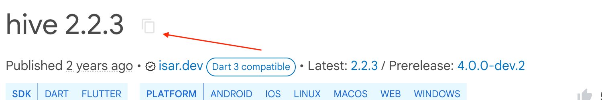
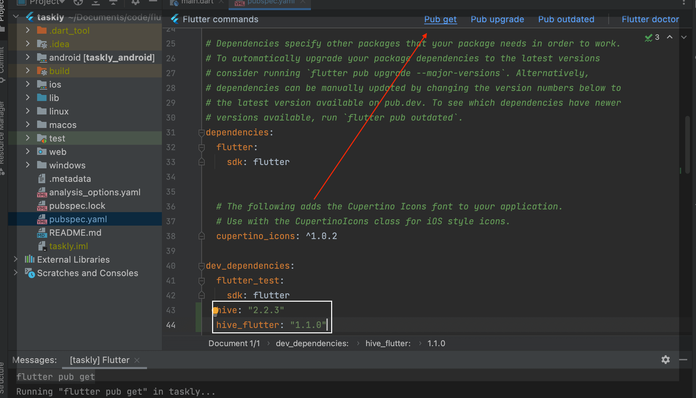
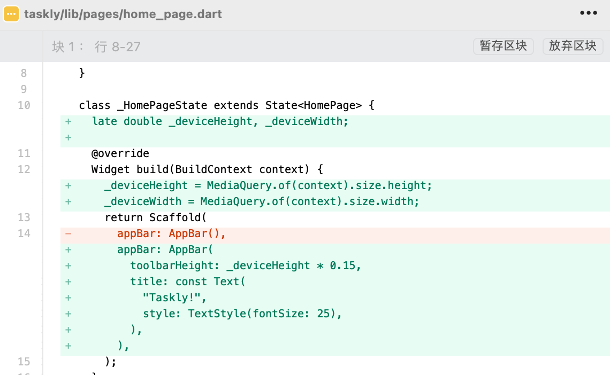
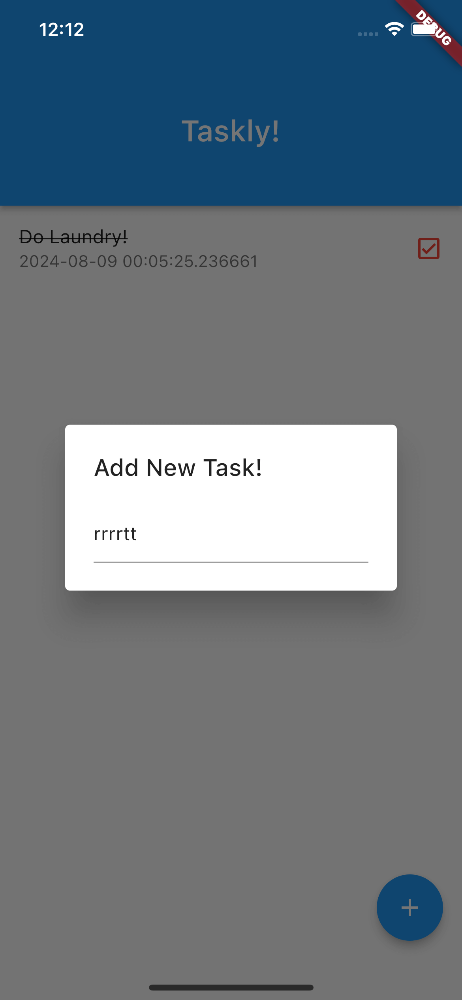
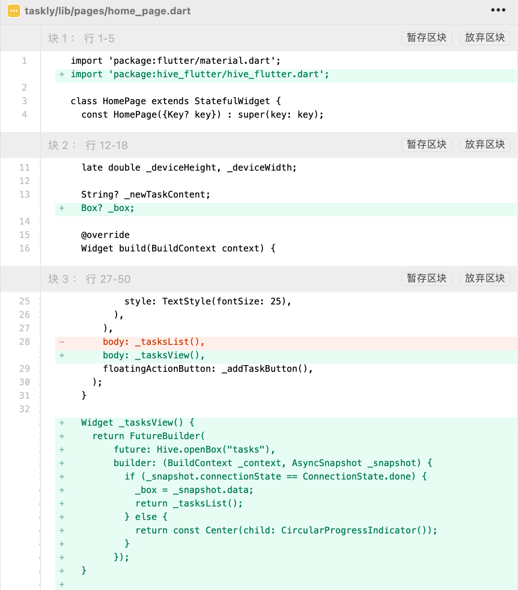
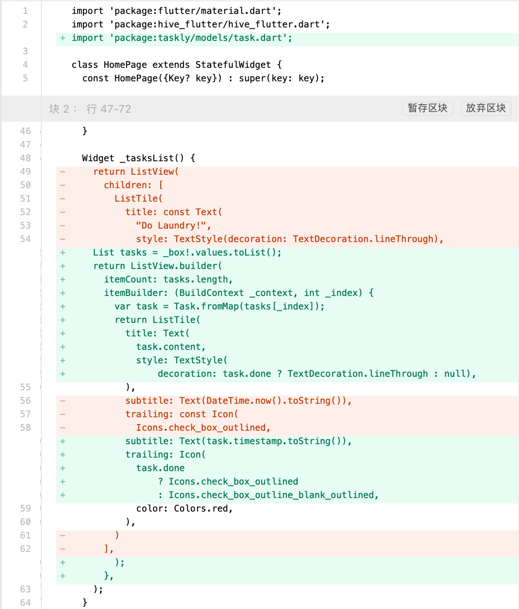
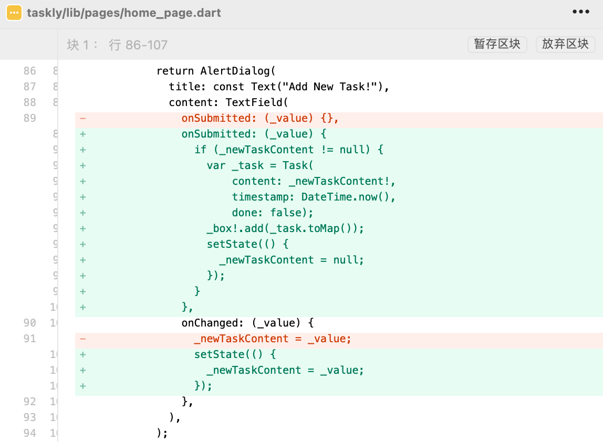
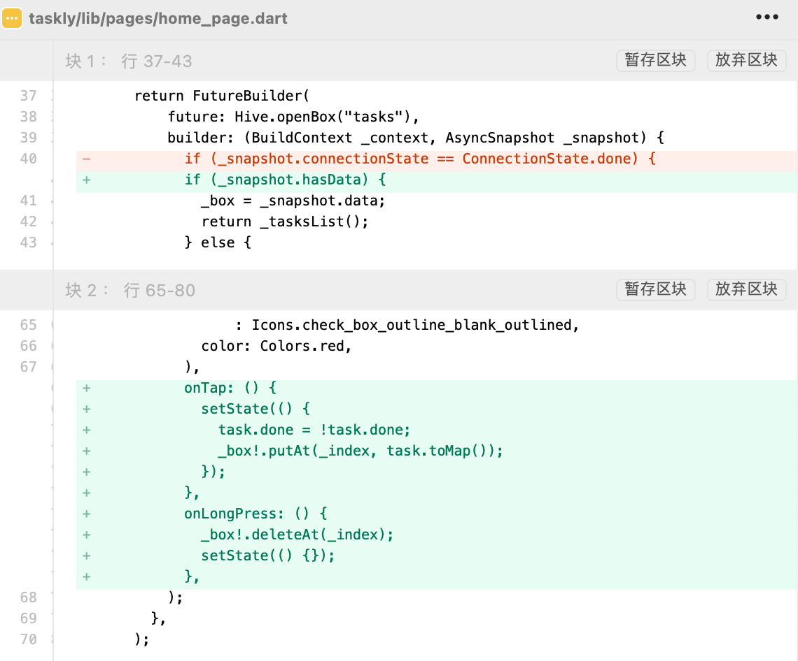
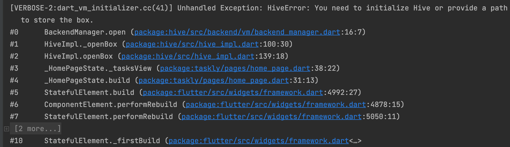
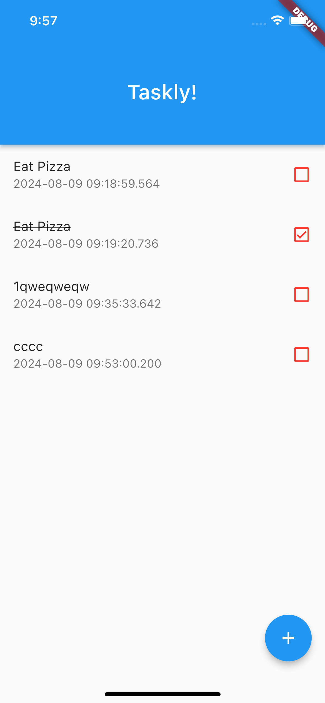

# Taskly

* 24.8.8 created
* 24.8.9 updated

## 创建工程

```
localhost:flutter chenchangqing$ flutter create taskly
Creating project taskly...
Running "flutter pub get" in taskly...                           2,386ms
Wrote 127 files.

All done!
In order to run your application, type:

  $ cd taskly
  $ flutter run

Your application code is in taskly/lib/main.dart.
```

## 依赖数据库

1、打开https://pub.dev/，搜索`hive`，点击`hive`  
2、复制版本依赖  

3、修改`.yaml`文件，增加`hive: "2.2.3"`  
4、同样的方式依赖`hive_flutter: "1.1.0"`  
5、点击`.yaml`文件右上角的`Pub get`获取依赖  


## 新增首页

### 创建`pages/home_page.dart`  
```c
import 'package:flutter/material.dart';

class HomePage extends StatefulWidget {
  const HomePage({Key? key}) : super(key: key);

  @override
  State<HomePage> createState() => _HomePageState();
}

class _HomePageState extends State<HomePage> {
  @override
  Widget build(BuildContext context) {
    return Scaffold(
      appBar: AppBar(),
    );
  }
}
```
1、删除`main.dart`中`MyHomePage`示例代码  
2、`MaterialApp`的home属性修改为替换为`const HomePage()`

### 新增导航栏


```c
class _HomePageState extends State<HomePage> {
  late double _deviceHeight, _deviceWidth;

  @override
  Widget build(BuildContext context) {
    _deviceHeight = MediaQuery.of(context).size.height;
    _deviceWidth = MediaQuery.of(context).size.width;
    return Scaffold(
      appBar: AppBar(
        toolbarHeight: _deviceHeight * 0.15,
        title: const Text(
          "Taskly!",
          style: TextStyle(fontSize: 25),
        ),
      ),
    );
  }
}
```
### 新增列表
```c
  Widget _tasksList() {
    return ListView(
      children: [
        ListTile(
          title: const Text(
            "Do Laundry!",
            style: TextStyle(decoration: TextDecoration.lineThrough),
          ),
          subtitle: Text(DateTime.now().toString()),
          trailing: const Icon(
            Icons.check_box_outlined,
            color: Colors.red,
          ),
        )
      ],
    );
  }
```
在`Scaffold`中增加`body: _tasksList(),`


### 新增任务按钮

```c
  Widget _addTaskButton() {
    return FloatingActionButton(
      onPressed: () {},
      child: const Icon(Icons.add),
    );
  }
```
在`Scaffold`中增加`floatingActionButton: _addTaskButton(),`

## 初始化Hive

1、新建`hive_boxes`文件夹  
2、在`main.dart`新增`runApp(const MyApp());`

```c
void main() {
  Hive.initFlutter("hive_boxes");
  runApp(const MyApp());
}
```

## 新增Task

新增`models/task.dart`：

```c
class Task {
  String content;
  DateTime timestamp;
  bool done;

  Task({required this.content, required this.timestamp, required this.done});

  factory Task.fromMap(Map task) {
    return Task(
        content: task["content"],
        timestamp: task["timestamp"],
        done: task["done"]);
  }

  Map toMap() {
    return {
      "content": content,
      "timestamp": timestamp,
      "done": done,
    };
  }
}
```

## 任务输入

1、在`_HomePageState`，新增属性`String? _newTaskContent;`；  
2、在`_HomePageState`，`build`方法新增`print("Input Value: $_newTaskContent");`；  
3、新增`_displayTaskPopup`方法，在`onPressed`中调用该方法
```c
  _displayTaskPopup() {
    showDialog(
        context: context,
        builder: (BuildContext _context) {
          return AlertDialog(
            title: const Text("Add New Task!"),
            content: TextField(
              onSubmitted: (_value) {},
              onChanged: (_value) {
                _newTaskContent = _value;
              },
            ),
          );
        });
  }
```
当前效果：

## 使用FutureBuilder


```c
  Widget _tasksView() {
    return FutureBuilder(
        future: Hive.openBox("tasks"),
        builder: (BuildContext _context, AsyncSnapshot _snapshot) {
          if (_snapshot.connectionState == ConnectionState.done) {
            _box = _snapshot.data;
            return _tasksList();
          } else {
            return const Center(child: CircularProgressIndicator());
          }
        });
  }
```

## 加载动态数据


```c
  Widget _tasksList() {
    List tasks = _box!.values.toList();
    return ListView.builder(
      itemCount: tasks.length,
      itemBuilder: (BuildContext _context, int _index) {
        var task = Task.fromMap(tasks[_index]);
        return ListTile(
          title: Text(
            task.content,
            style: TextStyle(
                decoration: task.done ? TextDecoration.lineThrough : null),
          ),
          subtitle: Text(task.timestamp.toString()),
          trailing: Icon(
            task.done
                ? Icons.check_box_outlined
                : Icons.check_box_outline_blank_outlined,
            color: Colors.red,
          ),
        );
      },
    );
  }
```

## 增加任务


```c
  _displayTaskPopup() {
    showDialog(
        context: context,
        builder: (BuildContext _context) {
          return AlertDialog(
            title: const Text("Add New Task!"),
            content: TextField(
              onSubmitted: (_value) {
                if (_newTaskContent != null) {
                  var _task = Task(
                      content: _newTaskContent!,
                      timestamp: DateTime.now(),
                      done: false);
                  _box!.add(_task.toMap());
                  setState(() {
                    _newTaskContent = null;
                  });
                }
              },
              onChanged: (_value) {
                setState(() {
                  _newTaskContent = _value;
                });
              },
            ),
          );
        });
  }
```

## 更新任务



## TODO



## 最终UI



## 源码

https://gitee.com/learnany/flutter/blob/master/taskly.zip
