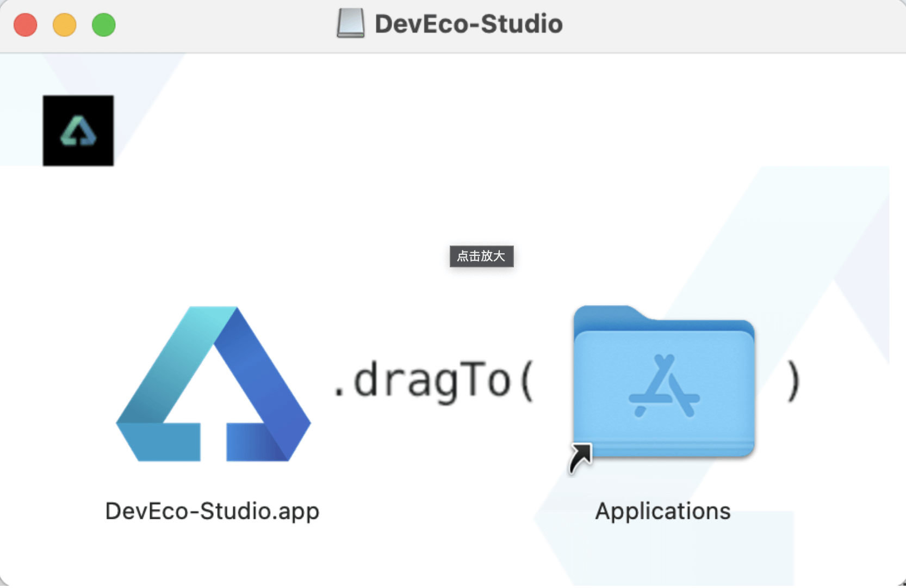
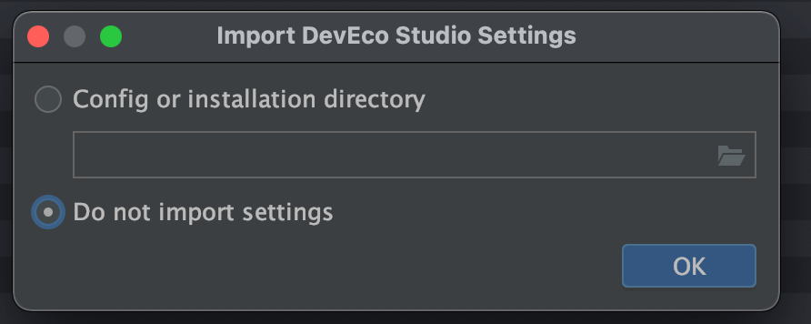
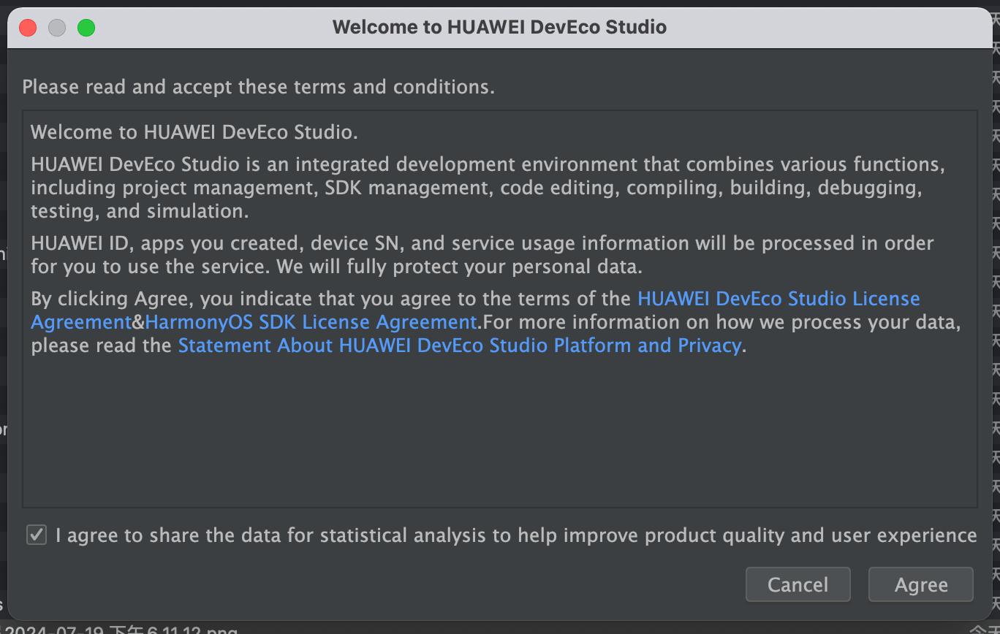
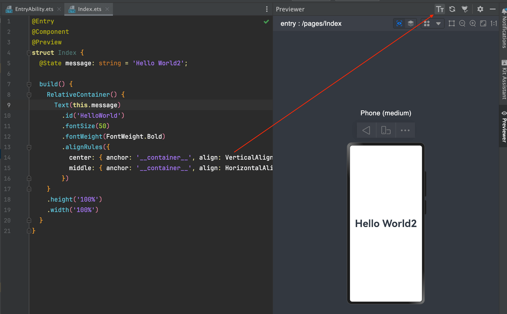
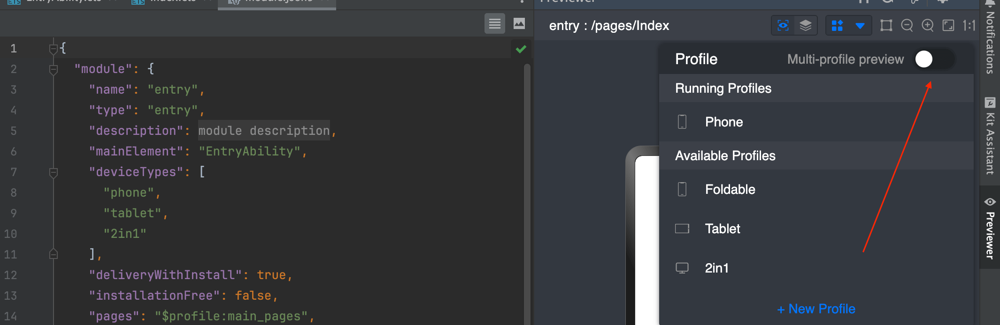
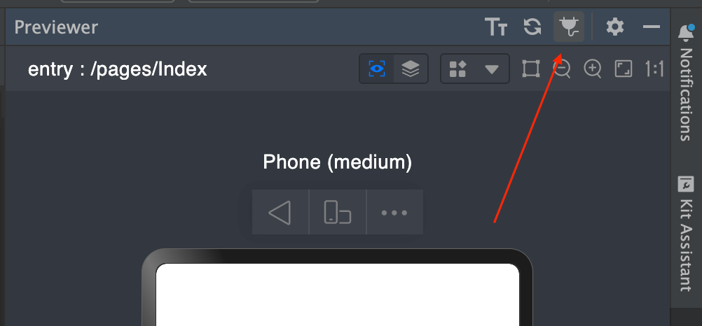
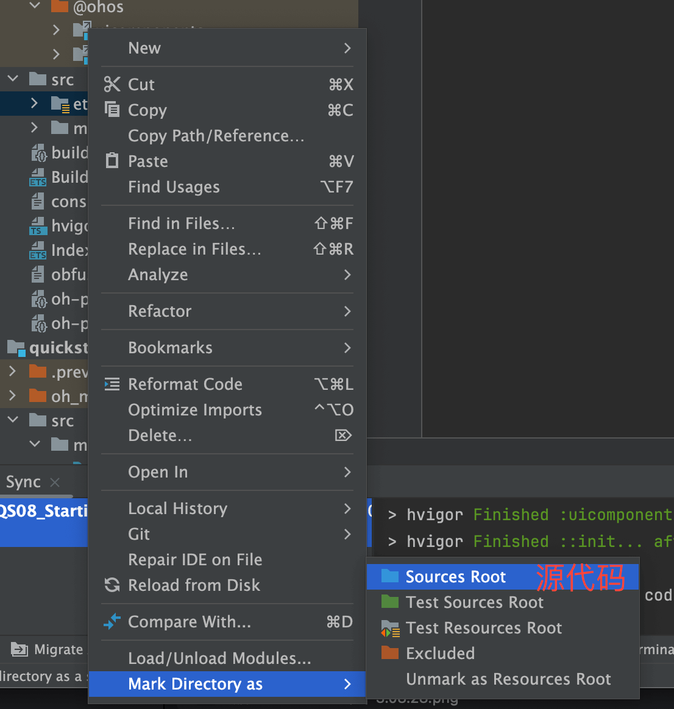
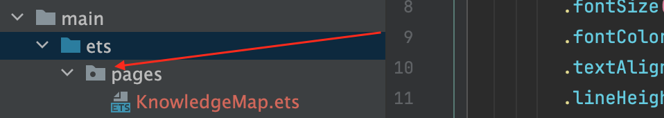
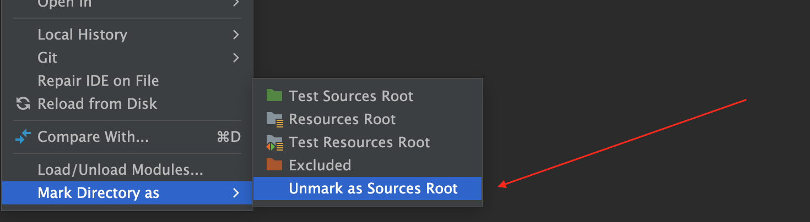

# DevEco Studio

## Mac下安装

1. 先注册华为账号
2. [下载zip文件](https://developer.huawei.com/consumer/cn/download/)
3. 解压`devecostudio-mac-5.0.3.404.zip`
4. 双击dmg
5. 拖拽至applications  

6. 不设置安装文件夹，直接点击ok  

7. 点击同意  

## 界面预览

* 双向预览

* 多设备预览

* 关闭实时预览

* @Preview：组件预览
* 预览模拟数据

## 参考链接

* [安装DevEco Studio](https://developer.huawei.com/consumer/cn/training/course/slightMooc/C101717494752698457)
* [HarmonyOS应用开发者基础认证](https://developer.huawei.com/consumer/cn/training/dev-cert-detail/101666948302721398)
* [论坛](https://developer.huawei.com/consumer/cn/forum/)
* [指南](https://developer.huawei.com/consumer/cn/doc/harmonyos-guides-V2/data-persistence-by-preferences-0000001505432513-V2)

## 考试答案
吃多少发多少    
* [【HarmonyOS第一课】从简单的页面开始答案](https://blog.csdn.net/qq_42874996/article/details/140066247)
* [【HarmonyOS第一课】从简单的页面开始答案2](https://www.cnblogs.com/MojoisMe/p/17421632.html)

## codelabs

* [从简单的页面开始](https://developer.huawei.com/consumer/cn/training/course/slightMooc/C101717497398588123)

## 问题记录

* 设置文件夹类型

* 文件夹中间有个点？

点击如下选项

