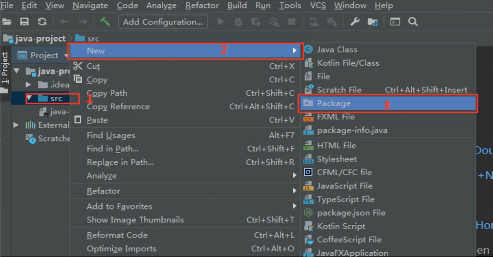

# IDEA创建项目

### 创建Java项目
--- 
1. 打开IDEA
2. 点击NewProject，显示NewProject窗口
3. 左边菜单默认选中New Project
4. 输入项目名称，指定项目路径、语言、Build System、JDK
5. 点击Create

### 创建Java中的package
---

### 创建类、接口、枚举、注解
---

### 创建空项目和Module及相关操作
---
1. 打开IDEA
2. 点击NewProject，显示NewProject窗口
3. 左边菜单默认选中Empty Project
4. 输入项目名称
5. 点击Create

>创建Module

方式一：
1. 点击File->New->Module
2. 输入Module名称->点击Create

方式二：
1. 点击右上角设置
2. 点击Project Structure
3. 选中Modules，点击+
4. 输入Module名称->点击Create

>项目支持web

1. 右键module名称
2. Add Framework Support
3. 勾选Java EE->Web Application(4.0)
4. 点击OK

>删除Module

方式一：
1. 右键module名称
2. Remove Module

方式二：
1. 点击右上角设置
2. 点击Project Structure
3. 选中Modules，点击-

注意：Remove Module后，需要删除硬盘里的Module文件夹。

### 创建Java空项目和Module及相关操作
---

1. 创建一个Java项目
2. 删除src
3. 右键项目名称，New->Module
