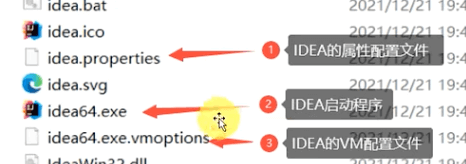
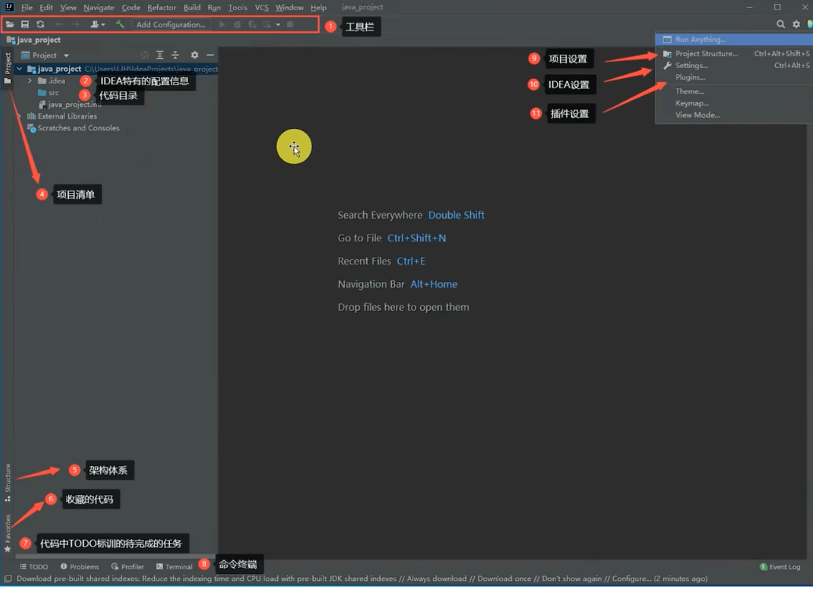
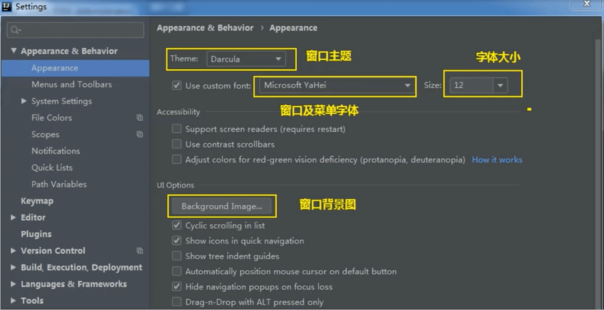

# IDEA环境配置

### 链接地址
---

官方地址：https://www.jetbrains.com/idea/

官方使用文档：https://www.jetbrains.com/idea/getting-started.html

### 安装目录
---


### 核心bin目录介绍
---



IDEA的VM配置，是指占用的机器内存。idea.vmoptions:

```java
-Xms128m// 占用最小内存
-Xmx750m// 张永最大内存
-XX:ReservedCodeCacheSize=512m// 代码占用的缓存大小
-XX:+UseG1GC
-XX:SoftRefLRUPolicyMSPerMB=50
-XX:CICompilerCount=2
-XX:+HeapDumpOnOutOfMemoryError
-XX:-OmitStackTraceInFastThrow
-XX:+IgnoreUnrecognizedVMOptions
-XX:CompileCommand=exclude,com/intellij/openapi/vfs/impl/FilePartNodeRoot,trieDescend
-ea
-Dsun.io.useCanonCaches=false
-Dsun.java2d.metal=true
-Djbr.catch.SIGABRT=true
-Djdk.http.auth.tunneling.disabledSchemes=""
-Djdk.attach.allowAttachSelf=true
-Djdk.module.illegalAccess.silent=true
-Dkotlinx.coroutines.debug=off
-XX:ErrorFile=$USER_HOME/java_error_in_idea_%p.log
-XX:HeapDumpPath=$USER_HOME/java_error_in_idea.hprof
-Dfile.encoding=UTF-8// 设置文件编码格式
-Dconsole.encoding=UTF-8// 设置控制台编码格式

```
如果电脑低于8G没有太多的修改必要，如果16G的内存，可以适当的修改最小内存和最大内存的值，调整最小内存可以提供Java程序的启动速度，调整最大内存可以减少内存回收的频率，提供程序性能。

### 常用配置
---

>设置常规视图界面



**注意**：由于项目具体的不同，展示的界面也不尽相同。

>设置主题



>设置启动时是否打开项目


>设置鼠标滚轮修改字体


>设置自动打包


>设置行号和分隔符


>代码提示规则


>取消单行显示


>设置编辑区字体


>设置编辑区主题


>更多主题


>修改控制台字体


>修改注释颜色


>修改类头的注释文档


>设置项目文件编码


>Build,Exeution,Deployment

