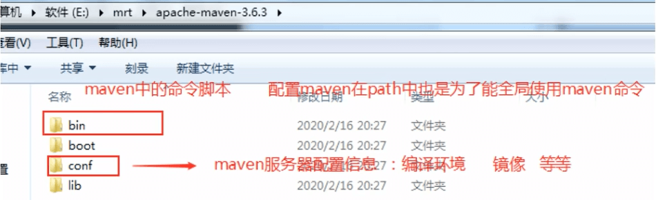
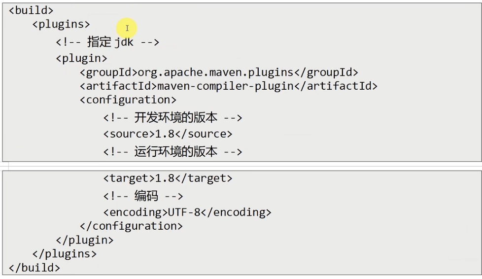

# Maven的安装与配置

Maven是一个免安装的程序，即解压则可以使用，但是Maven管理项目需要使用插件管理生命周期。而需要使用Maven的命令，所以需要配置Maven的环境变量。Maven本身使用Java开发，也依赖JDK的环境变量。

### Maven的目录结构
--- 


### Maven的下载
---
官方网站：https://maven.apache.org/

下载地址：https://maven.apache.org/download.cgi

查看IDEA对Maven的版本要求：

Setting->Preferences->Build,Execution,Deployment->Build Tools->Maven

### 环境变量
--- 
命令行输入以下命令
```
vi ~/bash_profile
```
编辑输入，然后保存：
```
MAVEN_HOME=~/Documents/apps/apache-maven-3.9.3
PATH=$MAVEN_HOME/bin:$PATH:.
export JAVA_HOME
export PATH
```
命令行输入：
```
source ~/.bash_profile
```
验证Maven：
```
mvn -version
```

### settings.xml
---

打开：MAVEN_HOME/conf/settings.xml

>配置仓库地址

找到localRepository，默认${user.home}/.m2/repository，可以修改。

>配置阿里云镜像

```
<!--<mirror>
  <id>maven-default-http-blocker</id>
  <mirrorOf>external:http:*</mirrorOf>
  <name>Pseudo repository to mirror external repositories initially using HTTP.</name>
  <url>http://0.0.0.0/</url>
  <blocked>true</blocked>
</mirror>
 -->
<mirror>
  <id>alimaven</id>
  <mirrorOf>central</mirrorOf>
  <name>aliyun maven</name>
  <url>http://maven.aliyun.com/nexus/content/groups/public</url>
</mirror>
```
>配置JDK

```
<profile>
  <id>jdk1.8</id>

  <activation>
    <activeByDefault>true</activeByDefault>
    <jdk>1.8</jdk>
  </activation>

  <properties>
    <maven.compiler.source>1.8</maven.compiler.source>
    <maven.compiler.target>1.8</maven.compiler.target>
    <maven.compiler.compilerVersion>1.8</maven.compiler.compilerVersion>
  </properties>
</profile>
```
>项目中指定JDK



### IDEA集成Maven
---
Setting->Preferences->Build,Execution,Deployment->Build Tools->Maven->修改Maven home path、setting.xml path

