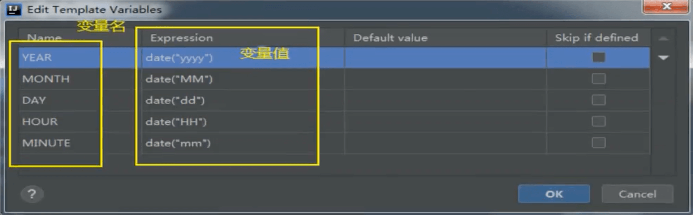

# IDEA模版

官方介绍：https://www.jetbrains.com/help/idea/using-live-templates.html

代码模板是指，配置一些常用的代码字母缩写后，当输入缩写字母时，IDEA会根据输入的字母缩写，帮助自动完成预设的代码。从而提供编码效率，同时也可以进行个性化设置，例如：注释模板。

### 内置模版
---
在IDEA中，有很多内置的编码模板，使用者只需要敲击简单的前缀即可生成代码。但是以下模板是固定的无法修改。

鉴于Postfix Completion模板无法修改，IDEA提供了Live Templates模板，该模板用户可以自定义。

### 常用模板说明
--- 

### 自定义模板
---

>首先创建一个模板组

>创建模板

>自定义模板

在自定义模板中，可以通过$名称$的形式声明变量，然后使用内置的函数为变量动态赋值。

效果

