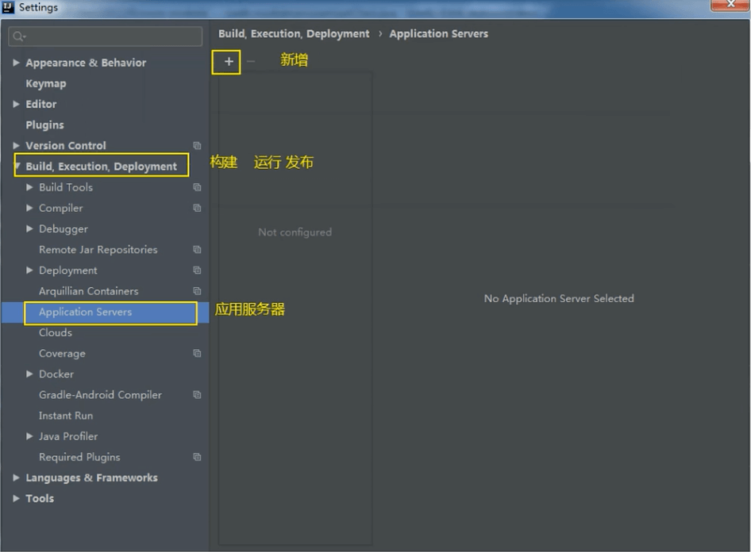
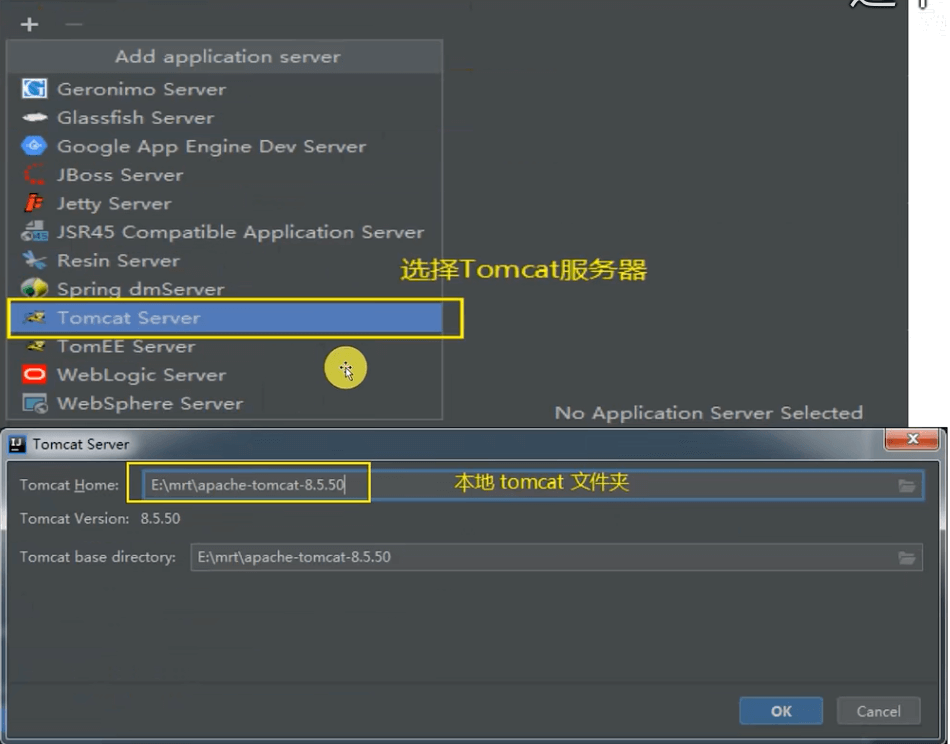
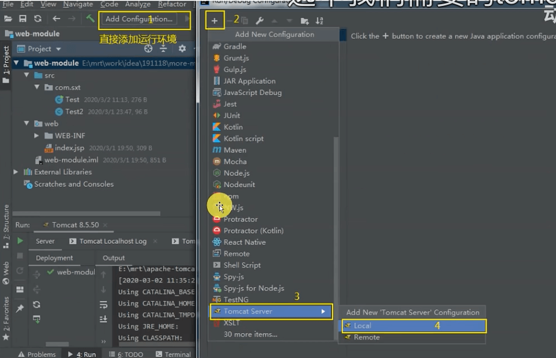
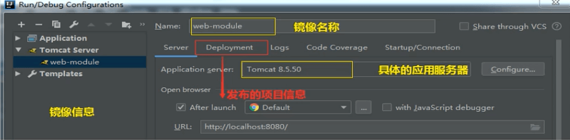
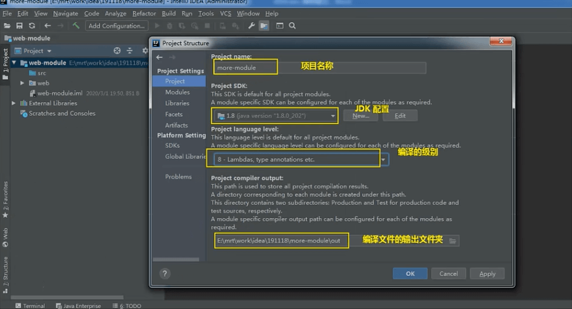
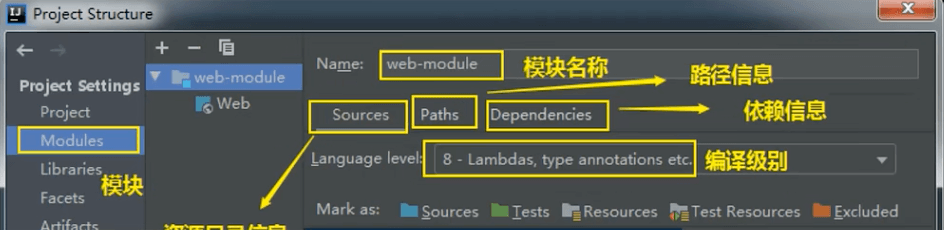
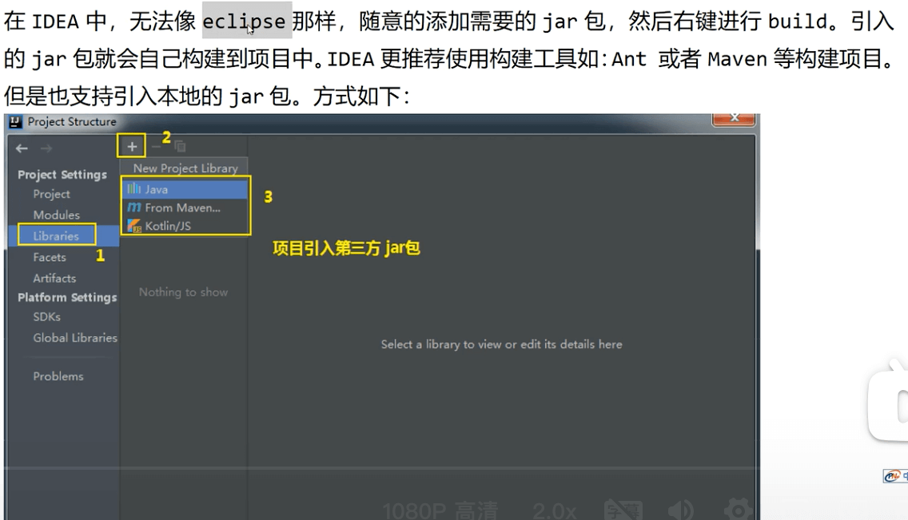

# IDEA配置Tomcat

在IDEA中配置Tomcat，推荐使用Maven插件中的Tomcat插件启动项目。

### 配置Tomcat
---
>Setting -> Preferences -> Build,Execution,Deployment -> Application Servers

>点击+，选择Tomcat Server，选择Tomcat根路径，点击OK

### 发布项目
---

### 项目配置信息
---

### Module的配置信息
---

### 第三方Jar包
---

还有一种方式：右键Module名称->New Directory->拖jar进文件夹->选中jar列表->Add as Library

