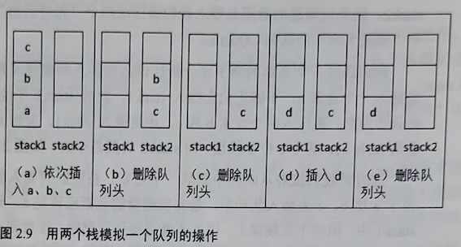

# 用两个栈实现队列

**题目：用两个栈实现一个队列。队列的声明如下，请实现它的两个函数appendTail和deleteHead，分别完成在队列尾部插入节点和在队列头部删除节点的功能。**

```c
template <typename T>class CQueue
{
public:
	CQueue(void);
	~CQueue(void);

	void appendTail(const T& node);
	T deleteHead();
private:
	stack<T>stack1;
	stack<T>stack2;
};
```
从上述队列的声明中可以看出，一个队列包含了两个栈stack1和stack2，因此这道题的意图是要求我们操作这两个“先进后出”的栈实现一个“先进先出”的队列CQueue。

我们通过一个具体的例子来分析往该队列插入和删除元素的过程。首先插入一个元素a，不妨先把它插入stack1，此时stack1中的元素有{a}，stack2为空。再压入两个元素b和c，还是插入stack1，此时stack1中的元素有{a,b,c}，其中c位于栈顶，而stack2仍然是空的，如图2.9(a)所示。

这时候我们试着从队列中删除一个元素。按照队列先入先出的规则，由于a比b、c先插入队列中，最先被删除的元素应该是a。元素a存储在stack1中，但并不在栈顶上，因此不能直接进行删除。注意到stack2一直没有被使用过，现在是让stack2发挥作用的时候了。如果我们把stack1中的元素逐个弹出并压入stack2，则元素在stack2中的顺序正好和原来在stack1中的顺序相反。因此经过3次弹出stack1和压入stack2的操作之后，stack1为空，而stack2中的元素是{c,b,a}，这时候就可以弹出stack2的栈顶a了。此时的stack1为空，而stack2的元素为{c,b}，其中b在栈顶，如图2.9(b)所示。

如果我们还想继续删除队列的头部应该怎么办呢？剩下的两个元素是b和c，b比c早进入队列，因此b应该先删除。而此时b恰好又在栈顶上，因此直接弹出stack2的栈顶即可。在这次弹出操作之后，stackl仍然为空，而stack2中的元素为{c}，如图2.9(c)所示。

从上面的分析中我们可以总结出删除一个元素的步骤：当stack2不为空时，在stack2中的栈顶元素是最先进入队列的元素，可以弹出。当stack2为空时，我们把stack1中的元素逐个弹出并压入stack2。由于先进入队列的元素被压到stack1的底端，经过弹出和压入操作之后就处于stack2的顶端，又可以直接弹出。

接下来再插入一个元素d。我们还是把它压入stack1,如图2.9(d)所示，这样会不会有问题呢？我们考虑下一次删除队列的头部stack2不为空，直接弹出它的栈顶元素c，如图2.9(e)所示。而c的确比d先进入队列，应该在d之前从队列中删除，因此不会出现任何矛盾。



总结完每一次在队列中插入和删除操作的过程之后，我们就可以开始动手写代码了。参考代码如下：

```c
template<typename T> void CQueue<T>::appendTail(const T& element)
{
    stack1.push(element);
} 

template<typename T> T CQueue<T>::deleteHead()
{
    if(stack2.size()<= 0)
    {
        while(stack1.size()>0)
        {
            T& data = stack1.top();
            stack1.pop();
            stack2.push(data);
        }
    }

    if(stack2.size() == 0)
        throw new exception("queue is empty");

    T head = stack2.top();
    stack2.pop();

    return head;
}
```

> 剑指 Offer P68，本题完整的源代码：https://github.com/zhedahht/CodingInterviewChinese2/tree/master/09_QueueWithTwoStacks