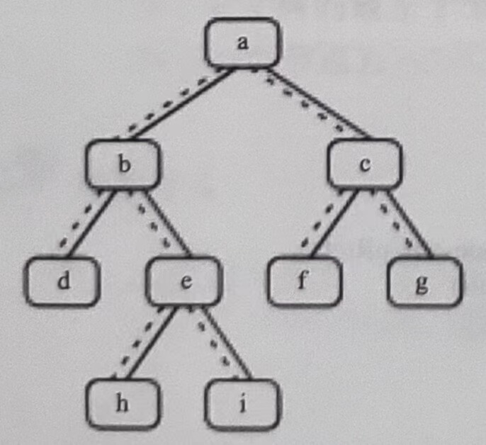

# 二叉树的下一个节点

**题目：给定一棵二叉树和其中的一个节点，如何找出中序遍历序列的下一个节点？树中的节点除了有两个分别指向左、右子节点的指针，还有一个指向父节点的指针。**

在图2.8中的二叉树的中序遍历序列是{d,b,h,e,i,a,f,c,g}。我们将以这棵树为例来分析如何找出二叉树的下一个节点。



**图2.8 一棵有9个节点的二叉树。树中从父节点指向子节点的指针用实线表示，从子节点指向父节点的指针用虚线表示**

如果一个节点有右子树，那么它的下一个节点就是它的右子树中的最左子节点。也就是说，从右子节点出发一直沿着指向左子节点的指针，我们就能找到它的下一个节点。例如，图2.8中节点b的下一个节点是h，节点a的下一个节点是f。

接着我们分析一个节点没有右子树的情形。如果节点是它父节点的左子节点，那么它的下一个节点就是它的父节点。例如，图2.8中节点d的下一个节点是b，节点f的下一个节点是c。

如果一个节点既没有右子树，并且它还是它父节点的右子节点，那么这种情形就比较复杂。我们可以沿着指向父节点的指针一直向上遍历，直到找到一个是它父节点的左子节点的节点。如果这样的节点存在，那么这个节点的父节点就是我们要找的下一个节点。

为了找到图2.8中节点i的下一个节点，我们沿着指向父节点的指针向上遍历，先到达节点e。由于节点e是它父节点b的右节点，我们继续向上遍历到达节点b。节点b是它父节点a的左子节点，因此节点b的父节点a就是节点i的下一个节点。

找出节点g的下一个节点的步骤类似。我们先沿着指向父节点的指针到达节点c。由于节点c是它父节点a的右子节点，我们继续向上遍历到达节点a。由于节点a是树的根节点，它没有父节点，因此节点g没有下一个节点。

我们用如下的C++代码从二叉树中找出一个节点的下一个节点：
```c
BinaryTreeNode* GetNext(BinaryTreeNode* pNode)
{
    if(pNode == nullptr)
        return nullptr;

    BinaryTreeNode* pNext = nullptr;
    if(pNode->m_pRight != nullptr)
    {
        BinaryTreeNode* pRight = pNode->m_pRight;
        while(pRight->m_pLeft != nullptr)
            pRight = pRight->m_pLeft;

        pNext = pRight;
    }
    else if(pNode->m_pParent != nullptr)
    {
        BinaryTreeNode* pCurrent = pNode;
        BinaryTreeNode* pParent = pNode->m_pParent;
        while(pParent != nullptr && pCurrent == pParent->m_pRight)
        {
            pCurrent = pParent;
            pParent = pParent->m_pParent;
        }

        pNext = pParent;
    }

    return pNext;
}
```

> 剑指 Offer P65，本题完整的源代码：https://github.com/zhedahht/CodingInterviewChinese2/tree/master/08_NextNodeInBinaryTrees