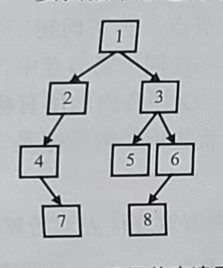
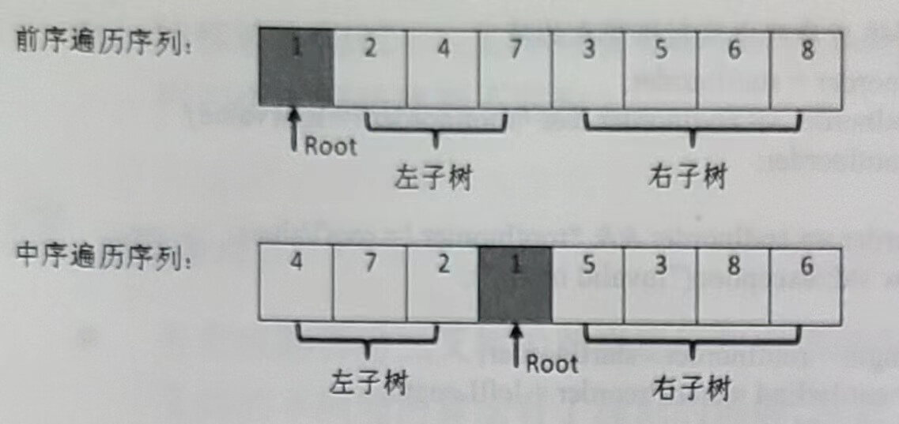

# 重建二叉树

**题目：输入某二叉树的前序遍历和中序遍历的结果，请重建该二又树。假设输入的前序遍历和中序遍历的结果中都不含重复的数字。例如，输入前序遍历序列{1,2,4,7,3,5,6,8}和中序遍历序列{4,7,2,1,5,3,8,6}，则重建如图2.6所示的二叉树并输出它的头节点。二叉树节点的定义如下：**

```c
struct BinaryTreeNode
{
	int m_nValue;
	BinaryTreeNode* m_pLeft;
	BinaryTreeNode*	m_pRight;
};
```
在二叉树的前序遍历序列中，第一个数字总是树的根节点的值。但在中序遍历序列中，根节点的值在序列的中间，左子树的节点的值位于根节点的值的左边，而右子树的节点的值位于根节点的值的右边。因此我们需要扫描中序遍历序列，才能找到根节点的值。



**图2.6 根据前序遍历序列(1,2,4,7,3,5,6,8}和中序遍历序列4,7,2,1,5,3,8,6}重建的二叉树**

如图2.7所示，前序遍历序列的第一个数字1就是根节点的值。扫描中序遍历序列，就能确定根节点的值的位置。根据中序遍历的特点，在根节点的值1前面的3个数字都是左子树节点的值，位于1后面的数字都是右子树节点的值。

由于在中序遍历序列中，有3个数字是左子树节点的值，因此左子树共有3个左子节点。同样，在前序遍历序列中，根节点后面的3个数字就是3个左子树节点的值，再后面的所有数字都是右子树节点的值。这样我们就在前序遍历和中序遍历两个序列中分别找到了左、右子树对应的子序列。



**图2.7 在二叉树的前序遍历和中序遍历序列中确定根节点的值、左子树节点的值和右子树节点的值**

既然我们已经分别找到了左、右子树的前序遍历序列和中序遍历序列，我们可以用同样的方法分别构建左、右子树。也就是说，接下来的事情可以用递归的方法去完成。

在想清楚如何在前序遍历和中序遍历序列中确定左、右子树的子序列之后，我们可以写出如下的递归代码：

```c
BinaryTreeNode* ConstructCore(int* startPreorder, int* endPreorder, int* startInorder, int* endInorder);

BinaryTreeNode* Construct(int* preorder, int* inorder, int length)
{
    if(preorder == nullptr || inorder == nullptr || length <= 0)
        return nullptr;

    return ConstructCore(preorder, preorder + length - 1,
        inorder, inorder + length - 1);
}

BinaryTreeNode* ConstructCore
(
    int* startPreorder, int* endPreorder, 
    int* startInorder, int* endInorder
)
{
    // 前序遍历序列的第一个数字是根结点的值
    int rootValue = startPreorder[0];
    BinaryTreeNode* root = new BinaryTreeNode();
    root->m_nValue = rootValue;
    root->m_pLeft = root->m_pRight = nullptr;

    if(startPreorder == endPreorder)
    {
        if(startInorder == endInorder && *startPreorder == *startInorder)
            return root;
        else
            throw std::exception("Invalid input.");
    }

    // 在中序遍历中找到根结点的值
    int* rootInorder = startInorder;
    while(rootInorder <= endInorder && *rootInorder != rootValue)
        ++ rootInorder;

    if(rootInorder == endInorder && *rootInorder != rootValue)
        throw std::exception("Invalid input.");

    int leftLength = rootInorder - startInorder;
    int* leftPreorderEnd = startPreorder + leftLength;
    if(leftLength > 0)
    {
        // 构建左子树
        root->m_pLeft = ConstructCore(startPreorder + 1, leftPreorderEnd, 
            startInorder, rootInorder - 1);
    }
    if(leftLength < endPreorder - startPreorder)
    {
        // 构建右子树
        root->m_pRight = ConstructCore(leftPreorderEnd + 1, endPreorder,
            rootInorder + 1, endInorder);
    }

    return root;
}
```

在函数ConstructCore中，我们先根据前序遍历序列的第一个数字创建根节点，接下来在中序遍历序列中找到根节点的位置，这样就能确定左、右子树节点的数量。在前序遍历和中序遍历序列中划分了左、右子树节点的值之后，我们就可以递归地调用函数ConstructCore去分别构建它的左、右子树。

> 剑指 Offer P62，本题完整的源代码：
https://github.com/zhedahht/CodingInterviewChinese2/tree/master/07_ConstructBinaryTree