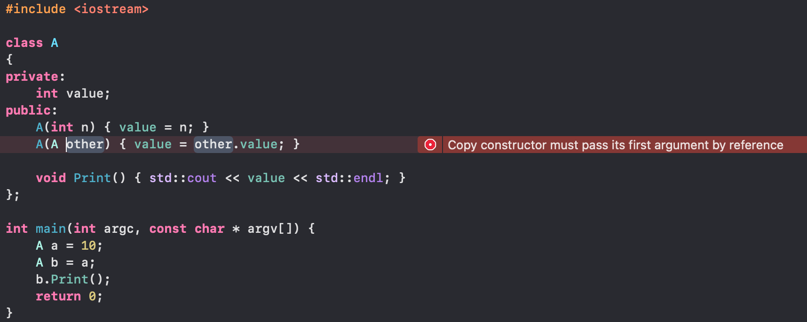

# 复制构造函数

比如，面试官递给应聘者一张有如下代码的A4打印纸要求他分析编译运行的结果，并提供3个选项：A.编译错误；B.编译成功，运行时程序崩溃；C.编译运行正常，输出10。

在上述代码中，复制构造函数A(A other)传入的参数是A的一个实例。由于是传值参数，我们把形参复制到实参会调用复制构造函数。因此，如果允许复制构造函数传值，就会在复制构造函数内调用复制构造函数，就会形成永无休止的递归调用从而导致栈溢出。因此，C+的标准不允许复制构造函数传值参数，在Visual Studio和GCC中，都将编译出错。要解决这个问题，我们可以把构造函数修改为A(const A&other),也就是把传值参数改成常量引用。