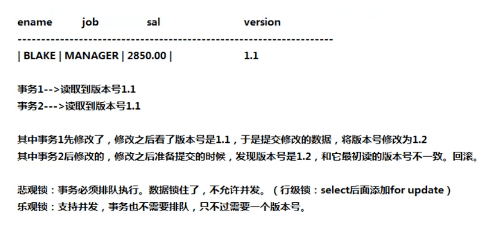

# 悲观锁和乐观锁

悲观锁（行级锁）：`select`结尾加`for update`。

乐观锁：多线程并发都可以对同一记录修改，只不过会对行数据记录版本号。有个线程发现版本号是v1.0，另一个线程发现版本号也是v1.0，这个时候第一个线程修改行数据后版本号为v2.0，另外一个线程也进行修改，在提交之前发现版本号是v2.0，和之前的v1.0不一致，发现数据被修改了，这个时候第二线程就回滚。

