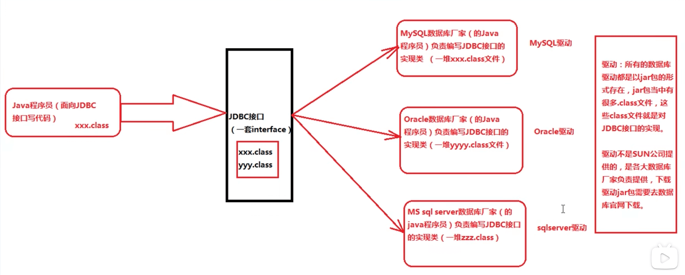

## JDBC本质
---

### JDBC是什么？

Java Database Connectivity（Java语言连接数据库）。

### JDBC的本质是什么？

JDBC是SUN公司制定的一套接口（interface）。接口都有调用者和实现者，面向接口调用、面向接口写实现类，这都属于面向接口编程。java.sql.*，这个软件包下有很多的接口。

### 为什么要面向接口编程？

解耦合：降低程序的耦合度，提供程序的扩展力。多态机制就是非常典型的面向抽象编程，而不是面向具体编程。

我们建议：
```java
Animal a = new Cat();
Animal b = new Dog();

// 喂养的方法
public void feed(Animal a) {
	// 面向父类型编程
}
```

我们不建议：
```java
Cat a = new Cat();
Dog b = new Dog();

// 喂养的方法
public void feed(Cat a) {
	// 面向实现类编程
}
```

### 为什么SUN制定一套JDBC接口呢？

因为每一个数据库的底层实现原理不一样，Oracle数据库有自己的原理，MYSQL数据库也有自己的原理，MS SQLServer数据库也有自己的原理，每个数据库都有自己独特的实现原理。



### 编写程序模拟JDBC本质

SUN角色：

```java
/*
SUN角色
SUN公司负责制定这套JDBC接口
*/
public interface JDBC {
	/*
	连接数据库的方法
	*/
	void getConnectoin();
}
```

实现者角色：
```java
/*
MySQL驱动
MySQL的数据库厂家负责写JDBC接口的实现类
*/
public class MySQL implements JDBC {
	public void getConnectoin() {
		// 具体这里的代码怎么写，对于我们Java程序员来说没关系
		// 这段代码涉及到MySQL底层数据库的实现原理
		System.out.println("连接MySQL数据库成功");
	}
}

/*
Oracle驱动
Oracle的数据库厂家负责写JDBC接口的实现类
*/
public class Oracle implements JDBC {
	public void getConnectoin() {
		// 具体这里的代码怎么写，对于我们Java程序员来说没关系
		// 这段代码涉及到Oracle底层数据库的实现原理
		System.out.println("连接Oracle数据库成功");
	}
}

/*
SqlServer驱动
SqlServer的数据库厂家负责写JDBC接口的实现类
*/
public class SqlServer implements JDBC {
	public void getConnectoin() {
		// 具体这里的代码怎么写，对于我们Java程序员来说没关系
		// 这段代码涉及到SqlServer底层数据库的实现原理
		System.out.println("连接SqlServer数据库成功");
	}
}
```

Java程序员：
```java
/*
Java程序员
不需要关心具体是哪个品牌的数据库，只需要面向JDBC接口写代码
面向接口编程，面向抽象编程，不要面向具体编程
*/
public class JavaProgramer {
	public static void main(String[] args) {
		JDBC jdbc = new MySQL();
		// 以下代码都是面向接口编程，不需要修改
		jdbc.getConnectoin();
	}
}
```

编译：
```
javac *.java
```

运行：
```
java JavaProgramer
```

输出：连接MySQL数据库成功

使用“反射机制”：
```java
/*
Java程序员
不需要关心具体是哪个品牌的数据库，只需要面向JDBC接口写代码
面向接口编程，面向抽象编程，不要面向具体编程
*/
public class JavaProgramer {
	public static void main(String[] args) {
		// 创建对象使用反射机制
		Class c = Class.forName("Oracle");
		JDBC jdbc = (JDBC)c.newInstance();
		// 以下代码都是面向接口编程，不需要修改
		jdbc.getConnectoin();
	}
}
```

使用配置文件jdbc.properties:`className=Oracle`

```java
import java.util.*;
/*
Java程序员
不需要关心具体是哪个品牌的数据库，只需要面向JDBC接口写代码
面向接口编程，面向抽象编程，不要面向具体编程
*/
public class JavaProgramer {
	public static void main(String[] args) throws Exception {
		// 创建对象使用反射机制
		ResourceBundle bundle = ResourceBundle.getBundle("jdbc");
		String className = bundle.getString("className");
		Class c = Class.forName(className);
		JDBC jdbc = (JDBC)c.newInstance();
		// 以下代码都是面向接口编程，不需要修改
		jdbc.getConnectoin();
	}
}
```


视频地址：https://www.bilibili.com/video/BV1Bt41137iB?p=2
