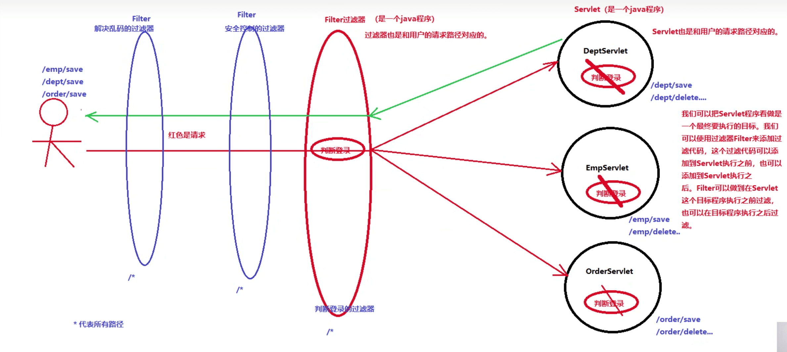

# 过滤器
---
* 23.12.17 21:59开始
* 23.12.17 23:35更新

## 过滤器实现原理图



## 编写过滤器

**第一步：** 编写一个java类实现一个接口：jarkata.servlet.Filter，并且实现这个接口当中的`doFilter`方法。
* init方法：在Filter对象第一次被创建之后调用，并且只调用一次。
* doFilter方法：只要用户发送一次请求，则执行一次；发送N次请求，则执行N次；在这个方法中编写过滤规则。
* destroy方法：在Filter对象被释放/销毁之前调用，并且只调用一次。

**第二步：** 在web.xml文件中对Filter进行配置。
```xml
<filter>
	<filter-name>filter</filter-name>
	<filter-class>com.xxx.javaweb.filter1</filter-class>
</filter>
<filter-mapping>
	<filter-name>filter1</filter-name>
	<url-pattern>/abc</url-pattern>
</filter-mapping>
```
或则使用注解`@WebFilter({"*.do"})`

## 生命周期

* Servlet对象默认情况下，在服务器启动的时候是不会新建对象的。
* Filter对象默认情况下，在服务器启动的时候新建对象。
* Servlet是单例的，Filter也是单例的。

## 目标Servlet执行条件

* 在过滤器当中是否编写了：`chain.doFilter(request, response);`
* 用户发送的请求路径是否和Servlet的请求路径一致。

>`chain.doFilter(request, response);`：执行下一个过滤器，如果下面没有过滤器了，执行最终的Servlet。

* Filter的优先级高于Servlet：`/a.do`对应了一个Filter，也对应了一个Servlet，那么一定是先执行Filter。

## Filter的配置路径

* 精确匹配：`/a.do`、`/b.do`、`/dept/save`
* 配置所有：`/*`
* 后缀匹配：`*.do`
* 前缀匹配：`/dept/*`

## Filter执行顺序

* 依靠filter-mapping标签的位置，越靠上优先级越高。
* dofilter调用遵循栈结构，先进后出。
* 使用注解方式：比较Filter类名的顺序，例如：FilterA和FilterB，则执行FilterA。

## Filter设计模式

责任链设计模式：在程序运行阶段，动态的组合程序调用顺序。

## Filter优点

在程序编译阶段下不会确定调用顺序，因为Filter的调用顺序是配置到web.xml文件中的，只要修改web.xml配置文件中的filter-mapping的顺序就可以吊证Filter的执行顺序。

显然Filter的执行顺序是在程序运行阶段动态组合的，那么这种设计模式被称为责任链设计模式。

## 登录过滤器

### 配置文件

```xml
<!-- 登录检查过滤器，过滤所有的路径 -->
<filter>
	<filter-name>loginFilter</filter-name>
	<filter-class>com.xxx.javaweb.filter.LoginCheckFilter</filter-class>
</filter>
<filter-mapping>
	<filter-name>loginFilter</filter-name>
	<url-pattern>/*</url-pattern>
</filter-mapping>
```

### 过滤器
```java
public class LoginCheckFilter implements Filter {
	@Override
	public void doFilter(ServletRequest req, ServletResponse resp, FilterChina chain) throws IOException, ServletException {
		HttpServletRequest request = (HttpServletRequest)req;
		HttpServletResponse response = (HttpServletResponse)resp;

		HttpSession session = request.getSession(false);
		String servletPath = request.getServletPath();
		// 首页放行、欢迎页放行、去登录放行、退出放行、已登录放行
		if("/index.jsp".equals(servletPath) || "/welcome".equals(servletPath) || "/user/login".equals(servletPath) || "/user/exit".equals(servletPath) || (session != null && session.getAttribute("username") != null)) {
			// 继续往下走
			chain.doFilter(request, response);
		} else {
			response.sendRedirect(request.getContextPath() + "/index.jsp");
		}
	}
}
```

## 视频

* start：https://www.bilibili.com/video/BV1Z3411C7NZ?p=57
* end：https://www.bilibili.com/video/BV1Z3411C7NZ?p=58