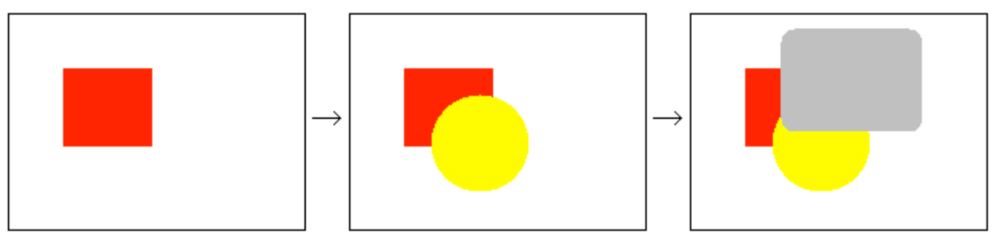
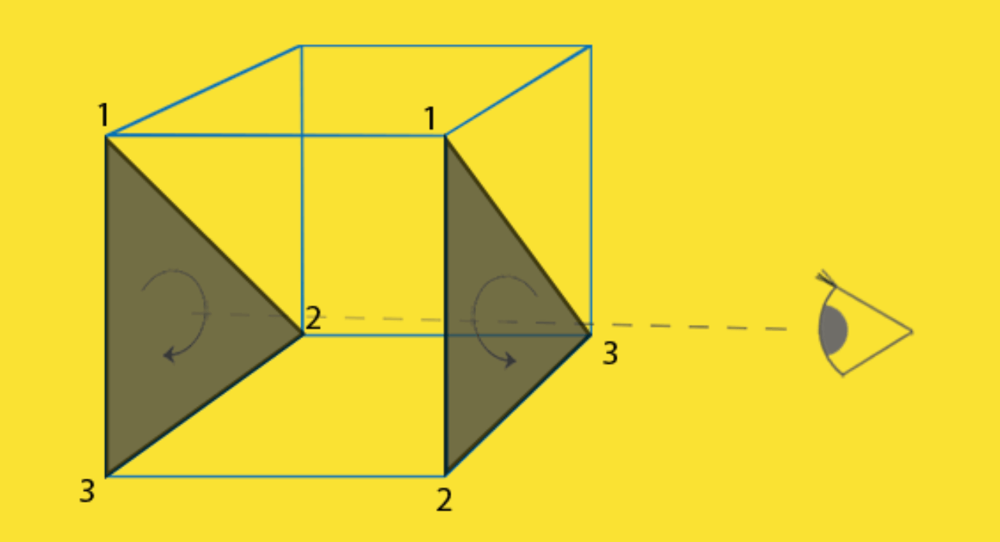
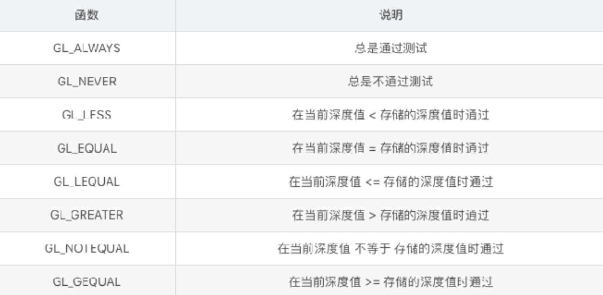
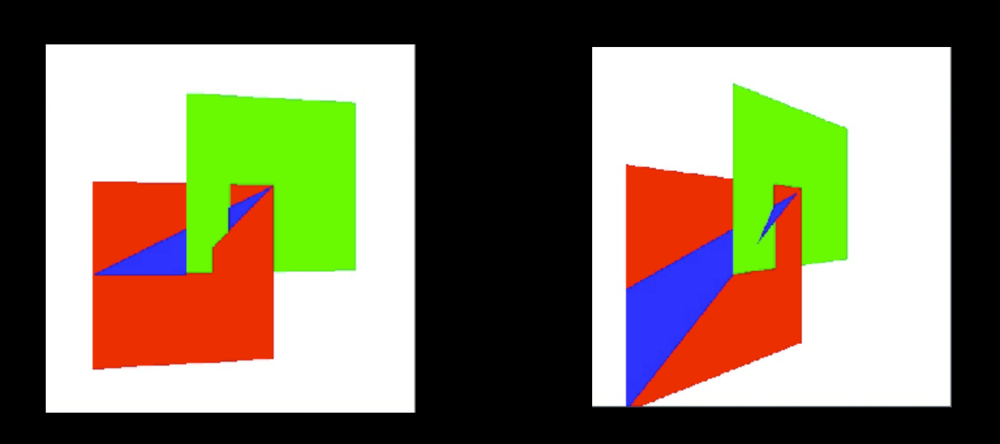
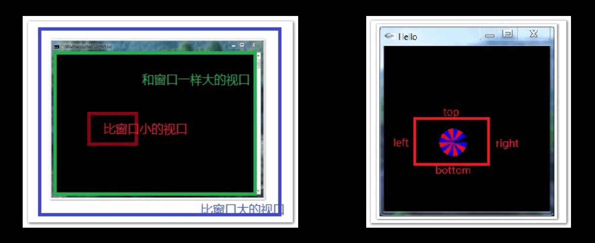

# 3.OpenGL渲染问题的处理方法

## 学习内容

* 渲染过程中可能产⽣的问题
* 油画渲染
* 正⾯面&背⾯面剔除
* 深度测试
* 多边形模型
* 多边形偏移
* 裁剪

## 一、在渲染过程中可能产⽣的问题

在绘制3D场景的时候,我们需要决定哪些部分是对观察者 可⻅的,或者哪些部分是对观察者不可⻅的.对于不可⻅的 部分,应该及早丢弃.例如在⼀个不透明的墙壁后,就不应该 渲染.这种情况叫做“隐藏⾯消除”(Hidden surface elimination).


## 二、油画算法

### 2.1 解释

先绘制场景中的离观察者较远的物体,再绘制较近的物体.

例如下⾯的图例：先绘制红⾊部分,再绘制⻩⾊部分,最后再绘制灰色部分,即可解决隐藏⾯消除的 问题。



### 2.2 弊端

使⽤油画算法,只要将场景按照物理距离观察者的距离远近排序,由远及近的绘制即可.那么会出现什么问题? 如果三个三角形是叠加的情况,油画算法将⽆法处理.


## 三、正背⾯剔除(Face Culling)

### 3.1 思考

**⼀个3D图形,你从任何⼀个⽅向去观察,最多可以看到几个面?**

答案：最多3⾯. 从⼀个⽴⽅体的任意位置和⽅向上看,你用过不可能看到多于3个面.

**那么思考? 我们为何要多余的去绘制那根本看不到的3个面?**

如果我们能以某种方式去丢弃这部分数据,OpenGL在渲染的性能即可提⾼超过50%.

**如何知道某个面在观察者的视􏰀中不会出现?**

任何平⾯都有2个面,正面/背面.意味着你⼀个时刻只能看到一⾯.OpenGL 可以做到检查所有正面朝向观察者的面,并渲染它们.从⽽丢弃背⾯朝向的⾯. 这样可以 节约⽚元着⾊器的性能.

**如果告诉OpenGL你绘制的图形,哪个面是正面,哪个面是背面?**

答案：通过分析顶点数据的顺序

### 3.2 分析顶点顺序


正⾯: 按照逆时针顶点连接顺序的三⻆形⾯

背⾯: 按照顺时针顶点连接顺序的三⻆形⾯

### 3.3 分析⽴方体中的正背⾯



#### 分析

* 左侧三⻆形顶点顺序为: 1—> 2—> 3; 右侧三⻆形的顶点顺序为: 1—> 2—> 3 . 
* 当观察者在右侧时,则右边的三⻆形⽅向为逆时针⽅方向判定为正⾯,⽽左侧的三⻆形为顺时针则为背面 
* 当观察者在左侧时,则左边的三角形⽅向为逆时针⽅方向判定为正⾯,⽽右侧的三⻆形为顺时针则为背面 

#### 总结

正⾯和背面是由三⻆形的顶点定义顺序和观察者方向共同决定的.随着观察者的⻆度⽅向的改变,正面背面也 会跟着改变。

### 3.4 开启正背面剔除函数

**开启表⾯剔除(默认背⾯剔除)**

```cpp
void glEnable(GL_CULL_FACE);
```

**关闭表面剔除(默认背⾯剔除)**

```cpp
void glDisable(GL_CULL_FACE);
```

**⽤户选择剔除那个面(正面/背面)**

```cpp
// mode参数为: GL_FRONT,GL_BACK,GL_FRONT_AND_BACK ,默认GL_BACK
void glCullFace(GLenum mode);
```

**⽤户指定绕序哪个为正⾯**

```cpp
// mode参数为: GL_CW,GL_CCW,默认值:GL_CCW
oid glFrontFace(GLenum mode); 
```

**例如,剔除正面实现(1)**

```cpp
glCullFace(GL_BACK);
glFrontFace(GL_CW);
```

**例如,剔除正面实现(1)**

```cpp
glCullFace(GL_FRONT);
```

## 四、深度测试

深度缓冲区(DepthBuffer)和颜⾊缓存区(ColorBuffer)是对应的.颜⾊缓存区存储像素的颜色信息,⽽深度缓冲区存储像素的深度信息.在决定是否绘制一个物体表⾯时,首先要将表⾯面对应的像素的深度值与当前深度缓冲区中的值进⾏比较.如果⼤于深度缓冲区中的值,则丢弃这部分.否则利用这个像素对应的深度值和颜⾊值.分别更新深度缓冲区和颜色缓存区. 这个过程称为”深度测 试”。

### 4.1 什么是深度？

深度其实就是该像素点在3D世界中距离摄像机的距离,Z值

### 4.2 什么是深度缓冲区?

深度缓存区,就是一块内存区域,专⻔存储着每个像素点(绘制在屏幕上的)深度值.深度值(Z值)越⼤, 则离摄像机就越远.

### 4.3 为什么需要深度缓冲区?

在不使⽤深度测试的时候,如果我们先绘制一个距离⽐较近的物体,再绘制距离较远的物体,则距离远的位图因为后绘制,会把距离近的物体覆盖掉.有了深度缓冲区后,绘制物体的顺序就不那么􏰀重要的. 实际上,只要存在深度缓冲区,OpenGL都会把像素的深度值写⼊到缓冲区中. 除非调用 glDepthMask(GL_FALSE).来禁⽌写入.


### 4.4 使⽤深度测试

* 深度缓冲区,⼀般由窗⼝管理理系统,GLFW创建.深度值⼀般由16位,24位,32位值表示.通常是24位.数越高,深度精确度更好.
* 开启深度测试
```cpp
glEnable(GL_DEPTH_TEST);
```
* 在绘制场景前,清除颜⾊缓存区,深度缓冲
```cpp
glClearColor(0.0f,0.0f,0.0f,1.0f);
glClear(GL_COLOR_BUFFER_BIT | GL_DEPTH_BUFFER_BIT);
```
* 清除深度缓冲区默认值为1.0,表示最大的深度值,深度值的范围为(0,1)之间.值越小表示越靠近观察者,值越大表示越远离观察者
* 指定深度测试判断模式

* 打开/阻断深度缓存区写⼊
```cpp
//value : GL_TURE 开启深度缓冲区写⼊入; GL_FALSE 关闭深度缓冲区写⼊入
void glDepthMask(GLBool value);
```

### 4.5 ZFighting闪烁问题出现

因为开启深度测试后,OpenGL就不会再去绘制模型被遮挡的部分.这样实现的显示更加真实.但是 由于深度缓冲区精度的限制对于深度相差⾮常小的情况下.(例如在同一平⾯上进行2次绘制),OpenGL就可能出现不能正确判断两者的深度值,会导致深度测试的结果不可预测.显示出来的现象时交错闪烁的前面2个画面,交错出现.


### 4.6 ZFighting闪烁问题解决

#### 第⼀步: 启⽤用 Polygon Offset  ⽅式解决

让深度值之间产⽣生间隔.如果2个图形之间有间隔,是不是意味着就不会产⽣干涉.可以理解为在执⾏深度测试前将⽴方体的深度值做⼀些细微的增加.于是就能将􏰀叠的2个图形深度值之间有所区分.

```cpp
// 启⽤用Polygon Offset⽅式 
// 参数列列表: 
// GL_POLYGON_OFFSET_POINT GL_POLYGON_OFFSET_LINE GL_POLYGON_OFFSET_FILL
// 对应光栅化模式: GL_POINT 
// 对应光栅化模式: GL_LINE
// 对应光栅化模式: GL_FILL
glEnable(GL_POLYGON_OFFSET_FILL)
```

#### 第⼆步: 指定偏移量

* 通过glPolygonOffset来指定.glPolygonOffset需要2个参数: factor , units
```cpp
void glPolygonOffset(Glfloat factor,Glfloat units);
```
* 每个Fragment的深度值都会增加如下所示的偏移量
```cpp
Offset = ( m * factor ) + ( r * units)
```
* m(深度值(Z值)) : 多边形的深度的斜率的最⼤值,理解一个多边形越是与近裁剪面平⾏,m 就越接近于0.
* r(使得深度缓冲区产⽣生变化的最小值) : 能产⽣于窗⼝坐标系的深度值中可分辨的差异最小值.r是由具体OpenGL平台指定的⼀个常量.
* ⼀个⼤于0的Offset 会把模型推到离你(摄像机)更远的位置,相应的一个⼩于0的Offset会把模型拉近
* ⼀般⽽言,只需要将-1.0 和 0.0 这样简单赋值给glPolygonOffset基本可以满⾜需求.

#### 第三步: 关闭Polygon Offset
```cpp
glDisable(GL_POLYGON_OFFSET_FILL)
```

### 4.7 ZFighting闪烁问题预防

* 不要将两个物体靠的太近，避免渲染时三⻆形叠在⼀起。这种方式要求对场景中物体插入⼀个少量的偏移，那么就可能避免ZFighting现象。例如上面的⽴方体和平⾯问题中，将平⾯下移0.001f就可以解决这个问题。当然⼿动去插⼊这个⼩的偏移是要付出代价的。 
* 尽可能将近裁剪⾯设置得离观察者远⼀些。上⾯我们看到，在近裁剪平面附近，深度的精确度是很高的，因此尽可能让近裁剪⾯远⼀些的话，会使整个裁剪范围内的精确度变高⼀些。但是这种⽅式会使离观察者较近的物体被裁减掉，因此需要调试好裁剪⾯参数。 
* 使⽤更⾼位数的深度缓冲区，通常使⽤的深度缓冲区是24位的，现在有一些硬件使用32位的缓冲区，使精确度得到提⾼

## 五、裁剪

在OpenGL中提高渲染的一种⽅式.只刷新屏幕上发生变化的部分.OpenGL允许将要进行渲染的窗口只 去指定一个裁剪框.

基本原理:⽤于渲染时限制绘制区域，通过此技术可以再屏幕(帧缓冲)指定一个矩形区域。启⽤剪裁测试之后，不在此矩形区域内的⽚元被丢弃，只有在此矩形区域内的⽚元才有可能进入帧缓冲。因此实际达到的效果就是在屏幕上开辟了了一个⼩窗口，可以再其中进⾏指定内容的绘制。

```cpp
//1 开启裁剪测试 
glEnable(GL_SCISSOR_TEST);
//2.关闭裁剪测试 
glDisable(GL_SCISSOR_TEST);
//3.指定裁剪窗⼝口
void glScissor(Glint x,Glint y,GLSize width,GLSize height);
x,y:指定裁剪框左下⻆角位置; width , height:指定裁剪尺⼨
```

### 5.1 理解窗口 

就是显示界⾯

### 5.2 视口 

就是窗⼝中⽤来显示图形的一块矩形区域，它可以和窗口等大，也可以⽐窗口⼤或者小。只有绘制在视口区域中的图形才能被显示，如果图形有一部分超出了视口区域，那么那一部分是看不到的。

### 5.3 裁剪区域（平行投影）

就是视⼝矩形区域的最小最大x坐标(left,right)和最小最大y坐标 (bottom,top），⽽不是窗口的最小最大x坐标和y坐标。通过glOrtho()函数设置，这个函数还需指定最近 最远z坐标，形成⼀个立体的裁剪区域。



## 六、混合

我们把OpenGL渲染时会把颜色值存在颜⾊缓存区中，每个⽚段的深度值也是放在深度缓冲区。当深度缓冲区被关闭时，新的颜色将简单的覆盖原来颜色缓存区存在的颜色值，当深度缓冲区再次打开时，新的颜色⽚段只是当它们⽐原来的值更接近邻近的裁剪平⾯才会替换原来的颜色⽚段。

```cpp
glEnable(GL_BlEND);
```

### 6.1 组合颜⾊

⽬标颜色:已经存储在颜⾊缓存区的颜⾊值

源颜⾊:作为当前渲染命令结果进⼊颜色缓存区的颜⾊值

当混合功能被启动时，源颜⾊和⽬标颜⾊的组合⽅式是混合方程式控制的。在默认情况下，
混合方程式如下所示:

```cpp
// Cf: 最终计算参数的颜⾊色 
// Cs: 源颜⾊色
// Cd:⽬目标颜⾊色 
// S: 源混合因⼦子 
// D: ⽬目标混合因⼦子

Cf = (Cs * S) + (Cd * D)
```

### 6.2 设置混合因⼦

#### 函数介绍

设置混合因⼦子，需要⽤用到glBlendFun函数
```cpp
// S:源混合因⼦子
// D:⽬目标混合因⼦子
glBlendFunc(GLenum S,GLenum D);
```


表中R、G、B、A 分别代表 红、绿、蓝、alpha。

表中下标S、D，分别代表源、⽬目标。

表中C 代表常量量颜⾊色(默认⿊黑⾊色)。

#### 函数使用

下⾯面通过⼀个常⻅的混合函数组合来说明问题:
```cpp
glBlendFunc(GL_SRC_ALPHA,GL_ONE_MINUS_SRC_ALPHA);
```
如果颜⾊缓存区已经有一种颜色红色(1.0f,0.0f,0.0f,0.0f),这个目标颜色Cd，如果在这上面用⼀种alpha为0.6的蓝色(0.0f,0.0f,1.0f,0.6f)

Cd (⽬标颜色) = (1.0f,0.0f,0.0f,0.0f); 
Cs (源颜⾊色) = (0.0f,0.0f,1.0f,0.6f); 
S = 源alpha值 = 0.6f
D = 1 - 源alpha值= 1-0.6f = 0.4f

方程式Cf = (Cs \* S) + (Cd * D)

等价于 = (Blue * 0.6f) + (Red * 0.4f)

#### 总结

最终颜色是以原先的红色(目标颜色)与 后来的蓝色(源颜色)进行组合。源颜⾊的alpha值越⾼，添加的蓝⾊色颜色成分越高，⽬标颜⾊所保留的成分就会越少。混合函数经常⽤于实现在其他一些不透明的物体前⾯绘制一个透明物体的效果。

### 6.3 改变组合⽅程式

默认混合⽅方程式: Cf = (Cs*S)+(Cd*D)

实际上远不止这一种混合⽅程式，我们可以从5个不同的方程式中进行选择

选择混合⽅方程式的函数:
```cpp
glbBlendEquation(GLenum mode);
```


### 6.4 glBlendFuncSeparate 函数

除了能使⽤glBlendFunc来设置混合因子，还可以有更灵活的选择。

```cpp
// strRGB: 源颜⾊的混合因⼦
// dstRGB: ⽬标颜⾊的混合因⼦ 
// strAlpha: 源颜色的Alpha因⼦ 
// dstAlpha: ⽬标颜色的Alpha因⼦
void glBlendFuncSeparate(GLenum strRGB,GLenum dstRGB ,GLenum strAlpha,GLenum dstAlpha);
```

glBlendFunc 指定源和⽬标RGBA值的混合函数;但是glBlendFuncSeparate函数则允许为RGB 和 Alpha 成分单独指定混合函数。

在混合因⼦子表中，GL_CONSTANT_COLOR,GL_ONE_MINUS_CONSTANT_COLOR,GL_CONSTANT_ALPHA,GL_ONE_MINUS_CONSTANT值允许混合方程式中引⼊一个常量混合颜⾊。

### 6.5 常量混合颜⾊

常量混合颜⾊色，默认初始化为⿊⾊(0.0f,0.0f,0.0f,0.0f)，但是还是可以修改这个常量混合颜色。
```cpp
void glBlendColor(GLclampf red ,GLclampf green ,GLclampf blue ,GLclampf alpha);
```

## 七、案例

[源码](https://gitee.com/chenchangqing/iOS-OpenGL-Tutorials/tree/master/03_OpenGL渲染问题的处理方法)

### 7.1 深度测试+正背面剔除

```cpp
//演示了OpenGL背面剔除，深度测试，和多边形模式
#include "GLTools.h"	
#include "GLMatrixStack.h"
#include "GLFrame.h"
#include "GLFrustum.h"
#include "GLGeometryTransform.h"

#include <math.h>
#ifdef __APPLE__
#include <glut/glut.h>
#else
#define FREEGLUT_STATIC
#include <GL/glut.h>
#endif

////设置角色帧，作为相机
GLFrame             viewFrame;
//使用GLFrustum类来设置透视投影
GLFrustum           viewFrustum;
GLTriangleBatch     torusBatch;
GLMatrixStack       modelViewMatix;
GLMatrixStack       projectionMatrix;
GLGeometryTransform transformPipeline;
GLShaderManager     shaderManager;

//标记：背面剔除、深度测试
int iCull = 0;
int iDepth = 0;

//右键菜单栏选项
void ProcessMenu(int value)
{
    switch(value)
    {
        case 1:
            iDepth = !iDepth;
            break;
            
        case 2:
            iCull = !iCull;
            break;
            
        case 3:
            glPolygonMode(GL_FRONT_AND_BACK, GL_FILL);
            break;
            
        case 4:
            glPolygonMode(GL_FRONT_AND_BACK, GL_LINE);
            break;
            
        case 5:
            glPolygonMode(GL_FRONT_AND_BACK, GL_POINT);
            break;
    }
    
    glutPostRedisplay();
}


// 召唤场景
void RenderScene(void)
{
    //清除窗口和深度缓冲区
    glClear(GL_COLOR_BUFFER_BIT | GL_DEPTH_BUFFER_BIT);
    
    //根据设置iCull标记来判断是否开启背面剔除
    if(iCull)
    {
        glEnable(GL_CULL_FACE);
        glFrontFace(GL_CCW);
        glCullFace(GL_BACK);
    }
    else
        glDisable(GL_CULL_FACE);
    
    //根据设置iDepth标记来判断是否开启深度测试
    if(iDepth)
        glEnable(GL_DEPTH_TEST);
    else
        glDisable(GL_DEPTH_TEST);
    
    //把摄像机矩阵压入模型矩阵中
    modelViewMatix.PushMatrix(viewFrame);
    
    GLfloat vRed[] = { 1.0f, 0.0f, 0.0f, 1.0f };
    
    //使用平面着色器
    //参数1：平面着色器
    //参数2：模型视图投影矩阵
    //参数3：颜色
    //shaderManager.UseStockShader(GLT_SHADER_FLAT, transformPipeline.GetModelViewProjectionMatrix(), vRed);
    
    //使用默认光源着色器
    //通过光源、阴影效果跟提现立体效果
    //参数1：GLT_SHADER_DEFAULT_LIGHT 默认光源着色器
    //参数2：模型视图矩阵
    //参数3：投影矩阵
    //参数4：基本颜色值
    shaderManager.UseStockShader(GLT_SHADER_DEFAULT_LIGHT, transformPipeline.GetModelViewMatrix(), transformPipeline.GetProjectionMatrix(), vRed);
    
    //绘制
    torusBatch.Draw();
    
    //出栈
    modelViewMatix.PopMatrix();
    
    
    glutSwapBuffers();
}

// 这个函数不需要初始化渲染
// context. 图像上下文
void SetupRC()
{
    // 设置背景颜色
    glClearColor(0.3f, 0.3f, 0.3f, 1.0f );
    
    //初始化着色器管理器
    shaderManager.InitializeStockShaders();
    
    //将相机向后移动7个单元：肉眼到物体之间的距离
    viewFrame.MoveForward(7.0);
    
    //创建一个甜甜圈
    //void gltMakeTorus(GLTriangleBatch& torusBatch, GLfloat majorRadius, GLfloat minorRadius, GLint numMajor, GLint numMinor);
    //参数1：GLTriangleBatch 容器帮助类
    //参数2：外边缘半径
    //参数3：内边缘半径
    //参数4、5：主半径和从半径的细分单元数量
   
    gltMakeTorus(torusBatch, 1.0f, 0.3f, 52, 26);
    
    
    
    //点的大小
    glPointSize(4.0f);
}

//键位设置，通过不同的键位对其进行设置
//控制Camera的移动，从而改变视口
void SpecialKeys(int key, int x, int y)
{
    if(key == GLUT_KEY_UP)
        viewFrame.RotateWorld(m3dDegToRad(-5.0), 1.0f, 0.0f, 0.0f);
    
    if(key == GLUT_KEY_DOWN)
        viewFrame.RotateWorld(m3dDegToRad(5.0), 1.0f, 0.0f, 0.0f);
    
    if(key == GLUT_KEY_LEFT)
        viewFrame.RotateWorld(m3dDegToRad(-5.0), 0.0f, 1.0f, 0.0f);
    
    if(key == GLUT_KEY_RIGHT)
        viewFrame.RotateWorld(m3dDegToRad(5.0), 0.0f, 1.0f, 0.0f);
    
    //重新刷新window
    glutPostRedisplay();
}


void ChangeSize(int w, int h)
{
    //防止h变为0
    if(h == 0)
        h = 1;
    
    //设置视口窗口尺寸
    glViewport(0, 0, w, h);
    
    //setPerspective函数的参数是一个从顶点方向看去的视场角度（用角度值表示）
    // 设置透视模式，初始化其透视矩阵
    viewFrustum.SetPerspective(35.0f, float(w)/float(h), 1.0f, 100.0f);
    
    //把透视矩阵加载到透视矩阵对阵中
    projectionMatrix.LoadMatrix(viewFrustum.GetProjectionMatrix());
    // 初始化渲染管线
    transformPipeline.SetMatrixStacks(modelViewMatix, projectionMatrix);
}


int main(int argc, char* argv[])
{
    gltSetWorkingDirectory(argv[0]);
    
    glutInit(&argc, argv);
    glutInitDisplayMode(GLUT_DOUBLE | GLUT_RGBA | GLUT_DEPTH | GLUT_STENCIL);
    glutInitWindowSize(800, 600);
    glutCreateWindow("Geometry Test Program");
    glutReshapeFunc(ChangeSize);
    glutSpecialFunc(SpecialKeys);
    glutDisplayFunc(RenderScene);
    
    // Create the Menu
    glutCreateMenu(ProcessMenu);
    glutAddMenuEntry("Toggle depth test",1);
    glutAddMenuEntry("Toggle cull backface",2);
    glutAddMenuEntry("Set Fill Mode", 3);
    glutAddMenuEntry("Set Line Mode", 4);
    glutAddMenuEntry("Set Point Mode", 5);
    
    glutAttachMenu(GLUT_RIGHT_BUTTON);
    
    
    GLenum err = glewInit();
    if (GLEW_OK != err) {
        fprintf(stderr, "GLEW Error: %s\n", glewGetErrorString(err));
        return 1;
    }
    
    SetupRC();
    
    glutMainLoop();
    return 0;
}
```

### 7.2 裁剪

```cpp
//demo OpenGL 裁剪
#include "GLTools.h"
#ifdef __APPLE__
#include <glut/glut.h>
#else
#define FREEGLUT_STATIC
#include <GL/glut.h>
#endif

//召唤场景
void RenderScene(void)
{
    //设置清屏颜色为蓝色
    glClearColor(0.0f, 0.0f, 1.0f, 0.0f);
    glClear(GL_COLOR_BUFFER_BIT);
    
    //1.现在剪成小红色分区
    //(1)设置裁剪区颜色为红色
    glClearColor(1.0f, 0.0f, 0.0f, 0.0f);
    //(2)设置裁剪尺寸
    glScissor(100, 100, 600, 400);
    //(3)开启裁剪测试
    glEnable(GL_SCISSOR_TEST);
    //(4)开启清屏，执行裁剪
    glClear(GL_COLOR_BUFFER_BIT);
    
    // 2.裁剪一个绿色的小矩形
    //(1).设置清屏颜色为绿色
    glClearColor(0.0f, 1.0f, 0.0f, 0.0f);
    //(2).设置裁剪尺寸
    glScissor(200, 200, 400, 200);
    //(3).开始清屏执行裁剪
    glClear(GL_COLOR_BUFFER_BIT);
    
    //关闭裁剪测试
    glDisable(GL_SCISSOR_TEST);
    
    //强制执行缓存区
    glutSwapBuffers();
}


void ChangeSize(int w, int h)
{
    //保证高度不能为0
    if(h == 0)
        h = 1;
    
    // 将视口设置为窗口尺寸
    glViewport(0, 0, w, h);
}

//程序入口
int main(int argc, char* argv[])
{
    glutInit(&argc, argv);
    glutInitDisplayMode(GLUT_DOUBLE | GLUT_RGB);
    glutInitWindowSize(800,600);
    glutCreateWindow("OpenGL Scissor");
    glutReshapeFunc(ChangeSize);
    glutDisplayFunc(RenderScene);
    glutMainLoop();
    
    return 0;
}
```

### 7.3 颜色混合

```cpp
//颜色组合
#include "GLTools.h"
#include "GLShaderManager.h"

#ifdef __APPLE__
#include <glut/glut.h>
#else
#define FREEGLUT_STATIC
#include <GL/glut.h>
#endif

GLBatch	squareBatch;
GLBatch greenBatch;
GLBatch redBatch;
GLBatch blueBatch;
GLBatch blackBatch;

GLShaderManager	shaderManager;


GLfloat blockSize = 0.2f;
GLfloat vVerts[] = { -blockSize, -blockSize, 0.0f,
    blockSize, -blockSize, 0.0f,
    blockSize,  blockSize, 0.0f,
    -blockSize,  blockSize, 0.0f};


void SetupRC()
{
    glClearColor(1.0f, 1.0f, 1.0f, 1.0f );
    shaderManager.InitializeStockShaders();

    //绘制1个移动矩形
    squareBatch.Begin(GL_TRIANGLE_FAN, 4);
    squareBatch.CopyVertexData3f(vVerts);
    squareBatch.End();
    
    //绘制4个固定矩形
    GLfloat vBlock[] = { 0.25f, 0.25f, 0.0f,
        0.75f, 0.25f, 0.0f,
        0.75f, 0.75f, 0.0f,
        0.25f, 0.75f, 0.0f};
    
    greenBatch.Begin(GL_TRIANGLE_FAN, 4);
    greenBatch.CopyVertexData3f(vBlock);
    greenBatch.End();
    
    
    GLfloat vBlock2[] = { -0.75f, 0.25f, 0.0f,
        -0.25f, 0.25f, 0.0f,
        -0.25f, 0.75f, 0.0f,
        -0.75f, 0.75f, 0.0f};
    
    redBatch.Begin(GL_TRIANGLE_FAN, 4);
    redBatch.CopyVertexData3f(vBlock2);
    redBatch.End();
    
    
    GLfloat vBlock3[] = { -0.75f, -0.75f, 0.0f,
        -0.25f, -0.75f, 0.0f,
        -0.25f, -0.25f, 0.0f,
        -0.75f, -0.25f, 0.0f};
    
    blueBatch.Begin(GL_TRIANGLE_FAN, 4);
    blueBatch.CopyVertexData3f(vBlock3);
    blueBatch.End();
    
    
    GLfloat vBlock4[] = { 0.25f, -0.75f, 0.0f,
        0.75f, -0.75f, 0.0f,
        0.75f, -0.25f, 0.0f,
        0.25f, -0.25f, 0.0f};
    
    blackBatch.Begin(GL_TRIANGLE_FAN, 4);
    blackBatch.CopyVertexData3f(vBlock4);
    blackBatch.End();
}

//上下左右键位控制移动
void SpecialKeys(int key, int x, int y)
{
    GLfloat stepSize = 0.025f;
    
    GLfloat blockX = vVerts[0];
    GLfloat blockY = vVerts[7];
    
    if(key == GLUT_KEY_UP)
        blockY += stepSize;
    
    if(key == GLUT_KEY_DOWN)
        blockY -= stepSize;
    
    if(key == GLUT_KEY_LEFT)
        blockX -= stepSize;
    
    if(key == GLUT_KEY_RIGHT)
        blockX += stepSize;
    
    
    if(blockX < -1.0f) blockX = -1.0f;
    if(blockX > (1.0f - blockSize * 2)) blockX = 1.0f - blockSize * 2;;
    if(blockY < -1.0f + blockSize * 2)  blockY = -1.0f + blockSize * 2;
    if(blockY > 1.0f) blockY = 1.0f;
    
    
    vVerts[0] = blockX;
    vVerts[1] = blockY - blockSize*2;
    
    vVerts[3] = blockX + blockSize*2;
    vVerts[4] = blockY - blockSize*2;
    
    vVerts[6] = blockX + blockSize*2;
    vVerts[7] = blockY;
    
    vVerts[9] = blockX;
    vVerts[10] = blockY;
    
    squareBatch.CopyVertexData3f(vVerts);
    
    glutPostRedisplay();
}


//召唤场景
void RenderScene(void)
{
    
    glClear(GL_COLOR_BUFFER_BIT | GL_DEPTH_BUFFER_BIT | GL_STENCIL_BUFFER_BIT);
    
    //定义4种颜色
    GLfloat vRed[] = { 1.0f, 0.0f, 0.0f, 0.5f };
    GLfloat vGreen[] = { 0.0f, 1.0f, 0.0f, 1.0f };
    GLfloat vBlue[] = { 0.0f, 0.0f, 1.0f, 1.0f };
    GLfloat vBlack[] = { 0.0f, 0.0f, 0.0f, 1.0f };
    
    //召唤场景的时候，将4个固定矩形绘制好
    //使用 单位着色器
    //参数1：简单的使用默认笛卡尔坐标系（-1，1），所有片段都应用一种颜色。GLT_SHADER_IDENTITY
    //参数2：着色器颜色
    shaderManager.UseStockShader(GLT_SHADER_IDENTITY, vGreen);
    greenBatch.Draw();
    
    shaderManager.UseStockShader(GLT_SHADER_IDENTITY, vRed);
    redBatch.Draw();
    
    shaderManager.UseStockShader(GLT_SHADER_IDENTITY, vBlue);
    blueBatch.Draw();
    
    shaderManager.UseStockShader(GLT_SHADER_IDENTITY, vBlack);
    blackBatch.Draw();
    
    
    //组合核心代码
    //1.开启混合
    glEnable(GL_BLEND);
    //2.开启组合函数 计算混合颜色因子
    glBlendFunc(GL_SRC_ALPHA, GL_ONE_MINUS_SRC_ALPHA);
    //3.使用着色器管理器
    //*使用 单位着色器
    //参数1：简单的使用默认笛卡尔坐标系（-1，1），所有片段都应用一种颜色。GLT_SHADER_IDENTITY
    //参数2：着色器颜色
    shaderManager.UseStockShader(GLT_SHADER_IDENTITY, vRed);
    //4.容器类开始绘制
    squareBatch.Draw();
    //5.关闭混合功能
    glDisable(GL_BLEND);
    
    
    //同步绘制命令
    glutSwapBuffers();
}


void ChangeSize(int w, int h)
{
    glViewport(0, 0, w, h);
}

int main(int argc, char* argv[])
{
    gltSetWorkingDirectory(argv[0]);
    glutInit(&argc, argv);
    glutInitDisplayMode(GLUT_DOUBLE | GLUT_RGBA | GLUT_DEPTH);
    glutInitWindowSize(800, 600);
    glutCreateWindow("移动矩形，观察颜色");
    
    GLenum err = glewInit();
    if (GLEW_OK != err)
    {
        fprintf(stderr, "Error: %s\n", glewGetErrorString(err));
        return 1;
    }
    
    glutReshapeFunc(ChangeSize);
    glutDisplayFunc(RenderScene);
    glutSpecialFunc(SpecialKeys);
    
    SetupRC();
    
    glutMainLoop();
    return 0;
}
```
