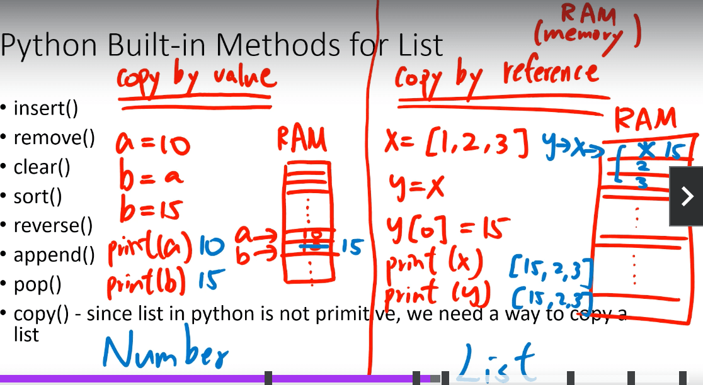

# 基础类型

* 24.8.26 created
* 24.8.27 22:41 updated

## 注释

* `# 单行注释`
* `"""多行注释"""`

## print

如何输出多份内容？

```python
print(内容1, 内容2, 内容3, ..., 内容N)
```

## type

查看数据类型

```python
print(type("字符串"))  # <class 'str'>
print(type(666))  # <class 'int'>
print(type(3.14))  # <class 'float'>
> 在`python`中，变量是没有类型的，变量存储的数据是有类型的。

## 关键字

False True None and as class def elif except from lambda nonlocal not or pass raise yield

## 字符串格式化

* %s：将内容转换成字符串
* %d：将内容转换成数字
* %f：将内容转换成浮点型

```python
class_num = 57
avg_salary = 16432
message = "Python大数据科学，北京%s期，毕业平均工资：%s" % (class_num, avg_salary)
print(message)
```
输出：
```
Python大数据科学，北京57期，毕业平均工资：16432
```

## 数字精度控制

```python
num1 = 11
num2 = 11.345
print("数字11宽度限制5，结果：%5d" % num1) # 宽度5，补了3个空格
print("数字11宽度限制1，结果：%1d" % num1) # 宽度小于数字本身，无影响
print("数字11.345宽度限制7，小数精度2，结果：%7.2f" % num2) # 宽度7，补了2个空格，小数精度2，四舍五入后.34
print("数字11.345不限制宽度，小数精度2，结果：%.2f" % num2) # 不限制宽度，小数点后四舍五入后为.35
```
输出：
```
数字11宽度限制5，结果：   11
数字11宽度限制1，结果：11
数字11.345宽度限制7，小数精度2，结果：  11.35
数字11.345不限制宽度，小数精度2，结果：11.35
``` 
快速格式化：
```python
name = "baidu"
set_up_year = 2006
stock_price = 19.99
print(f"我是{name}，我成立于：{set_up_year}，我今天的股票价格是：{stock_price}")
```
输出：
```
我是baidu，我成立于：2006，我今天的股票价格是：19.99
```

## input

```python
# 获取键盘输入
name = input("请告诉我你是谁？")
print("我知道了，你是：%s" % name)
```

> VSCode无法输入，待解决

## 操作符

```python
print(10 + 5)
print(10 - 5)
print(10 * 5)
print(10 / 5)  # 2.0

print(10 % 5)  # 0
print(10 % 3)  # 1

# 指数
print(2 ** 3)  # 8
print(3 ** 2)  # 9

# 取整除
print(10 // 5) # 1
```

## 数学函数

* 绝对值：abs()
* 指数：pow()
* 最大：max()
* 最小：min()
* 四舍五入：round()

```python
# abs
print(abs(-5))  # 5
print(abs(5))  # 5

# pow
print(pow(2, 10))  # 1024

# min max
print(min(4, 2, 1, -10, 100, -7))  # -19
print(max(4, 2, 1, -10, 100, -7))  # 100

# round
print(round(2.6))  # 3
print(round(2.5))  # 2
print(round(3.5))  # 4

# x.5 the values will be rounded up if the roundup value is an even number
# otherwise, it will be rounded down.
# x.5的情况，如果四舍五入的值是偶数，就向上取整；否则，向下取整。
```

## 类型转换

built-in methods（typecasting）

* str()
* int()
* float()

```python
# type casting
print(int(3.0))  # 3
print(float(3))  # 3.0
print(str(3))  # 3
print(str(3) + str(3))  # 33
print(3 + 3)  # 6
```

## import math

* e
* pi
* 向下取整：floor()
* 向上取整：ceil()
* 开根号：sqrt()

```python
import math

print(math.e)  # 2.718281828459045
print(math.pi)  # 3.141592653589793
print(math.floor(3.8))  # 3
print(math.ceil(3.8))  # 4
print(math.sqrt(36))  # 6.0
```

## string使用

uppper、lower:

```python
name = "Chenchangqing"
print(len(name))  # 13
print(name.upper()) # CHENCHANGQING
print(name.lower())  # chenchangqing
print(name)  # Chenchangqing
```

isupper、islower:
```python
name = "Chenchangqing"
print(name)  # CHENCHANGQING
print(name.isupper())  # False
print(name.islower())  # False
name = name.upper()
print(name.upper().isupper())  # True
```

index:
```python
name = "Chenchangqing"
print(name.index("e"))  # 2
print(name.index("en"))  # 2
```

replace:
```python
name = "Josh Donaldson"
print(name.replace("J", "K"))  # Kosh Donaldson
```

split:
```python
sentence = "Today is a good day."
print(sentence.split(" "))  # ['Today', 'is', 'a', 'good', 'day.']
```

list:
```python
sentence = "Today is a good day."
print(list(sentence))  # ['T', 'o', 'd', 'a', 'y', ' ', 'i', 's', ' ', 'a', ' ', 'g', 'o', 'o', 'd', ' ', 'd', 'a', 'y', '.']
```

format:
```python
# string, number, boolean, dict, set, tuple, list
print("I have a string {}".format(["fjsd", "fjsdklf"]))  # I have a string ['fjsd', 'fjsdklf']
print("{}, {}, {}".format(20, "here is another string", 3.14))  # 20, here is another string, 3.14
print("{2}, {1}, {0}".format(20, "here is another string", 3.14))  # 3.14, here is another string, 20
print("{3}, {1}, {2}".format(20, "here is another string", 3.24, 35))  # 35, here is another string, 3.24
print("{name}, {address}, {age}".format(
    name="Wilson", age=25, address="china"))  # Wilson, china, 25
```

fstring(python 3.6有的):
```python
myName = "Wilson"
age = 25
print(f"Hello, my name is {myName}, I am {age} years old.")
```

count(指定字符串出现次数):
```python
string = "Good day is a good day"
print(string.count("good"))  # 1
print(string.lower().count("good"))  # 2
```

find:
```python
string = "Good day is a good day"
print(string.find("good"))  # 14
print(string.find("good1"))  # -1
print(string.index("good1"))  # ValueError: substring not found
```
>`index`可以用于`list`、`tuple`、`string`，而`find`只用于`string`

startswith、endswith:
```python
name = "Wilson"
print(name.startswith("n"))  # False
print(name.endswith("n"))  # True
```

修改string的错误方式：
```python
myString1 = "hello"
myString1[0] = "H" # 错误的
```

通过重新给变量赋值修改string：
```python
name = "Sam Donaldson"
name = 'P' + name[1:]
print(name)  # Pam Donaldson
```
>Keep in mind that Python built-in methods don`t modify the string itself.

string乘以数字:
```python
print("Wilson" * 10)  # WilsonWilsonWilsonWilsonWilsonWilsonWilsonWilsonWilsonWilson
```
错误的方式：
```python
print("Wilson" * 5.5)
print("Wilson" * "10")
```

截取字符串:
"字符串"[开始位置:结束为止:步长(默认1)]
```python
print("hello"[0])  # h
print("hello"[-1])  # o
print("hello"[1:4])  # ell
print("hello"[1:])  # ell
print("hello"[:4])  # el
print("hello"[1:4:2]) # hell
print("hello"[::-1]) # reversed
```

## list使用

list倒序：
```python
luckyNumbers = [2, 3, 4, 5, 6, 7, 10]
print(luckyNumbers[::-1])  # [10, 7, 6, 5, 4, 3, 2]
```

list长度：
```python
luckyNumbers = [2, 3, 4, 5, 6, 7, 10]
print(len(luckyNumbers))  # 7
```

list元素出现次数：
```python
x = [1, 2, 1]
print(x.count(1))  # 2
```

list元素位置：
```python
x = [1, 2, 1]
print(x.index(1))  # 0
```

list相加：
```python
x = [1, 2, 1]
y = [3, 4, 5]
print(x + y)  # [1, 2, 1, 3, 4, 5]
```

乘以数字：
```python
x = [1, 2, 1]
print(x * 2)  # [1, 2, 1, 1, 2, 1]
```

修改list：
```python
x = [1, 2, 1]
x[1] = 10
print(x)  # [1, 10, 1]
```

list排序：
```python
# 默认字母排序
friends = ["Wilson", "Mike", "Nelson", "Greg", "Jimmy"]
friends.sort()
print(friends)  # ['Greg', 'Jimmy', 'Mike', 'Nelson', 'Wilson']

# 数字排序
numbers = [4, -3, 6, 1, 3, 2]
numbers.sort()
print(numbers)  # [-3, 1, 2, 3, 4, 6]
```

反转：
```python
numbers = [4, -3, 6, 1, 3, 2]
numbers.reverse()
print(numbers)  # [2, 3, 1, 6, -3, 4]
```

append:
```python
x = ["a", "b", "c"]
x.append("d")
x.append(15.0)
print(x) # ['a', 'b', 'c', 'd', 15.0]
```

pop:
```python
x = ["a", "b", "c"]
lost_element = x.pop()
print(x)  # ['a', 'b']
print(lost_element)  # c
```

list之copy:
```python
x = [1, 2, 3]
y = x.copy()
y[0] = 15
print(x)  # [1, 2, 3]
print(y)  # [15, 2, 3]
```

list中放list:
```python
x = [1, 2, [4, 5, 6], 2, 1, [4, 3, [-10, 4]]]
print(x[2][1])  # 5
```

取list最后一个元素:
```python
x = [1, 2, 3]
print(x[len(x) - 1])  # 3
```

## Copy by Value or Reference

修改listy的同时也修改了listx：
```python
x = [1, 2, 3, 4, 5, 6]
y = x
y[0] = 15
print(x)  # [15, 2, 3, 4, 5, 6]
print(y)  # [15, 2, 3, 4, 5, 6]
```

修改stringb，不会修改stringa
```python
a = 10
b = a
b = 15
print(a)  # 10
print(b)  # 15
```

从上面的输出可以看出修改list和修改string的机制上是不一样的，如图：


Copy By Reference:
* List
* Dictionaries
* Tuples
* Sets

Copy By Value:
* Integer
* Float
* String
* Boolean

> 修改list是`copy by reference`，修改string是`copy by value`

## dictionary使用

取值：
```python
person = {"name": "Wilson", "age": 15}
print(person["name"])  # Wilson
```

修改：
```python
person = {"name": "Wilson", "age": 15}
person["name"] = "Grace"
print(person)  # {'name': 'Grace', 'age': 15}
```

keys:
```python
person = {"name": "Wilson", "age": 15}
print(person.keys())  # dict_keys(['name', 'age'])
```

values:
```python
person = {"name": "Wilson", "age": 15}
print(person.values())  # dict_values(['Wilson', 15])
```

items:
```python
person = {"name": "Wilson", "age": 15}
print(person.items())  # dict_items([('name', 'Wilson'), ('age', 15)])
```

dictionarykey的特点：

* 不可变
* 实现hashable

可以作为key的类型：integer,float,boolean, string, tuple。如果list想作为key，则可以转为tuple。
> tuple就是不可变的list。

## tuple使用

取值：
```python
myTuple = (10, "100", "Hello")
print(myTuple[0:2])  # (10, '100)
```

* len、index、count 也可以使用

> 因为tuple是不可变得，所以pop、append、sort等修改方法不可用。

特性一：打包

```python
x = 10, 15
print(x)  # (10, 15)
print(type(x))  # <class 'tuple'>
```

特性二：解包
```python
# 赋值1
x = ("a", 25)
name, age = x
print(name)  # a
print(age)  # 25
# 赋值2
a, b = (15, 100)
print(a)
print(b)
# 交换
x = 25
y = 35
x, y = y, x
print(x)  # 35
print(y)  # 25
```

在tuple中存在可变类型，可以修改可变对象，但是这样的tuple不可以作为key：
```python
a = ([1, 2, 3], "Wilson")
a[0][1] = 100
print(a)  # ([1, 100, 3], 'Wilson')
```

## set使用

* 无序
* 元素实现hashable
* 元素唯一

第一个set：
```python
mySet = set({1, 2, 3})
print(mySet)  # {1, 2, 3}
```

list去重复：
```python
myList = [1, 4, 3, 2, 5, 1, 5]
mySet = set(myList)
print(mySet)  # {1, 2, 3, 4, 5}
```

add:
```python
s = set()
s.add(1)
print(s)  # {1}
```

discard:
```python
s = set({1, 2, 3})
s.discard(3)
print(s) # {1, 2}
```

clear:
```python
s = set({1, 2, 3})
s.clear()
print(s)  # set()
```

difference:
```python
a = {1, 3, 4, 5}
b = {3, 4, 7, 8}
# a - b
print(a.difference(b))  # {1, 5}
print(b.difference(a))  # {8, 7}
```

intersection:
```python
a = {1, 3, 4, 5}
b = {3, 4, 7, 8}
print(a.intersection(b))  # {3, 4}
print(b.intersection(a))  # {3, 4}
```

union:
```python
a = {1, 3, 4, 5}
b = {3, 4, 7, 8}
# a - b
print(a.union(b))  # {1, 3, 4, 5, 7, 8}
print(b.union(a))  # {1, 3, 4, 5, 7, 8}
```

isdisjoint:
```python
a = {1, 2}
b = {3, 4}
print(a.isdisjoint(b)) # True
```

issubset, issuperset:
```python
a = {1, 2}
b = {1, 2, 3, 4}
print(a.issubset(b))  # True
print(b.issuperset(a))  # True
```

## boolean

* True
* False

```python
x = True  # Constant必须首字母大写，`None`也是大写
print(x)  # True
```

https://docs.python.org/3/library/constants.html


## nj

```python
x = 3 + 4j
y = 5 - 7j
print(x + y)  # (8-3j)
```

## none

```python
def hello():
	print("hello")
print(hello)  # <function hello at 0x10ce422a0>
print(hello())  # None
```

## floating binary problem

```python
print(0.1 + 0.2 - 0.3)  # 5.551115123125783e-17
```

## join

```python
myList = ["a", "b", "c"]
myString = "|".join(myList)
print(myString)  # a|b|c
```

## sort & sorted

* sort会改变原对象
* sorted不会改变原对象

sorted list:
```python
x = [4, 2, 3, 1]
y = sorted(x)
# the list x is [4, 2, 3, 1] .
print("the list x is", x, ". Also, the list y is ", y)

z = sorted(x, reverse=True)
# the list x is [4, 2, 3, 1] . Also, the list z is  [4, 3, 2, 1]
print("the list x is", x, ". Also, the list z is ", z)
```

sort tuple:
```python
x = (4, 2, 3, 1)
y = sorted(x)
print(x)  # (4, 2, 3, 1)
print(y)  # (1, 2, 3, 4) 类型变了
```

sort dict keys:
```python
x = {"name": "Wilson", "age": 25}
y = sorted(x)
print(x)  # {'name': 'Wilson', 'age': 25}
print(y)  # ['age', 'name']
```

sort set:
```python
x = {4, 5, 3, 2, 1}
y = sorted(x)
print(x)  # {1, 2, 3, 4, 5}
print(y)  # [1, 2, 3, 4, 5]
```

sort string:
```python
x = "How are you doing today?"
y = sorted(x)
print(x)  # How are you doing today?
# [' ', ' ', ' ', ' ', '?', 'H', 'a', 'a', 'd', 'd', 'e', 'g', 'i', 'n', 'o', 'o', 'o', 'o', 'r', 't', 'u', 'w', 'y', 'y']
print(y)
```

## in，not in

in：
```python
a = "ABCD"
if "A" in a:
	print("A is in ", a)  # True
a = ["A", "B", "C", "D"]
if "A" in a:
	print("A is in ", a)  # True
a = {"A", "B", "C"}
if "A" in a:
	print("A is in ", a)  # True
a = ("A", "B", "C")
if "A" in a:
	print("A is in ", a)  # True
```

不使用in：
```python
myString = "Today is a good day. The eather in Hawaii is not bad."
isIn = False
for i in range(len(myString)):
	if "A" == myString[i]:
		isIn = True
print(isIn)
```

