# Mac下配置Python

* 24.8.24 created

## 安装anaconda

1. 打开 https://www.anaconda.com/download ，输入邮箱。
2. 打开邮箱，点击链接，进入下载页面。
3. 选择“Download for Mac“，根据自己电脑CPU，选择合适的版本下载。
4. 双击下载后的文件，傻瓜式的安装即可。
5. 安装完成后，在applications里将会多出一个名字为`Anaconda Navigator`的应用。
6. 重新打开命令行，输入`python --version`，如果版本为3.12.4及以上，说明安装成功了。

## 下载VSCode

1、打开 https://code.visualstudio.com/download 。  
2、根据自己电脑CPU，选择合适的版本下载。  
3、下载完成，然后解压缩后是`Visual Studio Code.app`。  
4、将`Visual Studio Code.app`移动至`applications`中，安装完成。  
5、使用`anaconda`的`python`版本  
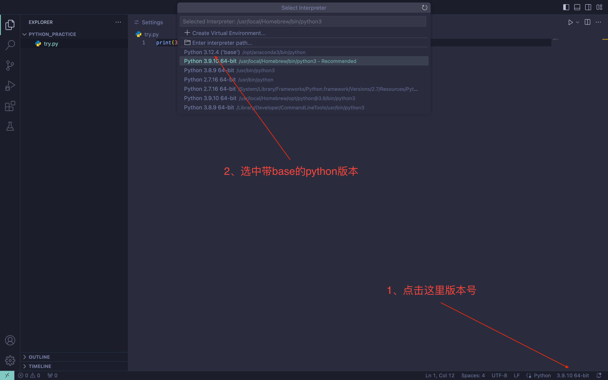

## 使用VSCode

1、新建`python`文件夹，这里是的路径为`~/Document/code/python/python_practice`。

2、 打开`VSCode`，设置文件夹目录为步骤一新建的路径。
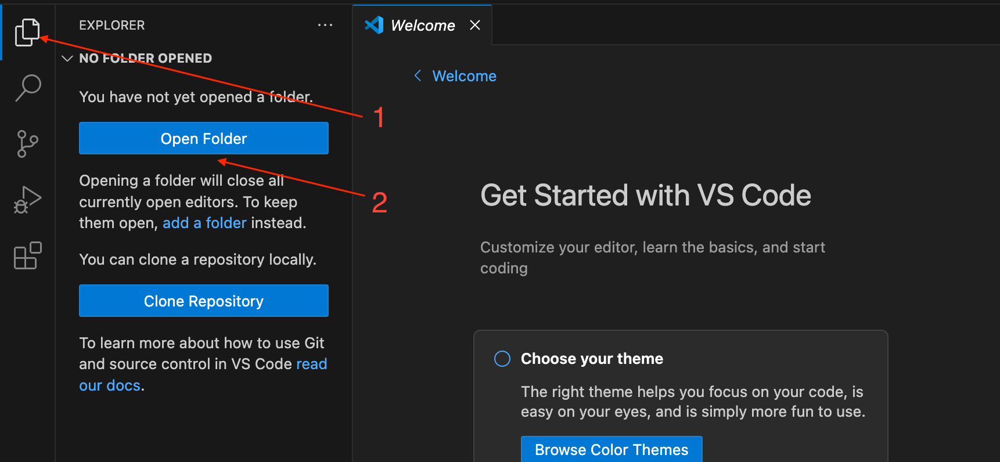

3、鼠标移动至箭头位置，出现新增图标，新建源代码文件。

## 安装VSCode插件

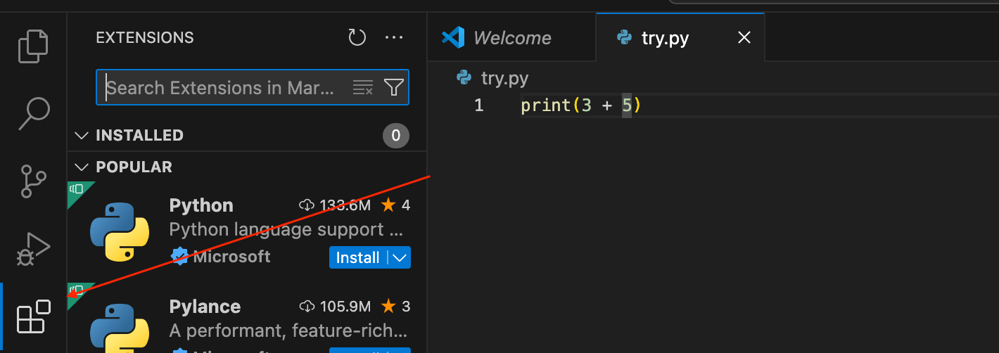

>安装完插件后，建议重启`VSCode`。

### Python

搜索python，安装python插件。
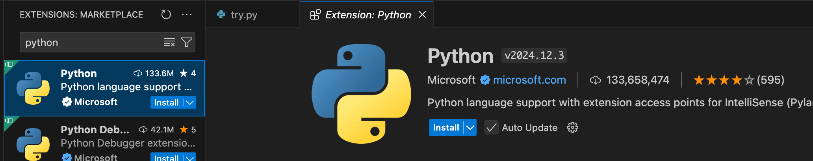

### Code Runner

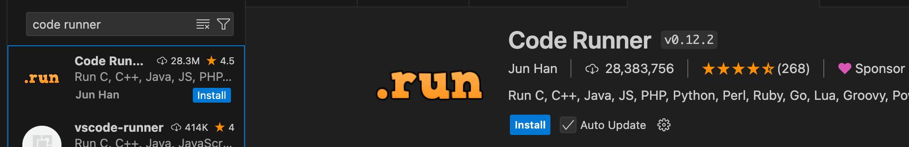

`Code Runner`效果:
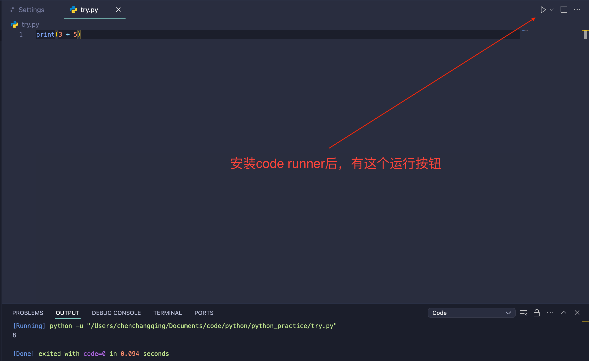

### Material Icon Theme

为不同类型的档案标记不同的Icon。

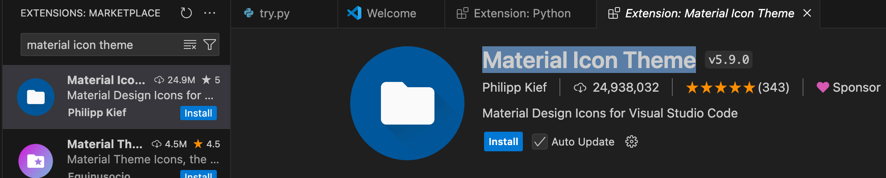

配置主题，可以搜索`Community Material`，选择`Community Material Theme Palenight High Contrast`。
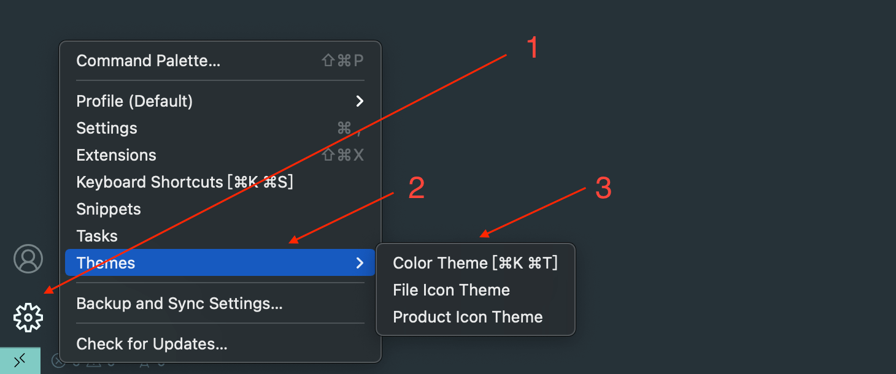

### autopep8

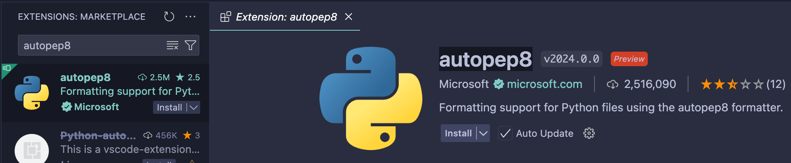

1、打开`format on save`
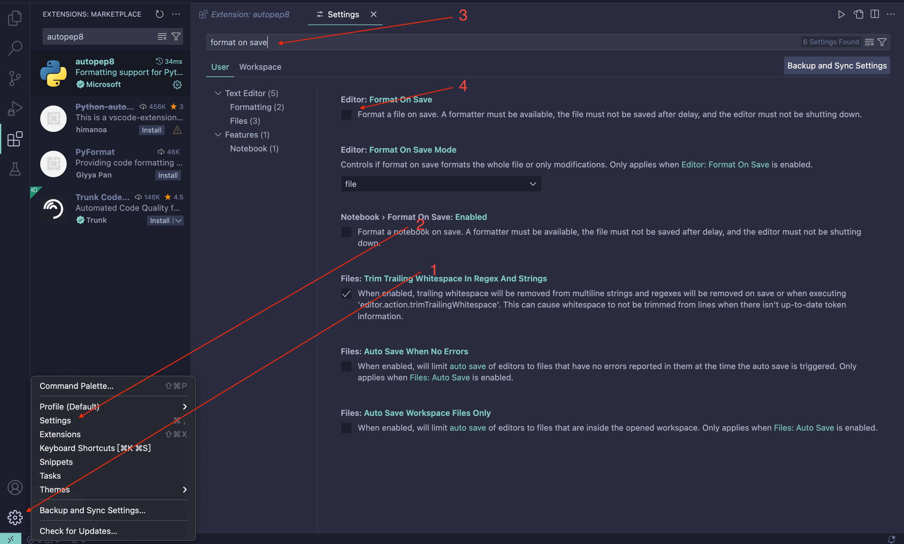

2、选中`autopep8`
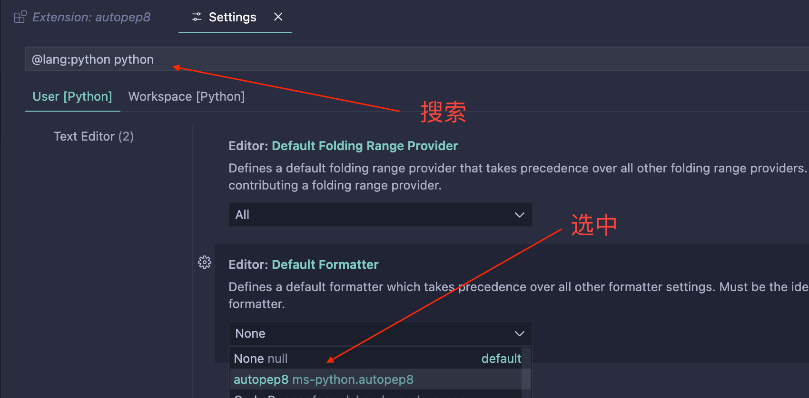

