# Servlet考试管理系统

## 准备工作
---

### 创建用户信息表Users

```sql
CREATE TABLE Users(
	userId int primary key auto_increment, #用户编号
	userName varchar(50), #用户名称
	password varchar(50), #用户密码
	sex char(1), #用户性别 ‘男’ 或 ‘女’
	email varchar(50) ## 用户邮箱
);
```
### 在src下新建com.c1221.entity.Users实体类
```java
package com.c1221.entity;

public class Users {
    private Integer userId;
    private String userName;
    private String password;
    private String sex;
    private String email;

    public User(Integer userId, String userName, String password, String sex, String email) {
        this.userId = userId;
        this.userName = userName;
        this.password = password;
        this.sex = sex;
        this.email = email;
    }

    /// Getter

    /// Setter
}
```
生成get、set、构造方法：右键类文件编辑区（Command+N）->Generate->Constructor、Getter、Setter
### 新增Mysql驱动 
在web下WEB-INF下创建lib文件夹，存放mysql提供的JDBC实现jar包

### 在src下新建com.c1221.util.JdbcUtil工具类
```java
package com.c1221.util;

import java.sql.*;

/**
 * JDBC工具类，简化JDBC编程
 */
public class JdbcUtil {

    static final String URL = "jdbc:mysql://localhost:3306/mysql";
    static final String USERNAME = "root";
    static final String PASSWORD = "333";

    /**
     * 工具类中的构造方法都是私有的
     * 因为工具类当中的方法都是静态的，不需要new对象，直接采用类名调用
     */
    private JdbcUtil(){}

    // 静态代码块在类加载时执行，并且只执行一次
    static {
        try {
            Class.forName("com.mysql.jdbc.Driver");
        } catch (ClassNotFoundException e) {
            e.printStackTrace();
        }
    }

    /**
     * 获取数据库连接对象
     *
     * @return 连接对象
     * @throws SQLException
     */
    public static Connection getConnection() throws SQLException {
        return DriverManager.getConnection(URL, USERNAME, PASSWORD);
    }

    /**
     * 关闭资源
     * @param conn 连接对象
     * @param ps 数据库操作对象
     * @param rs 结果集
     */
    public static void close(Connection conn, Statement ps, ResultSet rs) {
        if (rs != null) {
            try {
                rs.close();
            }catch(SQLException e) {
                e.printStackTrace();
            }
        }
        if (ps != null) {
            try {
                ps.close();
            } catch(SQLException e) {
                e.printStackTrace();
            }
        }
        if (conn != null) {
            try {
                conn.close();
            } catch(SQLException e) {
                e.printStackTrace();
            }
        }
    }
}
```

## 用户信息注册流程图
---
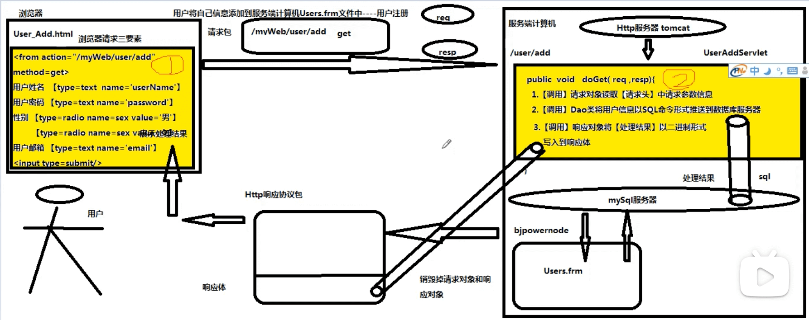

## 注册页面
---
在web下，新建user_add.html
```html
<!DOCTYPE html>
<html lang="en">
<head>
    <meta charset="UTF-8">
    <title>Title</title>
</head>
<body>
    <center>
        <form action="/examsystem/user/add" method="get">
            <table>
                <tr>
                    <td>用户姓名</td>
                    <td><input type="text" name="userName"></td>
                </tr>
                <tr>
                    <td>用户密码</td>
                    <td><input type="password" name="password"></td>
                </tr>
                <tr>
                    <td>用户性别</td>
                    <td>
                        <input type="radio" name="sex" value="1"/>男
                        <input type="radio" name="sex" value="2"/>女
                    </td>
                </tr>
                <tr>
                    <td>用户邮箱</td>
                    <td><input type="text" name="email"></td>
                </tr>
                <tr>
                    <td><input type="submit" value="用户注册"/></td>
                    <td><input type="reset"/></td>
                </tr>
            </table>
        </form>
    </center>
</body>
</html>
```

## 编写UserDao
---
在src下新建com.c1221.dao.UserDao
```java
package com.c1221.com.c1221.dao;

import com.c1221.entity.Users;
import com.c1221.util.JdbcUtil;

import java.sql.*;

public class UserDao {

    public int add(Users users) {
        Connection conn = null;
        PreparedStatement ps = null;
        int result = 0;
        try {
            // 2、获取连接
            conn = JdbcUtil.getConnection();
            // 将自动提交机制修改为手动提交
            conn.setAutoCommit(false);
            // 3、获取数据库操作对象
            String sql = "insert into users(userName,password,sex,email)" +
                    " values(?,?,?,?)";
            ps = conn.prepareStatement(sql);
            // 4、执行SQL语句
            ps.setString(1, users.getUserName());
            ps.setString(2, users.getPassword());
            ps.setString(3, users.getSex());
            ps.setString(4, users.getEmail());
            result = ps.executeUpdate();
            conn.commit();
        } catch(Exception e) {
            // 回滚事务
            if(conn != null) {
                try {
                    conn.rollback();
                } catch (SQLException e1) {
                    e1.printStackTrace();
                }
            }
            e.printStackTrace();
        } finally {
            JdbcUtil.close(conn, ps, null);
        }
        return result;
    }
}

```

## 注册Servlet
---
### 导入servlet-api.jar

https://blog.51cto.com/laoshifu/4839810

### 修改web.xml
```xml
<?xml version="1.0" encoding="UTF-8"?>
<web-app xmlns="http://xmlns.jcp.org/xml/ns/javaee"
         xmlns:xsi="http://www.w3.org/2001/XMLSchema-instance"
         xsi:schemaLocation="http://xmlns.jcp.org/xml/ns/javaee http://xmlns.jcp.org/xml/ns/javaee/web-app_4_0.xsd"
         version="4.0">
    <servlet>
        <servlet-name>UserAddServlet</servlet-name>
        <servlet-class>com.c1221.controller.UserAddServlet</servlet-class>
    </servlet>
    <servlet-mapping>
        <servlet-name>UserAddServlet</servlet-name>
        <url-pattern>/user/add</url-pattern>
    </servlet-mapping>
</web-app>
```
### 在src下新建com.c1221.controller.UserAddServlet

```java
package com.c1221.controller;

import com.c1221.com.c1221.dao.UserDao;
import com.c1221.entity.Users;

import javax.servlet.ServletException;
import javax.servlet.http.HttpServlet;
import javax.servlet.http.HttpServletRequest;
import javax.servlet.http.HttpServletResponse;
import java.io.IOException;
import java.io.PrintWriter;

public class UserAddServlet extends HttpServlet {
    @Override
    protected void doGet(HttpServletRequest req, HttpServletResponse resp) throws ServletException, IOException {
        String userName,password,sex,email;
        UserDao dao = new UserDao();
        Users user = null;
        int result = 0;
        PrintWriter out = null;
        // 1.【调用请求对象】读取【请求头】参数信息，得到用户的信息
        userName = req.getParameter("userName");
        password = req.getParameter("password");
        sex = req.getParameter("sex");
        email = req.getParameter("email");
        // 2.【调用UserDao】将用户信息填充到INSERT命令借助JDBC规范发送到数据库服务器
        user = new Users(null, userName, password, sex, email);
        result = dao.add(user);
        // 3.【调用响应对象】将【处理结果】以二进制形式写入到响应体
        resp.setContentType("text/html;charset=utf-8");
        out = resp.getWriter();
        if (result == 1) {
            out.print("<font style='color:red;font-size:40'>用户信息注册成功</font>");
        } else {
            out.print("<font style='color:red;font-size:40'>用户信息注册失败</font>");
        }
        out.close();
        // Tomcat负责销毁【请求对象】和【响应对象】
        // Tomcat负责将Http响应协议包推送到发起请求的浏览器上
        // 浏览器根据响应头content-type指定编译器对响应体二进制内容编辑
        // 浏览器将编辑后结果在窗口中展示给用户【结束】
    }
}

```
## 查询Servlet
---
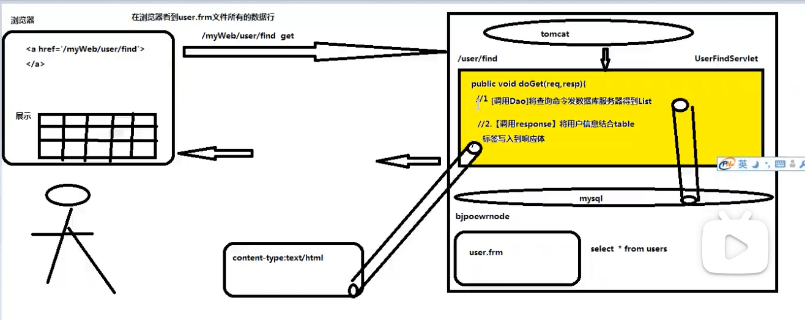

### 修改web.xml

```xml
<servlet>
    <servlet-name>UserFindServlet</servlet-name>
    <servlet-class>com.c1221.controller.UserFindServlet</servlet-class>
</servlet>
<servlet-mapping>
    <servlet-name>UserFindServlet</servlet-name>
    <url-pattern>/user/find</url-pattern>
</servlet-mapping>
```

### 新增UserFindServlet
```java
@Override
protected void doGet(HttpServletRequest request, HttpServletResponse response) throws ServletException, IOException {
    UserDao dao;
    PrintWriter out;
    // 1【调用DAO】将查询命令推送到数据服务器上，得到所有用户信息【List】
    dao = new UserDao();
    List<Users> userList = dao.findAll();
    // 2【调用响应对象】将用户信息结合《table》标签命令以二进制形式写入到响应体
    response.setContentType("text/html;charset=utf-8");
    out = response.getWriter();
    out.print("<table border='2' align='center'>");
    out.print("<tr>");
    out.print("<td>用户编号</td>");
    out.print("<td>用户姓名</td>");
    out.print("<td>用户密码</td>");
    out.print("<td>用户性别</td>");
    out.print("<td>用户邮箱</td>");
    out.print("</tr>");
    for (Users users:userList) {
        out.print("<tr>");
        out.print("<td>"+users.getUserId()+"</td>");
        out.print("<td>"+users.getUserName()+"</td>");
        out.print("<td>"+users.getPassword()+"</td>");
        out.print("<td>"+users.getSex()+"</td>");
        out.print("<td>"+users.getEmail()+"</td>");
        out.print("</tr>");
    }
    out.print("</table>");
}
```

### 修改UserDao

```java
// 查询用户信息
public List findAll() {
    PreparedStatement ps = null;
    Connection conn = null;
    ResultSet rs = null;
    List<Users> userList = new ArrayList<Users>();
    try {
        // 2、获取连接
        conn = JdbcUtil.getConnection();
        // 3、获取数据库操作对象
        String sql = "select * from users";
        ps = conn.prepareStatement(sql);
        rs = ps.executeQuery();
        while (rs.next()) {
            Integer userId = rs.getInt("userId");
            String userName = rs.getString("userName");
            String password = rs.getString("password");
            String sex = rs.getString("sex");
            String email = rs.getString("email");
            Users users = new Users(userId, userName, password, sex, email);
            userList.add(users);
        }
    } catch(SQLException e) {
        e.printStackTrace();
    } finally {
        JdbcUtil.close(conn, ps, rs);
    }
    return userList;
}
```

## 导航栏
--- 
### 新建index.html
```html
<html>
<head>
    <meta charset="UTF-8">
    <title>Title</title>
</head>
<frameset rows="15%,85%">
  <frame name="top" src="top.html"/>
  <frameset cols="30%,70%">
    <frame name="left"  src="left.html"/>
    <frame name="right"/>
  </frameset>
</frameset>
</html>
```
### 新建top.html
```html
<html>
<head>
    <meta charset="UTF-8">
    <title>Title</title>
</head>
<body style="background-color: green">
  <center>
    <font style="color: red; font-size: 40px">在线考试管理系统</font>
  </center>
</body>
</html>
```

### 新建left.html
```html
<!DOCTYPE html>
<html lang="en">
<head>
    <meta charset="UTF-8">
    <title>Title</title>
</head>
<body>
  <ul>
    <li>用户信息管理</li>、
      <ol>
        <li><a href="user_add.html" target="right">用户信息注册</a></li>
        <li><a href="user/find" target="right">用户信息查询</a></li>
      </ol>
    <li>试题信息管理</li>
    <li>考试管理</li>
  </ul>
</body>
</html>
```

## UserDeleteServlet
---

### 修改UserFindServlet
```java
@Override
protected void doGet(HttpServletRequest request, HttpServletResponse response) throws ServletException, IOException {
    UserDao dao;
    PrintWriter out;
    // 1【调用DAO】将查询命令推送到数据服务器上，得到所有用户信息【List】
    dao = new UserDao();
    List<Users> userList = dao.findAll();
    // 2【调用响应对象】将用户信息结合《table》标签命令以二进制形式写入到响应体
    response.setContentType("text/html;charset=utf-8");
    out = response.getWriter();
    out.print("<table border='2' align='center'>");
    out.print("<tr>");
    out.print("<td>用户编号</td>");
    out.print("<td>用户姓名</td>");
    out.print("<td>用户密码</td>");
    out.print("<td>用户性别</td>");
    out.print("<td>用户邮箱</td>");
    out.print("<td>操作</td>");
    out.print("</tr>");
    for (Users users:userList) {
        out.print("<tr>");
        out.print("<td>"+users.getUserId()+"</td>");
        out.print("<td>"+users.getUserName()+"</td>");
        out.print("<td>"+users.getPassword()+"</td>");
        out.print("<td>"+users.getSex()+"</td>");
        out.print("<td>"+users.getEmail()+"</td>");
        out.print("<td><a href='user/delete?userId="+users.getUserId()+"'>删除用户</a></td>");
        out.print("</tr>");
    }
    out.print("</table>");
}
```
### 修改UserDAO，新增删除方法
```java
// 根据用户编号删除用户信息
public int delete(String userId) {
    Connection conn = null;
    PreparedStatement ps = null;
    int result = 0;
    try {
        // 2、获取连接
        conn = JdbcUtil.getConnection();
        // 将自动提交机制修改为手动提交
        conn.setAutoCommit(false);
        // 3、获取数据库操作对象
        String sql = "delete from users where userId=?";
        ps = conn.prepareStatement(sql);
        ps.setString(1, userId);
        result = ps.executeUpdate();
        conn.commit();
    } catch(Exception e) {
        // 回滚事务
        if(conn != null) {
            try {
                conn.rollback();
            } catch (SQLException e1) {
                e1.printStackTrace();
            }
        }
        e.printStackTrace();
    } finally {
        JdbcUtil.close(conn, ps, null);
    }
    return result;
}
```

### 新增UserDeleteServlet
```java
@Override
protected void doGet(HttpServletRequest request, HttpServletResponse response) throws ServletException, IOException {
    String userId;
    UserDao dao = new UserDao();
    int result = 0;
    PrintWriter out = null;
    // 1.【调用请求对象】读取【请求头】参数（用户编号）
    userId = request.getParameter("userId");
    // 2.【调用DAO】将用户编号填充到delete命令并发送到数据库服务器
    result = dao.delete(userId);
    // 3.【调用响应对象】将处理结果以二进制写入到响应体，交给浏览器
    response.setContentType("text/html; charset=utf-8");
    out = response.getWriter();
    if (result == 1) {
        out.print("<font style='color:red; font-size:40px'>用户信息删除成功</font>");
    } else {
        out.print("<font style='color:red; font-size:40px'>用户信息删除失败</font>");
    }
}
```
## 登录验证
---
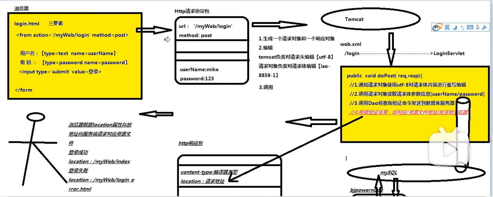

### 新建login.html
```html
<!DOCTYPE html>
<html lang="en">
<head>
    <meta charset="UTF-8">
    <title>Title</title>
</head>
<body>
  <center>
    <form action="/examsystem/user/login" method="post">
      <table border="2">
        <tr>
          <td>登录名</td>
          <td><input type="text" name="userName"/></td>
        </tr>
        <tr>
          <td>密码</td>
          <td><input type="password" name="password"/></td>
        </tr>
        <tr>
          <td><input type="submit" value="登录"/></td>
          <td><input type="reset"/></td>
        </tr>
      </table>
    </form>
  </center>
</body>
</html>
```
### 修改UserDao，新增login方法
```java
// 登录验证
public int login(String userName, String password) {
    PreparedStatement ps = null;
    Connection conn = null;
    ResultSet rs = null;
    int result = 0;
    try {
        // 2、获取连接
        conn = JdbcUtil.getConnection();
        // 3、获取数据库操作对象
        String sql = "select count(*) from users where userName=? and password=?";
        ps = conn.prepareStatement(sql);
        ps.setString(1, userName);
        ps.setString(2, password);
        rs = ps.executeQuery();
        while (rs.next()) {
            result = rs.getInt("count(*)");
        }
    } catch(SQLException e) {
        e.printStackTrace();
    } finally {
        JdbcUtil.close(conn, ps, rs);
    }
    return result;
}
```
### 新增login_error.html
```html
<!DOCTYPE html>
<html lang="en">
<head>
  <meta charset="UTF-8">
  <title>Title</title>
</head>
<body>
<center>
  <font style="color:red; font-size: 30px">登录信息不存在，请重新登录</font>
  <form action="/examsystem/user/login" method="post">
    <table border="2">
      <tr>
        <td>登录名</td>
        <td><input type="text" name="userName"/></td>
      </tr>
      <tr>
        <td>密码</td>
        <td><input type="password" name="password"/></td>
      </tr>
      <tr>
        <td><input type="submit" value="登录"/></td>
        <td><input type="reset"/></td>
      </tr>
    </table>
  </form>
</center>
</body>
</html>
```
### 新建LoginServlet
```java
@Override
protected void doPost(HttpServletRequest request, HttpServletResponse response) throws ServletException, IOException {
    String userName,password;
    UserDao dao = new UserDao();
    int result = 0;
    // 调用请求对象对请求体使用utf-8字符集进行重新编辑
    request.setCharacterEncoding("utf-8");
    // 调用请求对象读取请求体参数信息
    userName = request.getParameter("userName");
    password = request.getParameter("password");
    // 调用DAO将查询验证信息推送到数据库服务器上
    result = dao.login(userName, password);
    // 调用响应对象，根据验证码结果将不同资源文件地址写入到响应体，交给浏览器
    if (result == 1) {
        // 用户存在
        response.sendRedirect("/examsystem/index.html");
    } else {
        response.sendRedirect("/examsystem/login_error.html");
    }
}
```
### 修改web.xml
```xml
<servlet>
    <servlet-name>LoginServlet</servlet-name>
    <servlet-class>com.c1221.controller.LoginServlet</servlet-class>
</servlet>
<servlet-mapping>
    <servlet-name>LoginServlet</servlet-name>
    <url-pattern>/user/login</url-pattern>
</servlet-mapping>
```
## 欢迎资源文件
---
### 前提

用户可以记住网站名，但是不会记住网站资源文件名

### 默认欢迎资源文件

用户发送了一个针对某个网站的【默认请求】时，此时由Http服务器自动从当前网站返回的资源文件。
* 正常请求：http://localhost:8080/examsystem/index.html
* 默认请求：http://localhost:8080/examsystem

### Tomcat对默认欢迎资源文件定位规则

1）规则位置：Tomcat安装位置/conf/web.xml

2）规则命令：
```xml
<welcome-file-list>
    <welcome-file>index.html</welcome-file>
    <welcome-file>index.htm</welcome-file>
    <welcome-file>index.jsp</welcome-file>
</welcome-file-list>
```

### 设置当前网站的默认欢迎资源文件规则

1）规则位置：网站/web/WEB-INF/web.xml

2) 规则命令：
```xml
<welcome-file-list>
    <welcome-file>login.html</welcome-file>
</welcome-file-list>
```

## Http状态码
---
### 介绍

1）由三位数字组成的一个符号。  
2）Http服务器在推送响应包之前，根据本次请求处理情况将Http状态码写入到响应包中【状态行】上。  
3）如果Http服务器针对本次请求，返回了对应的资源文件。通过Http状态码通知浏览器应该如何处理这个结果。  
4）如果Http服务器针对本次请求，无法返回对应的资源文件。通过Http状态码向浏览器解释不能提供服务的原因。  

### 分类

1）组成：100～599，分为5个大类

2）1XX
最有特征的是100：通知浏览器本次返回的资源文件并不是一个独立的资源文件，需要浏览器在接受响应包之后，继续向Http服务器所要依赖。
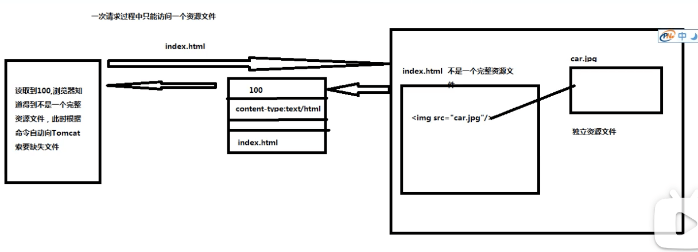

3）2XX  
最有特征的是200：通知浏览器本次返回的资源文件是一个完整独立资源文件，浏览器在接收到之后不需要所要其他关联文件。  

4）3XX：  
最有特征的是302：通知浏览器本次返回的不是一个资源文件内容而是一个资源文件地址，需要浏览器根据这个地址自动发起请求来所要这个资源文件。

response.sendRedirect("资源文件地址")写入到响应头中location，而这个行为导致Tomcat将302状态码写入到状态行。

5）4XX  
* 404：通知浏览器，由于在服务器没有定位到被访问的资源文件，因此无法提供帮助。
* 405：通知浏览器，在服务器已经定位到被访问的资源文件（Servlet），但是这个Servlet对于浏览器采用的请求方式不能处理

6）5XX

500：通知浏览器，在服务端已经定位到被访问的资源文件（Servlet），这个Servlet可以接收浏览器采用请求方式，但是Servlet在处理请求期间，由于Java异常导致处理失败。

## 做个Servlet之间的调用规则
---


### 前提条件

某些来自于浏览器发送请求，往往需要服务端中多个Servlet协同处理。但是浏览器一次只能访问一个Servlet，导致用户需要手动通过浏览器发起多次请求才能得到服务。这样增加用户获得服务难度，导致用户放弃访问当前网站。

### 提高用户使用感受规则

无论本次请求涉及到多少个Servlet，用户只需要【手动】通知浏览器发起一次请求即可。

### 多个Servlet之间调用规则

1）重定向解决方案

2）请求转发解决方案

## 重定向解决方案
--- 

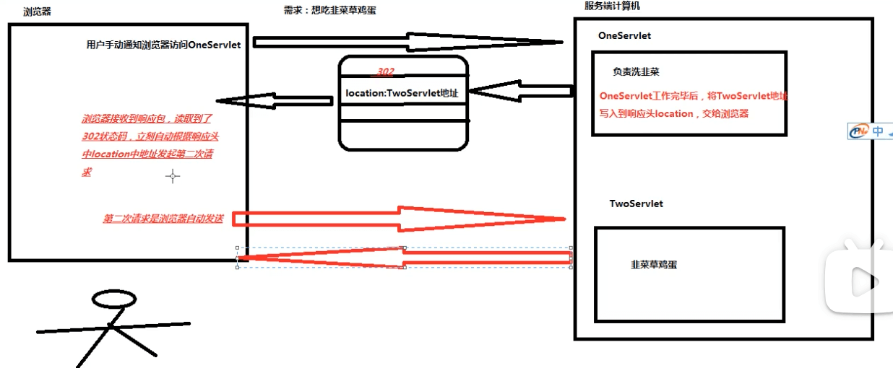

### 工作原理

用户第一次通过【手动方式】通知浏览器返回OneServlet。OneServlet工作完毕后，将TwoServlet地址写入到响应头location属性中，导致Tomcat将302状态码写入到状态行。

在浏览器接收到响应之后，会读取302状态。此时浏览器自动根据响应头中location属性地址发起第二次请求，访问TwoServlet去完成请求中剩余任务。

### 实现命令

response.sendRedirect("请求地址")，将地址写入到响应包中响应头中的location属性。

### 特征

1）请求地址：既可以把当前网站内部的资源文件地址发送给浏览器（/网站名/资源文件名），也可以把其他网站资源文件地址发送给浏览器（http://ip地址：端口号/网站名称/资源文件名)。

2）请求次数：浏览器至少发送两次请求，但是只有第一次请求是用户手动发送。后续请求都是浏览器自动发送的。

3）请求方式：重定向解决方案中，通过地址栏通知浏览器发起下一次请求，因此通过重定向解决方案调用的资源文件接收的请求方式一定是【get】。

4）缺点：重定向解决方案需要在浏览器与服务器之间进行多次往返，大量时间消耗在往返次数上，增加用户等待服务时间。

## 请求转发解决方案
---

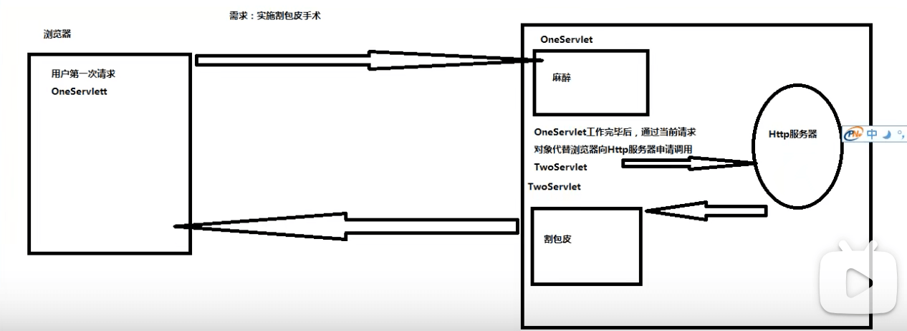

### 原理

用户第一次通过手动方式要求浏览器访问OneServlet，OneServlet工作完毕后，通过当前的请求对象代替浏览器向Tomcat发起请求，申请调用TwoServlet，Tomcat在接收到这个请求之后，自动调用TwoServlet来完成剩余任务。

### 实现命令

1) 通过当前请求对象生成资源文件申请报告对象
```java
// 注意：一定要以“/”为开头
RequestDispatcher report = request.getRequestDispatcher("/资源文件名");
```
2) 将报告对象发送给Tomcat
```java
report.forward(当前请求对象, 当前响应对象);
```

### 优点

1）无论本次请求涉及到多少个Servlet，用户只需要手动通过浏览器发送一次请求。

2）Servlet之间调用发生在服务端计算上，节省服务器与浏览器之间往返次数，增加处理服务速度。

### 特征

1）请求次数：在请求转发过程中，浏览器只发送一次请求。

2）请求地址：知恩感向Tomcat服务器申请调用当前网站下资源文件地址。

3）请求方式：在请求转发过程中，浏览器只发送一个Http请求协议包，参与本次请求的所有Servlet共享同一个请求协议包，因此这些Servlet接收的请求方式与浏览器发送的请求方式保持一致。

## 多个Servlet之间数据共享实现方案
---
数据共享，OneServlet工作完毕后，将产生数据交给TwoServlet来使用。

### Servlet规范中提供四种数据共享方案

1. ServletContext接口
2. Cookie类
3. HttpSession接口
4. HttpServletRequest接口

## ServletContext接口
---


### 介绍

1. 来自于Servlet规范中一个接口，在Tomcat中存在servlet-api.jar，在Tomcat中负责提供这个接口实现类。
2. 如果两个Servlet来自于同一个网站，彼此之间通过网站的ServletContext实例对象实现数据共享。
3. 开发人员习惯于将ServletContext对象称为【全局作用域对象】。

### 工作原理

每个网站都存在一个全局作用域对象，这个全局作用域对象【相当于】一个Map，在这个网站中OneServlet可以将一个数据存入到全局作用域对象，当前网站中其他Servlet此时都可以从全局作用域对象得到这个数据进行使用。


### 全局对象作用域的生命周期

1）在Http服务器启动过程中，自动为当前在内存中创建一个全局作用域对象。

2）在Http服务器运行期间时，一个网站只有一个全局作用域对象。

3）在Http服务器运行期间，全局作用域对象一致处理存活状态。

4）在Http服务器准备关闭时，负责将当前网站中全局作用域对象进行销毁处理。

**全局作用域对象生命周期贯穿网站整个运行期间**

### 命令实现

【同一个网站】OneServlet将数据共享给TwoServlet
```java
// 通过【请求对象】向Tomcat索要当前网站中【全局作用域对象】
ServletContext application = request.getServletContext();
// 将数据添加到全局作用域对象作为【共享数据】
application.setAttribute("key1", 数据);
```
取数据
```java
// 通过【请求对象】向Tomcat索要当前网站中【全局作用域对象】
ServletContext application = request.getServletContext();
// 从全局作用域对象得到指定关键字对应数据
Object 数据 = application.getAttribute("key1");
```

## Cookie
---

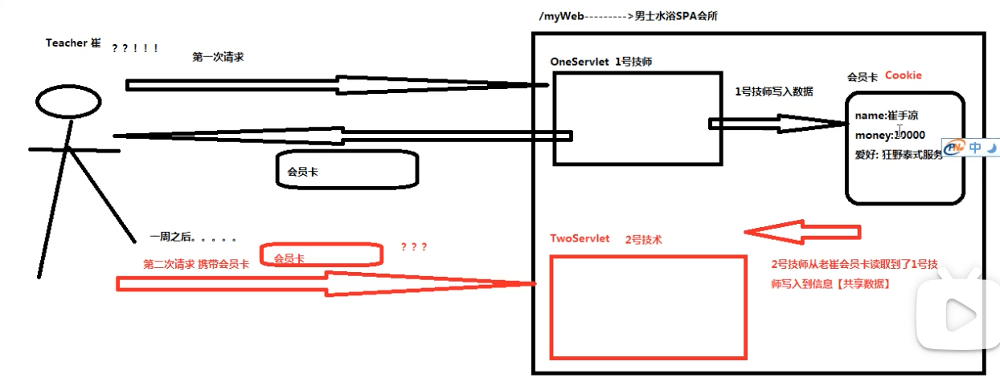

### 介绍

1）Cookie来自于Servlet规范中一个工具类，存在于Tomcat提供Servlet-api.jar中。

2）如果两个Servlet来自于同一个网站，并且为同一个浏览器/用户提供服务，此时借助于Cookie对象进行数据共享。

3）Cookie存放当前用户的私人数据，在共享数据过程中提供服务质量。

4）在现实生活场景中，Cookie相当于用户在服务端得到【会员卡】。

### 原理

用户通过浏览器第一次向MyWeb网站发送请求申请OneServlet，OneServlet在运行期间创建一个Cookie存储于当前用户相关数据，OneServlet工作完毕后，【将Cookie写入到响应头】交还给当前浏览。

浏览在接收到响应包之后，将Cookie存储在浏览器的缓存，一段时间后，用户通过【同一个浏览器】再次向【MyWeb网站】发送请求申请TwoServlet时，【浏览器需要无条件的将myWeb网站之前推送过来的Cookie，写入到【请求头】发送国旗。

此时TwoServlet在运行时，就可以通过读取请求头中的Cookie中信息，得到OneServlet提供的共享数据。

### 实现命令

同一个网站OneServlet于TwoServlet借助于Cookie实现数据共享
```java
// 创建一个Cookie对象，保存共享数据（当前用户数据）
// Cookie相当于一个map，一个cookie中只能存放一个键值对，这个键值对的key于value只能是String，键值对中key不能时中文
Cookie card = new Cookie("key1", "abc");
Cookie card1 = new Cookie("key2", "abc2");;
// 2.【发卡】将cookie写入到响应头，交给浏览器
response.addCookie(card);
response.addCookie(card1);
```
取数据
```java
// 调用请求对象从请求头得到浏览器返回的cookie
Cookie cookieArray[] = request.getCookies();
// 循环遍历数据得到每一个cookie的key与value
for(Cookie card: cookieArray) {
	// 读取key “key1”
	String key = card.getName();
	// 读取value “abc”
	String value = card.getValue();
}
```

## 会员卡订单
---
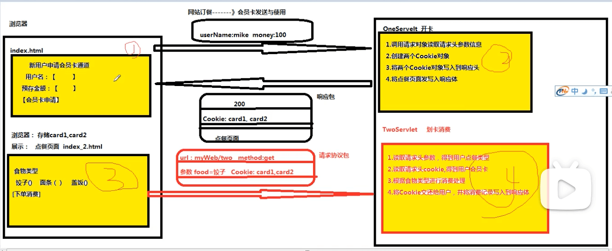

### 新建index.html
```html
<!DOCTYPE html>
<html lang="en">
<head>
    <meta charset="UTF-8">
    <title>Title</title>
</head>
<body>
  <center>
    <font style="color:red;font-size:40px">新会员申请开卡</font>
    <form action="/vip/one">
      <table>
        <tr>
          <td>用户名</td>
          <td><input type="text" name="userName"/></td>
        </tr>
        <tr>
          <td>预存金额</td>
          <td><input type="text" name="money"/></td>
        </tr>
        <tr>
          <td><input type="submit" value="申请开卡"></td>
          <td><input type="reset"/></td>
        </tr>
      </table>
    </form>
  </center>
</body>
</html>
```

### 新建OneServlet
```java
package com.c1221.controller;

import javax.servlet.*;
import javax.servlet.http.*;
import java.io.IOException;

public class OneServlet extends HttpServlet {
    @Override
    protected void doGet(HttpServletRequest request, HttpServletResponse response) throws ServletException, IOException {
        String userName,money;
        // 调用请求对象读取【请求头】参数信息
        userName = request.getParameter("userName");
        money = request.getParameter("money");
        // 开卡
        Cookie card1 = new Cookie("userName", userName);
        Cookie card2 = new Cookie("money", money);
        // 发卡，将Cookie写入到响应头交给浏览器
        response.addCookie(card1);
        response.addCookie(card2);
        // 通知浏览器【点餐页面】内容写入到响应体交给浏览器（请求转发）
        request.getRequestDispatcher("/index_2.html").forward(request, response);
    }

    @Override
    protected void doPost(HttpServletRequest request, HttpServletResponse response) throws ServletException, IOException {

    }
}

```

### 新建index_2.html
```html
<!DOCTYPE html>
<html lang="en">
<head>
    <meta charset="UTF-8">
    <title>Title</title>
</head>
<body>
  <center>
    <font style="color:red;font-size:40px">点餐页面</font>
    <form action="/vip/two">
      食物类型<input type="radio" name="food" value="jiaozi"/>饺子（30元）
      <input type="radio" name="food" value="miantiao"/>面条（20元）
      <input type="radio" name="food" value="gaifan"/>盖饭（15元）
      <input type="submit" value="划卡消费">
    </form>
  </center>
</body>
</html>
```

### 新建TwoServlet
```java
package com.c1221.controller;

import javax.servlet.*;
import javax.servlet.http.*;
import java.io.IOException;
import java.io.PrintWriter;

public class TwoServlet extends HttpServlet {
    @Override
    protected void doGet(HttpServletRequest request, HttpServletResponse response) throws ServletException, IOException {
        int jiaozi_money=30;
        int gaifan_money=15;
        int miantiao_money = 20;
        int money=0,xiaofei=0,balance=0;
        String food,userName = null;
        Cookie cookieArray[] = null;
        response.setContentType("text/html;charset=utf-8");
        PrintWriter out = response.getWriter();
        Cookie newCard = null;
        // 读取请求头参数信息，得到用户点餐食物类型
        food = request.getParameter("food");
        // 读取请求中的Cookie
        cookieArray = request.getCookies();
        // 刷卡消费
        for(Cookie card: cookieArray) {
             String key = card.getName();
             String value = card.getValue();
             if ("userName".equals(key)) {
                 userName = value;
             } else if ("money".equals(key)) {
                 money = Integer.valueOf(value);
                 if ("jiaozi".equals(food)) {
                     if (jiaozi_money > money) {
                         out.print("用户"+userName+" 余额不足，请充值");
                     } else {
                         newCard = new Cookie("money", (money-jiaozi_money)+"");
                         xiaofei = jiaozi_money;
                         balance = money - jiaozi_money;
                     }
                 } else if ("miantiao".equals(food)) {
                     if (miantiao_money > money) {
                         out.print("用户"+userName+" 余额不足，请充值");
                     } else {
                         newCard = new Cookie("money", (money-miantiao_money)+"");
                         xiaofei = miantiao_money;
                         balance = money - miantiao_money;
                     }
                 } else if ("gaifan".equals(food)) {
                     if (gaifan_money > money) {
                         out.print("用户"+userName+" 余额不足，请充值");
                     } else {
                         newCard = new Cookie("money", (money-gaifan_money)+"");
                         xiaofei = gaifan_money;
                         balance = money - gaifan_money;
                     }
                 }
             }
        }
        // 将用户会员卡返还给用户
        response.addCookie(newCard);
        // 将消费记录写入响应
        out.print("用户"+userName+"本次消费 "+xiaofei+" 余额："+balance);
    }

    @Override
    protected void doPost(HttpServletRequest request, HttpServletResponse response) throws ServletException, IOException {

    }
}
```

## Cookie生命周期
---

### Cookie销毁时机

1）在默认情况下，Cookie对象存放在浏览器的缓存中，因此只要浏览器关闭，Cookie对象就被销毁掉。

2）在手动设置情况下，可以要求浏览器将接收的Cookie存放在客户端计算机上硬盘上，同时需要指定Cookie在硬盘上存活时间。在存活时间范围内，关闭浏览器关闭客户端计算机，关闭服务器，都不会导致Cookie被销毁。在存活时间到达时，Cookie自动从硬盘上被删除。

```java
// cookie在硬盘上存活1分钟
cookie.setMaxAge(60);
```

## HttpSession接口
---

### 介绍

1）HttpSession接口来自于Servlet规范下一个接口，存在于Tomcat中servlet-api.jar，其实现类由Http服务器提供。Tomcat体统实现类存在于servlet-api.jar。

2）如果两个Servlet来自于同一个网站，并且为同一个浏览器/用户提供服务，此时借助于HttpSession对象进行数据共享。

3）开发人员习惯于将HttpSession接口修饰对象称为【会话作用域对象】。

### HttpSession于Cookie区别

1）存储位置：一个在天上，一个在地下

1. Cookie：存放在客户端计算机（浏览器内存/硬盘）
2. HttpSession：存放在服务端计算机内存

2）数据类型

1. Cookie对象存储共享数据类型只能是String
2. HttpSession对象可以存储任意类型的共享数据Object

3）数据数量

一个Cookie对象只能存储一个共享数据，HttpSession使用map集合存储共享数据，所以可以存储任意数量共享数据。

4）参照物

Cookie相当于客户在服务端【会员卡】，HttpSession相当于客户在服务端【私人保险柜】。

### 命令实现

同一个网站下OneServlet将数据传递给TwoServlet
```java
OneServlet {
	public void doGet(HttpServletRequest request, HttpServletResponse response) {
		// 调用请求对象向Tomcat索要当前用户在服务端的私人存储柜
		HttpSession session = request.getSession();
		// 将数据添加到用户私人存储柜
		session.setAttribute("key1", 共享数据);
	}
}
```
浏览器访问/myWeb中TwoServlet
```java
OneServlet {
	public void doGet(HttpServletRequest request, HttpServletResponse response) {
		// 调用请求对象向Tomcat索要当前用户在服务端的私人存储柜
		HttpSession session = request.getSession();
		// 从会话作用域对象得到OneServlet提供的共享数据
		Object 共享数据 = session.getAttribute("key1");
	}
}
```

### Http服务器如何将用户于HttpSession关联起来
cookie
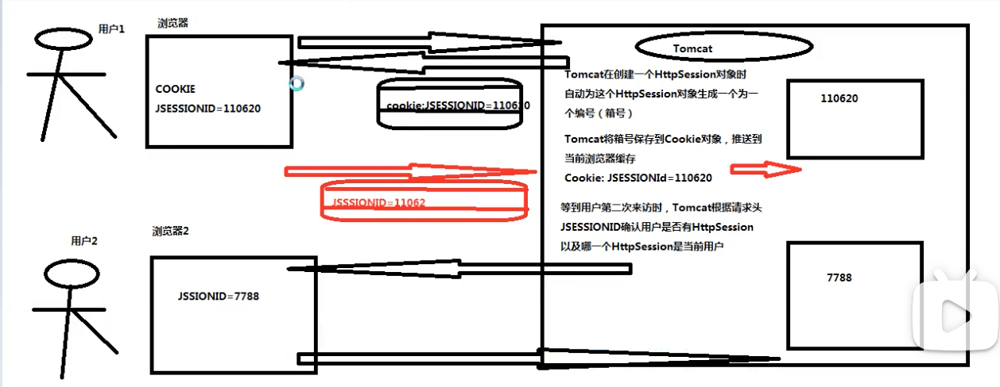

### getSession于getSession(false)

1）getSession()：如果当前用户在服务端已经拥有了自己的私人储物柜，邀请Tomcat将这个私人储物柜进行返回；如果当前用户在服务端尚未拥有自己的私人储物柜，邀请Tomcat为当前用户创建一个全新的私人储物柜。

2）getSession(false)：如果当亲啊用户在服务端已经拥有了自己的私人储物柜，要求Tomcat将这个私人储物柜进行返回；如果当前用户在服务端尚未拥有自己的的私人储物柜，此时Tomcat将返回null。

### HttpSession的销毁时机

1）用户与HttpSession关联是使用的Cookie只能存放在浏览器缓存中。

2）在浏览器关闭时，意味着用户与他的HttpSession关联被切断

3）由于Tomcat无法检测浏览器何时关闭，因此在浏览器关闭时并不易导致Tomcat将浏览器关联的HttpSession进行销毁。

4）为了解决这个问题，Tomcat为每一个HttpSession对象设置【空闲时间】，这个空闲时间默认30分钟，如果当前HttpSession对象空闲时达到30分钟，此时Tomcat认为用户已经放弃了自己的HttpSession，此时Tomcat就会销毁掉这个HttpSession。

### HttpSession空闲时间手动设置

在当前网站/web/WEB-INF/web.xml
```xml
<session-config>
	<session-timeout>5</session-timeout><!-- 当前网站中每一个session最大空闲时间5分钟 -->
</session-config>
```

## Session购物车示例
---
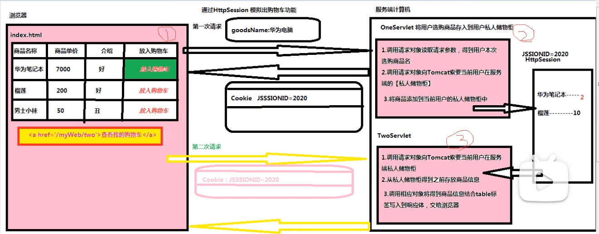

### 新建index.html
```html
<!DOCTYPE html>
<html lang="en">
<head>
    <meta charset="UTF-8">
    <title>Title</title>
</head>
<body>
  <table border="2" align="center">
    <tr>
      <td>商品名称</td>
      <td>商品单价</td>
      <td>供货商</td>
      <td>放入购物车</td>
    </tr>
    <tr>
      <td>华为笔记本电脑pro13</td>
      <td>7000</td>
      <td>华为</td>
      <td><a href="/shopcar/one?goods=华为笔记本电脑pro13">放入购物车</a></td>
    </tr>
    <tr>
      <td>榴莲</td>
      <td>300</td>
      <td>泰国</td>
      <td><a href="/shopcar/one?goods=榴莲">放入购物车</a></td>
    </tr>
    <tr>
      <td>男士内裤</td>
      <td>1000</td>
      <td>老催</td>
      <td><a href="/shopcar/one?goods=男士内裤">放入购物车</a></td>
    </tr>
    <tr align="center">
      <td colspan="4">
        <a href="/shopcar/two">查看我的购物车</a>
      </td>
    </tr>
  </table>
</body>
</html>
```

### 新建OneServlet
```java
package com.c1221.controller;

import javax.servlet.*;
import javax.servlet.http.*;
import java.io.IOException;

public class OneServlet extends HttpServlet {
    @Override
    protected void doGet(HttpServletRequest request, HttpServletResponse response) throws ServletException, IOException {
        String goodsName;
        // 调用请求对象，读取请求头参数，得到用户选择商品名
        goodsName = request.getParameter("goodsName");
        // 调用请求对象，向Tomcat索要当前用户服务端的私人储物柜
        HttpSession session = request.getSession();
        // 将用户选购商品添加到当前用户私人储物柜
        Integer goodsNum = (Integer)session.getAttribute(goodsName);
        if (goodsNum == null) {
            session.setAttribute(goodsName, 1);
        } else {
            session.setAttribute(goodsName, goodsNum+1);
        }
    }

    @Override
    protected void doPost(HttpServletRequest request, HttpServletResponse response) throws ServletException, IOException {

    }
}
```

### 新建TwoServlet

```java
package com.c1221.controller;

import javax.servlet.*;
import javax.servlet.http.*;
import java.io.IOException;
import java.util.Enumeration;

public class TwoServlet extends HttpServlet {
    @Override
    protected void doGet(HttpServletRequest request, HttpServletResponse response) throws ServletException, IOException {
        // 调用请求对象，向Tomcat索要当前用户在服务端私人储物柜
        HttpSession session = request.getSession();
        // 将session中所有的key读取出来，存放一个枚举对象
        Enumeration goodsNames = session.getAttributeNames();
        while (goodsNames.hasMoreElements()) {
            String goodsName = (String)goodsNames.nextElement();
            int goodsNum = (int)session.getAttribute(goodsName);
            System.out.println("商品名称"+goodsName+" 商品数量"+goodsNum);
        }
    }

    @Override
    protected void doPost(HttpServletRequest request, HttpServletResponse response) throws ServletException, IOException {

    }
}
```

## HttpServletRequest接口实现数据共享
---

### 介绍

1）在同一个网站中，如果两个Servlet之间通过【请求转发】方式进行调用，彼此之间共享同一个请求协议包。而一个请求协议包只对应一个请求对象，因此Servlet之间共享同一个请求对象，此时可以利用这个请求对象在两个Servlet之间实现数据共享。

2）在请求对象实现Servlet之间数据共享功能时，开发人员将请求数据对象称为【请求作用域对象】。

### 命令实现

OneServlet通过请求转发申请调用TwoServlet时，需要给TwoServlet提供共享数据
```java
OneServlet {
	public void doGet(HttpServletRequest request, HttpServletResponse response) {
		// 将数据添加到【请求作用域对象】中attribute属性
		request.setAttribute("key1", 数据);// 数据类型可以任意类型Object
		// 向Tomcat申请调用TwoServlet
		request.getRequestDispatcher("/two").forward(request, response);
	}
}
TwoServlet {
	public void doGet(HttpServletRequest request, HttpServletResponse response) {
		// 从当前请求对象得到OneServlet写入到共享数据
		Object 数据 = request.getAttribute("key1");
	}
}
```

## 监听器接口
--- 

### 介绍

1）一组来自于Servlet规范下接口，共有8个接口。在Tomcat存在servlet-api.jar包。

2）监听器接口需要由开发人员亲自实现，Http服务器提供jar包并没有对象的实现类。

3）监听器接口用于监控【作用域对象生命周期变化时刻】以及【作用域对象共享数据变化时刻】

### 作用域对象

1）在Servlet规范中，认为在服务端内存中可以在某些条件下为两个Servlet之间提供数据共享方案的对象，被称为【作用域对象】

2）Servlet规范下作用域对象：

* ServletContext：全局作用域对象
* HttpServlet：会话作用域对象
* HttpServletRequest：请求作用域对象

### 监听器接口实现类开发规范

1. 根据监听的实际情况，选择对应监听器接口进行实现
2. 充血监听器接口声明【监听事件处理方法】
3. 在web.xml文件将监听器接口实现类注册到Http服务器

### ServletContextListener接口：

1）作用：通过这个接口合法的检测全局作用域对象被初始化时刻及销毁时刻。

2）监听事件处理方法：

* public void contextInitlized()：在全局作用对象被Http服务器初始化被调用
* public vaid contextDestory()：在全局作用域对象被Http服务器销毁事件触发调用

### ServletContextAttributeListener接口

1）作用：通过这个接口合法的检测全局作用域对象共享数据变化时刻

2）监听事件处理方法：

* public void contextAdd()：在全局作用域对象添加共享数据
* public void contextReplaced()：在全局作用域对象更新共享数据
* public vlid contextRemove()：在全局作用域对象删除共享数据

### 全局作用域对象共享数据变化时刻
```java
ServletContext application = request.getServletContext();
application.setAttribute("key1", 100);// 新增共享数据
application.setAttribute("key1", 200);// 更新共享数据
application.removeAttribute("key1")；// 删除共享数据
```

## 监听器接口提高程序运行速度
---

todo

## 过滤器接口
---
### 介绍

1）来自于Servlet规范下接口，在Tomcat中存在于servlet-api.jar包。

2）Filter接口实现类由开发人员负责提供，Http服务器不负责提供。

3）Filter接口在Http服务器调用资源文件之前，对Http服务器进行拦截。

### 具体作用

1）拦截Http服务器，帮助Http服务器检测当前请求合法性。

2）拦截Http服务器，对当前请求进行增强操作。

### Filter接口实现类开发步骤：三步

1）创建一个Java类实现Filter接口。

2）充血Filter接口中doFilter方法。

3）web.xml将过滤器接口实现类注册到Http服务器。

## 过滤器示例一：拦截一张图片
---

### 在web目录下新增一张图片资源文件（fj.jpg）。

### 新建OneFilter

```java
package com.c1221.filter;

import javax.servlet.*;
import java.io.IOException;
import java.io.PrintWriter;

public class OneFilter implements Filter {
    public void init(FilterConfig config) throws ServletException {
    }

    public void destroy() {
    }

    @Override
    public void doFilter(ServletRequest request, ServletResponse response, FilterChain chain) throws ServletException, IOException {
        // 通过拦截请求对象得到请求包参数信息，从而得到来访用户的真实年龄
        String age = request.getParameter("age");
        // 根据年龄，帮助Http服务器判断本次请求合法性
        if (Integer.valueOf(age) < 70) {// 合法请求
            // 将拦截请求对象和响应对象交还给Tomcat，由Tomcat继续调用资源文件
            chain.doFilter(request, response);// 放行
        } else {
            // 过滤器代替Http服务器拒绝本次请求
            response.setContentType("text/html;charset=utf-8");
            PrintWriter out = response.getWriter();
            out.print("<center><font style='color:red;font-size:40px'>大爷，珍爱生命啊！</font></center>");
        }
    }
}
```

### 修改web.xml
```xml
<filter>
    <filter-name>OneFilter</filter-name>
    <filter-class>com.c1221.filter.OneFilter</filter-class>
</filter>
<filter-mapping>
    <filter-name>OneFilter</filter-name>
    <url-pattern>/fj.jpg</url-pattern>
</filter-mapping>
```

## 过滤器示例二：对request设置编码方式
---


### 新建index.html
```html
<!DOCTYPE html>
<html lang="en">
<head>
    <meta charset="UTF-8">
    <title>Title</title>
</head>
<body>
  <center>
    <form action="/filterexample2/one" method="post">
      参数：<input type="text" name="userName"/><br/>
      <input type="submit" value="POST方式访问OneServlet">
    </form>
    <form action="/filterexample2/two" method="post">
      参数：<input type="text" name="userName"/><br/>
      <input type="submit" value="POST方式访问TwoServlet">
    </form>
  </center>
</body>
</html>
```

### 新建OneServlet
```java
package com.c1221.controller;

import javax.servlet.*;
import javax.servlet.http.*;
import java.io.IOException;

public class OneServlet extends HttpServlet {
    @Override
    protected void doGet(HttpServletRequest request, HttpServletResponse response) throws ServletException, IOException {

    }

    @Override
    protected void doPost(HttpServletRequest request, HttpServletResponse response) throws ServletException, IOException {
        // 直接从请求体读取请求参数
        String userName = request.getParameter("userName");
        System.out.println("OneServlet 从请求体得到参数 "+userName);
    }
}
```

### 新建TwoServlet
```java
package com.c1221.controller;

import javax.servlet.*;
import javax.servlet.http.*;
import java.io.IOException;

public class TwoServlet extends HttpServlet {
    @Override
    protected void doGet(HttpServletRequest request, HttpServletResponse response) throws ServletException, IOException {

    }

    @Override
    protected void doPost(HttpServletRequest request, HttpServletResponse response) throws ServletException, IOException {
        // 直接从请求体读取请求参数
        String userName = request.getParameter("userName");
        System.out.println("TwoServlet 从请求体得到参数 "+userName);
    }
}
```

### 新建OneFilter
```java
package com.c1221.filter;

import javax.servlet.*;
import java.io.IOException;

public class OneFilter implements Filter {
    public void init(FilterConfig config) throws ServletException {
    }

    public void destroy() {
    }

    // 通知拦截的请求对象，使用UTF-8字符集对当前请求体信息进行一次重新编辑
    @Override
    public void doFilter(ServletRequest request, ServletResponse response, FilterChain chain) throws ServletException, IOException {
        request.setCharacterEncoding("utf-8");// 增强
        chain.doFilter(request, response);
    }
}
```
修改web.xml
```xml
<filter>
    <filter-name>OneFilter</filter-name>
    <filter-class>com.c1221.filter.OneFilter</filter-class>
</filter>
<filter-mapping>
    <filter-name>OneFilter</filter-name>
    <!-- 通知Tomcat在调用所有资源文件之前都需要调用OneFilter进行拦截 -->
    <url-pattern>/*</url-pattern>
</filter-mapping>
```

## 过滤器拦截地址格式
---

### 命令格式
```xml
<filter-mapping>
    <filter-name>OneFilter</filter-name>
    <url-pattern>拦截地址</url-pattern>
</filter-mapping>
```

### 命令作用

拦截地址通知Tomcat在调用何种资源文件之前需要调用OneFilter过滤进行拦截。

### 拦截具体文件
要求Tomcat在调用某一个具体文件之前，来调用OneFilter拦截
```xml
<url-pattern>/img/fj.jpg<url-pattern>
```

### 拦截文件夹
要求Tomcat在调用某一个文件夹下所有的资源文件之前，来调用OneFilter拦截
```xml
<url-pattern>/img/*</url-pattern>
```

### 拦截某种类型
要求Tomcat在调用任意文件夹下某种类型文件之前，来调用OneFilter拦截
```xml
<url-pattern>*.jpg</url-pattern>
```

### 拦截所有
要求Tomcat在调用网站中任意文件时，来调用OneFilter拦截
```xml
<url-pattern>/*</url-pattern>
```

## 过滤器防止用户恶意登录行为
--- 


### 修改LoginServlet

```java
package com.c1221.controller;

import com.c1221.com.c1221.dao.UserDao;

import javax.servlet.*;
import javax.servlet.http.*;
import java.io.IOException;

public class LoginServlet extends HttpServlet {
    @Override
    protected void doGet(HttpServletRequest request, HttpServletResponse response) throws ServletException, IOException {

    }

    @Override
    protected void doPost(HttpServletRequest request, HttpServletResponse response) throws ServletException, IOException {
        String userName,password;
        UserDao dao = new UserDao();
        int result = 0;
        // 调用请求对象对请求体使用utf-8字符集进行重新编辑
        request.setCharacterEncoding("utf-8");
        // 调用请求对象读取请求体参数信息
        userName = request.getParameter("userName");
        password = request.getParameter("password");
        // 调用DAO将查询验证信息推送到数据库服务器上
        result = dao.login(userName, password);
        // 调用响应对象，根据验证码结果将不同资源文件地址写入到响应体，交给浏览器
        if (result == 1) {
            // 在判定来访用户身份合法后，通过请求对象向Tomcat申请为当前用户申请一个HttpSession
            HttpSession session = request.getSession();
            // 用户存在
            response.sendRedirect("/examsystem/index.html");
        } else {
            response.sendRedirect("/examsystem/login_error.html");
        }
    }
}
```

### 修改UserFindServlet
```java
package com.c1221.controller;

import com.c1221.com.c1221.dao.UserDao;
import com.c1221.entity.Users;

import javax.servlet.*;
import javax.servlet.http.*;
import java.io.IOException;
import java.io.PrintWriter;
import java.util.List;

public class UserFindServlet extends HttpServlet {
    @Override
    protected void doGet(HttpServletRequest request, HttpServletResponse response) throws ServletException, IOException {
        UserDao dao;
        PrintWriter out;
        // 索要当前用户在服务端HttpSession
        HttpSession session = request.getSession(false);
        if (session == null) {
            response.sendRedirect("/login_error.html");
            return;
        }
        // 1【调用DAO】将查询命令推送到数据服务器上，得到所有用户信息【List】
        dao = new UserDao();
        List<Users> userList = dao.findAll();
        // 2【调用响应对象】将用户信息结合《table》标签命令以二进制形式写入到响应体
        response.setContentType("text/html;charset=utf-8");
        out = response.getWriter();
        out.print("<table border='2' align='center'>");
        out.print("<tr>");
        out.print("<td>用户编号</td>");
        out.print("<td>用户姓名</td>");
        out.print("<td>用户密码</td>");
        out.print("<td>用户性别</td>");
        out.print("<td>用户邮箱</td>");
        out.print("<td>操作</td>");
        out.print("</tr>");
        for (Users users:userList) {
            out.print("<tr>");
            out.print("<td>"+users.getUserId()+"</td>");
            out.print("<td>"+users.getUserName()+"</td>");
            out.print("<td>"+users.getPassword()+"</td>");
            out.print("<td>"+users.getSex()+"</td>");
            out.print("<td>"+users.getEmail()+"</td>");
            out.print("<td><a href='/examsystem/user/delete?userId="+users.getUserId()+"'>删除用户</a></td>");
            out.print("</tr>");
        }
        out.print("</table>");
    }

    @Override
    protected void doPost(HttpServletRequest request, HttpServletResponse response) throws ServletException, IOException {

    }
}
```
### 使用过滤器

问题示意图：
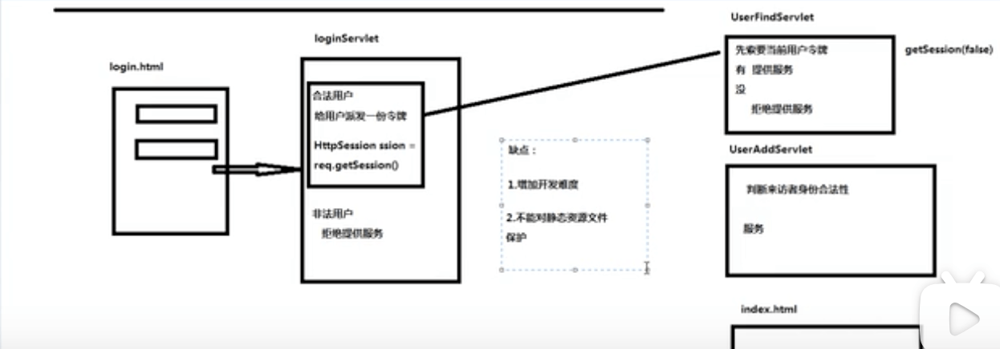
使用过滤器：


#### 1）新建OneFilter
```java
package com.c1221;

import javax.servlet.*;
import javax.servlet.http.HttpServletRequest;
import javax.servlet.http.HttpServletResponse;
import javax.servlet.http.HttpSession;
import java.io.IOException;

public class OneFilter implements Filter {
    public void init(FilterConfig config) throws ServletException {
    }

    public void destroy() {
    }

    @Override
    public void doFilter(ServletRequest request, ServletResponse response, FilterChain chain) throws ServletException, IOException {
        HttpServletRequest request2 = (HttpServletRequest)request;
        HttpServletResponse response2 = (HttpServletResponse)response;
        // 拦截后，通过请求对象向Tomcat索要当前用户的HttpSession
        HttpSession session = request2.getSession(false);
        // 判断来访用户身份合法性
        if (session == null) {
            request2.getRequestDispatcher("/login_error.html").forward(request, response);
            return;
        }
        // 放行
        chain.doFilter(request, response);
    }
}
```
修改web.xml
```xml
<filter>
    <filter-name>OneFilter</filter-name>
    <filter-class>com.c1221.OneFilter</filter-class>
</filter>
<filter-mapping>
    <filter-name>OneFilter</filter-name>
    <url-pattern>/*</url-pattern>
</filter-mapping>
```
### 互联网通信流程图
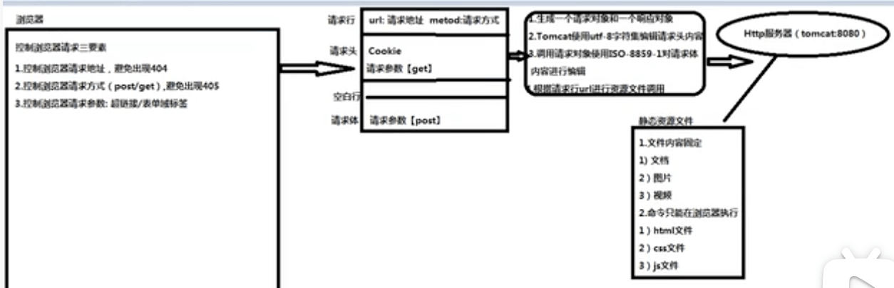
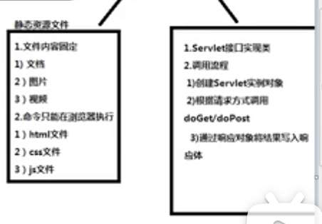
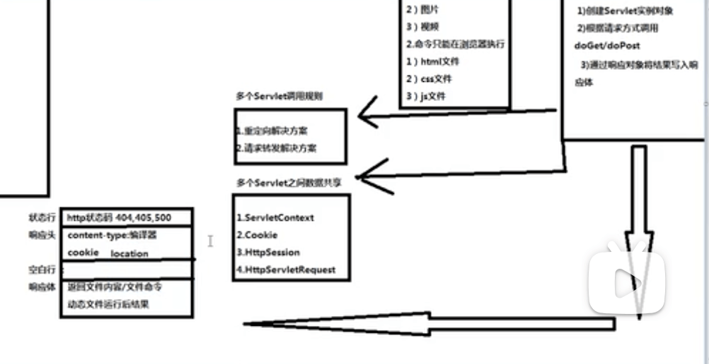

### 解决拦截所有后，无法登录问题
修改OneServlet
```java
package com.c1221;

import javax.servlet.*;
import javax.servlet.http.HttpServletRequest;
import javax.servlet.http.HttpServletResponse;
import javax.servlet.http.HttpSession;
import java.io.IOException;

public class OneFilter implements Filter {
    public void init(FilterConfig config) throws ServletException {
    }

    public void destroy() {
    }

    @Override
    public void doFilter(ServletRequest request, ServletResponse response, FilterChain chain) throws ServletException, IOException {
        HttpServletRequest request2 = (HttpServletRequest)request;
        HttpServletResponse response2 = (HttpServletResponse)response;
        HttpSession session = null;
        // 调用请求对象读取请求包中请求行URI，了解用户访问的资源文件是谁
        String uri = request2.getRequestURI();//【/网站名/资源文件名】/examsystem/login.html or /examsystem/login
        // 如果本次请求资源文件与登录相关【login.html or LoginServlet】此时应该无条件放行
        if (uri.indexOf("login") != -1 || "/examsystem/".equals(uri)) {
            chain.doFilter(request, response);
            return;
        }
        // 如果本次请求访问的是其他资源文件，需要得到用户在服务器HttpSession
        session = request2.getSession(false);
        if (session != null) {// 判断来访用户身份合法性
            chain.doFilter(request, response);// 放行
            return;
        }
        // 做拒绝请求
        request2.getRequestDispatcher("/login_error.html").forward(request, response);
    }
}

```