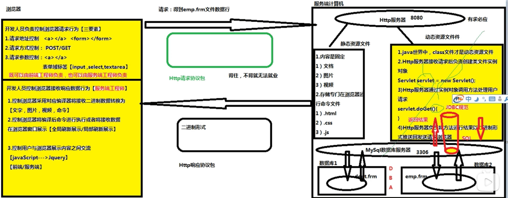

# Servlet规范
---

1. Servlet规范来自于JAVAEE规范中的一种。
2. 作用：
	* 在Servlet规范中，指定【动态资源文件】开发步骤。  
	* 在Servlet规范中，指定Http服务器调用动态资源文件规则。  
	* 在Servlet规范中，指定Http服务器管理动态资源文件实例对象规则。

  

### Servlet接口实现类

1. Servlet接口来自于Servlet-api.jar，存放在Http服务器，提供jar包。
2. Tomcat服务器下lib文件夹下有一个servlet-api.jar存放Servlet接口（javax.servlet.Servlet接口)。
3. Servlet规范中任务，Http服务器能调用的【动态资源文件】必须是一个Servlet接口实现类。
	例子：
	```java
	class Student {
		// 不是动态资源文件，Tomcat无权调用
	}
	class Teacher implements Servlet {
		// 合法动态资源文件，Tomcat有权利调用
		Servlet obj = new Teacher();
		obj.doGet();
	}
	```

### Servlet接口实现类开发步骤

#### 第一步：创建一个Java类继承于HttpServlet父类，使之成为一个Servlet接口实现类。

```java
 public class OneServlet extends HttpServlet {

 } 
```
* 子类-->父类-->A接口，此时，子类也是A接口实现类。
* 抽象类作用：降低接口实现类对接口实现过程难度，将接口中不需要使用抽象方法教给抽象类进行完成，这样接口实现类只需要对接口需要方法进行重写。
* Servlet接口：
	* init
	* getServletConfig
	* getServletInfo
	* destory 
		- 四个方法对于Servlet接口实现类没用
	* service - 有用

Tomcat根据Servlet规范调用Servlet接口实现类规则：

1. Tomcat有权利创建Servlet接口实现类实例对象。
	```java
	Servlet oneServlet = new OneServlet();
	```
2. Tomcat根据实例对象调用service方法处理当前请求。
	```java
	oneServlet.service();
	```
3. oneServlet-->(abstract)HttpServlet-->(abstract)GenericServlet-->Servlet

#### 第二步：重写HttpServlet父类两个方法。doGet或doPost
  
1. 浏览器get---->oneServlet.doGet()
2. 浏览器post---->oneServlet.doPost()

通过父类决定在何种情况下调用子类中的方法 --- 设计模式 --- 模版设计模式

```java
HttpServlet: service() {
	if (请求方式 == GET) {
		this.doGet
	} else if (请求方式 == POST) {
		this.doPost
	}
}
```

#### 第三步：将Servlet接口实现类信息【注册】到Tomcat服务器

【网站】---->【web】---->【WEB-INF】----> web.xml

```
<!-- 将Servlet接口实现类类路径地址交给Tomcat -->
<servlet>
	<servelt-name>mm</servlet-name><!-- 声明一个变量存储servlet接口实现类类路径 -->
	<servlet-class>com.xxxx.controller.OneServlet</servlet-class><!-- 声明servlet接口实现类 -->
</servlet>
```
Tomcat String mm = "com.xxxx.controller.OneServlet"

为了降低用户访问Servlet接口实现类的难度，需要设置简短请求别名
```
<servlet-mapping>
	<servlet-name>mm</servlet-name>
	<url-pattern>/one</url-pattern><!-- 设置简短请求别名，别名在书写时必须以“/”为开头 -->
</servlet-mapping>
```
如果现在浏览器向Tomcat所要OneServlet时，地址：http://localhost:8080/myWeb/one