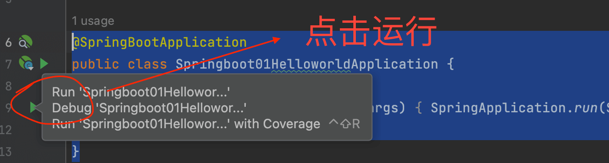

# SpringBoot入门
---

* 23.12.25 2:30更新

## 官方地址

https://docs.spring.io/spring-boot/docs/current/reference/html/getting-started.html#getting-started.introducing-spring-boot

## SpringBoot2系统要求

* Java 8 & 兼容java14 .
* Maven 3.3+
* idea 2019.1.2

### 命令

* 监测java版本

```
java -version
```
```
java version "1.8.0_361"
Java(TM) SE Runtime Environment (build 1.8.0_361-b09)
Java HotSpot(TM) 64-Bit Server VM (build 25.361-b09, mixed mode)
```

* 查看maven版本

```
mvn -v
```
```
Apache Maven 3.9.3 (21122926829f1ead511c958d89bd2f672198ae9f)
Maven home: /Users/chenchangqing/Documents/apps/apache-maven-3.9.3
Java version: 1.8.0_361, vendor: Oracle Corporation, runtime: /Library/Java/JavaVirtualMachines/jdk1.8.0_361.jdk/Contents/Home/jre
Default locale: zh_CN, platform encoding: UTF-8
OS name: "mac os x", version: "11.7.10", arch: "x86_64", family: "mac"
```

### 修改setting.xml

1. 打开`Maven home`/conf/settings.xml
2. 替换配置文件：

```xml
  <mirrors>
      <mirror>
        <id>nexus-aliyun</id>
        <mirrorOf>central</mirrorOf>
        <name>Nexus aliyun</name>
        <url>http://maven.aliyun.com/nexus/content/groups/public</url>
      </mirror>
  </mirrors>
 
  <profiles>
         <profile>
              <id>jdk-1.8</id>
              <activation>
                <activeByDefault>true</activeByDefault>
                <jdk>1.8</jdk>
              </activation>
              <properties>
                <maven.compiler.source>1.8</maven.compiler.source>
                <maven.compiler.target>1.8</maven.compiler.target>
                <maven.compiler.compilerVersion>1.8</maven.compiler.compilerVersion>
              </properties>
         </profile>
  </profiles>
```

## HelloWorld

### 打开官方文档

https://docs.spring.io/spring-boot/docs/current/reference/html/getting-started.html#getting-started.first-application

### 创建maven的springboot项目

http://1221.site/pages/idea/createp.html#%E4%BD%BF%E7%94%A8maven%E5%88%9B%E5%BB%BAspringboot%E9%A1%B9%E7%9B%AE

#### 1）点击`New Project`


#### 2）项目设置


#### 3）Create


#### 4）pom.xml


### 默认会有一个Main入口

```java
@SpringBootApplication
public class Springboot01HelloworldApplication {

    public static void main(String[] args) {
        SpringApplication.run(Springboot01HelloworldApplication.class, args);
    }

}
```

### 创建类`HelloController`

右键包名，`New->Java Class`，输入`HelloController`：
```java
@RestController
public class HelloController {

    @RequestMapping("/hello")
    public String handle01(){
        return "Hello, Spring Boot!";
    }
}
```

### 运行项目

在`Springboot01HelloworldApplication`运行main方法：



#### 发现错误


>springboot3.2.1不支持jdk1.8，需要更新到java17

## 配置文件

`application.properties`

https://docs.spring.io/spring-boot/docs/current/reference/html/application-properties.html#appendix.application-properties

* 例如：Server Properties -> server.port

## 简化部署

springboot支持通过.jar文件直接启动服务。官方文档：

https://docs.spring.io/spring-boot/docs/current/reference/html/getting-started.html#getting-started.first-application.executable-jar

### 配置pom.xml
```xml
<build>
    <plugins>
        <plugin>
            <groupId>org.springframework.boot</groupId>
            <artifactId>spring-boot-maven-plugin</artifactId>
        </plugin>
    </plugins>
</build>
```

### 打包


### 找到jar

target->xxx-1.0-SNAPSHOT.jar

### 运行项目
cd到jar目录，执行：
```java
java -jar xxx-1.0-SNAPSHOT.jar
```

>xxx-1.0-SNAPSHOT.jar/BOOT-INF/lib：这里目录下有`tomcat-embed-core-9.0.38.jar`、`tomcat-embed-websocket-9.0.38`，带有tomcat环境。

## 视频地址

* start：https://www.bilibili.com/video/BV19K4y1L7MT?p=5
* start：https://www.bilibili.com/video/BV19K4y1L7MT?p=6