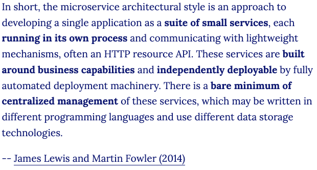
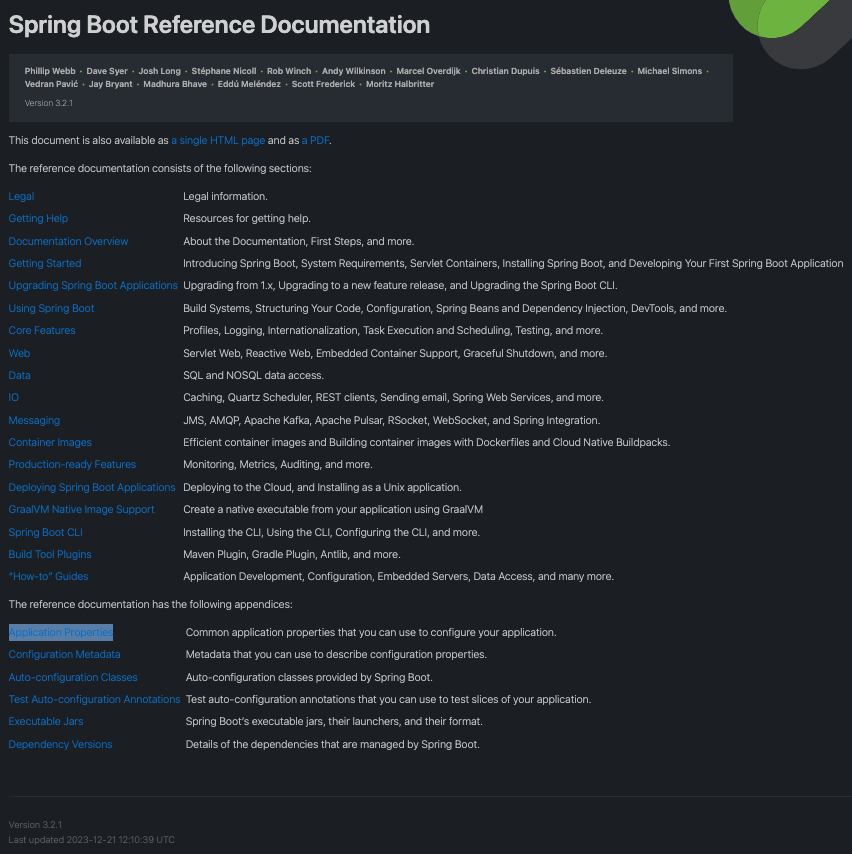

# Spring与SpringBoot
---
* 23.12.23 20:55开始
* 23.12.23 23:17更新
* 23.12.24 22:50更新

## Spring的能力

https://spring.io/

* Microservices（微服务）：一个项目功能模块很多，将每一个功能模块拆解成一个微小的服务，独立运行。
* Reactive（响应式编程）：构建异步数据流，占用少量的线程，少量cpu及内存资源，构建高吞吐量的应用。
* Cloud（分布式云开发）
* Web apps（Web应用）：SpringMVC
* Serverless（无服务开发）：函数式服务，无需购买服务器。
* Event Driver（事件驱动）：实时数据流。
* Batch：批处理。

## Spring生态圈

https://spring.io/projects/spring-boot/

* Spring Framework（Web开发）
* Spring Data（数据访问）
* Spring Security（安全控制）
* Spring Cloud(分布式)
* Spring Session(分布式Session的存储问题)
* Spring AMQP（消息队列）
* Spring Mobile（移动开发）
* Spring Batch（批处理）
* Spring Android
* Spring Shell
* ......

## Spring5升级

* 响应式编程：https://spring.io/reactive/

* 内部源码设计：基于Java8的一些新特性，如：接口默认实现，重新设计源码架构。

>接口默认实现：不在需要使用适配器模式。

## 什么是SpringBoot

* SpringBoot是整合Spring技术栈的一站式框架。
* SpringBoot是简化Spring技术栈的快速开发脚手架。

## SpringBoot要求

https://docs.spring.io/spring-boot/docs/current/reference/html/getting-started.html#getting-started-system-requirements

* Java8及以上。
* Maven3.3及以上。

## 为什么用SpringBoot

Spring Boot makes it easy to create stand-alone, production-grade Spring based Applications that you can "just run".
>能快速创建出生产级别的Spring应用

## SpringBoot优点

* Create stand-alone Spring applications
	* 创建独立Spring应用
* Embed Tomcat, Jetty or Undertow directly (no need to deploy WAR files)
	* 内嵌web服务器
* Provide opinionated 'starter' dependencies to simplify your build configuration
	* 自动starter依赖，简化构建配置
* Automatically configure Spring and 3rd party libraries whenever possible
	* 自动配置Spring以及第三方功能
* Provide production-ready features such as metrics, health checks, and externalized configuration
	* 提供生产级别的监控、健康检查及外部化配置
* Absolutely no code generation and no requirement for XML configuration
	* 无代码生成、无需编写XML

## SpringBoot缺点

* 人称版本帝，迭代快，需要时刻关注变化
* 封装太深，内部原理复杂，不容易精通

## 微服务

https://martinfowler.com/microservices/

* 微服务是一种架构风格
* 一个应用拆分为一组小型服务
* 每个服务运行在自己的进程内，也就是可独立部署和升级
* 服务之间使用轻量级HTTP交互
* 服务围绕业务功能拆分
* 可以由全自动部署机制独立部署
* 去中心化，服务自治。服务可以使用不同的语言、不同的存储技术

## 分布式

### 分布式的困难
* 远程调用：Http方式
* 服务发现：找到服务可用的机器
* 负载均衡
* 服务容错：A服务调用B服务失败，如何处理。
* 配置管理：建立配置中心，相同服务去配置中心更新。
* 服务监控：对服务健康状况的监测。
* 链路追踪：服务A调B服务，B服务调用C服务，C服务出现问题，如何排查。
* 日志管理
* 任务调度：服务A有个定时任务，所有机器怎么同步，并发还是串行。
* ......

### 分布式的解决

SpringBoot + SpringCloud

## 云原生

原生应用如何上云。 Cloud Native

### 上云的困难

* 服务自愈：服务A的一台机器挂了，自动拉起一台新机器，部署服务A。
* 弹性伸缩：流量高峰自动增加服务部署，流量低峰家少服务器部署。
* 服务隔离：一台机器同时部署了服务A、B、C，A服务挂了，不影响其他服务。
* 自动化部署
* 灰度发布：更新服务只更新其中一台机器，其他机器的服务依然保持旧版本，经过时间验证，更新的服务没有问题，在全部更新。
* 流量治理：机器A性能不好，让A负载低一些。
* ......

### 上云的解决

* 初识云原生
* 深入Docker-容器化技术
* 掌握星际容器编排Kubernetes
* DevOps-实战企业CI/CD，构建企业云平台
* 拥抱新一代架构Service Mesh与Serverless
* 云上架构与场景方案实战

## 如何学习SpringBoot

1. 进入官网：https://spring.io/projects/spring-boot/
2. 点击`LEARN`，`CURRENT`当前版本，`xxx-SNAPSHOT`快照版本，`RELEASE`已发布。
3. 点击`Reference Doc.`

* Documentation Overview（文档）
	* https://docs.spring.io/spring-boot/docs/current/reference/html/documentation.html#documentation
	* 可以下载PDF
* Getting Started（入门）
* Using Spring Boot（使用Spring Boot）
* Core Features（核心特性）

查看版本更新日志：https://github.com/spring-projects/spring-boot/wiki#release-notes

## 学习资料

* 文档地址：https://www.yuque.com/atguigu/springboot
* 源码地址：https://gitee.com/leifengyang/springboot2

## 视频地址

* start：https://www.bilibili.com/video/BV19K4y1L7MT?p=1
* end：https://www.bilibili.com/video/BV19K4y1L7MT?p=4