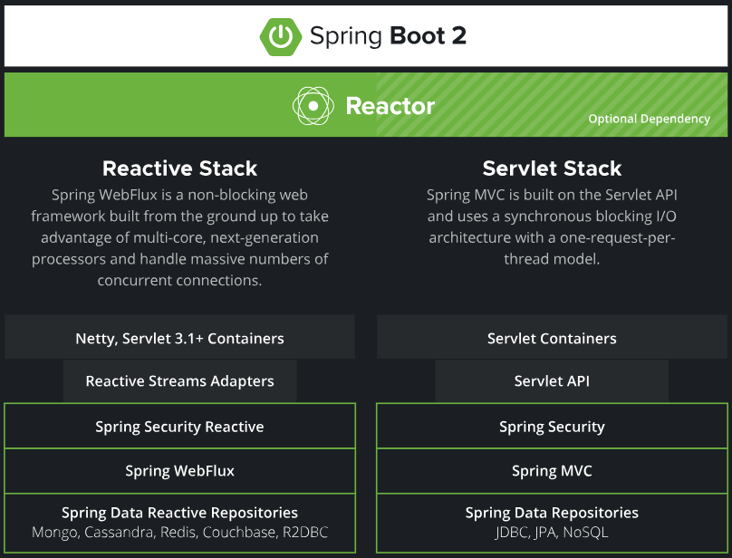

# Spring与SpringBoot
---
* 23.12.23 20:55开始
* 23.12.23 23:17更新

## Spring的能力

https://spring.io/

* Microservices（微服务）：一个项目功能模块很多，将每一个功能模块拆解成一个微小的服务，独立运行。
* Reactive（响应式编程）：构建异步数据流，占用少量的线程，少量cpu及内存资源，构建高吞吐量的应用。
* Cloud（分布式云开发）
* Web apps（Web应用）：SpringMVC
* Serverless（无服务开发）：函数式服务，无需购买服务器。
* Event Driver（事件驱动）：实时数据流。
* Batch：批处理。

## Spring生态圈

https://spring.io/projects/spring-boot/

* Spring Framework（Web开发）
* Spring Data（数据访问）
* Spring Security（安全控制）
* Spring Cloud(分布式)
* Spring Session(分布式Session的存储问题)
* Spring AMQP（消息队列）
* Spring Mobile（移动开发）
* Spring Batch（批处理）
* Spring Android
* Spring Shell
* ......

## Spring5升级

* 响应式编程：https://spring.io/reactive/

* 内部源码设计：基于Java8的一些新特性，如：接口默认实现，重新设计源码架构。

>接口默认实现：不在需要使用适配器模式。

## 什么是SpringBoot

* SpringBoot是整合Spring技术栈的一站式框架。
* SpringBoot是简化Spring技术栈的快速开发脚手架。

## SpringBoot要求

https://docs.spring.io/spring-boot/docs/current/reference/html/getting-started.html#getting-started-system-requirements

* Java8及以上。
* Maven3.3及以上。

## 为什么用SpringBoot

Spring Boot makes it easy to create stand-alone, production-grade Spring based Applications that you can "just run".
>能快速创建出生产级别的Spring应用

## SpringBoot优点

* Create stand-alone Spring applications
	* 创建独立Spring应用
* Embed Tomcat, Jetty or Undertow directly (no need to deploy WAR files)
	* 内嵌web服务器
* Provide opinionated 'starter' dependencies to simplify your build configuration
	* 自动starter依赖，简化构建配置
* Automatically configure Spring and 3rd party libraries whenever possible
	* 自动配置Spring以及第三方功能
* Provide production-ready features such as metrics, health checks, and externalized configuration
	* 提供生产级别的监控、健康检查及外部化配置
* Absolutely no code generation and no requirement for XML configuration
	* 无代码生成、无需编写XML

## SpringBoot缺点

* 人称版本帝，迭代快，需要时刻关注变化
* 封装太深，内部原理复杂，不容易精通

## 学习资料

* 文档地址：https://www.yuque.com/atguigu/springboot
* 源码地址：https://gitee.com/leifengyang/springboot2

## 视频地址

* start：https://www.bilibili.com/video/BV19K4y1L7MT?p=1
* end：https://www.bilibili.com/video/BV19K4y1L7MT?p=2