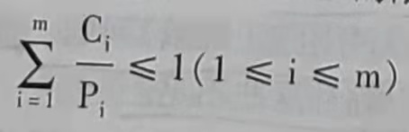

## 第三节 实时系统中的调度

在第一章介绍了实时系统的特点，实时系统对处理器操作或者数据流动有着严格的时间限制，实时系统的进程调度对保证时间的要求具有重要作用。

### 一、实现实时调度的基本条件

为了满足实时系统对截止时间的要求，实现实时调度应具备下列几个条件。

#### 1. 提供必要的调度信息

为了实现实时调度，系统可能需要为调度程序提供下列一些信息。

1) 就绪时间。是一个实时任务成为就绪态的起始时间。

2) 开始截止时间和完成截止时间。

3) 处理时间。指一个实时任务从开始执行直至完成所需要的时间。

4) 资源要求。关于任务执行所需要的资源信息。

5) 优先级。根据实时任务紧迫程度的不同，可以给实时任务赋予不同的优先权，使高优先权任务能优先获得系统资源，尽快得到执行。系统中实时进程的优先权不能动态降低。

#### 2. 系统处理能力强

在实时系统中，通常有多个实时进程（通常也称其为实时任务），若处理机的处理能力不够强，处理速度不够快，从而使某些实时进程不能得到及时处理，可能发生难以预料的
后果。

##### (1) 单处理机情况下必须满足的限制条件

假定系统中有m个周期性的硬实时进程，它们的处理时间可表示为Ci，周期时间表示为Pi,则在单处理机情况下，必须满足如式(3-3)所示的限制条件。

例如，有6个实时进程，它们的周期时间都是50ms，也就是说每个进程都必须每隔50ms完成一次运行。处理机的处理能力为处理个进程的时间具10ms，所以该系统是无法保证所有的6个实时进程都能在截止时间内完成的，这种情况称为系统不可调度。要保证该系统是可调度的，可以提高处理机的处理能方以缩短每个实时进程的处理时间，也可以增加处理机数量。

##### (2) n个处理机情况下必须满足的限制条件

采用多处理机系统可以提高实时系统的处理能力，若系统的处理机个数为n，处理能力的限制条件改变如式(3-4)所示。

操作系统在提高处理能力方面是可以有所作为的，比如，设计适合特定实时应用的进程调度算法，规定实时进程具有最高的优先权，以及使调度程序和进程切换的延迟时间尽可能短。

#### 3. 采用抢占式调度机制

在实时系统中广泛采用抢占式调度。当一个优先权更高的进程到达时，允许将当前进程暂时挂起，而令高优先权进程立即投人运行。这样可以满足实时进程对截止时间的要求。

为了使调度过程更简单，调度开销更小，对于支持需要服务时间很短的小实时进程的系统，也可以采用非抢占式调度。

抢占式调度算法根据抢占CPU的时机不同，可以分为基于时钟中断的抢占和立即抢占。

##### (1) 基于时钟中断的抢占式优先权调度算法

在高优先权的实时进程到达后，虽然该进程的优先权大于正在执行的进程，系统也并不立即抢占当前进程的处理机，而是等到最近一次时钟中断到来时，系统才剥夺当前进程的CPU，将CPU分配给新到来的优先权更高的实时进程。

##### (2) 立即抢占的优先权调度算法

在这种调度策略中，一旦接收到触发实时进程运行的信号，这通常是一个外部中断信号，系统立即剥夺当前进程的CPU，把它分配给请求中断的新的实时进程。这种算法能获得比基于时钟中断的抢占式优先算法更快的响应速度。

#### 4. 具有快速切换机制

为保证对截止时间要求较高的实时进程能及时运行，在实时系统中还应具有快速切换机制，以保证进程的快速切换。该机制应具有以下两个方面的能力。

##### (1) 对外部中断的快速响应能力

为使在紧迫的外部事件请求中断时系统能及时响应，要求系统具有快速的硬件中断机构，还应使禁止中断的时间间隔尽可能短。

##### (2) 快速的进程切换能力

在完成进程调度后进行进程切换。为了提高进程切换时的速度，应使系统中的每个运行功能单位适当地小，以减少进程切换的时间开销。

### 二、常用的几种实时调度算法

#### 1. 最早截止时间优先EDF(Earliest Deadline First,EDF)算法

该算法是根据进程的开始截止时间确定进程的优先级。截止时间越早，进程的优先级越高，越优先获得处理机。该算法要求在系统中保持一个实时进程的就绪队列，该队列按各进程截止时间的早晚排序，具有最早截止时间的进程排在队列的最前面。调度程序在选择进程时，总是选择就绪队列中的第一个进程，为之分配处理机，使之投入运行。最早截止时间优先的算法既可用于抢占式调度，也可用于非抢占式调度。

#### 2. 最低松弛度优先LLF(Least Laxity First,LLF)算法

松弛度用来表示一个实时进程的紧迫程度，如果一个进程的完成截止时间为T,当前时间为Tc，处理完该任务还需要的时间为Ts，则松驰度L的计算式表示为

L=T-Tc-Ts

在使用最低松弛度优先算法时，调度程序在调度时机到来时，每次选择松弛度L最小的进程，把CPU分配给该进程。该算法在实现时，把进程按松弛度排序，让松驰度最小的进程处于就绪队列队首，这样调度程序执行时只需选择就绪队列队首的进程执行即可。

## 第四节 进程切换

当进程调度程序选择到一个新的进程后，要进行进程切换，用新选择的进程替换原来的执行进程，也就是把CPU的控制权交给由调度程序所选择的进程。

进程切换使当前正在执行的进程成为被替换进程，出让其所使用的CPU，以运行被进程调度程序选中的新进程。进程切换通常包括以下几个步骤。

1) 保存包括程序计数器和其他寄存器在内的CPU上下文环境。

2) 更新被替换进程的进程控制块。

3) 修改进程状态，把执行态改为就绪态或者阻塞态。

4) 将被替换进程的进程控制块移到就绪队列或阻塞队列。

5) 执行通过进程调度程序选择的新进程，并更新该进程的进程控制块。

6) 更新内存管理的数据结构。

7) 恢复被调度程序选中的进程的硬件上下文。

## 第五节 多处理器调度

随着对计算机性能的要求，尤其是对计算速度、处理能力的要求越来越高，多处理器系统得到更加广泛的应用，各类大、中、小型主机系统，网络服务器，以及高端的工作站都采用多处理器结构，甚至个人微机都使用双CPU。操作系统与计算机体系结构有着天然的联系，面对多处理器系统，必须解决多处理器的进程调度问题。

### 一、多处理器系统(MultiProcessor Systems,MPS)的类型

对处理器系统有多种不同的分类方式，根据处理器的耦合程度，可以把多处理器系统分为紧密耦合多处理器系统和松弛耦合多处理器系统；根据处理器结构是否相同，可以把多处理器系统分为对称多处理器系统和非对称多处理器系统。

#### 1. 紧密耦合的多处理器系统和松弛耦合的多处理器系统

##### (1) 紧密耦合的多处理器系统

紧密耦合的多处理器系统通常通过高速总线或高速交叉开关实现多个处理器之间的互连，它们共享主存储器系统和I/O设备，并要求将主存储器划分为若干个独立访问的存储器模块，以便多个处理器能同时对主存进行访问。系统中的所有资源和进程都由操作系统实施统一的控制和管理。

##### (2) 松弛耦合的多处理器系统

松弛耦合的多处理器系统通常通过通道或通信线路来实现多台计算机之间的互连。每台计算机都有自己的存储器和I/O设备，并配置了操作系统来管理本地资源和在本地运行的进程。因此，每一台计算机都能独立工作，必要时可通过通信线路与其他计算机交换信息，以及协调它们之间的工作。

#### 2. 对称多处理器系统和非对称多处理器系统

对称多处理器系统属于同构的多处理器系统，其中所包含的各处理单元，在功能和结构上都是相同的，当前的绝大多数多处理器系统都是对称多处理器系统

非对称多处理器系统中有多种类型的处理单元，它们的功能和结构各不相同。其中只有一个主处理器，有多个从处理器。

### 二、多处理器系统中的进程分配方式

#### 1. 对称多处理器系统中的进程分配方式

在对称多处理器系统中，进程到处理器的分配可以采用以下两种方式。

##### (1) 静态分配

在采用这种分配方式时，操作系统为每个处理器建立一个专门的就绪队列，该就绪队列的每个进程都只能在与就绪队列对应的处理器上运行。一个进程无论经过多少次调度，操作系统都把同一个处理器分配给该进程。静态分配方式的优点是进程调度的开销小，缺点是不
能动态地平衡各处理器的负载，使系统存在各处理器忙闲不均的情况。

##### (2) 动态分配

动态分配的基本特征就是每个进程经过多次调度，每次获得的不一定是同一个处理器。为实现动态分配，可以在系统中设置一个公共的就绪队列，系统中的所有就绪进程都被放在
该队列中。可将进程分配到任何一个处理器上，这样，对一个进程的整个运行过程而言，在每次被调度执行时，都是随机地被分配到当时处于空闲状态的某一处理器上去执行。例如，某进程一开始被分配到处理器A上执行，后来因为阻塞或时间片用完而暂停执行，当再次回到公共就绪队列中，重新被调度时，该进程可能被分配到B处理器或C处理器上运行。动态分配的优点是可以在每次调度时考虑处理器的负载平衡问题，总是把进程分配给当前空
闲的处理器。此外，对于共享存储器的紧密耦合系统，所有的处理器可以共享保存在内存中
的进程信息。

#### 2. 非对称多处理器系统(MPS)中的进程分配方式

对于非对称多处理器系统，大多采用主一从式操作系统，即操作系统的核心部分驻留在一台主机上，而从机上只运行用户程序，只有主机执行调度程序，所有丛机的进程都是由主机分配的。每当从机空闲时，便向主机发送一个请求分配进程的信号，然后便等待主机为它分配进程。在主机中保持有一个就绪队列，只要就绪队列不为空，主机便从其队首摘下一个进程分配给请求分配进程的从机。从机接收到分配的进程后便运行该进程，该进程结束后从机又向主机发出请求。

在非对称多处理系统中，主、从式的进程分配方式的主要优点是系统处理比较简单。这是因为所有的进程分配都由一台主机独自处理，使进程间的同步问题得以简化，并且进程调度程序也很易于从单处理器的进程调度程序演化而来。但由一台主机控制一切，也存在着不可靠性，主机一旦出现故障，会导致整个系统瘫痪，而且也容易因主机太忙而形成系统瓶
颈。克服这些缺点的有效方法是利用多台处理器来管理整个系统。这样，当其中一台处理器出现故障时，可由其他处理器来接替其完成任务，不影响系统正常运行。而且用多合处理器还具有更强的执行管理任务的能力，也不容易形成系统瓶颈。

### 三、进程（线程）调度方式

多处理器的调度比单处理器调度机制要复杂，下面简要介绍几种比较典型的多处理器调度方式。

#### 1. 自调度

自调度算法是当前多处理器系统中最常用的调度方式之一，也是最简单的一种调度方式。采用自调度的系统中设置有一个公共的就绪队列，任何一个空闲的处理器都可以自行从该就绪队列中选取一个进程或者一个线程运行。在自调度方式中，可采用在单处理器环境下所用的调度算法，如先来先服务(First-Come,First-Service,FCFS)调度算法、最高优先权调度算法等。在多处理器环境下，FCFS是一种较好的自调度算法，算法简单，开销小。

##### (1) 自调度算法的优点

1) 易移植。在采用自调度方式的系统中，公共就绪队列可按照单处理器系统中所采用的各种组织方式加以组织，其调度算法也可沿用单处理器系统所用的算法，因此，很容易将单处理器环境下的调度机制移植到多处理器系统中。

2) 有利于提高CPU的利用率。只要系统中有任务，或者说只要公共就绪队列不为空，就不会出现处理器空闲的情况，也不会发生处理器忙闲不均的现象，因而有利于提高处理器
的利用率。

##### (2) 自调度方式的缺点

1) 瓶颈问题。采用自调度，在整个系统中只有一个必须互斥访问的公共就绪队列。在系统中有多个处理器的情况下，对公共就绪队列的访问很容易形成瓶颈。当系统中处理器的数目在数十个，甚至数百个时，采用自调度算法瓶颈问题会非常严重。

2) 低效性。采用自调度算法，CPU上的高速缓存的命中率较低。当进程阻塞后再重新就绪时，它只能进入唯一的公共就绪队列，经过进程调度后，不一定能在阻塞前的处理器上运行。如果在每台处理器上都配有高速缓存，则这时在其中保留的该进程的数据已经失效，而在该进程新获得的处理器上又需要重新建立这些数据的备份。由于一个进程的整个生命期中，可能要多次更换处理器，因而使高速缓存的命中率很低。

3) 线程切换频繁。在多线程系统中，通常一个应用中的多个线程是相互合作的关系。而采用自调度时，相互合作的线程很难同时获得处理器运行，这将会使某些线程因其合作线程未获得处理器运行而阻塞，进而被切换下来。

#### 2. 成组调度

成组调度方式是由系统将一组相互合作的进程或线程同时分配到一组处理器上运行，进
程或线程与处理器一一对应。

##### (1) 成组调度的优点

1) 减少线程切换，改善系统性能。如果一组相互合作的线程或进程能并行执行，则能
有效减少进程（线程）阻塞情况的发生，从而减少线程的切换，使系统性能得到改善。

2) 减少调度开销。因为每次调度都可以解决一组线程的处理器分配问题，因而可以显
著减少调度频率，从而减少调度开销。

##### (2) 成组调度中的时间分配

在成组调度中可以采用两种方式为应用程序分配处理器时间：一是面向所有的应用程序平均分配处理器时间；二是面向所有的线程平均分配处理器时间。

#### 3. 专用处理器分配

1989年由Tucker提出了专用处理器分配方式。该方式是在一个应用程序执行期间，专门为该应用程序分配一组处理器，每个线程一个，这组处理器供该应用程序专用，直至应用
程序完成。这种方式会造成处理器资源的严重浪费。因为当一个处理器上的线程被阻塞时，处理器不能分配给别的线程使用，只能空等。例如，有一个线程为了与另一个线程同步而被
阻塞起来，则该线程所分配到的处理器就会空闲。

之所以可以将这种专用处理器调度方式用于并发程度高得多的处理器环境，是因为在具有数十个乃至上百个处理器的并行系统中，每个处理器的投资费用在整个系统中仅占很小的比重。对整个系统的性能和效率而言，单个处理器的使用效率并不像在单处理器系统中那么重要。其次，在一个应用程序的整个运行过程中，由于每个进程或线程专用一台处理器，因此可以完全避免进程或线程的切换，从而可以大大加速程序的完成。总的来说，专用处理器的优点一是加速了应用程序的运行速度，二是避免了进程切换。

