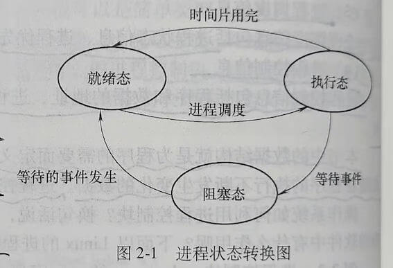

## 第一节 进程的描述

### 一、程序的并发执行

#### 1. 程序的顺序执行

早期无操作系统及单道批处理系统的计算机中，程序的执行方式都是经典的顺序执行。

##### 1）顺序性

处理机的操作，严格按照程序所规定的顺序执行，即只有前一个操作结束后，才能执行后继操作。

##### 2）封闭性

程序是在封闭的环境下运行的。即程序运行时独占全机资源，因而各资源的状态（除初始状态外）只有本程序才能改变。

##### 3）可再现性

只要程序执行时的环境和初始条件相同，当程序多次重复执行时，其执行结果相同。

#### 2. 程序的并发执行

程序并发执行是指在同一时间间隔内运行多个程序。一个程序执行结束之前，可以运行其他程序。

程序并发执行的确切含义是从宏观上，用户看到多个程序同时向前不间断地推进。而从微观上，任意时刻一个CPU上只有一个程序在执行。

##### 1）间断性

程序在并发执行时，由于它们共享资源，而资源数量又往往少于并发执行的程序数量，系统不能保证每个程序不受限制地占用资源。因而，每个程序在CPU上运行，都是时断时续的。

当请求某个资源的程序数量大于被请求的资源数量时，就必然有因申请不到资源而暂停执行的程序。

当其他程序释放资源后，该程序才可能继续执行。资源的有限使并发执行的程序呈现执行过程的间断性。

##### 2）失去封闭性

程序在并发执行时，由于它们共享资源或者合作完成同一项任务，系统的状态不再是有正在执行的某一个程序可以“看见”和改变。

##### 3）不可再现性

程序在并发执行时，由于失去了封闭性，也将导致其失去执行结果的可再现性。同一个程序在输入完全相同的情况下多次运行，可能出现不同的运行结果。

### 二、进程的概念

当操作系统支持程序并发执行时，并发执行的程序可能是同一个程序在不同数据集合上的执行，也可能是不同的程序在不同数据集合上的执行，它们共享系统资源。用程序已不能描述程序的并发执行，所以引入了进程的概念。

#### 1. 进程的定义

定义1：进程是允许并发执行的程序在某个数据集合上的运行过程。

定义2：进程是由正文段、用户数据段及进程控制块共同组成的执行环境。正文段存放被执行的机器指令，用户数据段存放进程在执行时直接进行操作的用户数据。进程控制块存放程序的运行环境，操作系统通过这些数据描述和管理进程。

程序装入内存后就可以运行了，根据指令计数器PC的值，不断将指令从内存取到CPU的指令寄存器中，经过译码后完成各种操作。这些指令控制的对象不外乎各种存储器（内存、外存和各种CPU寄存器），这些存储器中有待运行的指令和待处理的数据，指令只有得到CPU才能发挥作用。

可见，在计算机内部，程序的执行过程实际对应了一个执行环境的总和。这个执行环境包括程序中的各种指令和数据，还有一些额外数据，如寄存器的值、用来保存临时数据的堆栈、被打开文件的数量及输入/输出设备的状态等。这个执行环境的动态变化表征程序的运行，一个进程对应了一个这样的环境。

**进程代表了程序的执行过程**，是一个动态的实体，它随着程序中指令的执行而不断变化，在某个特定时刻的进程内容被称为进程映像。

#### 2. 进程的特征

##### 1）并发性

多个进程实体能在一段时间间隔内同时运行。

##### 2）动态性

进程是进程实体的执行过程。

##### 3）独立性

在没有引入线程概念的操作系统中，进程是独立运行和资源调度的基本单位。

##### 4）异步性

是指进程的执行时断时续，进程什么时候执行、什么时候暂停都无法预知，呈现一种随机的特征。

##### 5）结构特征

进程实体包括用户正文段，用户数据段和进程控制块。

#### 3. 进程与程序的比较

##### 1）进程与程序的区别

程序是静态的，进程是动态的。程序是存储在某种介质上的二进制代码，进程对应了程序执行的过程。

程序是永久的，进程是暂时存在的。

进程因程序的执行而被创建，因程序执行的结果而被撤回，有一个相对短暂的生命期。

##### 2）进程与程序的联系

进程是程序的一次执行，进程总是对应至少一个特定的程序，执行程序的代码。

一个程序可以对应多个进程。同一个进程可以在不同的数据集合上运行，因而构成若干个不同的进程。几个进程能并发地执行相同的程序代码，而同一个进程能顺序地执行几个程序。

##### 例题

请解释进程的概念，并说明进程和程序的区别和联系。

进程是允许并发执行的程序在某个数据集合的运行过程；是由正文段、用户数据段及进程控制块共同组成的执行环境。

###### 进程和程序的区别：

1. 程序是静态的，进程是动态。
2. 程序是永久的，进程是暂时存在的。

###### 进程和程序的联系：

1. 进程是程序的一次执行，执行程序的代码。
2. 一个程序可以对应多个进程。

### 三、进程控制块

进程实体存在的标志是操作系统管理进程所使用的<u>数据结构</u>--进程控制块。

#### 1. 什么是进程控制块

进程控制块是进程实体的一部分，是操作系统中最重要的数据结构。

操作系统在创建进程时，首先要为进程创建进程控制块，也就是生成一个进程控制块类型的变量，以存储所创建进程的描述信息。每个进程由唯一的进程控制块，进程控制块时操作系统感知进程存在的唯一标志。

#### 2. 进程控制块中的信息

一般操作系统中的进程控制块中通常包含一下信息：

##### 1）进程标识符信息

进程标识符用户唯一标识一个进程。

##### 2）处理机状态信息

1）通用寄存器。用户程序可以访问的寄存器，用于暂存信息。

2）指令计数器。其中存放了CPU要访问的下一条指令的地址。

3）程序状态字PSW。其中包含状态信息，如条件码、执行方式和中断屏蔽标志等。

4）用户栈指针。每个用户进程都有一个与之相关的系统栈，用于存放过程和系统调用参数及调用地址，栈指针指向该栈的栈顶。

##### 3）进程调度信息

进程调度信息包括进程状态信息、进程优先级和进程调度所需的其他信息。

##### 4）进程控制信息

进程控制信息包括程序和数据的地址、进程同步和通信机制、资源清单，以及链接指针。

本书中的数据结构就是为程序的需要而定义的简单类型或复杂类型的变量，变量用来存放随着程序的执行不断发生变化的数据。进程控制块就是复杂类型的变量。

### 四、进程的状态

进程控制块的状态字短描述了进程当前所处的状态。

#### 1. 进程的3中基本状态

##### 1）就绪态

就绪态时进程一旦获得CPU就可以投入运行的状态。在多任务系统中，可以有多个处于就绪态的进程，这些进程被组成成一个或多个就绪进程队列。

##### 2）执行态

执行态是进程获得CPU正在运行的状态。

##### 3）阻塞态

阻塞态是进程由于等待资源或某个事件的发生而暂停执行的状态，系统不会为阻塞态的进程分配CPU。阻塞态进程在获得其等待的资源或其等待的事件发生之后，转变为就绪状态。

#### 2. 进程状态的转换

  

新创建进程的状态一般被设置为就绪态，当操作系统为处于就绪态的进程分配CPU时，进程开始在CPU上运行，进程的状态由就绪态变为执行态。

在多任务系统中，CPU被多个进程共享的资源，操作系统通常会为普通进程规定一个在CPU上连续运行的时间长度，称这个时间长度为时间片。当进程在CPU上运行的时间片长度递减为0时，系统把CPU分配给其他就绪态进程。如果进程在CPU上运行的时间递减为0，系统将该进程的状态由执行态变为就绪态。

如果执行态进程在运行过程中因为申请某种资源或等待某时间的发生而不宜继续占用CPU，系统将把该进程的状态改变为阻塞态，并暂停该进程的执行，将CPU分配给就绪态进程。阻塞态进程在其等待的时间发生或申请到所需资源后，系统将其状态转变为就绪态。

### 五、进程的组织

在操作系统中任意时刻都可能存在很多进程，每个进程对应一个进程控制块，操作系统组织和管理进程是通过管理和组织进程控制块来实现的。

实际上对进程的组织是通过定义数据结构来实现的。

#### 1. 链接方式

把系统中具有相同状态的进程的进程控制块（PCB）用其中的链接字链接成一个队列。

#### 2. 索引方式

系统根据所有进程的状态，建立几张索引表，索引表的每一个表项指向一个PCB的物理块。

#### 3. 进程队列

当系统中有很多进程时，可以把进程控制块用队列组织起来，形成进程队列。把具有相同状态的进程放在同一个队列中，具有不同状态的进程就形成了不同的进程队列。

处于就绪态的进程构成的进程队列称为就绪队列，处于阻塞态的进程构成的进程队列称为阻塞队列。