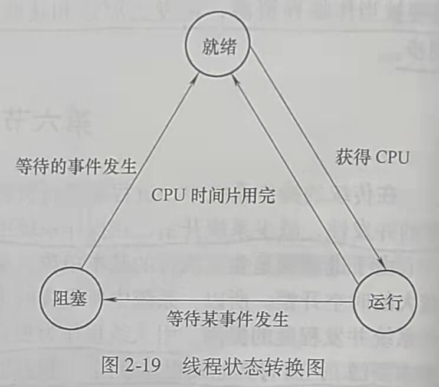
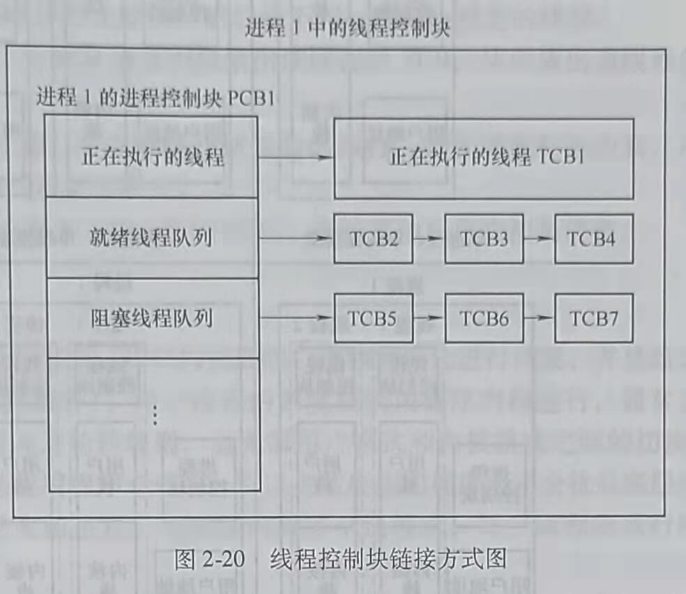
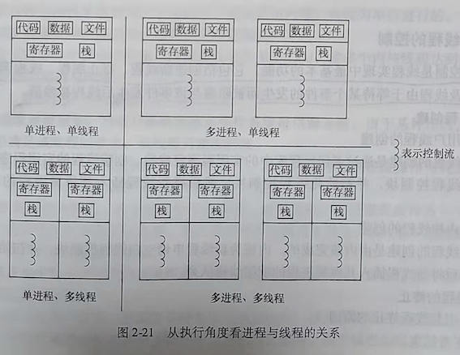
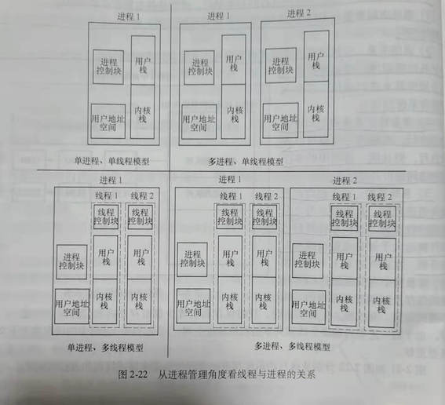

## 第六节 线程

在传统的操作系统中，进程是进行资源分配和独立执行的基本单位。为了进一步提高程序的并发性，减少系统开销，在操作系统中引人了线程的概念。

由于进程既是独立执行的基本单位，又是资源拥有者，在进程创建、撤销和切换时需要较大的时空开销。所以，系统中所设置的进程数和进程切换的频率都受到了限制，影响了操作系统并发程度的提高。引入线程作为独立调度和分派的单位，不独立拥有资源（仅有少量基本资源)，而与其他线程共享同一进程的资源，减小了系统的时空开销。

线程的实质是把进程的任务划分成更小、具有独立功能的单位，以线程的形式来并发执行，以提高程序并发执行的程度。

### 一、线程的描述

#### 1. 线程的概念和分类

##### (1) 线程的概念

线程是进程中的一个实体，是被系统独立调度和分派的基本单位。线程只拥有在运行中必需的资源，包括程序计数器、一组寄存器和栈，但它可与同属一个进程的其他线程共享进程所拥有的全部资源。一个线程可以创建和撤销另一个线程。同一进程中的多个线程可以并发执行。线程在运行中呈现间断性，也有就绪、阻塞和执行3种基本状态。

##### (2)线程的分类

线程的实现可以分为两类，即用户级线程和内核级线程。内核级线程依赖于内核，用户进程和系统进程中的线程，它们的创建、撤销和切换都由内核实现。在内核中为线程创建线程控制块，内核根据该控制块感知线程的存在并对线程进行控制。

用户级线程不依赖于内核，用户级线程的创建、撤销和切换都与内核无关。

下面从不同方面对内核级线程和用户级线程进行比较。

1) 线程的调度与切换速度。

内核级线程的调度由内核的线程调度程序完成，用户级线程的调度则由用户线程包中的一个过程来完成。内核级线程的调度程序运行在系统态，用户级线程的调度程序运行在用户态。

内核级线程的调度规则与进程调度相似，用户级线程的调度规则相对简单。内核级线程
切换慢，用户级线程切换快。

2) 系统调用。

内核级线程进行系统调用，只阻塞该线程。用户级线程的系统调用，要阻塞线程所属的
进程。

3) 线程执行时间的分配。

内核级线程的CPU时间以线程为单位分配，每一个线程都可以独享一个CPU时间片。用户级线程的CPU时间以进程为单位，同一进程的多个线程共享一个CPU时间片。

#### 2. 线程的3种基本状态

<u>与进程一样，线程的主要状态有就绪、运行和阻塞3种。</u>就绪态是线程一旦获得CPU就可以投入运行的状态。运行态是线程获得CPU正在运行的状态。阻塞态是线程由于等待某个事件的发生而暂停执行的状态。

线程的3种状态转换如图2-19所示。

#### 3. 线程控制块

##### (1) 线程控制块的定义

<u>每个线程都由一个数据结构表示，包括它的基本状态、标识及记账信息。这个数据结构就是线程控制块(Thread Control Block,TCB)。TCB记录了操作系统所需要的、用于描述线程情况及控制线程运行所需的全部信息。</u>

##### (2) 线程控制块中的信息

<u>线程控制块中包含的信息有线程标识符信息、处理机状态信息、线程调度信息和线程控制信息。</u>

##### (3) 线程控制块的组织方式

<u>线程控制块通常采用链接方式来组织，把同一进程中具有相同状态的TCB用指针链接
成队列</u>，如图2-20所示。

#### 4. 线程与进程的关系

由于线程与进程密切相关，可从以下几个角度来说明线程与进程的关系。

1) <u>资源和调度</u>。线程是程序执行的基本单位，进程是拥有资源的基本单位。

2) <u>地址空间资源</u>。不同进程的地址空间是相互独立的，而同一进程中的各线程共享同一地址空间。

3) <u>通信关系</u>。进程之间的通信必须使用操作系统提供的进程间通信机制、而同一进程中的各线程间可以通过直接读或写全局变量来进行通信，其至无需操作系统的参与。

4) <u>并发性</u>。多进程之间可以并发执行，多线程之间也可以并发执行，而且同一进程中的多个线程之间也可并发执行。

5) <u>系统开销。由于创建进程或撤销进程时，系统都要为之分配或回收资源，操作系统所付出
的开销远大于创建或撤销线程时的开销</u>。在进行进程上下文切换时，涉及整个当前进程的CPU环境的保存及新调度到进程的CPU环境的设置。而线程上下文切换时，只需保存和设置少量寄存器内容，因此开销很小。另外，由于同一进程内的多个线程共享进程的地址空间，因此，同一进程中的线程的上下文切换要更快。

图2-21和图2-22分别从执行的角度和进程管理的角度来描述线程和进程的关系。

### 二、线程的控制

<u>线程控制是线程实现中最基本的功能。它包括创建新线程、终止线程、线程调度和线程切换，以及线程由于等待某个事件的发生而被阻塞与该事件发生后线程被唤醒</u>。

#### 1. 线程创建

##### (1) 用户线程的创建

用户线程的创建是通过调用线程库中的实用程序完成的。创建线程的实用程序为新线程申请空白线程控制块，并初始化线程控制块，然后将新线程插入其所属进程的就绪线程队列。

##### (2) 内核线程的创建

内核线程的创建是由内核完成的。内核为新线程申请空白线程控制块，并初始化线程控制块，然后将新线程插入其所属进程的就绪线程队列。

#### 2.线程的终止

##### (1) 引起线程终止的原因

1) 正常结束。

2) 异常结束。

3) 外界干预

##### (2)线程的终止过程

如果系统发生了上述要求终止线程的事件，用户线程由线程库的实用程序来调用线程终止原语，而内核线程由内核来调用线程终止原语，然后按下列过程终止指定的线程。

1) 根据被终止线程的标识符，从TCB集合中检索出该线程的TCB,从中读出该线程的状态。

2) 若被终止线程正处于运行状态，应立即终止该线程的执行，并置调度标志为真，用于指示该线程被终止后应重新执行线程调度程序。

3) 将被终止线程的TCB从所在队列（或链表）中移出，等待其他程序来搜集信息。

#### 3. 线程的调度与切换

##### (1) 用户线程的调度与切换

由于内核没有意识到用户线程的存在，所以内核继续以进程为单位进行调度，并且给该进程指定一个状态（就绪、运行或阻塞等）。用户线程的调度在应用程序内部进行，通常采用非抢占式和更简单的规则，如时间片轮转规则，也无需用户模式和内核模式之间的切换，所以速度特别快。调度算法可以是应用程序专用的，可以去适应应用程序而不会扰乱底层的操作系统调度程序。CPU时间片分配给进程，当进程内有多个线程时，每个线程的执行时间相对较少。

一个多用户线程的应用程序不能充分利用多CPU技术。内核一次只把一个CPU分配给一个进程，因此一个进程中只有一个用户线程可以执行，无法享用多CPU带来的好处。

由于所有线程管理数据结构都在一个进程的用户地址空间中，线程切换不需要内核模式特权，所以也不需要用户模式和内核模式之间的切换，节省了两种模式间切换的开销。

##### (2)内核线程的调度与切换

内核线程由内核来维护其上下文信息，调度是由内核以线程为单位进行的。内核线程的调度和切换都需要用户模式和内核模式之间的切换。

调度可以为一个进程中的多个内核线程分配多个CPU,使多个内核线程达到并行。

#### 4. 线程的阻塞与唤醒

##### (1) 引起线程阻塞的事件

1) 请求系统服务。当运行态线程请求操作系统提供服务时，由于某种原因，操作系统并不立即满足该线程的要求，该线程只能被阻塞。

2) 启动某种操作。当线程启动某种操作后，如果该线程必须在该操作完成之后才能继续执行，则必须先将该线程阻塞，以等待该操作完成。

3) 新数据尚未到达。对于相互合作的线程，如果其中一个线程先获得另一个线程提供
的数据才能运行以对数据进行处理，则只要其所需数据尚未到达，该线程只能被阻塞。

##### (2) 用户线程的阻塞与唤醒

如果进程中的一个用户线程被阻塞，则整个进程都必须等待，即使还有其他用户线程可
以在应用程序内运行。

正在执行的用户线程，当需要等待某事件的发生时，该线程便调用线程阻塞原语把自己
阻塞，该线程所属的进程也调用进程阻塞原语把自己阻塞。用户线程的阻塞过程如下。

1) 停止该线程的执行，将该线程的状态改为阻塞态。

2) 将该线程控制块插入相应的线程阻塞队列。

3) 将该线程所属进程的状态改为阻塞态。

4) 将该线程所属进程的进程控制块插入相应的进程阻塞队列。

5) 将控制传递给进程调度程序，重新进行进程调度。

当被阻塞的线程所等待的事件发生时，则由有关进程唤醒原语将该线程所属的进程唤
醒，然后由有关线程唤醒原语将该线程唤醒。用户线程的唤醒过程如下。

1) 将该线程所属进程的状态由阻塞改为就绪。

2) 将该线程所属进程的进程控制块从进程阻塞队列中移出。

3) 将该线程所属进程的进程控制块插入进程就绪队列。

4) 将该线程状态由阻塞改为就绪。

5) 将该线程的线程控制块从线程阻塞队列中移出。

6) 将该线程的线程控制块插人线程就绪队列。

##### (3) 内核线程的阻塞与唤醒

<u>如果进程中的一个内核线程被阻塞，内核可以调度同一个进程中的另一个内核线程运行</u>。

正在执行的内核线程，当需要等待某事件的发生时，该线程便调用线程阻塞原语进行自我阻塞。内核线程的阻塞过程如下。

1) 停止该线程的执行，将该线程的状态改为阻塞态。

2) 将该线程控制块插入相应的线程阻塞队列。

3) 将控制传递给线程调度程序，重新进行线程调度。

当被阻塞的线程所等待的事件发生时，则由有关线程唤醒原语将该线程唤醒。内核线程
的唤醒过程如下。

1) 将该线程状态由阻塞态改为就绪态。

2) 将该线程的线程控制块从线程阻塞队列中移出。

3) 将该线程的线程控制块插人线程就绪队列。

阻塞和唤醒是一对作用相反的原语，因此，如果在某线程中调用了阻塞原语，则必须在与之相合作的另一个线程或其他相关的线程中安排唤醒原语，用于唤醒阻塞线程。

### 三、线程的同步

<u>一个进程中的所有线程共享同一个地址空间和诸如打开的文件之类的其他资源。一个线程对资源的任何修改都会影响同一个进程中其他线程的环境。因此，需要对各种线程的活动进行同步，保证诸线程以互斥的方式访问临界资源，以便它们互不干扰且不破坏数据结构、线程同步的机制有原语操作和信号量机制</u>。

### 四、线程通信

<u>线程通信是指线程之间的信息交换。由于同一进程中线程间共享内存和文件资源，各线程间可以通过直接读/写全局变量来进行通信，甚至无需操作系统内核的参与。对于不同进程的线程间通信，则必须使用操作系统提供的线程间通信机制</u>。
