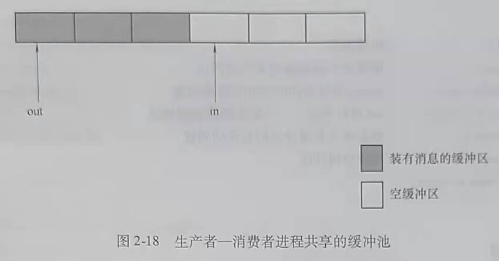

## 第四节 进程同步

多任务操作系统支持多个进程并发执行，并发执行的进程共享系统的软件和硬件资源。

操作系统同步机制的主要任务就是要保证多任务共享系统资源的情况下，程序执行能得到正确的结果。

### 一、进程同步的基本概念

进程同步有两个任务：

一是对具有资源共享关系的进程，保证诸进程以互斥的方式访问临界资源。临界资源是必须以互斥方式访问的共享资源。

二是对具有相互合作关系的进程，保证互相合作的诸进程协调执行。相互合作的进程可能同时存在资源共享的关系。

为了说明什么是临界资源，先回忆前面p1、p2两个进程并发执行，counter是全局变量，初始值为0，p1、p2两个进程分别对counter做加1操作，代码如下。

```
p1
{	...
	counter = counter + 1
	...
}
p2
{	...
	counter = counter + 1
	...
}
```
若当前counter=0，p1和p2各执行一次后，counter的正确值应该是2，但是当p1和p2在经过编译后，必须分别经过下列指令的执行，才能完成counter=counter+1的功能。
```
p1
{	...
	register1 = counter;
	register1 = register1 + 1;
	counter = register1;
	...
}
p2
{	...
	register2 = counter;
	register2 = register2 + 1;
	counter = register2;
	...
}
```
p1、p2并发执行时，指令的执行序列可能出现各种组合，当按下列顺序执行时，会发生counter计数错误。
```
register1 = counter;		// 执行结果：register1 = 0
register1 = register1 + 1;	// 执行结果：register1 = 1
register2 = counter;		// 执行结果：register2 = 0
register2 = register2 + 1;	// 执行结果：register2 = 1
counter = register1;		// 执行结果：counter = 1
counter = register2;		// 执行结果：counter = 1

```
执行结果是counter=1，而正确结果应该是counter=2。

如果p1和p2以互斥的方式去访问counter，也就是说，如果p1先开始对counter的访问，p2就必须等待p1对counter的访问完全结束，再开始对counter的访问。反之，如果p2先开始对counter的访问，p1就必须等待p2对counter的访问完全结束，再开始对counter的访问。那么p1和p2对counter访问指令的交错执行的情况就不会出现，计算结果的错误也就不会出现了。p1和p2以互斥的方式去访问counter的含义是在p1和p2中的任意一个进程执行counter+1操作的一系列指令的过程中，不允许另一个进程执行访问counter的操作。类似counter这样必须以互斥方式访问的共享资源称为临界资源。

在设计操作系统时，设计人员必须严格界定系统中的哪些资源是临界资源，通过同步机
制保证系统运行过程中，对临界资源的访问进行有效控制。

临界区是进程中访问临界资源的那段代码。访问临界资源是通过执行临界区代码来实现的，如果能使程序以互斥的方式进入临界区，就能够实现对临界资源的互斥访问。这一点可以通过在临界区前面加进入区代码，在临界区后面加退出区代码来实现。进入区代码在临界区代码之前执行，检查进程是否可以进入临界区并对临界区“加锁”。退出区代码在临界区代码之后执行，完成释放临界区访问权的功能。

在进程中，可以采用下列模式的代码来实现对临界资源的互斥访问。
```
{
	...
	进入区（Entry Section）；
		临界区（Critical Section）；
	退出区（Exit Section）；
}
```

### 二、同步机制应遵循的准则

当存在多种可选的同步方案时，可能是硬件或软件的不同，也可能是算法的不同，根据什么来权衡利弊，做出怡当的选择呢？对于一种同步技术，如何对它收确性和性能做出评
价呢？同步机制应遵循的准则可以为人们提供判断、选择和评价的参考依据。

#### 1. 空闲让进

当没有进程处于临界区时，表明临界资源处于空闲状态，应允许一个请求进入临界区的进程立即进入自己的临界区，以有效地利用临界资源。

#### 2. 忙则等待

当已有进程进入临界区时，表明临界资源正在被访问，因而其他试图进入临界区的进程
必须等待，以保证对临界资源的互斥访问。

#### 3. 有限等待

对要求访问临界资源的进程，应保证在有限时间内能进人自己的临界区，以免进程陷人
无限等待的状态。

#### 4. 让权等待

当进程申请不到共享资源的访回权时，应立即释放处理机，以免进程哈人“忙等”状态，
浪费CPU资源。

### 三、信号量机制

在信号量机制中，用某种类型的变量，即信号量的取值来表示资源的使用状况，或某种事件是否发生，以此为基础实现进程的同步。本节将介绍整型信号量机制、记录型信号量机
制、AND型信号量机制。

交通信号灯的作用是通过灯的不同颜色告知车辆应如何行驶，信号量机制类似这种信号灯的作用。对不同的共享资源设置被称为信号量的变量，用信号量的取值来表示资源的使用
状况，或某种事件是否发生。通过信号量的取值来判断进程是否能访问与信号量对应的共享资源。

#### 1. 整型信号量机制

整型信号量是表示共享资源状态且只能由特殊的原子操作改变的整型量。其完成同步功能的原理是定义一个整型变量，用整型变量值来标记资源的使用情况。如果整型量>0，说明有可用资源：如果整型量≤0，说明资源忙，进程必须等待。对于一次只允许一个进程访问的临界资源，可定义一个用于互斥的整型信号量，并将其初始化为1。整型信号量的值只能通过两个特定的原子操作wait和signal来改变。

##### (1) 整型信号量的wait和signal操作

s定义为整型信号量。
```
Var s integer;
wait(s)//用于申请资源
{
	while s≤0 do no-op; //整型信号量值≤0时循环执行空操作
	s=s-1
}
signal(s)//用于释放资源
{
	s=s+1;
}
```
##### (2) 用整型信号量实现进程互斥

用整型信号量实现进程互斥的思想是：为必须互斥访问的临界资源CS定义一个互斥信号量mutex,将初始值置为1，然后将CS放入wait(mutex)和signal(mutex)之间。当CS可访问时，wait(mutex)才能正常结束使进程进入CS。

##### (3) 用整型信号量实现进程的协调

##### (4) Linux中的整型信号量

##### (5) 对整型信号量机制的总结

1）整型信号量的值只能由wait和signal操作改变。

2）wait和signal操作都是原子操作，即在这两个操作中对信号量的访问是不能被中断的。

3）原子操作可以通过关中断来实现。

4）整型信号量机制的实例：Linux中的自旋锁Spin Lock。

5）不同的资源对应不同的信号量，并不是系统中所有的资源都用同一个信号量表示。

#### 2. 记录型信号量机制

##### (1) 记录型信号量的数据类型
```
Type semaphore = record
	Value: integer; 	// 资源数量
	L: list of process;	// 阻塞队列
end
```

##### (2) 记录型信号量的wait(s)和signal(s)操作
```
procedure wait(s)
	var s: semaphore;
	begin
		s.value = s.value -1;
		if s.value < 0 then block(s.L);
	end

proceduresignal(s)
	var s: semaphore;
	begin
		s.value = s.value + 1;
		if s.value <= 0 then wakeup(s.L);
	end
```

##### (3) 对记录型信号量wait(s)和signal(s)的说明

1) 当s.value>=0时，s.value的值表示资源数量。当s.value<0时，s value的绝对值等于某资源的等待队列中阻塞进程的数量。

2) 每次的wait(s)操作，意味着进程请求一个单位的资源，描述为s.value=s.value-1。当s.value<0时，表示资源已分配完毕。因而，进程调用block原语，进行自我阻塞，放弃处理机，并自我阻塞进程，其进程控制块被插人到阻塞队列s.L中。

3) 每次的signal(s)操作，意味着进程释放一个资源，故s.value=s.value+1操作表示系统可用的资源数目加1.若加1后s.value<=0,则表示在该信号量的阻塞队列中，仍有等待该资源的进程被阻塞，故还应该调用wakeup原语，唤醒s.L队列中的一个阻塞进程。

4) 如果s.value的初值为1，表示只允许一个进程访问临界资源，此时的信号量转化为互斥信号量。

5) 记录型信号量机制的优点是不存在“忙等”，采取了“让权等待”的策略。

##### (4) 利用记录型信号量实现互斥

利用记录型信号量实现互斥的模型从实现互斥的代码片段上看与整型信号量一致，都是在访问临界资源的进程中定位临界区。在临界区前面加wait(s)，在临界区后面加signal(s)，不同的是信号量的类型和wait(s)、signal(s)实现代码不同。实现进程互斥的代码模型描述如下。
```
var s: semaphore;
s.value = 1;
Begin
	Repeat
		wait(s);
			Critical Section;
		signal(s);
		Remainder section;
	Until false;
End
```
##### (5) 利用记录型信号量实现“协调”的应用举例

#### 3. AND型信号量机制

##### (1) AND型信号量机制的引入

AND信号量机制的基本思想是将进程在整个运行过程中所需要的所有资源一次性地全部分配给进程，待该进程使用完后再一起释放。只要还有一个资源不能分配给该进程，其他所有可能为之分配的资源也不分配给它。

##### (2) AND型信号量机制的实现

### 四、经典的进程同步问题

本节将介绍如何用记录型信号量机制解决两个经典的进程同步问题。

#### 1. 生产者一消费者问题的描述

生产者一消费者问题是相互合作进程关系的一种抽象。例如，输人进程和计算进程的关系中，输入进程是生产者进程，计算进程是消费者进程。计算进程和输出进程的关系中，计算进程是生产者进程，输出进程是消费者进程。

##### (1) 问题描述

生产者进程生产消息，并将消息提供给消费者进程消费。在生产者进程和消费者进程之间设置了一个具有个缓冲区的缓冲池，生产者进程可以将它所生产的消息放人缓冲池的一个缓冲区中，消费者进程可以从一个缓冲区中取得一个消息消费。任意两个进程必须以互斥的方式边问公共缓冲池。当缓冲池空，没有可供消费的消息时，消费者进程必须阻塞等待。当缓冲池装满消息，没有空闲缓冲区时，生产者进程必须阻塞等待。

如图2-18所示，out指针指向装有消息的缓冲区，消费者进程从out指向的缓冲区中取
消息。n指针指向空缓冲区，生产者进程总是把新生产的消息放入in指向的空缓冲区。



##### (2) 需要解决的问题

1) 实现任意两个进程对缓冲池的互斥访问。

2) 实现对生产者进程和消费者进程的“协调”，即缓冲池中有消息时消费者进程才能执行取消息的操作。无消息时，阻塞消费者进程。缓冲池中有空闲缓冲区时，生产者进程才能执行放消息的操作。无空间缓冲区时，阻塞生产者进程。

##### (3) 信号量的设置

1) 设置一个互斥信号量mutex,用于实现对公共缓冲池的互斥访问，初值为1。

2) 设置两个资源信号量，分别表示可用资源数

empty：表示缓冲池中的空缓冲区数，初值为n。

full：表示装有消息的缓冲区数，初值为0（一个缓冲区中放一个消息）

##### (4) 同步程序

利用记录型信号量机制实现生产者一消费者问题的同步代码描述如下。

1) 生产者进程同步代码的描述。
```
Producer:
begin
repeat
	...
	produce an item in nextp;
	wait(empty); 		//申请空缓冲区
	wait(mutex);		//申请公共缓冲池的互斥访问权
	buffer(in)=nextp;	//将消息放入in指针指向的缓冲区
	in (in +1)mod n;	//in指针指向下一个空缓冲区
	signal(mutex);		//释放对公共缓冲池的互斥访问权
	signal(full);		//释放消息资源
until false;
end
```

2) 消费者进程同步代码的描述。
```
Consumer:
begin
repeat
	…
	wait(full);			//申请消息
	wait(mutex);		//申请公共缓冲池的互斥访问权
	nexte buffer(out);	//从out指针指向的缓冲区中取消息
	out (out +1)mod n;	//out指针指向下一个装有消息的缓冲区
	signal(mutex);		//释放对公共缓冲池的互斥访问权
	signal(empty);		//释放空缓冲区
	consume item in nextc;
until false;
end
```
(5) 说明

1) wait和signal操作必须成对出现。

2) wait操作的顺序不能颠倒。必须先对资源信号量（即empty和full)进行wait操作，然
后再对互斥信号量进行wait操作。

3) 用记录型信号量机制解决生产者一消费者问题，对具有相互合作关系的进程，提供
了解决问题的模型。

#### 2. 读者一写者问题

##### (1) 问题描述

D是多个进程共享的数据区，允许多个进程同时读D区，仅允许一个进程写D区，且有进程写D区时，不能有任何其他进程读或写D区。

数据库管理中存在这种同步问题的实例，系统允许多个用户同时读一个数据库表，但是任意时刻只允许一个用户修改它，当数据库表被用户（通常是有特殊权限的数据库管理员）修改时，任何其他用户不能读或者写这一数据库表。

##### (2) 信号量的设置

1) 全局变量readcount用于对进入共享区的读进程计数。

2) 互斥信号量mutex用于对多个进程共享的全局变量readcount的互斥访问。

3) 互斥信号量wmutex用于实现读操作与写操作的互斥，以及写操作与写操作的互斥。

##### (3) 同步程序

1) 写进程同步代码的描述。
```
writer;
begin:
	wait(wmutex);
…
writing operation;
…
	signal(wmutex);
end;
```
2) 读进程同步代码的描述。
```
reader:
begin:
	wait(rmutex);
	if readcount =0 then wait(wmutex);
	readcount++;
	signal(rmutex);	
	…
	reading file from D:
	wait(rmutex);
	readcount--;
	if readcount =0 then signal(wmutex);
	signal(rmutex)
end;
```
### 五、管程

信号量机制的缺陷是每个访问共享资源的进程都必须自备同步操作wait(s)和signal(s)。这就使大量的同步操作分散在各个进程中，这不仅给系统的管理带来麻烦，而且还会因同步操作的使用不当而导致系统出错，因此引入了管程的概念。

#### 1. 管程的基本概念

##### (1) 管程的定义

管程是描述共享资源的数据结构和在数据结构上的共享资源管理程序的集合。其中包括变量的定义、变量的初始化代码，以及管理共享资源的过程。管程的语法描述如下。
```
type moniter-name=moniter
	variable declarations;
	procedure entrypl(…)
begin…end;
	…	
	procedure entrypn(…)
		begin…end;
	begin initialization code;
end
```

##### (2) 对管程的说明

1) 管程是可供程序猿调用的软件包。

2) 每次只有一个进程调用管程执行，任意时刻管程中只能有一个活跃进程。

3) 管程是一种编程语言的构建，所有编译器知道它们很特殊，并可以调用与其他过程不同的方法处理它们。

##### (3) 条件变量

## 第五节 进程通信

操作系统提供进程通信功能，以支持进程之间的信息交换。进程之间的高级通信机制分为共享存储器系统、消息传递系统和管道通信系统。

### 1. 共享存储器系统

在共享存储器系统中，相互通信的进程共享其些数据结构或共享存储区，进程之间能通过这些空间进行通信。共享存储系统可分为两种类型。

1) 基于共享数据结构的通信方式。在这种通信方式中，要求诸进程公用某些数据结构，以实现进程间的信息交换。例如在生产者一消费者问题中，使用有界缓冲区这种数据结构来实现进程间的通信。

2) 基于共享存储区的通信方式。为了传输大量数据，在存储器中划出一块共享存储区，
进程可以通过对共享存储区中的数据的读或写来实现通信。

### 2. 消息传递系统

在消息传递系统中，进程间通过操作系统提供的一组通信程序传递格式化的消息。这种方式对应用程序隐藏了通信实现的细节，使通信过程对用户是透明的。

消息传递系统中，根据源进程向目标进程传递消息方式的不同，可分为直接通信方式和间接通信方式。

1) 直接通信方式。操作系统利用发送程序直接把消息发送给目标进程。

2) 间接通信方式。进程之间的通信需要通过用于暂存消息的共享数据结构来实现，如信箱。该方式既可以实现实时通信，又可以实现非实时通信。

### 3. 管道通信

管道(Pipeline)是连接读写进程的一个特殊文件，也被称为管道文件。管道文件存在于外存中，其中的消息没有固定长度，能用于进程间大量的信息通信。向管道提供输人的发送进程以字符流的形式将大量的数据送入管道（写）。接受管道输出的接收进程，从管道中接收数据（读）。

### 4. 消息缓冲队列

消息缓冲队列机制广泛用于本地进程之间的通信。该机制包括数据结构、发送原语和接收原语，每个进程都有自己的消息缓冲队列和消息缓冲区。发送进程发送消息时，先申清一个消息缓冲区将要发送的消息从发送进程的发送区放入消息缓冲区。然后，调用发送原语将消息发送给接收进程，发送原语将发送缓冲区插入接收进程的消息缓冲队列。接收消息的进程通过调用接收原语将该进程消息缓冲队列中的消息复制到自己的消息接收区。

消息缓冲区是一个结构型数据结构。通常包括发送进程标志符、消息长度、消息正文和指向下一个消息缓冲区的指针。在采用消息缓冲队列的系统中，进程控制块中要增加指向消息缓冲队列的指针、消息队列的互斥信号量和消息队列的资源信号量等字段。<u>消息缓冲队列需要被当作临界资源，在发送原语和接收原语中对消息缓冲队列的访问需要进行互斥与同步</u>。

