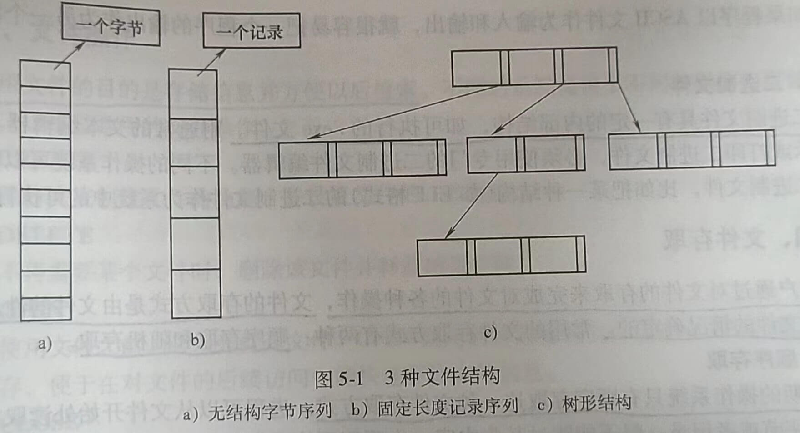

# 第五章 文件系统

文件系统管理是操作系统的重要功能之一，它为用户提供了在计算机系统中对数据信息
进行长期、大量存储和访问的功能。文件的结构，以及文件的命名、访问、存储、保护和实现方法都是文件系统设计的主要内容。从总体上看，操作系统中处理文件的部分称为文件系统(File System)，文件系统包括了文件及管理文件的软件集合。

本章分两部分来讨论文件系统，一部分是文件系统的用户接口，另一部分是文件系统的实现，包括文件的按名访问和存储空间管理的实现。

## 第一节 文件

本节讨论文件系统的用户接口，即用户可以“看见”和使用的文件系统部分，包括文件的命名、类型、属性和对文件的操作。

### 一、文件命名

文件命名向用户提供了简单、直观的文件访问方式，使用户在访问文件时不必了解信息存储的方法、位置及磁盘实际动作方式等细节，而只需给出要访问的文件名。在创建一个文件时，进程给出文件名。进程终止后，文件仍然存在，其他进程使用该文件名可以对它进行存取。

不同的文件系统为文件命名制定的规则略有不同，但所有操作系统都允许用1~8个字母组成的字符串作为文件名。例如，hello、bruce和oenw都是合法文件名。一般情况下，文件名中也允许有数字和一些特殊字符，如1、error!和Tab.6-1都是合法的。许多文件系统支持长达255个字符的文件名。文件的命名规则和文件名的长度在文件系统设计时确定。

有的文件系统区分大小写字母，如UNIX的文件系统；有的不区分，如MS-DOS。因此，在UNIX中，hello、Helo和HELLO是3个不同的文件名；而在MS-DOS中，它们是同一个文件名。

多数操作系统都支持文件名用圆点隔开分为两部分，如hello.c。圆点后面的部分称为文件扩展名。文件名info.txt用于表示这个文件的类型，给用户一个提示，而不是表示给计算机传送什么信息。但是，编译器、链接程序等利用扩展名区分哪些是C文件，哪些是汇编文件，哪些是其他文件。

在Windows系统中，扩展名被赋予了含义。用户可以在操作系统中注册扩展名，并且规定哪个程序与该扩展名关联，当用户双击某个文件名时，关联该扩展名的程序就会启动并访问该文件。例如，双击“孔子.rmvb”就会启动关联的电影播放软件，并播放该视频。

### 二、文件结构

本节介绍如图5-1所示的3种文件结构。

#### 1.无结构字节序列

无结构字节序列文件也称为流式文件，操作系统不知道也不关心文件内容是什么，操作系统所见到的就是字节，其任何含义由使用该文件的程序自行理解，在UNIX和Windows系统中都采用这种方式。

把文件看成字节序列为操作系统提供了最大的灵活性。用户程序可以向文件中加人任何
内容，并以方便的形式对文件进行命名。

#### 2.固定长度记录序列

在该模型中，构成文件的基本单位是具有固定长度的记录，每个记录都有其内部结构。把文件作为记录序列的中心思想是：读操返回一个记录，而写操作重写或追加一个记录。

#### 3.树形结构

文件由一棵记录树构成，记录长度不定，在记录的固定位置包含一个关键字域，记录树
按关键字域排序。在这种文件结构中，基本操作是获取具有特定关键字的记录（而不是获取下一条记录)。增加记录时，由操作系统决定记录在文件中的存放位置。这类文件结构与UNIX和Windows系统中采用的无结构字节序列有明显不同，它在一些处理商业数据的大型计算机中获得了广泛使用。

### 三、文件类型

在设计操作系统时要考虑系统支持哪些类型的文件，并为每种类型的文件定义合法的操作。文件的类型有正规文件、目录文件、字符设备文件和块设备文件等。正规文件包含用户信息，一般分为ASCII文件和二进制文件。目录文件是用于管理文件的系统文件。字符设备文件和输入/输出有关，用于串行I/O类设备，如终端、打印机和网络等。块设备文件用于磁盘类设备。本节主要介绍正规文件。

#### 1.ASCII(American Standard Code for Information Interchange)

ASCII文件由多行正文组成，在某些系统中每行用回车符结束，某些则用换行符结束，而有些系统还同时采用回车符和换行符，如MS-D05。各行的长度不必相同。

ASCII文件的明显优势是可以显示和打印，也可以用通常的文本编辑器进行编辑。另外，如果程序以ASCII文件作为输入和输出，就很容易把一个程序的输出作为另一个程序的输入。

#### 2.二进制文件

二进制文件具有一定的内部结构，如可执行的.exe文件。用通常的文本编辑器不能直接显示或打印二进制文件，必须使用专门的二进制文件编辑器。不同的操作系统可以识别不同的二进制文件，比如把某一种结构（如ELF格式）的二进制文件作为系统中的可执行文件。

### 四、文件存取

用户通过对文件的存取来完成对文件的各种操作，文件的存取方式是由文件的性质和用户使用文件的情况确定的。常用的文件存取方式有两种：顺序存取和随机存取。

#### 1.顺序存取

早期的操作系统只有顺序存取这一种文件存取方式。进程可以从文件开始处读取文件中的所有字节或者记录，但不能跳过某些内容，也不能不按顺序存取。在存储介质是磁带而不是磁盘时，顺序存取文件是很方便的。

#### 2.随机存取

随机存取又称直接存取，即可以以任意顺序读取文件中的字节或记录。现代操作系统的文件一旦被创建，所有文件自动成为随机存取文件。定长记录的文件能很好地支持随机存取，而变长记录虽然可以随机存取，但实现起来复杂而且存取速度慢。

### 五、文件属性

为方便管理，除了文件名和文件数据外，文件系统还会保存其他与文件相关的信息，如文件的创建日期、文件大小和修改时间等，这些附加信息称为文件属性。文件属性在不同的操作系统中差别很大，表5-1列出了一些常用的文件属性。

表5-1一些常用的文件属性

### 六、文件操作

使用文件的目的是存储信息并方便以后检索。不同的系统提供了不同的操作来存储和检索信息，以下是常用的文件操作。

#### 1.CREATE

该操作完成创建文件的功能，并设置文件的一些属性。

#### 2.DELETE

当不再需要某个文件时，删除该文件并释放磁盘空间。

#### 3.OPEN

在使用文件之前，必须先打开文件。OPEN调用的目的是将文件属性和文件的地址信息装入主存，便于在对文件的后续访问中能快速存取文件信息。

#### 4.CLOSE

当存取结束后，不再需要文件属性和地址信息，这时应该关闭文件以释放内部表空间。很多系统限制进程打开文件的个数，以鼓励用户关闭不再使用的文件。

#### 5.READ

从文件中读取数据。一般地，用户可以指定从哪个文件的第几个字节开始读取多少个字节的内容。此外，调用读文件的函数时，还需要给出存放被读取内容的内存缓冲区。

#### 6.WRITE

往文件中写数据，写操作一般从写函数的参数指定的文件位置开始。如果当前位置是文件末尾，文件长度增加。如果当前位置在文件中间，则现有数据被覆盖，并且永远丢失。

#### 7.APPEND

该操作是WRITE调用的限制形式，它只能在文件末尾添加数据。

#### 8.SEEK

对于随机存取文件，要指定从何处开始取数据。通常的做法是用SEEK系统调用把当前
位置指针指向文件中特定的位置。SEEK调用结束后，就可以从该位置开始读写数据了。

#### 9.GETATTRIBUTES

该操作用于获取文件属性。

#### 10.SETATTRIBUTES

某些属性是可由用户设置的，文件创建以后，用户还可以通过系统调用SETAT-TRIBUTES来修改它们。

#### 11.RENAME

该操作用于修改已有文件的名件名。