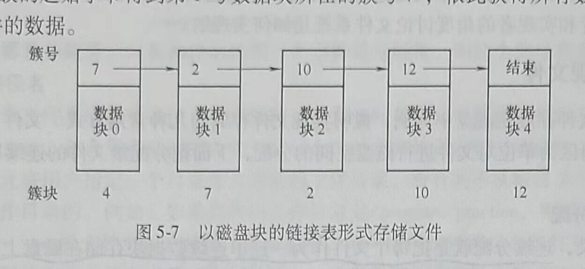
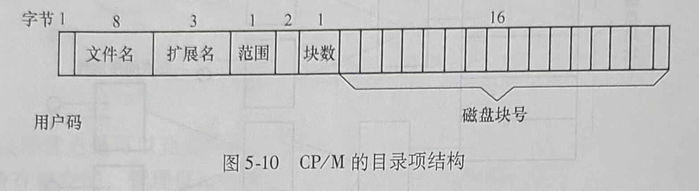

# 第三节 文件系统的实现

前面讨论的文件系统，主要是从用户的角度探讨问题。用户关心的是文件怎样命名、可以进行哪些操作、目录树是什么样的，以及类似界面问题。而实现者感兴趣的是文件和目录是怎样存储的、文件的存储空间是怎样管理的，以及怎样使系统有效而可靠地工作等。下面，从设计者和实现者的角度讨论文件系统是如何实现的。

## 一、实现文件
本节以文件存放在磁盘中为例，说明实现文件存储的几种常用方式。文件系统通常是以2ⁿ个连续的扇区为单位对文件进行磁盘空间的分配，下面把分配给文件的连续扇区构成的磁盘块称为簇。

### 1.连续分配

顾名思义，连续分配就是把每个文件作为一连串连续数据块存储在磁盘上。例如，系统规定的簇大小为1KB，则存储5KB大小的文件，需要5个连续的簇。若簇大小为2KB,则存储5KB大小的文件需要分配3个连续的簇，最后一个簇中，有1KB的磁盘空间将不能使用，下一个文件要从一个新的簇开始，如图5-6所示。

连续分配方式有两大优点。首先，实现简单，记录每个文件用到的簇仅需存储两个数字即可：第一块的磁盘地址和文件的块数。给定第一块的簇号，就可以找到任何其他块的簇号。其次，读操作性能好，在单个操作中就能从磁盘上读取整个文件。只需要寻找一次第一个块，之后不再需要寻道和旋转延迟，所以数据以磁盘全带宽的速率输入。

但是，连续分配方式也有十分明显的缺点：随着时间的推移，磁盘会变得零碎。当删除文件时，文件所占的簇被释放，这些空闲的连续簇形成“空洞”。随着磁盘的使用，磁盘上会有许多空洞。当磁盘被充满而又需要创建新文件时，需要挑选大小合适的空洞存入文件，这时就有必要知道该文件的最终大小。但很多情况下，无法预知一个文件的最终大小，比如录入一个文档，文档的内容有多少，需要占用多大空间都是未知的，也就是说文件的大小可变，系统管理文件的存储会比较麻烦。

### 2.使用磁盘链接表的分配

该方法为每个文件构造簇的链接表，每个簇开始的几个字节用于存放下一个簇的簇号，簇的其他部分存放数据，每个文件可以存放在不连续的簇中。在目录项中只需存放第一个数据块的磁盘地址，文件的其他块可以根据这个地址来查找。如图5-7所示，某文件的数据信息需要占用5个簇，第0块数据存储在4号簇中，第1块数据存储在7号簇中，第2块数据存储在2号簇中，第3块数据存储在10号簇中，第4块数据存储在12号簇中。4号簇的起始字节中存放了1号数据块所在簇的簇号7，7号簇的起始字节中存放了2号数据块所在簇的簇号2，2号簇的起始字节存放了3号数据块所在簇的簇号10，10号簇的起始字节存放了4号数据块所在簇的簇号12。12号簇的起始字节存放文件结束标志，表示12号簇是存放该文件的最后一个簇。对该文件的查找过程是先根据该文件的文件名搜索目录文件，找到该文件的目录项，从目录项中得到第0个数据块所在的簇号4，从4号簇的起始字节得到第1号数据块所在的簇号7，依此获得所有数据所在的簇号，访问文件的数据。

这一方法的优点是可以充分利用每个簇，不会因为磁盘碎片（除了最后一块中的内部碎片)而浪费存储空间，管理也比较简单。缺点是随机存取相当缓慢。要获得文件的第n块，每一次都要从头开始读取前面的n-1块。显然，进行如此多的读操作会占用很多时间。

### 3.使用内存的链接表分配

该方法是将文件所在的磁盘的簇号存放在内存的表（文件分配表）中，访问文件时，只需从内存文件分配表中顺着某种链接关系查找簇的簇号。不管文件有多大，在目录项中只需记录文件的第一块数据所在簇的簇号，根据它查找到文件的所有块。

MS-DOS就使用这种方法进行磁盘分配。图5-8表示了图5-7所示例子的文件分配表的内容。该文件依次使用了簇号为4、7、2、10和12的磁盘块。访问该文件时，先根据文件名检索目录文件，从目录文件中获得文件第0号数据块所在的簇号4，然后利用图5-8中的文件分配表，从第4号表项中读到簇号7，从7号表项中读到簇号2，从2号表项中读到簇号10，从10号表项中读到簇号12。在12号表项中存该文件的结束标志，至此找到图5-7所示例子中的文件占用的全部簇的簇号。

这种方法的一个缺点是必须把整个表都存放在内存中。对于目前比较常见的500GB的磁盘，如果簇大小为1KB，这张表需要有500M个表项，每一项对应一个簇。若每项占4个字节，根据系统对空间或时间的优化方案，这张表要占用约2GB的内存(500M×4B)。很显然，这种方法不适合大容量的磁盘。

### 4.i-结点

该方法为每个文件赋予一个被称为i结点的数据结构，其中列出了文件属性和文件块的磁盘地址。图5-9所示是一个简单的例子。给定一个文件的i结点，就有可能找到文件的所有块。系统打开文件时，将文件的ⅰ结点从磁盘读入内存。当访问文件时，系统先根据文件名搜索文件所在的目录文件，从该文件对应的目录项中找到文件的i结点号，根据ⅰ结点号从磁盘中将i结点信息读入内存，文件在磁盘中的地址信息都存放在i结点中。

如果每个i结点只能存储固定数量的磁盘地址，那么当一个文件比较大，所含簇的数目太多时，i结点将无法记录所有的簇号。一个解决方案是采用间接地址，使一个“磁盘地址”不存放数据块，而是存放簇号。对于一个大文件，ⅰ结点内的其中一个地址是一次间接块的簇号，这个块包含了存放文件数据的簇的簇号。如果还不够的话，在i结点中还有二次间接块的簇号，其中存放了若干个一次间接块的簇号。文件再大的话，可以使用三次间接块，如图5-9所示。

Linux的Ext2文件系统的一个i结点包括15个地址项，每个地址项存32位地址(4个字节)，用其中12个地址项存直接地址，一个地址项存一次间接地址，一个地址项存二次间接地址，一个地址项存三次间接地址。当簇大小为1KB时，系统能管理的单个文件的最大长度该如何计算呢？

首先，12个地址项存放的是簇号，所以12个直接地址可表示的文件大小为12×1KB=12KB。其次，每个簇大小为1KB，每个地址项占4个字节，所以，每个簇中可以存放256个簇号。这样，一次间接块可以表示的文件大小为256×1KB=256KB。以此类推，二次间接块可以表示的文件大小为256×256×1KB=64MB。三次间接块可以表示的文件大小为256×256×256×1KB=16GB。最后，一个文件的最大长度为12KB+256KB+64MB+16GB。

## 二、实现目录

系统在读文件前，必须先打开文件。打开文件时，操作系统利用用户给出的路径名找到相应的目录项，目录项中提供了查找文件簇所需要的信息。下面，以CP/M、MS-DOS和UNIX为例，说明3种不同的目录实现方式。

### 1.CP/M中的目录

CP/M是一个微机操作系统，它只有一层目录，因此只有一个目录文件。要查找文件名，就是在这个唯一的目录文件中找到文件对应的目录项，从目录项中获得文件存放的磁盘地址。图5-10所示为CP/M的目录项结构。其中，各字段的含义如下。

1)用户码：记录了文件所有者。

2)文件名：存放文件名。

3)扩展名：标识文件类型。

4)范围：由该域可知某目录项是文件的第几个目录项，因为一个很大的文件（大于16KB)，其簇的数量多，在一个目录项中记录不下。

5)块数：文件实际使用的簇的数量。

6)最后16个域记录了簇号。

需要注意的是，文件占用的最后一个簇可能没有写满，这样系统无法确切地知道文件的
字节数，因为CP/M是以簇而不是以字节为单位来记录文件长度的。

### 2.MS-D0S中的目录

MS-DOS文件系统曾经是IBM PC系列所采用的文件系统，目前它已经不再是新的PC文件系统的标准了，但它和它的扩展(FAT32)一直被许多嵌人式系统所广泛使用。大部分的数码相机使用它，许多MP3播放器使用它，流行的苹果公司的iPod使用它作为默认的文件系统。现在使用MS-DOS文件系统的电子设备数量远远多于过去，并且远远多于使用更现代的NTFS文件系统的数量。下面介绍其中的一些细节。

图5-11所示是一个MS-D0S的目录项。它总共32个字节，其中包含了8个字节的文件名、1个字节的文件属性和2个字节的文件第一个簇的簇号。根据第一个簇号，顺着索引链表可以找到所有的文件块。MS-D0S中，目录可以包含其他子目录，从而形成树形目录。

MS-DOS用文件分配表即FAT作为索引表来存放文件数据所在簇的簇号。目录项包含了文件第一个数据块所在簇的簇号，将这个簇号用作FAT的索引，可依次找到文件的所有块。FAT的结构见前面的图5-8。

FAT文件系统有3个版本：FAT-12,FAT-16和FAT-32，取决于用多少个二进制位存放簇号。

### 3.UNIX中的目录

UNIX中采用的目录结构非常简单，如图5-12所示，每个目录项只包含一个文件名及其i结点号。有关文件类型、长度、时间、所有者和簇号等信息都放在ⅰ结点中。当打开某个文件时，文件系统必须要获得文件名并且定位文件所在的第一个簇。下面说明文件系统寻找一个文件的过程，以查找UNIX中的/usr/ast/mbox为例。

首先，文件系统找到根目录，在UNIX中根目录的ⅰ结点位于磁盘的固定位置。然后，系统读根目录文件并且在根目录文件中查找路径的第一部分usr，获得文件/usr的i结点号。由ⅰ结点号来定位ⅰ结点是很直接的，因为每个i结点在磁盘上都有固定的位置。根据这个ⅰ结点号，系统定位/usr目录并查找下一部分ast。一旦找到ast的目录项，便找到了/usr/ast的i结点。根据这个i结点，可以定位该目录并在其中查找mbox。然后，这个文件的i结点被读入内存，并且在文件关闭之前会一直保留在内存中。查找的过程如图5-13所示。

提示：相对路径的查找与绝对路径的查找方法相同，只不过是从当前工作目录开始查找而不是从根目录开始。

## 三、磁盘空间管理

磁盘空间管理是文件系统的重要功能，包括记录空闲磁盘信息、设计文件的存放方式，以及规定文件系统的簇大小等内容。

### 1.簇大小

文件系统为文件分配磁盘空间是以簇为单位的，一旦用固定大小的簇来存储文件，就会出现一个问题：簇的大小应该是多少？

拥有大的簇尺寸意味着每个文件，甚至一个字节的文件，都要占用很大的空间，也就是说小的文件浪费了大量的磁盘空间。另一方面，小的尺寸意味着大多数文件会跨越多个簇，因此需要多次寻道与旋转延迟才能读出它们，从而降低了时间性能。因此，簇太大，容易造成空间的浪费；簇太小，则会使访问文件的时间延长。

一般簇大小是2的整数次幂个连续的扇区，如1个扇区，512个字节；连续两个扇区，大小为1KB；连续4个扇区，大小为2KB。根据系统管理的文件大小，可以选择合适的簇大小来格式化磁盘。

### 2.记录空闲块

确定了簇大小后，下一个问题是怎样跟踪记录空闲簇。有以下两种方法被广泛采用。

#### (1)空闲簇链接表

用一些空闲簇存放空闲簇的簇号。一个簇存放尽可能多的空闲簇的簇号，并专门留出最后几个字节存放指向下一个存放空闲簇的指针。对于1KB大小的簇，可以存放256个32位的簇号（有一个存放指向下一个块的指针）。图5-14a显示了该方法的记录方式。

#### (2)位图

用n位位图对应磁盘的n个簇，在位图中，空闲簇用1表示，已分配簇用0表示（或者反过来)，如图5-14b所示。很显然，位图方法所需空间少，因为每个簇只用一个二进制位标识，而在链接表方法中，每一个簇号都要用32位。

