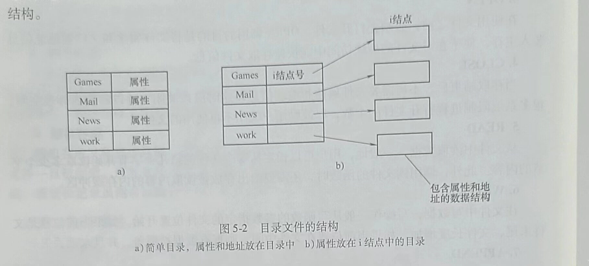

## 第二节 目录

<span style="border-bottom:2px solid; black;">文件系统通常提供目录或文件夹用于记录文件，很多系统中目录本身也是文件，目录是文件系统中实现按名访问文件的重要数据结构。</span>本节讨论目录、目录的组成、目录的特性，以及可以对目录进行的操作。

### 一、层次目录系统

#### 1.目录文件的结构

目录文件有两种常见的结构：<span style="border-bottom:2px solid; black;">属性放在目录项中和放在i结点中。	</span>

目录文件包含许多目录项，每个目录项用于描述一个文件。在第一种结构中，每个目录项长度相同，每个文件对应一个目录项。其中包含文件名、文件属性和文件的地址。在第二种结构中，目录项中有一个文件名和i结点号。i结点是一种数据结构，文件属性和文件的地址信息存放在i结点中。这两种结构都得到了广泛的应用。图5-2分别描述了以上两种结构。



#### 2.目录结构

文件目录的组织和管理是文件管理的一个重要方面，包括单层目录、两级目录和树形目录。

##### (1)单层目录

这种目录也被称为根目录。在整个系统中设置一张线性目录表，表中包括了所有文件的描述信息。早期的个人计算机中，这种系统很普遍。这种目录结构使得软件设计相对简单。

图5-3所示是一个单层目录系统的例子。该目录中有4个文件。

在多用户系统中，单层目录带来的一个显著问题是，不同用户可能会使用相同的文件名。例如，如果用户A创建了一个名为helo.c的文件，然后，用户B也创建了一个名为hello.c的文件，用户B的文件可能会覆盖用户A的文件。很显然，这种结构不适合在多用户系统中使用。

另外，由于使用单层目录时，要查找一个文件必须对单层目录表中的所有文件信息项进行搜索，因而搜索效率也较低。

##### (2)两级目录

为了避免上述文件名冲突，一种改进方法是为每个用户提供一个私有目录。这样，一个用户选择文件名时就不会影响到其他用户。图5-4展示了一个两级目录系统。


在两级目录结构中，目录被分为两级，第一级称为主目录，给出了用户名和用户子目录所在的物理位置。第二级称为用户目录，给出了该用户所有文件的文件控制块。这一设计隐含的机制是，当一个用户试图打开文件时，系统知道是哪个用户，从而知道应该查询哪个目录。

使用两级目录的优点是解决了文件的重名问题和文件共享问题，查找时间降低。缺点是增加了系统的存储开销。

##### (3)树形目录

<span style="border-bottom:2px solid; black;">把两级目录的层次关系加以推广，就形成了多级目录，又称树形目录，</span>如图5-5所示。


在多级目录结构中，除了叶子结点对应的存储块中装有文件信息外，其他每一级目录中存放的都是下一级目录或文件的说明信息，由此形成层次关系。最高层为根目录，最底层为文件。在这种结构中，用户可以拥有多个所需的目录，自由地组织自己的文件。同时，用户可以创建任意数量子目录的功能，为用户组织其文件提供了一种强大的工具。

树形目录的优点是<span style="border-bottom:2px solid; black;">便于文件的分类，层次结构清晰，便于管理和保护、解决了重名问题，查找速度加快。</span>缺点是<span style="border-bottom:2px solid; black;">查找一个文件按路径名逐层检查，由于每个文件都放在外存中，多次访问磁盘会影响速度，结构相对复杂</span>。

### 二、路径名

用目录树组织文件系统时，需要有某种方法指明文件名。常用的方法有两种：<span style="border-bottom:2px solid; black;">绝对路径名和相对路径名。</span>

#### 1.绝对路径名

<span style="border-bottom:2px solid; black;">绝对路径名由从根目录到文件的路径组成。</span>例如，路径/program//practice/est表示根目录中有子目录program，而program中又有子目录practice，文件test就在子目录practice下。绝对路径名总是从根目录开始，并且是唯一的。在Windows系统中，路径各部分之间用“\”分隔；在UNIX系统中，分隔符为“/”。同样的路径名在两种系统中的书写形式如下。
```
Windows \ program \ practice \ test
UNIX /program/practice/test
```
不管采用哪种分隔符，只要路径名的第一个字符是分隔符，则这个路径就是绝对路径。

#### 2.相对路径名

当访问一个文件系统的目录包含很多级时，如果访问每个文件都要从根目录开始，直到叶子的文件名为止，包含所有经过的各级分目录在内的全路径名是相当麻烦的。在设计文件系统时，可以允许用户指定一个目录作为当前的工作目录，所有的不从根目录开始的路径名都是相对于工作目录的。例如，如果当前的工作目录是/program/practice,则绝对路径名为/program/practice/test的文件可以直接用test来引用，用户使用相对路径名往往更方便，但是前提是用户访问的文件必须在当前工作目录下。一些程序需要存取某个特定的文件，而不管当前目录是什么，这时必须采用绝对路径名。不管当前的工作目录是什么，绝对路径名总能正常工作。

支持树形目录结构的大多数文件系统在每个目录中有两个特殊的目录项“.”和“..”。“.”指当前目录，“..”指当前目录的父目录。也就是说当在UNIX的终端或Windows的命令提示符中输入命令“cd..”时，将返回上一层目录，如果已经到根目录，再执行该命令，当前目录将一直留在根目录。

### 三、目录操作

本节以UNIX系统为例，说明对目录的操作。

#### 1.CREATE

根据给定的目录文件名，创建目录。除了目录项“.”和“..”外，目录内容为空。“.”和
“..”是系统自动放在目录中的。

#### 2.DELETE

删除目录，根据指定的目录名删除一个目录文件。

#### 3.OPENDIR

目录内容可以被读取。例如，为列出目录中的所有文件和子目录，程序必须先打开该目录，然后读取其中所有文件的文件名，同打开和读取文件一样，在读目录之前必须打开目录。

#### 4.CLOSEDIR

读目录结束后，应关闭目录以释放内部表空间。

#### 5.READDIR

以标准格式返回打开目录的下一级目录项。

#### 6.RENAME

更换目录名。