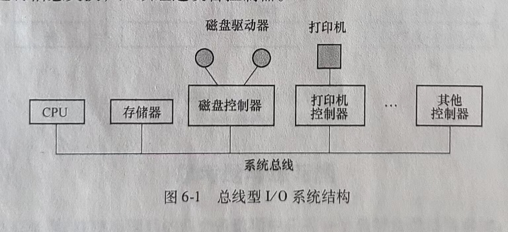
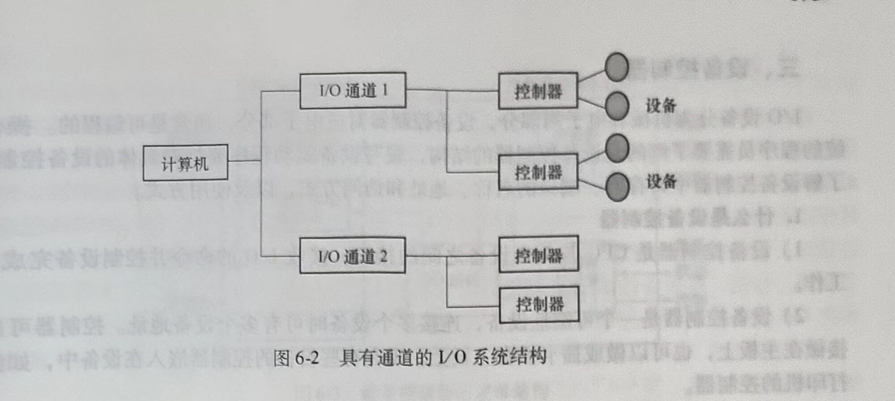
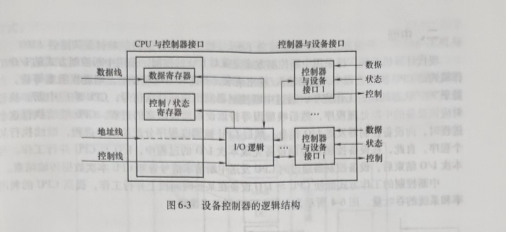

# 第六章 I/O设备管理

计算机系统中的I/O设备即输入/输出设备是用于计算机系统与人通信或与其他机器通信的所有设备，以及所有外存设备。I/O设备管理是操作系统的重要功能之一，也简称为设备管理。

I/O设备是计算机系统的重要组成部分，计算机I/O设备的多样性使设备的管理非常复杂。本章先从硬件角度介绍I/O设备的一般构成和控制方式，然后从操作系统设备管理软件的角度说明I/O设备管理软件的构成和软件各组成部分的功能，并说明部分功能实现的原理。

## 第一节 I/O系统的组成

I/O系统不仅包括各种I/O设备，还包括与设备相连的设备控制器，有些系统还配备了专门用于输入/输出控制的专用计算机，即通道。此外，I/O系统要通过总线与CPU、内存相连。本节介绍I/O系统的结构、I/O设备的分类、设备控制器的功能和构成，以及通道的特点和功能。

### 一、I/O系统的结构

I/O系统的结构分为微机I/O系统和主机I/O系统两大类。

#### 1.微机I/O系统

总线型I/O系统结构如图6-1所示。CPU与内存之间可以直接进行信息交换，但是不能与设备直接进行信息交换，必须经过设备控制器。

#### 2.主机I/O系统

I/O系统可能采用四级结构，包括主机、通道、控制器和设备。一个通道可以控制多个设备控制器，一个设备控制器也可以控制多个设备。图6-2所示为具有通道的I/O系统结构。

### 二、I/O设备的分类

不同功能的I/O设备种类繁多，可以根据设备的某种特点或功能分别对设备进行分类。是否需要对设备进行分类，如何分类，可根据实际需要的情况而定。

#### 1.按传输速率分类

1)低速设备。如键盘和鼠标，传输速率为几个~几百个字节/秒。

2)中速设备。如打印机，传输速率为数千个~数万个字节/秒。

3)高速设备。如磁带机、磁盘机、光盘机，传输速率为几十万~几兆字节/秒。

#### 2.按信息交换的单位分类

1)块设备。数据的存取以数据块为单位，如磁盘。块设备在块中保存信息，块的大小通常是固定的，并且一次只传送一块，通常可以通过块号访问数据。

2)字符设备。传送字节流，没有使用块结构。终端、打印机、通信端口和鼠标等都是字符设备。

在操作系统实现驱动程序时，通常需要区分一个设备是块设备还是字符设备，操作系统对这两种设备的缓冲管理和驱动程序的实现方式是不同的。

#### 3.按设备的共享属性分类

1)独占设备。是必须作为临界资源以互斥方式访问的设备。在一个进程没有使用完毕之前，其他任何进程不能访问该设备，直到设备被释放。例如，打印机是典型的独占设备。

2)共享设备。是允许多个进程共同访问的设备，如硬磁盘是典型的共享设备。这里共同访问的含义是：一个进程访问该设备的全部任务还没有完成，就可以把设备分配给另一个进程使用。如进程p1需要读5个磁盘块的数据，p2需要读3个磁盘块的数据。当进程p1读完一个磁盘块后，就可以把磁盘的访问权分配给p2，让进程p2读一个或若干个磁盘块，再让p1继续读其余的磁盘块。如果必须让pl1读完所有5个磁盘块后才能让p2开始访问磁盘，那磁盘就成了独占设备了。共享磁盘的含义并不是指在任意时刻不同的进程都可以同时读写磁盘。

3)虚拟设备。是通过某种虚拟技术把一台物理设备变成若干逻辑设备，从用户的角度看，多个用户拥有各自的设备，可以随时向设备发出访问请求并得到系统应答。

### 三、设备控制器

I/O设备分为机械和电子两部分，设备控制器对应电子部分，通常是可编程的。操作系统的程序员需要了解的是设备控制器的结构，编写设备驱动程序要针对具体的设备控制器，了解设备控制器中寄存器、端口的名称、地址和访问方式，以及使用方式。

#### 1.什么是设备控制器

1)设备控制器是CPU与I/O设备之间的接口，接收I/O的命令并控制设备完成I/O工作。

2)设备控制器是一个可编址设备，连接多个设备时可有多个设备地址。控制器可以直接做在主板上，也可以做成插卡插在主板上。现在有些设备的控制器嵌入在设备中，如激光打印机的控制器。

#### 2.设备控制器的功能

设备控制器的功能说明如下。

1)接收和识别命令。

接收CPU的命令和参数存放在控制器的控制寄存器中，并对命令和地址译码。

2)数据交换。通过数据寄存器进行数据交换。

①将驱动器中的比特流汇集在控制器的缓冲区中以形成字节块。

②实现CPU到控制器、控制器到CPU的双向数据传送。

③将控制器对设备的控制命令传送给设备控制器。

3)设备状态的了解和报告。

设备控制器中有专门用来存放设备状态信息的寄存器或触发器，CPU可以通过读取这些信息了解设备的当前状态。

4)地址识别。

①设备控制器必须能识别它所控制的每个设备的地址。

②设备控制器中的寄存器本身应该有唯一的地址，以使CPU能向寄存器中读/写数据。

③将CPU要访问的外设地址送入控制器，由控制器的地址译码器译码后选中目标设备。

5)数据缓冲。

在设备控制器中可以存储数据，作为CPU和I/O之间的缓冲。

6)差错控制。

设备控制器需要具有差错检测功能，当通过数据校验发现数据传输出错时，可以向CPU报告，废弃错误数据，重新启动一次数据传输。

3.设备控制器的组成

设备控制器的逻辑构成主要包括以下3部分。

1)设备控制器与处理机的接口：数据线、控制线和地址线。

2)设备控制器与设备的接口：设备与设备控制器接口中的3类信号为数据、状态和控
制信号。

3)I/O逻辑：I/O逻辑主要由指令译码器和地址译码器两部分功能部件构成，将CPU的命令和地址分别译码，控制指定设备进行I/O操作。

设备控制器的逻辑结构如图6-3所示。

### 四、I/O通道

通道用于大型主机系统控制I/O设备，与控制设备结合，与微机和小型机的设备控制器具有对等的功能。即用来代替微机、小型机中的设备控制器，实现大型主机系统的I/O设备控制功能，提供操作系统与I/O设备间的接口。

I/O通道是一种特殊的处理机，它具有执行I/O指令的能力，并通过执行通道程序来控制I/O操作。简单地说，通道是大型主机系统中专门用于I/O的专用计算机。引人通道能够使CPU从控制I/O的任务中解脱，使CPU与I/O并行工作，提高CPU的利用率和系统的吞吐量。
