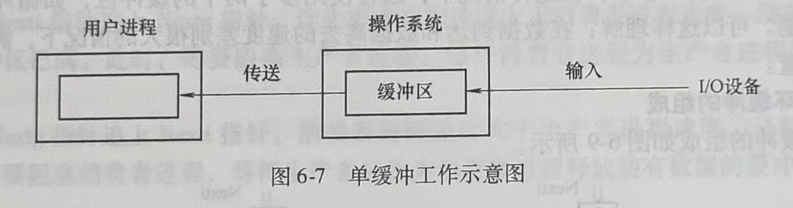
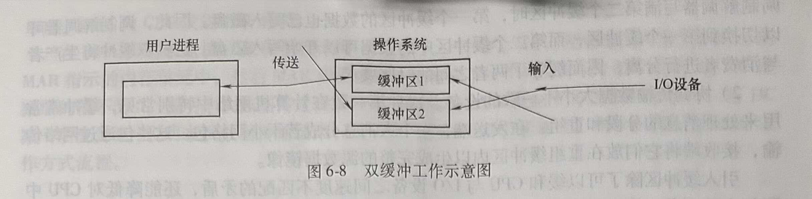
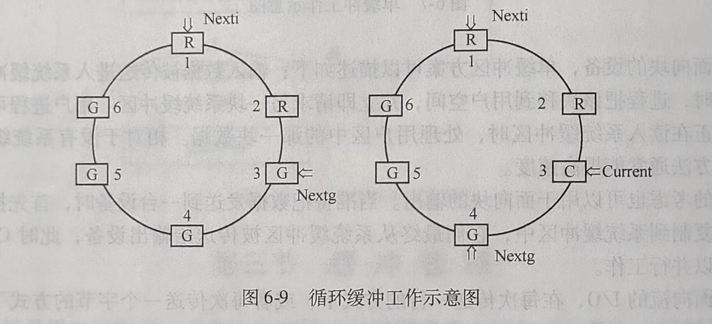
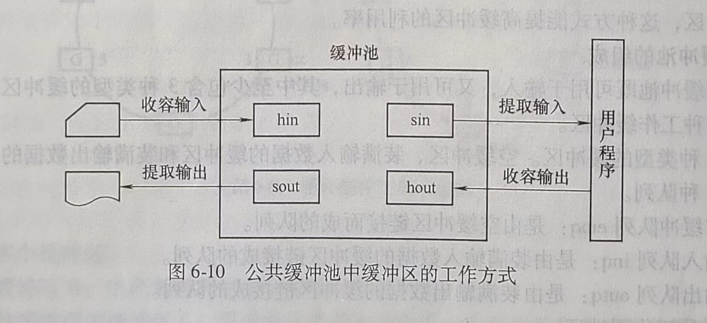

# 第三节 缓冲管理

缓冲区是用来保存两个设备之间或设备与应用程序之间传输数据的内存区域。由于CPU的速度远高于I/O设备，为了尽可能使CPU与设备并行工作，提高系统的性能，通常需要操作系统在设备管理软件中提供缓冲区管理功能。

## 一、缓冲的引入

在数据到达速率与数据离去速率不同的地方，都可以引入缓冲区。引入缓冲区的主要原因可以归纳为以下两点。

1)处理数据流的生产者与消费者之间的速度差异。例如，假如从调制解调器收到一个文件，并保存到硬盘上。调制解调器大约比硬盘慢数千倍，这种情况下，可以在内存中创建缓冲区以存放从调制解调器处收到的字节。当整个缓冲区填满时，就可以通过一次操作将缓冲区中的数据写入到磁盘中。由于写磁盘并不及时，而且调制解调器需要一个空间继续保存输入数据，因而需要两个缓冲区。当调制解调器填满第一个缓冲区后，就可以请求写磁盘。接着调制解调器开始填写第二个缓冲区，而这时第一个缓冲区中的数据正被写入磁盘。等到调制解调器写满第二个缓冲区时，第一个缓冲区的数据也已写入磁盘。因此，调制解调器可以切换到第一个缓冲区，而第二个缓冲区中的数据可以开始写入磁盘。这种双缓冲将生产者与消费者进行分离，因而缓和了两者之间的时序要求。

2)协调传输数据大小不一致的设备。这种不一致在计算机网络中特别常见，缓冲常常用来处理消息的分段和重组。在发送端，一个大消息分成若干小网络包。这些包通过网络传输，接收端将它们放在重组缓冲区内以生成完整的源数据镜像。

引入缓冲区除了可以缓和CPU与I/O设备之间速度不匹配的矛盾，还能降低对CPU中断频率的要求，放宽对中断响应时间的限制，提高CPU和I/O设备之间的并行性。

## 二、单缓冲

操作系统提供的最简单的缓冲类型是单缓冲区，如图6-7所示。当一个用户进程发出I/O请求时，操作系统为该操作分配一个位于主存的缓冲区。



对于面向块的设备，单缓冲区方案可以描述如下：输入数据被传送进人系统缓冲区。当传送完成时，进程把该块移到用户空间，并立即请求另一块系统缓冲区。用户进程可以在下一块数据正在读入系统缓冲区时，处理用户区中的那一块数据。相对于没有系统缓冲的情况，这种方法通常能提高速度。

类似的考虑也可以用于面向块的输出。当准备把数据发送到一台设备时，首先把它们从用户空间复制到系统缓冲区中，它们最终从系统缓冲区被传送给输出设备，此时CPU与输出设备可以并行工作。

对于面向流的I/O，在每次传送一行的方式下，或者每次传送一个字节的方式下，可以使用单缓冲方案。键盘、打印机和传感器等都属于面向流的设备。

对于每次传送一行的I/O，可以用缓冲区保存一行数据。在输入期间用户进程被阻塞，等待整行的到达。对于输出，用户进程可以把一行输出放置在缓冲区中，然后继续处理。只有当第一次输出操作的缓冲区内容清空之前，又需要发送第二行输出时，它才需要被阻塞。对于每次传送一个字节的I/O，操作系统和用户进程之间的交互按照第三章进程同步讲述的生产者一消费者模型进行。

## 三、双缓冲

可以通过给操作系统指定两个系统缓冲区，如图6-8所示，对单缓冲方案进行改进。当一个进程往这一个缓冲区中传送数据（或从这个缓冲区中读取数据）时，操作系统正在清空(或填充)另一个缓冲区，这种技术称为双缓冲(Doube Buffering)，或缓冲交换(Buffering Swapping)。

双缓冲的性能比单缓冲的性能有所提高，但是这种提高是以增加复杂性为代价的。



## 四、循环缓冲

双缓冲方案可以平滑I/O设备和进程之间的数据流，如果某个特定进程的性能是关注的焦点，常常会希望相关I/O操作能够跟得上这个进程。如果这个进程突然快速执行了大量的I/O，仅有双缓冲就不够了，在这种情况下，通常使用多于两个的缓冲区，如循环缓冲来解决这个问题。可以这样理解：在数据到达和数据离去的速度差别很大的情况下，需要增加缓冲区的数量。

### 1.循环缓冲的组成

循环缓冲的组成如图6-9所示。



#### (1)多个缓冲区

1)空缓冲区R:生产者进程下一个可用的空缓冲区。

2)已装满数据的缓冲区G:用于指示消费者进程下一个可用的装有产品的缓冲区。

3)现行工作缓冲区C:消费者进程正在使用的工作缓冲区。

#### (2)多个指针

1)Nextg:用于指示消费者进程下一个可用的装有数据的缓冲区。

2)Nexti:用于指示生产者进程下一个可用的空缓冲区。

3)Current:用于指示进程正在使用的工作缓冲区。

### 2.循环缓冲的使用

生产者进程和消费者进程可以利用Getbuf过程和Releasebuf过程来使用循环缓冲区。

#### (1)Getbuf过程

消费者进程要使用缓冲区中的数据时，可调用Getbuf过程。该过程将Nextg指向的缓冲区提供给进程使用，并把它改成由Current指针指向的现行工作缓冲区，同时使Nextg指向下一个可用的装有数据的缓冲区G。而当生产者进程要使用空缓冲区来装数据时，也通过调用Getbuf过程，把Nexti指示的空缓冲区提供给生产者进程使用，然后使Nexti指向下一个空缓冲区R。

#### (2)Releasebuf过程

当进程使用完缓冲区之后，调用Releasebuf过程释放缓冲区。当消费者进程把C缓冲区中的数据提取完毕时，便调用Releasebuf过程释放C缓冲区，把该缓冲区改为空缓冲区R。当生产者进程把缓冲区装满数据后，调用Releasebuf过程释放缓冲区，使装满数据的当前工作缓冲区成为G缓冲区。

### 3.进程同步

由于使用缓冲可使生产者进程和消费者进程并行执行，相应地，指针Nexti和指针Nextg将不断地沿顺时针方向移动，在下列两种情况下需要保持两种进程同步的机制。

1)Nexti指针追上Nextg指针，即生产者进程速度大于消费者进程速度，没有空缓冲区，全部缓冲区已满。此时，需要阻塞生产者进程，等待消费者进程为生产者进程释放空缓冲区R。

2)Nextg指针追上Nexti指针，消费者进程速度大于生产者进程速度，全部缓冲已空。此时，需要阻塞消费者进程，等待生产者进程为消费者进程释放装有数据的缓冲区G。

## 五、缓冲池

公共缓冲池是被广泛应用的一种缓冲管理技术，公共缓冲池中设置多个可供若干进程共享的缓冲区，这种方式能提高缓冲区的利用率。

### 1.缓冲池的组成

公共缓冲池既可用于输入，又可用于输出，其中至少包含3种类型的缓冲区、3种缓冲队列和4种工作缓冲区。

#### 1)3种类型的缓冲区。空缓冲区、装满输入数据的缓冲区和装满输出数据的缓冲区。

#### 2)3种队列。

①空缓冲队列emq:是由空缓冲区链接而成的队列。

②输入队列inq:是由装满输入数据的缓冲区链接成的队列。

③输出队列outq:是由装满输出数据的缓冲区链接成的队列。

#### 3)4种工作缓冲区。

①收容输人数据的缓冲区。收容完输入数据后，缓冲区被插入输入队列中。

②提取输人数据的缓冲区。存在于输入队列中，进程需要输入数据时，先从输入队列中获取这种缓冲区。

③收容输出数据的缓冲区。收容完输出数据后，缓冲区被插入输出队列中。

④提取输出数据的缓冲区。存在于输出队列中，进程需要输出数据时，先从输出队列中获取这种缓冲区。

### 2.Getbuf过程和Putbuf过程

对缓冲池的操作由Getbuf过程和Putbuf过程来完成。为了使进程能以互斥的方式访问缓冲池队列，可为每个队列设置一个相应的互斥信号量MS(type)。为了保证进程同步使用缓冲区，可以为每个队列设置一个资源信号量RS(type)。其中，type指示缓冲区队列类型，可以是emq、inq或outq。

#### (1)Getbuf过程

```c
Procedure Getbuf(type)
Begin
	Wait(RS(type));//申请缓冲区
	Wait(MS(type));//申请缓冲队列的互斥访问权
	B(number)=Takebuf(type);//提取缓冲区
	Signal(MS(type));//释放缓冲队列的互斥访问权
End
```

#### (2)Putbuf过程

```c
Procedure Putbuf(type,number)
Begin
	Wait(MS(type));//申请缓冲队列的互斥访问权
	Addbuf(type,number);//向type指示的队列中插入number指示的缓冲区，number可以是hin、sin、sout或hout,见图6-l0
	Signal (MS(type));//释放缓冲队列的互斥访问权
	Signal (RS(type));//释放缓冲区斯等量
End
```

### 3.缓冲区的工作方式

缓冲区可以工作在收容输入、提取输入、收容输出和提取输出4种工作方式下，如图6-10所示。



#### (1)收容输入

在进程需要收容输入数据时，要先从空缓冲队列提取一个空缓冲区，将输入数据写入缓冲后，再把装入了输入数据的缓冲区入到输入队列中去。操作步骤如下。

1)Getbuf(emq)。

2)将输入数据写入缓冲区。

3)putbuf(inq,hin)。

#### (2)提取输入

当进程需要输入数据时（如计算进程需要提取输入数据，然后对数据进行计算处理），先从输入队列提取输入缓冲区，然后从中提取输入数据，最后把缓冲区作为空缓冲区插人空缓冲队列。操作步骤如下。

1)Getbuf(inq)。

2)从缓冲区提取数据.

3)putbuf(emq,sin)。

#### (3)收容输出

在进程需要收容输出数据时，要先从空缓冲队列提取一个空缓冲区，将输出数据写入缓冲后，再把装入了输出数据的缓冲区插入到输出队列中去。操作步骤如下。

1)Getbuf(emq)。

2)将输出数据写入缓冲区。

3)putbuf(outq,hout)。

#### (4)提取输出

当进程需要输出数据时（如打印进程需要提取输出数据送打印机），先从输出队列提取输出缓冲区，然后从中提取输出数据，最后把这个缓冲区插入空缓冲队列。操作步骤如下。

1)Getbuf(outq)。

2)输出数据。

3)putbuf(emq,sout)。


