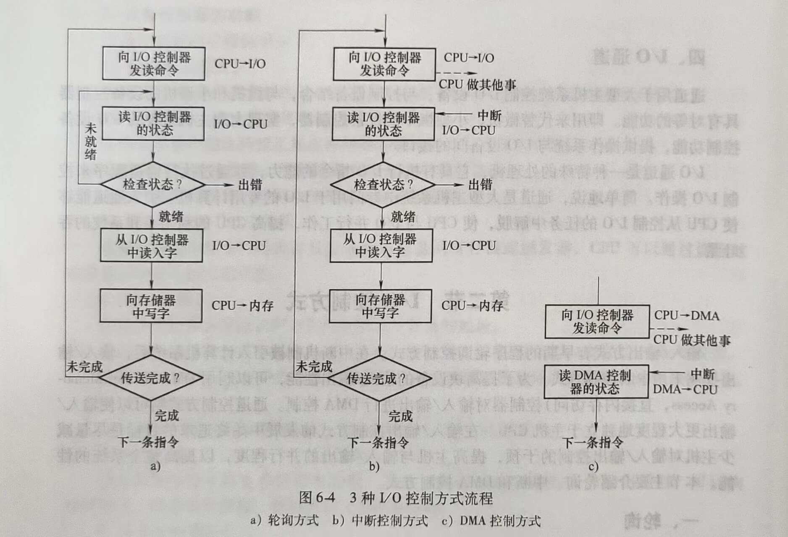
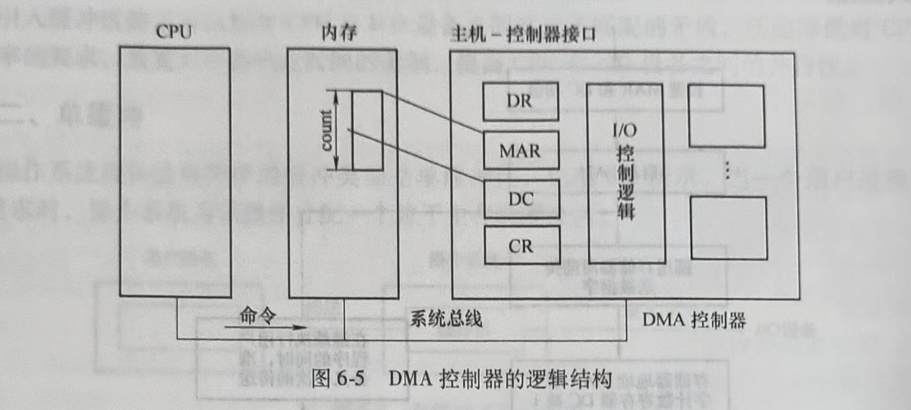
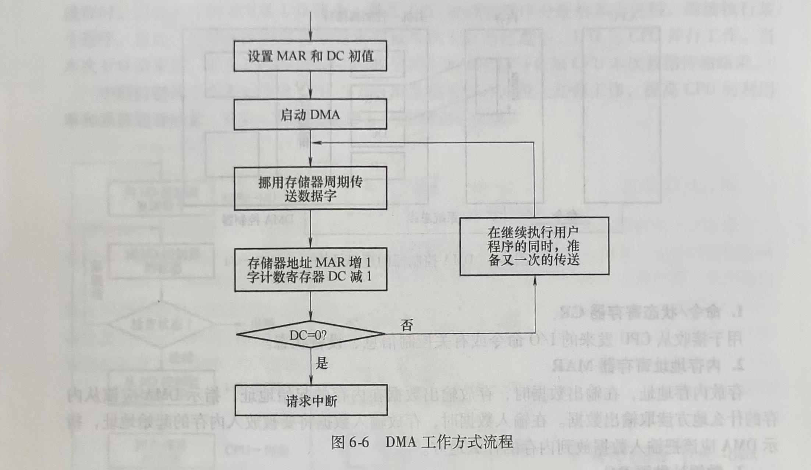

# 第二节 I/O控制方式

输入/输出方式有早期的程序轮询控制方式。在中断机制被引入计算机系统后，输入/输出控制采用中断控制方式。为了提高块设备的输入/输出性能，可以利用DMA(Direct Memory Access，直接内存访问)控制器对输入/输出进行DMA控制。通道控制方式则可以使输入/输出更大程度地独立于主机CPU。在输入/输出控制方式的发展中始终追求的目标是尽量减少主机对输入/输出控制的干预，提高主机与输入/输出的并行程度，以提高整个系统的性能。本节主要介绍轮询、中断和DMA控制方式。

## 一、轮询

早期的计算机系统，因为没有中断机制，处理器对输入/输出的控制不得不采取程序轮询的方式。采用这种控制方式，主机试图发送I/O控制命令之前，先通过反复检测设备控制器状态寄存器的忙/闲标志位，若设备“忙”，主机继续检测该标志位，直到该位为“空闲”，主机发送I/O指令。在主机发送完/0指令后，设备控制器把状态寄存器的忙/闲标志位再置成“忙”，主机再次进人轮询状态，以检测本次输人/输出是否结束。这种控制方式使CPU经常处于由于输入/输出而造成的循环测试状态，造成CPU的极大浪费，影响整个系统的吞吐量。

## 二、中断

现代计算机系统广泛采用中断控制方式完成对I/O的控制。采用中断控制方式的I/O工作模式是CPU执行进程中，发出输入/输出请求，若此时I/O设备忙，则进程阻塞等待。当处于“忙”状态的设备工作完毕，通过中断控制器发出中断请求信号，CPU响应中断，执行对应该设备的中断处理程序，然后唤醒因等待该设备而被阻塞的进程。CPU继续执行这个进程时，向设备控制器发送I/O指令，然后CPU被调度程序分配给某个进程，继续执行某个程序。自此，在设备控制器控制设备完成本次I/O的过程中，I/O与CPU并行工作。当本次I/O结束后，设备控制器通过向CPU发送中断请求信号告知CPU本次数据传输结束。

中断控制的工作方式能使CPU与I/O设备在某些时间段上并行工作，提高CPU的利用率和系统的吞吐量。图6-4所示为3种I/O控制方式流程。

## 三、DMA控制方式

对于磁盘驱动器这类的设备，每次数据传输量较大，采用中断控制方式，传输一个数据块就需要进行多次中断处理。典型情况下，一个数据块大小为512B，采用中断控制方式，若磁盘控制器中数据寄存器为一个字节大小，则每传输完一个字节，就需要CPU执行一次中断处理。为了进一步提高I/O的速度和CPU与I/O的并行程度，可以采用DMA控制方式。

DMA控制需要特殊结构的设备控制器，DMA控制器的逻辑组成包括3部分：主机与DMA的接口、DMA与设备的接口，以及I/O控制逻辑。

为了实现主机与设备控制器之间成块数据的传送，在DMA控制器中设计了4类寄存器：命令/状态寄存器CR、内存地址寄存器MAR、数据寄存器DR和数据计数器DC。DMA控制器的逻辑结构如图6-5所示。

### 1.命令/状态寄存器CR

用于接收从CPU发来的I/O命令或有关控制信息、设备状态。

### 2.内存地址寄存器MAR

存放内存地址，在输出数据时，存放输出数据在内存的起始地址，指示DMA应该从内存的什么地方读取输出数据。在输入数据时，存放输入数据将要被放入内存的起始地址，指示DMA应该把输入数据放到内存的什么地方。

### 3.数据计数器DC

指示DMA,本次向CPU发中断信号前要读或写数据的次数。

### 4.数据寄存器DR

用于暂存DMA传输中要输入或输出的数据。

下面以从磁盘读数据为例，说明DMA控制方式的工作原理，以及DMA控制和中断控制的区别。

1)没有使用DMA时磁盘读数据的过程。

①首先控制器一个比特一个比特地从设备完整地读出一块数据放入内部缓冲区中。

②确认该块数据的正确性。

③控制器发中断信号，CPU执行中断处理程序，从控制器的设备寄存器中将数据读入内存。

2)通过DMA从磁盘读数据的过程。

当CPU要从磁盘读入一个数据块时，便向磁盘控制器发送一条读命令。该命令被送到其中的命令寄存器CR中。同时，CPU将本次读入数据将要放在内存中的起始地址送DMA的MAR寄存器，将本次要读的字节数送DC寄存器。然后，启动DMA控制器进行数据传送。在DMA控制输入的过程中，CPU可以执行其他的进程。当本次读入的数据全部传送完毕后，DMA向CPU发送中断请求。

在DMA控制磁盘读入数据的过程中，每读入一个字（节），便将该字（节）送到当前MAR指示的内存单元中，然后MAR的值递增，以指向下一个内存单元。DC减1，若DC递减后的值不为O，说明本次数据传送没有结束，继续在DMA控制下传送下一个字节；若DC减1后变为O，说明本次数据传输结束，由DMA向CPU发中断请求。图6-6所示为DMA工作方式流程。

