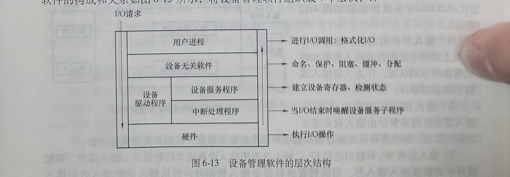
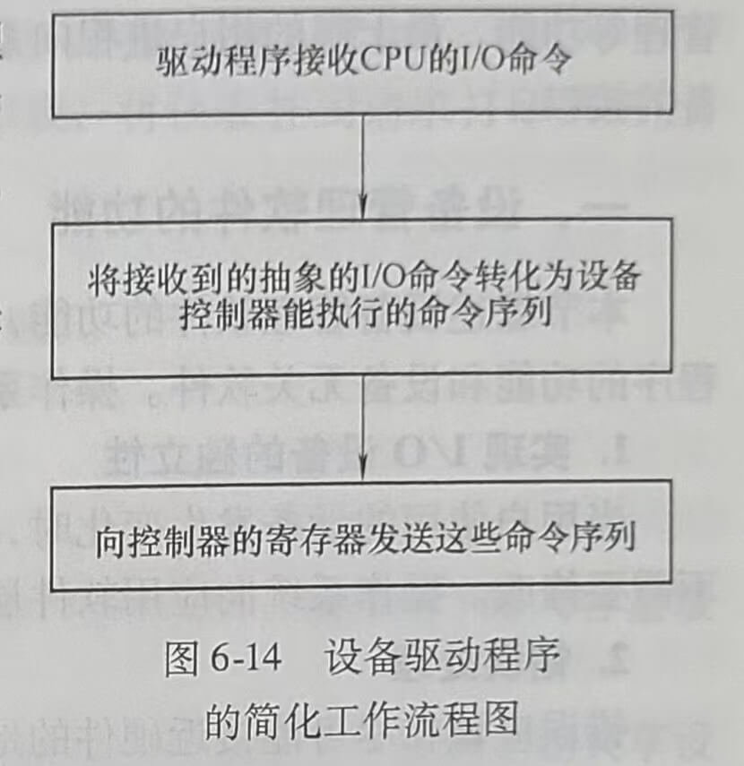

# 第五节 I/O软件管理

I/O软件的总体目标是将软件组织成一种层次结构，低层软件用来屏蔽硬件的具体细节，高层软件则主要是为用户提供一个简洁、规范的界面。用户程序及操作系统中设备管理软件的构成和关系如图6-13所示，将设备管理软件组织成4个层次，即

1)用户层软件。

2)与设备无关的软件层。

3)设备驱动程序。

4)中断处理程序（底层）。

设备管理软件与硬件关系最密切的是设备驱动程序，包括设备服务程序和中断处理程序。设备驱动程序上层是设备无关软件，通常完成设备命名、设备分配、设备独立性和缓冲管理等功能。最上层的用户进程向系统发送I/O请求，显示I/O操作的结果，提供用户与设备的接口。

## 一、设备管理软件的功能

本节综述设备管理软件的功能，后面的内容分别说明设备驱动程序、I/O设备中断处理程序的功能和设备无关软件。操作系统设备管理软件(I/O软件)应该实现以下功能。

### 1.实现I/O设备的独立性

当用户使用的设备发生变化时，比如用激光打印机替代了喷墨打印机，应用程序的代码不需要修改。操作系统向应用软件层提供的这一支持方便了应用程序的开发和维护。

### 2.错误处理

错误应该在尽可能接近硬件的地方处理，只有在低层软件处理不了的情况下才通知高层软件。例如，控制器进行一个读操作，它应该尽量处理并完成操作，如果因为某种故障控制器处理不了，则交给设备驱动程序，可能只需重读一次就可以解决问题。

### 3.异步传输

多数物理I/O是异步传输，即CPU在启动传输操作后便可以转向其他工作，直到中断到达。

### 4.缓冲管理

由于设备之间的速度差异，必须提供缓冲管理，为所有的块设备和字符设备提供缓冲管理功能，并向高层软件屏蔽由于设备差异带来的缓冲管理实现的具体细节。

### 5.设备的分配和释放

对共享设备和互斥设备应该采取不同的方式为用户请求分配设备。设备使用完毕，要完成对设备的释放。

### 6.实现I/O控制方式

针对不同的设备提供不同的I/O控制方式，如对打印机、键盘等字符设备实现中断控制。而对磁盘这样的块设备既可以采用中断控制方式，也可以采用DMA控制方式。但是，鉴于磁盘传输数据的特点，一般都采用DMA控制方式。

操作系统通过将I/O软件组织成如图6-13所示的4个层次，可以合理、高效地实现以上目标。

## 二、中断处理程序

I/O中断处理程序的作用是将发出I/O请求而被阻塞的进程唤醒。用户进程在发出I/O请求后，由于等待I/O的完成而被阻塞。CPU转去执行其他任务，当I/O任务完成，控制器向CPU发中断请求信号，CPU转去执行中断处理程序，由中断处理程序唤醒被阻塞的设备用户进程。

## 三、设备驱动程序

设备驱动程序是I/O进程与设备控制器之间的通信程序，其主要任务是接受上层软件发来的抽象的I/O请求，如read或write命令，把它们转换为具体要求后，发送给设备控制器，启动设备去执行。此外，它也将由设备控制器发来的信号传送给上层软件。设备驱动程序中包含所有与设备相关的代码。每个设备驱动程序只处理一种设备，或者一类紧密相关的设备。开发驱动程序需要知道某类设备控制器有多少个寄存器及它们的用途。驱动程序工作的简化流程如图6-14所示。

下面举例说明驱动程序的作用。例如，当有一个读第n块磁盘的请求时，磁盘驱动程序的工作如下。

1)计算出所请求块的物理地址。

2)检查驱动器电机是否正在运转。

3)检查磁头臂是否定位在正确的柱面。

4)确定需要哪些控制器命令及命令的执行顺序。

5)向设备控制器的设备寄存器中写入命令。

6)I/O完成后，向上层软件传送数据。

设备驱动程序属于操作系统的内核程序，但是一般由设备生产厂商开发，销售硬件设备时附送给用户，并不是由操作系统厂商提供。设备驱动程序要遵循操作系统提供的内核与设备驱动的接口标准。由于不同的操作系统提供的内核与驱动程序接口不一样，要使驱动程序在不同的操作系统环境中运行，对同一种设备需要开发针对不同操作系统的驱动程序。人们经常说某个驱动程序是for Windows或者for Linux的，就是出于这个原因。

## 四、与硬件无关的软件

设备无关软件和设备驱动程序之间的精确界限在各个系统中不尽相同。对于一些以设备无关方式完成的功能，在实际中由于考虑到执行效率等因素，也可以考虑由驱动程序完成。

设备无关I/O软件的功能如下。

1)设备命名：将设备名映射到相应的驱动程序。

2)设备保护：为设备设置合理的访问权限。

3)提供独立于设备的块大小。例如，不同磁盘的扇区大小可能不同，设备无关软件屏蔽了这一事实并向高层软件提供统一的数据块大小。例如，扇区大小为512B,若逻辑磁盘块大小为1KB，则软件发出读两个连续扇区的命令，将连续两个扇区作为一个大小为1KB的逻辑块来处理。

4)为块设备和字符设备提供必要的缓冲技术。

5)块设备的存储分配。当创建了一个文件并向其输入数据时，该文件必须被分配新的磁盘块。为了完成分配工作，操作系统需要为每个磁盘都配置一张记录空闲盘块的表或位图，但定位一个空闲块的算法是独立于设备的，因此可以在高于驱动程序的层次处理。

6)分配和释放独立设备。

7)错误处理。

