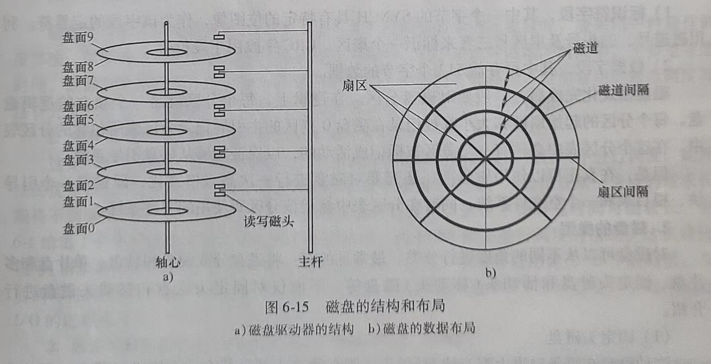
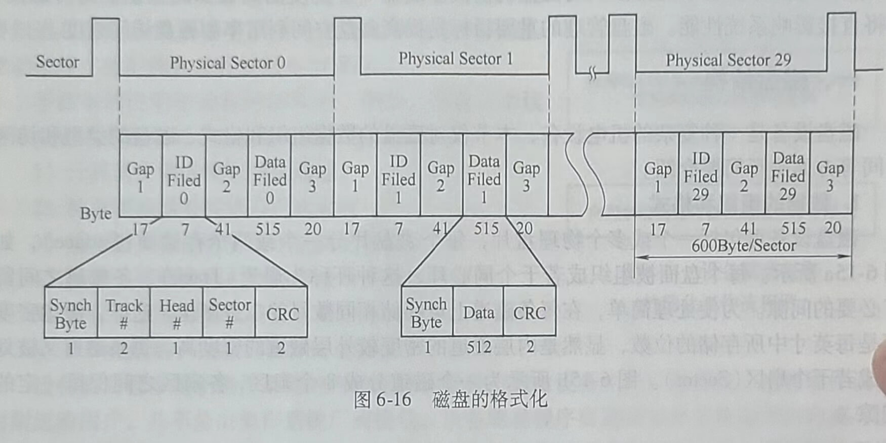
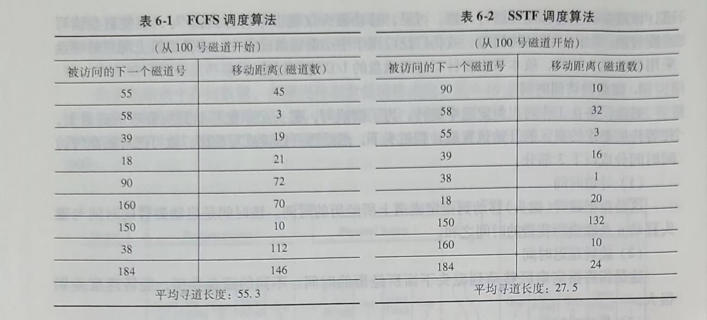
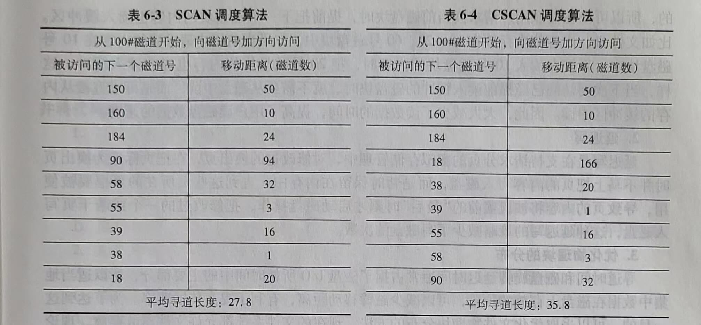

# 第六节 磁盘管理

磁盘存储器不仅容量大，存取速度快，而且可以实现随机存取，是存放大量程序和数据的理想设备。在现代计算机系统中都配置了磁盘存储器，并以它为主存放文件。计算机系统中对文件的操作，基本上都涉及对磁盘的访问。磁盘I/O速度的高低和磁盘系统的可靠性，都将直接影响系统性能。磁盘管理的重要目标是提高磁盘空间利用率和磁盘访问速度。

## 一、磁盘结构

磁盘设备是一种复杂的机电设备，本节仅对磁盘的数据组织和格式、磁盘的类型和访问时间等方面进行简要介绍。

### 1.数据的组织和格式

磁盘设备可包括一个或多个物理盘片，每个磁盘片分一个或两个存储面(Surface)，如图6-l5a所示。每个盘面被组织成若干个同心环，这种环称为磁道(Track)，各磁道之间留有必要的间隙。为使处理简单，在每条磁道上可存储相同数目的二进制位。这样，磁盘密度即是每英寸中所存储的位数，显然是内层磁道的密度较外层磁道的密度高。每条磁道又被划分成若干个扇区(Sector)。图6-l5b所示为一个磁道分成8个扇区，各扇区之间保留一定的间隙。

一个物理记录存储在一个扇区上，磁盘上存储的物理记录数目是由扇区数、磁道数及磁盘面数所决定的。

为了提高磁盘的存储容量，充分利用磁盘外磁道的存储能力，现代磁盘不再把内外磁道划分为相同数目的扇区，而是利用外层磁道容量较内层磁道大的特点，将盘面划分成若干条环带，使得同一环带内的所有磁道具有相同的扇区数。显然，外层环带的磁道拥有较内层环带的磁道更多的扇区。为了减少这种磁道和扇区在盘面分布的几何形式变化对驱动程序的影响，大多数现代磁盘都隐藏了这些细节。

为了在磁盘中存储数据，必须先将磁盘低级格式化。图6-16显示出了一种温盘（温切斯特盘)中一条磁道格式化的情况。其中每条磁道含有30个固定大小的扇区，每个扇区容量为600个字节。其中512个字节存放数据，其余的用于存放控制信息。每个扇区包括两个字段。

1)标识符字段，其中一个字节的SYNCH具有特定的位图像，作为该字段的定界符。利用磁道号、磁头号及扇区号三者来标识一个扇区。CRC字段用于段校验。

2)数据字段，其中可存放512个字节的数据。

磁盘格式化完成后，一般要对磁盘分区。在逻辑上，每个分区就是一个独立的逻辑磁盘。每个分区的起始扇区和大小都被记录在磁盘0扇区的主引导记录分区表所包含的分区表中。在这个分区表中必须有一个分区被标记成活动的，以保证能够从硬盘引导系统。

但是，在真正可以使用磁盘前，还需要对磁盘进行一次高级格式化，即设置一个引导块、根目录和一个空文件系统，同时在分区表中标记该分区所使用的文件系统。

### 2.磁盘的类型

对磁盘可以从不同的角度进行分类。最常见的有：将磁盘分成硬盘和软盘、单片盘和多片盘、固定头磁盘和活动头（移动头）磁盘等。下面仅对固定头磁盘和移动头磁盘进行介绍。

(1)固定头磁盘

这种磁盘在每条磁道上都有读/写磁头，所有的磁头都被装在一个刚性磁臂甲。通过这些磁头可访问各磁道且进行并行读/写，有效地提高了磁盘的I/O速度。这种结构的磁盘主要用于大容量磁盘上。

(2)移动头磁盘

这种磁盘每一个盘面仅配有一个磁头，也被装人磁臂中。为了能访问该盘面的所有磁道，该磁头必须能移动并进行寻道。可见，移动磁头仅能以串行方式读/写，致使磁盘读写速度较慢。但由于其结构简单，故仍广泛应用于中小型磁盘设备中。在微型机上配置的硬盘采用移动磁头结构，故本节主要针对这类磁盘的I/O进行讨论。

### 3.磁盘的访问时间

磁盘设备在工作时以恒定速率旋转。为了读或写，磁头必须能移动到所要求的磁道上，并等待所要求的扇区的开始位置旋转到磁头下，然后再开始读或写数据。故可把对磁盘的访问时间分成以下3部分。

(1)寻道时间

这是指把磁臂（磁头）移动到指定磁道上所经历的时间。该时间是启动磁臂的时间与磁头移动n条磁道所花费的时间之和。

(2)旋转延迟时间

这是指将指定扇区移动到磁头下面所经历的时间。不同的磁盘类型，旋转速度差别很大。

(3)传输时间

这是指把数据从磁盘读出或向磁盘写入数据时所经历的时间。其大小与每次所读/写的字节数和旋转速度有关。

在磁盘访问时间中，寻道时间和旋转延迟时间基本上都与所读/写数据的多少无关，而且寻道时间和旋转延迟时间通常占据了访问时间中的大头。适当地集中数据在磁盘上存放的位置，可以减少磁臂移动距离，这将有利于提高传输速率。

## 二、磁盘调度

磁盘是可供多个进程共享的设备，当有多个进程都要求访问磁盘时，应采用一种最佳调度算法，以使各个进程对磁盘的平均访问时间最短。由于在访问磁盘的时间中，主要是寻道时间，因此磁盘调度的一个重要目标是使磁盘的平均寻道时间最少。目前常用的磁盘调度算法有先来先服务、最短寻道时间优先及扫描等算法，下面逐一进行介绍。

### 1.先来先服务(First Come First Served,FCFS)

这是一种最简单的磁盘调度算法。它根据进程请求访问磁盘的先后顺序进行调度。此算法的优点是公平、简单，且每个进程的请求都能依次得到处理，不会出现某一进程的请求长期得不到满足的情况。但此算法由于未对寻道进行优化，致使平均寻道时间可能较长。表6-1给出了有9个进程先后提出磁盘I/O请求时，按FCS算法进行调度的情况。这里将进程号（请求者）按他们发出的请求的先后顺序排队。这样，平均寻道距离为55.3条磁道，与后面即将讲到的几种调度算法相比，其平均寻道距离较大，故FCFS算法仅适用于请求磁盘I/O的进程数目较少的场合。

### 2.最短寻道时间优先(Shortest Seek Time First,SSTF)

该算法选择这样的进程：其要求访问的磁道与当前磁头所在的磁道距离最近，以使每次的寻道时间最短。但这种算法不能保证平均寻道时间最短。表6-2给出了SSTF算法进行调度时，各进程被调度的顺序、每次磁头移动的距离，以及9次调度磁头平均移动的距离。比较表6-1和表6-2可以看出，SSTF算法的每次磁头移动平均距离明显低于FCFS的距离，因而SSTF较之FCFS有更好的寻道性能，故曾一度被广泛采用。

### 3.扫描(SCAN)算法

(1)进程“饥饿”现象

SSTF算法虽然能获得较好的寻道性能，但却可能导致某个进程发生“饥饿”(Starvation)现象。因为只要不断有新进程的请求到达，且其所要访问的磁道与磁头当前所在磁道的距离较近，这种新进程的I/O请求必然优先被满足，导致所要访问的磁道距离与磁头所在位置较远的磁盘任务总是不能得到调度。对SSTF算法略加修改后所形成的SCAN算法可防止进程出现“饥饿”现象。

(2)SCAN算法

该算法不仅考虑到要访问的磁道与当前磁道的距离，更优先考虑磁头当前的移动方向。例如，当磁头正在自里向外移动时，SCAN算法所考虑的下一个访问对象应是其要访问的磁道既在当前磁道之外，又是距离最近的。这样自里向外地访问，直至再无更外的磁道需要访问时，才将磁臂换为自外向里移动。这时，同样也是每次选择这样的进程来调度，即要访问的磁道在当前位置内距离最近者。这样，磁头逐步地自外向里移动，直至再无更里面的磁道
要访问，从而避免出现“饥饿”现象。由于在这种算法中磁头移动的规律颇似电梯的运行，因而又常称之为电梯调度算法。表6-3给出了按SCAN算法对9个进程进行调度及磁头移动的情况。

### 4.循环扫描(CSCAN)算法

SCAN算法既能获得较好的寻道性能，又防止了“饥饿”现象，故被广泛用于大、中、小型机器和网络中的磁盘调度。但SCAN也存在这样的问题：当磁头刚从里向外移动而越过了某一磁道时，恰好又有一进程请求访问此磁道。这时，该进程必须等待，待磁头继续自里向外，然后再自外向里扫描完所有要访问的磁道后，才处理该进程的请求，致使该进程的请求被大大推迟。为了减少这种延迟，CSCAN算法规定磁头是单向移动。例如，只是自里向外移动，当磁头移到最外的磁道后，磁头立即返回到最里的要访问的磁道，亦即将最小磁道号紧接着最大磁道号构成循环，进行循环扫描。表6-4给出了CSCAN算法对9个进程调度的顺序及每次磁头移动的距离。

### 5.NStepSCAN和FSCAN调度算法

(1)NStepSCAN算法

在SSTF、SCAN及CSCAN几种调度算法中，都可能会出现磁臂停留在某处不动的情况，例如，有一个或几个进程对某一磁道有较高的访问频率，即这个（些）进程反复请求对某磁道的I/O操作，从而垄断了整个磁盘设备。把这一现象称为“磁臂粘着”(Armstickiness)，在高密度磁盘上容易出现此情况。NStepSCAN算法是将磁盘请求队列分成若干个长度为N的子队列，磁盘调度将按FCFS算法依次处理这些子队列。每处理一个队列时又是按SCAN算法，对一个队列处理完后，再处理其他队列。当正在处理某子队列时，如果又出现新的磁盘I/O请求，便将新请求进程放入其他队列，这样就可避免出现磁臂粘着现象。当N值取得很大时，会使NStepSCAN算法的性能接近于SCAN算法的性能。当N=1时，NStepSCAN算法便蜕化为FCFS算法。

(2)FSCAN算法

FSCAN算法实质上是NStepSCAN算法的简化，即FSCAN只将磁盘请求队列分成两个子队列。一个是由当前所有请求磁盘I/O的进程形成的队列，由磁盘调度按SCAN算法进行处理。在扫描期间，将新出现的所有请求磁盘I/O的进程，放入另一个等待处理的请求队列。这样，所有的新请求都将被推迟到下一次扫描时处理。

## 三、提高磁盘I/O速度的方法

磁盘的I/O速度远低于内存的访问速度，通常要低上4~6个数量级。因此，磁盘的I/O已成为计算机系统的瓶颈。本节介绍儿种已经广泛采用的提高磁盘I/O速度的方法。

### 1.提前读

简单来说，提前读就是系统根据现在用户请求读的内容，把预计最近不久可能要读的内容与现在请求读的内容一起提前读人内存。用户读文件时，经常是顺序读文件内容，文件的存放是按内容顺序放人磁盘块的。操作系统知道文件内容是按照怎样的顺序存放在磁盘块中的，所以可以在按照用户请求读当前磁盘块时，提前把下一个磁盘块的内容也读入缓冲区。比如文件f1，内容依次存放在10、20、60号磁盘块中，如果当前用户请求读的内容在10号磁盘块中，系统在读入10号磁盘块的内容时，把20号磁盘块的内容也提前读入缓冲。这样，当下次要访问已经提前读入缓冲的磁盘块时，就不需要从磁盘中读，而是可以直接从内存的缓冲区中读。因此，大大减少了读数据的时间，提高了用户读磁盘数据的速度

### 2.延迟写

延迟写是在支持请求分页的虚拟存储管理中，对修改过的换出页，在把页标记为换出页时并不马上把页的内容写入磁盘，而是暂时保留在内存中，直到这些页所在的页框要被使用，导致页的内容将被覆盖前的“最后”时刻才启动磁盘操作，把修改过的一个或若干页写入磁盘，这种延迟写的策略减少了写磁盘的次数。

### 3.优化物理块的分布

寻道时间和磁盘旋转延迟时间通常占据了磁盘I/O所耗时间中的主要部分，所以适当地集中数据在磁盘上存放的位置，可以减少磁臂移动距离，有利于提高传输速率。为了达到这一目的，可以采取优化文件物理块分布的方法。现在的文件系统都允许文件离散存放。理论上，一个文件的物理块可以分散在磁盘的任意位置。但是，如果将一个文件存放在过于分散的多个磁盘块上，会增加磁头的移动距离。例如，如果分配给一个文件的第一个磁盘块在最里面的磁道上，而第二个磁盘块在最外面的磁道上，当读完该文件的第一个磁盘块时，需要把磁头从最里面的磁道移动到最外面一个磁道。而如果把这个文件存放在同一个磁道或者相邻的两个磁道上，读这个文件的两个磁盘块磁头的移动距离会短得多，读磁盘的速度会快得多。

因此，现在的文件系统基本都会考虑对文件的位置进行优化，原则就是尽可能地把一个文件存放在同一个磁道或者相邻的磁道上。实现这个原则的技术一个是以连续的几个扇区即一个簇作为磁盘块的分配单位，另一个技术是把磁盘分成块组，一个块组中的不同簇都在相邻的磁道上，一个文件尽可能地放在同一个块组中，如Liux的Ext2文件系统。

### 4.虚拟盘

虚拟盘是指利用内存空间去仿真磁盘，又称RAM盘。虚拟盘可以接受所有标准的磁盘操作，但这些操作的执行不是在磁盘上，而是在内存中。因此，对虚拟盘的访问比对磁盘的访问速度快。用户对虚拟盘的操作与对磁盘的操作完全相同，所有实现细节对用户都是透明的。虚拟盘通常用于存放临时性文件，如编译程序所产生的目标程序等。虚拟盘与磁盘高速缓存虽然都位于内存中，但是虚拟盘中的内容操作完全由用户控制，而高速缓存中的内容则
是由操作系统控制的。

### 5.磁盘高速缓存

磁盘高速缓存是指内存的一块存储空间，用来暂存从磁盘中读出的一系列盘块中的信息。因此，这里的高速缓存是一组逻辑上属于磁盘，而物理上是驻留在内存中的盘块。高速缓存在内存中可分成两种形式。第一种是在内存中开辟一个单独的存储空间来作为磁盘高速缓存，其大小是固定的，不会受应用程序多少的影响。第二种是把所有未利用的内存空间变为一个缓冲池，供请求分页系统和磁盘I/O时（作为磁盘高速缓存）共享。此时，高速缓存的大小不再是固定的。当磁盘频繁发生I/O时，该缓冲池可能包含更多的内存空间。而在应用程序运行得较多时，该缓冲池可能只剩下较少的内存空间。

