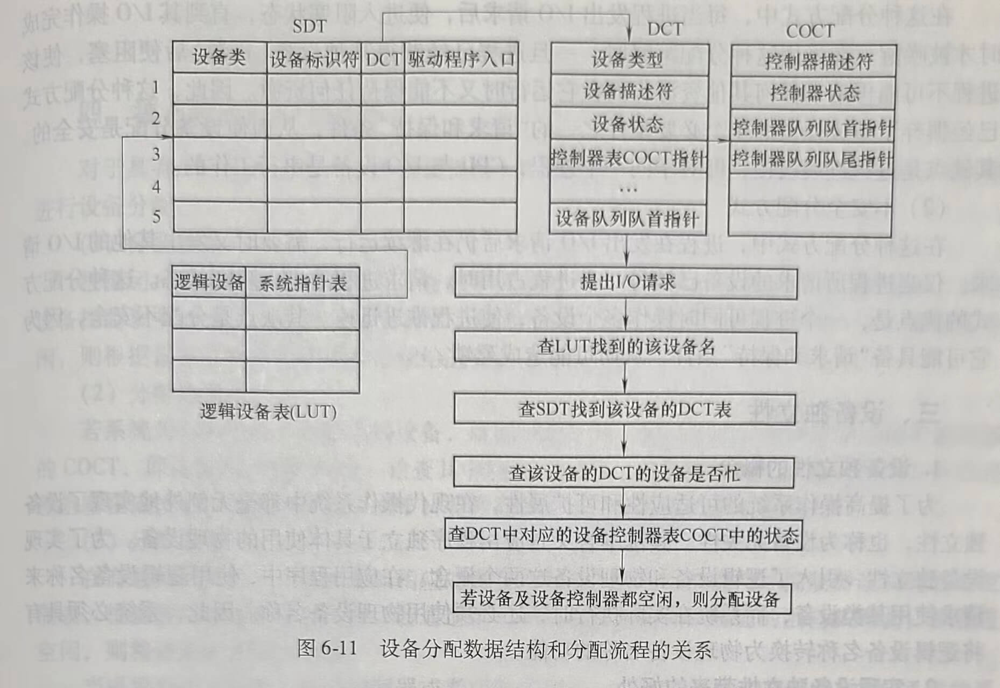
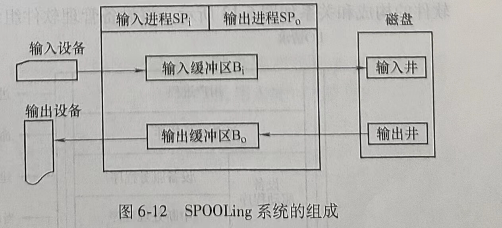

# 第四节 设备分配

在多道程序环境下，系统中的设备不允许用户自行使用，而必须由系统分配。每当进程向系统提出I/O请求时，设备分配程序便按照一定的策略，把设备分配给用户。设备分配功能的完成，需要记录设备情况的数据结构和设备分配算法。

## 一、设备分配中的数据结构

支持设备分配的数据结构需要记录设备的状态（忙或空闲）、设备类型等基本信息。下面是一种支持设备分配的数据结构设计方案，该方案包括设备控制表、控制器控制表、通道控制表和系统设备表。这些数据结构记录了设备、控制器、通道的状态及控制器进行控制所需要的信息。

### 1.设备控制表DCT(Device Control Table)

系统为每个设备建立一张设备控制表，多台设备的设备控制表构成设备控制表集合。每张设备控制表包含以下信息。

1)设备类型。

2)设备标识符。

3)设备状态：忙/闲。

4)指向控制器表的指针。

5)重复执行的次数或时间。

6)设备队列的队首指针。设备队列也称设备请求队列，是因请求设备而被阻塞的进程的PCB构成的队列。设备队列的队首指针指向队首的PCB。

### 2.控制器控制表COCT(Controller Control Table)

系统为每个控制器设置一张用于记录该控制器信息的控制器控制表，控制器控制表中通常包含以下几个字段。

1)控制器标识符。

2)控制器状态。

3)与控制器相连接的通道表指针。

4)控制器队列的队首指针。

5)控制器队列的队尾指针。

### 3.通道控制表CHCT(Channel Control Table)

在一些主机系统中还有通道设备，系统会为每个通道设备设置一张通道控制表，通道控制表包括以下几个字段。

1)通道标识符。

2)通道状态。

3)与通道连接的控制器表首址。

4)通道队列的队首指针。

5)通道队列的队尾指针。

### 4.系统设备表SDT(System Device Table)

系统设备表是系统范围的数据结构，其中记录了系统中全部设备的情况。每个设备占一个表目，其中包括设备类型、设备标识符、设备控制表及设备驱动程序的入口地址。

系统设备表、控制器控制表、设备控制表之间的关系及利用数据结构进行设备分配的流
程如图6-11所示，其中的逻辑设备表LUT的用途及一般结构见后面“三、设备独立性”一节。



## 二、设备分配

为了使系统有条不紊地工作，系统在分配设备时应考虑以下3个因素。

1)设备的固有属性。

2)设备分配算法。

3)设备分配时的安全性。

### 1.设备的固有属性

在分配设备时，首先应考虑与设备分配有关的设备属性。设备的固有属性可分成3种：第一种是独占性，指这种设备在一段时间内只允许一个进程独占，即“临界资源”。第二种是共享性，指这种设备允许多个进程同时共享。第三种是可虚拟性，指设备本身虽是独占设备，但经过某种技术处理，可以把它改造成虚拟设备。对上述的独占、共享、可虚拟3种设备应采取不同的分配策略。

#### (1)独占设备

对于独占设备，应采用独享分配策略，即将一个设备分配给某进程后，使由该进程独占，直至进程完成或释放该设备。然后，系统才能再将该设备分配给其他进程使用。这种分配策略的缺点是，设备得不到充分利用，而且还可能引起死锁。

#### (2)共享设备

对于共享设备，可同时分配给多个进程使用，此时需要注意对这些进程访问该设备的先后顺序进行合理的调度。

#### (3)可虚拟设备

由于可虚拟设备是指一台物理设备在采用虚拟技术后可变成多台逻辑上的所谓虚拟设备，因而一台可虚拟设备是可共享的设备，可以将它同时分配给多个进程使用，并对进程访问该设备的先后顺序进行控制。

### 2.设备分配算法

对设备分配的算法，与进程调度的算法有相似之处，但相对简单，通常只采用以下两种分配算法。

#### (1)先来先服务

当有多个进程对同一设备提出I/O请求时，该算法是根据进程对某设备提出请求的先后顺序将这些进程排成一个设备请求队列，设备分配程序总是先把设备分配给队首进程。

#### (2)基于优先权的分配算法

在进程调度中的这种策略，是优先权高的进程优先获得处理机。如果对这种高优先权进程所提出的I/O请求也赋予高优先权，显然有助于这种进程尽快完成。在利用该算法形成设备队列时，将优先权高的进程排在设备队列前面，而对于优先级相同的I/O请求，则按先来先服务原则排队。

### 3.设备分配方式

从进程运行的安全性上考虑，设备分配有以下两种方式。

#### (1)安全分配方式

在这种分配方式中，每当进程发出I/O请求后，便进人阻塞状态，直到其I/O操作完成时才被唤醒。在采用这种分配策略时，一旦进程已经获得某种设备（资源）后便阻塞，使该进程不可能再请求任何其他资源，而在它运行时又不能保持任何资源。因此，这种分配方式已经摒弃了造成死锁的4个必要条件之一的“请求和保持”条件，从而使设备分配是安全的。其缺点是进程进展缓慢，即对于同一个进程，CPU与I/O设备是串行工作的。

#### (2)不安全分配方式

在这种分配方式中，进程在发出I/O请求后仍在继续运行，需要时又发出其他的I/O请求。仅当进程所请求的设备已被另一个进程占用时，请求进程才进人阻塞状态。这种分配方式的优点是，一个进程可同时操作多个设备，使进程推进迅速。其缺点是分配不安全，因为它可能具备“请求和保持”条件，从而可能造成死锁。

## 三、设备独立性

### 1.设备独立性的概念

为了提高操作系统的可适应性和可扩展性，在现代操作系统中都毫无例外地实现了设备独立性，也称为设备无关性。其基本含义是应用程序独立于具体使用的物理设备。为了实现设备独立性，引入了逻辑设备和物理设备这两个概念。在应用程序中，使用逻辑设备名称来请求使用某类设备，而系统在实际执行时，还必须使用物理设备名称。因此，系统必须具有将逻辑设备名称转换为物理设备名称的功能。

### 2.实现设备独立性带来的好处

实现设备独立性带来的好处如下。

1)应用程序与物理设备无关，系统增减或变更外围设备时不需要修改应用程序。

2)易于处理输入/输出设备的故障。例如，某台打印机发生故障时，可用另一台不同型号、不同品牌的打印机替换，而不用修改应用程序。

3)提高了系统的可靠性，增加了设备分配的灵活性。

### 3.设备独立软件

设备独立软件完成的主要功能如下。

#### (1)执行所有设备的公有操作

执行的操作包括：独占设备的分配与回收、将逻辑设备名映射为物理设备名、对设备进行保护、缓冲管理和差错控制。为了实现逻辑设备名到物理设备名的转化，可以利用称为逻辑设备表LUT(Logical Unit Table)的数据结构。在该表的每个表目中都包含逻辑设备名、物理设备名。LUT的设置可采取两种方式：为整个系统设置一张LUT或者为每个用户设置一张LUT。

#### (2)向用户层软件提供统一的接口

设备独立软件向用户层屏蔽访问硬件的细节，向应用软件和最终用户提供简单、统一的访问接口。例如，对各种设备的读操作在应用程序中都使用read函数调用，写操作都使用write函数调用。

例6-1：在编程级，如果要在程序中在打印机/dev/ptl上输出字符串“hello”，用下列语句即可。
```c
fd open("/dev/ptl");
write("hello");
close(fd);
```

## 四、独占设备的分配程序

对于具有I/O通道的系统，在进程提出I/O请求后，系统的设备分配程序可按下列步骤进行设备分配。

(1)分配设备

根据用户请求的设备的物理名，查找系统设备表，从中找出该设备的设备控制表，检查设备控制表中的设备状态字。若设备忙，则将进程阻塞在该设备的阻塞队列中；若设备空闲，则根据设备分配算法将设备分配给进程。

(2)分配控制器

若系统为进程分配了其请求的设备，就到该设备的控制表中找出与该设备连接的控制器的COCT，即设备控制器控制表，检查其中的状态字段。若该控制器忙，则将请求I/O的进程阻塞在该设备控制器的阻塞队列中；若控制器空闲，则将它分配给进程。

(3)分配通道

在有通道的系统中，还需要从相应的设备控制器控制表中找到与该控制器连接的通道控制表，检查表中的通道状态字段。若通道忙，则将进程阻塞在该通道的阻塞队列上；若通道空闲，则将该通道分配给进程。

当进程获得了设备、设备控制器或者获得了设备、设备控制器和通道时（在有通道的系
统中)，系统的本次设备分配才算成功，系统可以启动进程的I/O。

## 五、SPOOLing技术

### 1.什么是SP00Ling

在多道程序环境下，利用一道程序来模拟脱机输入时的外围控制机的功能，把低速I/O设备上的数据传送到高速输出磁盘上，再利用另一道程序来模拟脱机输出时外围控制机的功能，把数据从磁盘传送到低速输出设备上。这种在联机情况下实现的同时外围操作称为SPOOLing (Simultaneous Perihernal Operations On-Line)。

#### (1)SPOOLing系统的组成

SPOOing系统的组成如图6-12所示。



1)输入井和输出井。这是位于磁盘上的两个分别存放输入数据和输出数据的存储区域，作为大量输入或输出数据的缓存。

2)输入缓冲区和输出缓冲区。输入缓冲区用来暂存由输入设备送来的输入数据，输出缓存区用来存放从输出井送来的输出数据，以后再传给输出设备。

3)输入进程SPi和输出进程SP0。输入进程把输入设备送来的数据送入输入缓存，再把缓存中的数据送入输入井。当消费者进程需要输入数据时，再从输人井把输入数据读入内存。

输出进程把要输出的数据从内存送入输出井，当需要输出数据时，再从输出井把数据读到输出缓存（如打印缓存），数据从输出缓存送往输出设备。

4)请求I/O队列。请求输入或输出的进程提交的输入/输出任务组成的队列。

### 2.利用SPOOLing技术实现共享打印机

当用户进程提出打印请求时，SPOOLing系统先为用户做下列两件事。

1)由输出进程在输出井中申请空闲盘块区，并将要打印的数据送入其中。

2)输出进程再为用户申请并填写一张用户请求打印表，将该表挂到请求打印队列上。当打印机空闲时，输出进程完成以下动作。

①从请求打印队列队首取一张请求打印表。

②将打印数据从输出井送到打印机缓冲区（输出缓冲区）。

③打印。

④打印完毕，若打印队列不为空，则转第①步。

SPOOLing系统的特点如下。

1)提高了I/O速度。由于使用了磁盘作为低速设备（如打印机、磁带等）的大容量缓存，提高了输入/输出的速度。

2)将独占设备改造为共享设备。通过SPOOLing系统使独占设备变为了逻辑上的共享设备，系统可以同时接受多个用户对设备的访问请求。

3)实现了虚拟设备功能。把一台物理上只能互斥使用的设备，变为了从用户眼里看到的共享设备。宏观上看，系统可以同时响应多个用户对设备的请求。微观上看，任意时刻设备只能为某一个用户进程服务，SPOOLing系统实现了将独占设备变换成多个逻辑设备的功能。


