# 第四章 内存管理

<span style="border-bottom:2px solid; black;">内存是计算机系统的重要组成部分、当操作系统接收到运行某程序的命令后，要为该程序的运行分配内存资源，创建进程，并把进程的全部或部分调入内存。进程运行结束，系统要回收被撤销进程的内存空间。内存管理的目标一方面是实现内存分配、内存回收等基本内存管理功能，另一方面是要提高内存空间的利用率和内存的访问速度</span>。每个程序员都希望自己的程序能运行在一个独占的、容量充分大、访问速度足够快的存储器上。然而，事实上计算机的内存是有限的，而且是被许多应用程序共享的。处于同一内存中的不同进程之间必然会存在竞争与相互影响。操作系统的内存管理正是解决这一问题的，其目标是充分利用现有的内存资源，为应用程序提供方便的内存使用方式和一个快速、安全且充分大的存储器。

关于内存管理，需要掌握：①计算机硬件为程序的运行提供了什么样的存储器使用方式。②操作系统为应用程序的运行提供了什么样的存储服务。③操作系统怎样将多个不同的用户进程放在一个内存中，并使它们不相互干扰地并发执行。④操作系统如何为进程提供远比物理内存大得多的虚拟内存空间。带着这些问题来学习内存管理，就会理解计算机硬件、操作系统和应用程序在内存的使用上各自的角色，以及如何相互合作，从而有一个内存管理的大局观。本章将详细介绍内存管理的基本原理和实现技术。

## 第一节 存储器的层次结构

<span style="border-bottom:2px solid; black;">内存是计算机存储系统的一部分，为了更好地理解后续章节的内容，有必要先了解存储器系统的层次结构</span>。

存储器系统是一个具有<span style="border-bottom:2px solid; black;">不同容量、成本和访问时间</span>的存储设备的层次结构，如图4-1所示。


<span style="border-bottom:2px solid; black;">在这个层次系统中，从高层到低层(L0~L5),较低层的存储设备速度更慢、容量更大、价格更便宜。在最高层(L0层)，是少量的快速CPU寄存器，CPU可以在一个时钟周期内访问它们。接下来是一个或多个小型或中型的基于SRAM的高速缓存存储器，可以在几个CPU时钟周期内访问它们。然后L3层是一个大的基于DRAM的主存，可以在几十或几百个时钟周期内访问它们。L3的下层L4是慢速但容量很大的本地磁盘。L5表示有些系统可能还包括一层附加的远程服务器上的磁盘，需要通过网络来访问它们</span>。例如NTF网络文件系统这样的分布式文件系统，允许程序访问存储在远程网络服务器上的文件。

<span style="border-bottom:2px solid; black;">CPU寄存器保存最常用的数据。靠近CPU的容量小、速度快的高速缓存存储器作为速度相对较慢、容量较大的主存中数据和指令子集的缓冲区。主存暂时存放存储容量更大、速度更慢的磁盘上的数据。而这些磁盘常常又作为存储在通过网络连接的其他机器的磁盘或磁带上的数据的缓冲区</span>。

<span style="border-bottom:2px solid; black;">如果程序需要的数据是存放在CPU寄存器中的，程序执行期间在零个周期内就可以访问到它们</span>。如果存储在高速缓存中、需要1~10个周期，如果这些数据存放在主存中，访问它们就需要50~100个周期。而如果这些数据是存放在磁盘中的，要访问它们需要大约2000万个周期。因此，在编写程序、设计算法时要尽可能把最近将要访问的指令或数据存储在层次较高的地方，以便让CPU更快地访问到它们。

程序的执行遵循局部性原理。程序执行的局部性原理指出，程序在执行时呈现出局部性规律，即在一段较短的时间内，程序的执行仅局限于某个部分，相应地，它所访问的存储空间也局限于某个区域。关于程序执行的局部性原理有以下几个论点。

1) 程序在执行时，除了少部分的转移和过程调用指令以外，在大多数情况下是顺序执行的。

2) 过程调用将会使程序的执行轨迹由一部分内存区域转到另一部分内存区域。但研究表明，在大多数情况下，过程调用的深度都不超过5。这就是说，程序将会在一段时间内局限在这些过程的范围内运行。

3) 程序中存在很多循环结构，它们虽然由少数指令构成，但多次执行。

4) 程序中往往包括许多对数据结构的处理。例如对数组进行操作，它们往往都局限在
很小的范围内。

<span style="border-bottom:2px solid; black;">总的来说，局部性原理表现为时间和空间的局部性</span>。

1) 时间局部性。如果程序中的某条指令一旦执行，则不久后该指令可能再次执行。如
果某个数据结构被访回，不久以后该数据结构可能被再次访。

2) 空间局部性。一旦程序访问了某个单元，在不久之后，其附近的存储单元也将被访问。

具有良好局部性的程序会经常访问相同的数据集合或相邻的数据集合。具有良好局部性的程序比局部性差的程序能更好地利用处于高层次的存储器，因此运行速度更快。例如，不同的矩阵初始化程序，执行相同数量的赋值操作，由于程序的不同，具有不同的局部性，其运行速度可能相差很大。


## 第二节 程序的链接和装入

<span style="border-bottom:2px solid; black;">高级语言程序必须经过编译、链接才能成为可执行程序，操作系统需要为程序的执行分配内存空间</span>。下面介绍链接程序的功能和程序被装人内存的几种方式。

### 一、程序的链接

链接程序不属于操作系统的构成部分，但是它为操作系统提供可装入的程序模块。<span style="border-bottom:2px solid; black;">链接程序要解决的问题是将编译后的目标模块装配成一个可执行的程序</span>。根据链接进行的时间和实现方式的不同，可以把链接分为静态链接和动态链接。

#### 1. 静态链接

<span style="border-bottom:2px solid; black;">静态链接(Static Linking)是在程序运行前，用链接程序将目标模块链接成一个完整的装入模块</span>。静态链接程序的任务一是对逻辑地址进行修改，二是变换外部调用符号。

##### (1) 对逻辑地址进行修改

如图4-2所示，链接前模块A、B、C的相对地址范围分别是0~L-1、0~M-1、0~N
-1，通过链接程序把三个目标模块链接成一个可执行程序后，模块B和C的逻辑地址范围变成了L~L+M-1、L+M~L+M+N-1。三个独立目标模块的逻辑地址空间链接成了一个连续的地址空间。


##### (2) 变换外部调用符号

将每个模块中所用的外部调用符号都变换为逻辑地址。在图4-2中，经过链接后，j将模块B的外部调用CALL B变成了一条跳转到模块B在相对地址空间中的起始地址L处的指令JSR”L"。对模块B的外部调用CALL C变成了一条跳转到模块C在逻辑地址空间中的起始地址L+M处的指令JSR" L+M"。

<span style="border-bottom:2px solid; black;">静态链接相对于动态链接而言，程序运行速度较快。但是无论程序在本次运行中会不会被执行，都将全部被链接到一个可执行文件中，使可执行文件比较大，占用的内外存空间较大，使存储开销较大。另外，使用静态链接的方式，程序开发不够灵活、方便，修改某一个模块会导致整个程序的重新链接</span>。

#### 2. 动态链接

<span style="border-bottom:2px solid; black;">采用动态链接(Run--time Dynamic Linking)，可将某些目标模块的链接推迟到这些模块中的函数被调用执行时才进行</span>。即在程序执行时，若发现一个被调用模块尚未链接，再把它链接到调用者模块上。<span style="border-bottom:2px solid; black;">采用动态链接的优点是节省内存和外存空间，方便了程序开发<span style="border-bottom:2px solid; black;">。例如开发一个图形控件，若让图形控件以动态链接库的形式存在，这个控件就可以独立开发、独立编译和链接。但由于动态链接是在程序运行过程中从外存将被调用的模块调入内存并链接到调用者模块上，这需要运行时的时间开销，会使程序运行时的速度变慢。

### 二、程序的装入

在多道程序环境下，程序要运行必须为之创建进程，而创建进程后，不可避免地要为进程分配内存，并将进程的程序和数据装人内存。将一个用户的源程序变为一个可在内存中执行的程序，通常要经过<span style="border-bottom:2px solid; black;">编译、链接和装人</span>3个阶段。

<span style="border-bottom:2px solid; black;">通常，可执行程序以二进制可执行文件的形式存储在磁盘上，为执行程序，操作系统需要把程序调人内存</span>。

多数系统允许操作系统将用户进程放在物理内存的任意位置。因此，虽然计算机的地址空间从0开始，但用户进程的起始地址不一定是0。在绝大多数情况下，源程序需要经过编译、链接和装入几个阶段才能执行。在不同阶段，程序地址有不同的表示形式。源程序中的地址通常是符号表示，如一个整型变量counter。编译器将这些符号地址变成可重定位地址，通常是相对于本模块开始位置的地址。例如，被编译模块的起始地址为0，所有符号地址都转变成相对于0开始的一个逻辑地址。链接程序把几个目标模块的逻辑地址转变为相对于整个可执行程序的起始地址的逻辑地址。每一次的地址变化都是从一个地址空间到另一个地址
空间的映射。根据形成在内存中物理地址的时机不同，把程序的装入方式分为绝对装入方式、可重定位装入方式（静态重定位）和动态运行时装入方式。

#### 1. 绝对装入方式

<span style="border-bottom:2px solid; black;">编译程序事先已知程序在内存中的驻留位置，编译时产生物理地址的目标代码，绝对装入程序按照装入模块的物理地址将程序和数据装入内存。因此装入模块被装入内存后，无需对程序和数据的地址进行修改</span>。

#### 2. 可重定位装入方式（静态重定位）

在多道程序系统中，众多用户进程共享内存空间，什么时候空闲、内存的哪一块区域空闲，可以让操作系统在此装入一个新进程是无法预知的。因此，编译器在编译程序时无法形成程序的物理地址。如果编译时不知道目标程序将驻留在内存的什么位置，那么编译时就必须生成可重定位的代码，其中的地址都是逻辑地址，在程序被装入内存时，再把这些逻辑地址映射为物理地址。<span style="border-bottom:2px solid; black;">在程序装入时对目标程序中的指令和数据地址的修改过程称为重定位</span>。

可重定位方式的两个特点如下。

1) 编译程序使目标模块的起始地址从0开始。

2) 程序装入时，装入程序根据内存的使用情况将装入模块装入到内存的某个位置，并对模块进行重定位。

物理地址=有效逻辑地址+程序在内存中的起始地址。

在采用可重定位装入方式将程序装入内存后，程序在内存中的实际物理地址与逻辑地址通常是不相同的。如图4-3所示，<span style="border-bottom:2px solid; black;">程序在逻辑地址（相对地址）为1000的单元中有一条指
令LOAD 1，2500。该指令的语义是将逻辑地址为2500处的内容取出装入1号寄存器，逻辑地址为2500的单元装有数据365。若采用重定位装人方式将该用户程序装入内存实际物理地址从10000开始的内存单元，就必须根据逻辑地址和用户程序在内存中的起始地址计算并修改用户程序在物理内存中的实际地址。指令LOAD 1，2500的实际物理地址改为1000+10000，即11000。数据365所在的实际物理内存单元地址改为2500+10000，即12500。用户程序装入内存后，指令中的逻辑地址也需要修改为实际物理地址，指令L OAD 1，2500要修改为LOAD1，12500</span>。


#### 3. 动态运行时装入（动态重定位）

<span style="border-bottom:2px solid; black;">进程在装入内存后，还可能从内存的一个区域移动到另一个区域，这种情况可能发生在支持虚拟存储的系统中。一个进程在被换出之前所在的内存位置与后来被从外存重新调入内存时所在的内存位置不同，在这种情况下，地址映射必须延迟到进程执行时再进行，把这种装人方式称为动态运行时装入</span>。

在采用动态运行时装入方式的系统中，系统将进程装入内存后，由于进程在内存中的位置可能发生移动，所以此时并不计算物理地址，而是在进程运行访存的过程中才进行地址转换，这种方式需要重定位寄存器的支持。<span style="border-bottom:2px solid; black;">当进程获得CPU运行时，系统把该进程在内存的起始地址存入重定位寄存器，进程在运行过程中访存时，通过重定位寄存器与被访问单元的逻辑地址计算出被访问单元的物理地址</span>，如图4-4所示。

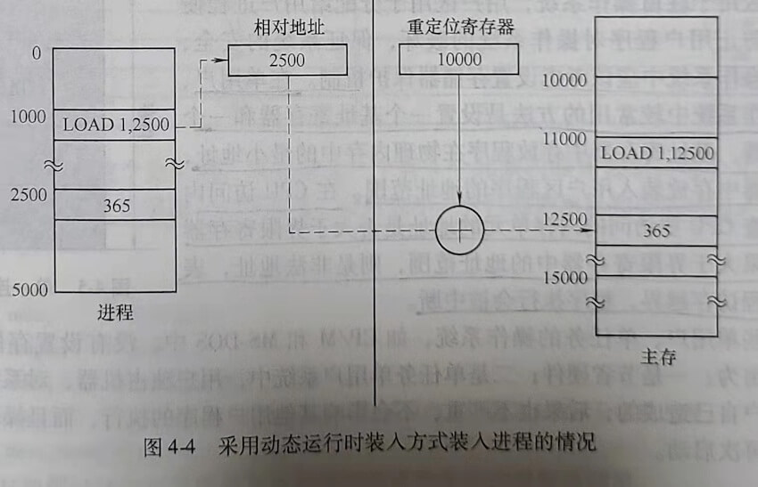

进程获得CPU运行时，操作系统将进程在内存中的起始地址10000存入重定位寄存器，作业运行的过程中，当要执行逻辑地址为1000的单元中的指令时，用逻辑地址1000与重定位寄存器中的地址10000相加，得到实际物理内存地址11000。CPU从11000物理单元取到指令LOAD 1，2500。当执行该指令访问逻辑地址为2500的单元取365时，先将2500与重定位寄存器的值10000相加，得到365所在的物理单元地址12500，然后从12500物理单元读取数据365

重定位寄存器是每CPU一个的，当发生进程切换时，要用获得CPU的进程在内存的起始地址更新重定位寄存器。

## 第三节 连续分配存储管理方式

<span style="border-bottom:2px solid; black;">连续分配是指操作系统分配内存时，为每个进程分配一块物理地址连续的内存空间</span>。连
续分配方式有3种类型。

#### 1. 单一连续区分配方式

<span style="border-bottom:2px solid; black;">内存中只有一个用户区，任意时刻内存中只能装人一道程序，这种分配方式仅适用于单用户、单任务的系统</span>。

#### 2. 固定分区分配方式

<span style="border-bottom:2px solid; black;">将内存用户区划分成若干个固定大小的区域，每个区域中驻留一道程序</span>。

#### 3. 动态分区分配方式

<span style="border-bottom:2px solid; black;">系统动态地对内存进行划分，根据进程需要的空间大小分配内存。内存中分区的大小和数量是变化的</span>。动态分区方式比固定分区方式显著地提高了内存利用率。

### 一、单一连续分配

单一连续分配方式适用于单用户、单任务的操作系统，它把内存分为系统区和用户区，系统区仅供操作系统使用，用户区供用户使用，如图4-5所示。

系统区用于驻留操作系统，用户区用于分配给用户进程使用。为了防止用户程序对操作系统的破坏，保证系统的安全可靠，在操作系统中应该考虑设置存储器保护机制。<span style="border-bottom:2px solid; black;">在单用户单任务操作系统中较常用的方法是设置一个基址寄存器和一个
界限寄存器。基址寄存器中存放程序在物理内存中的最小地址，界限寄存器中存放装入用户区程序的地址范围。在CPU访问内存时，检查CPU要访问的内存单元的地址是否大于界限寄存器的值。如果大于界限寄存器中的地址范围，则是非法地址，表
示用户进程访存越界，程序执行会被中断</span>。

在有些单用户、单任务的操作系统，如CP/M和MS-DOS中，没有设置存储器保护机制。其理由为：一是节省硬件；二是单任务单用户系统中，用户独占机器，对系统的破坏只可能是用户自己造成的，后果也不严重，不会影响其他用户程序的执行，而且操作系统很容易重装和再次启动。

### 二、固定分区分配

<span style="border-bottom:2px solid; black;">固定分区分配将用户内存空间划分为若干个固定大小的区域，在每个用户区中可以装入一道用户程序</span>，如图4-6所示。

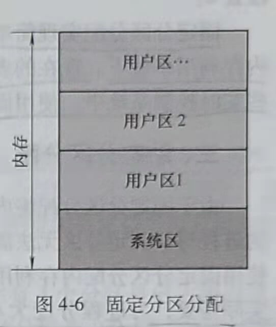

<span style="border-bottom:2px solid; black;">内存的用户区被划分成几个分区，便允许几个进程并发运行。当有一个空闲分区时，可从外存的后备队列中选择一个大小适当的作业装入该分区。当该作业结束时，释放所占用的分区，系统又可从后备作业队列中找出另一个作业调人该分区</span>。

#### 1. 划分分区的方法

<span style="border-bottom:2px solid; black;">固定分区分配的用户分区数量是固定的，每个分区的大小也是固定的。但是每个分区的大小可以相等、也可以不相等</span>。

##### (1) 分区大小相等

<span style="border-bottom:2px solid; black;">在这种设计中，把用户区划分成大小相等的若干个分区。这种设计的缺点是内存利用率比较低</span>。当程序太小时，该程序所占用的分区有很大一部分空间是空闲的。而程序较大时，可能找不到一个分区足以装下该程序。这种设计主要用于利用一台计算机去控制多个相同对象的场合，因为这种情况下，各用户进程需要的空间大小相同，例如，用一台计算机控制多台相同的冶炼炉。

##### (2) 分区大小不等

<span style="border-bottom:2px solid; black;">为了更好地利用内存，可以将用户区划分成大小不同、数量固定的若干个分区。为用户进程分配空间时，把大小最接近进程大小的空闲分区分配给申请内存空间的进程。使小进程占小分区，大进程占大分区，减少内存浪费</span>。

#### 2. 支持固定分区分配的数据结构

<span style="border-bottom:2px solid; black;">操作系统为了完成对固定分区的管理，必须定义一个记录用户分区大小和使用情况的数
据结构</span>。可以使用一个如表4-1所示的记录内存状况的内存分区说明表来管理内存分配。


用C语言来描述这个分区表，可以定义一个有4个元素的结构数组。每个元素对应一个分区。结构体包括4个字段：分区编号、分区大小、分区起始地址和分区状态。数据结构定义示例如下。
```c
struct
{
int num;//分区编号
int length;//分区大小
int addr;//分区起始地址
int state;//分区状态，该值为0表示分区空闲；该值为1表示分区被占用
} mem_block[4];
```
写程序时数据结构的定义根据具体系统的需要和算法的需要来调整。

#### 3. 固定分区分配的过程

<span style="border-bottom:2px solid; black;">需要为进程分配内存时，操作系统执行内存分配程序，搜索内存分区使用表。当找到个大小大于或等于进程需要的内存空间而且处于室闲状态的用户分区时，将该分区分配给进程，并将该分区状态改为“已占用”。在上面的数据结构中，就是将相应分区的state字段置1</span>。

#### 4. 固定分区的回收

<span style="border-bottom:2px solid; black;">当进程运行结束后，系统要回收进程占用的分区。通过执行内存回收程序完成回收操作，只要把回收分区的使用状态改为“空闲”即可，即把上面数据结构中相应分区的state字段置0</span>。

固定分区分配实现简单，但是由于每个分区的大小固定，必然造成存储空间的浪费，使内存利用率低下。现在的多道程序系统很少使用固定分区分配的内存管理方式。但是，在一些实时控制系统中，使用固定分区分配还是简单而有效的。

### 三、动态分区分配

由于固定分区分配将内存空间划分成大小固定的分区，当运行需要的内存空间比分区大的进程时，固定分区无法满足要求。而当运行只需要很小空间的进程时，内存空间浪费大。使用固定分区分配内存利用率低，难以提高系统的多道程序度。<span style="border-bottom:2px solid; black;">动态分区分配是根据进程的实际需要，为进程分配大小合适的内存区域。系统中用户分区的数量和大小都是动态变化的</span>。

本节主要介绍下列内容

1) 动态分区分配使用的数据结构。

2) 动态分区分配算法。

3) 动态分区的分配和回收操作。

#### 1. 动态分区分配原理

<span style="border-bottom:2px solid; black;">动态分区分配算法的原理：系统初始只有一个大空闲区，当进程请求空间时，由系统根据进程需要的空间大小划分出一片空闲区分配给进程</span>。系统运行一段时间后，内存的空闲区
可能散布在不连续的区域。系统维护一个记录当前空闲分区情况的数据结构，当进程请求内
存时，系统从所有空闲区中找到大小合适的空闲分区进行分配。系统中分区的大小和数量都
是变化的，空闲区的大小和数量也是变化的。

#### 2. 动态分区分配中的数据结构

为实现动态分区分配，系统需要建立并维护记录空闲分区情况的数据结构。常用的数据
结构有空闲分区表和空闲分区链。

##### (1) 空闲分区表

如表4-2所示，系统在空闲分区表中为每一个空闲分区建立一个表项，每个表项中包括分区编号、分区大小和分区起始地址。在具体程序实现时，可以用结构数组来实现空闲分区表。数组的每一个元素对应一个表项，记录一个空闲分区的情况。每个表项包含3个字段，即分区编号、分区大小和分区起始地址。<span style="border-bottom:2px solid; black;">使用空闲分区表的缺点是，若设置太多表项，会浪费内存空间；设置太少的表项，当空闲分区较多时，无法记录所有空闲分区的情况。在实现时，结构数组的大小不容易确定</span>。


在程序中可以用下列结构数组表示空闲分区表。
```c
struct
{
int num;//分区编号
int length;//分区大小
int addr;//分区起始地址
} FreeMem_block[N]
```
数组大小根据系统管理的最大分区数确定。

##### (2) 空闲分区链

<span style="border-bottom:2px solid; black;">使用空闲分区链可以动态地为每一个空闲分区建立一个结点，每个结点包括分区大小、分区起始地址、指向前一个空闲分区结点的指针，以及指向后一个空闲分区结点的指针。空闲分区链中的每个结点占用的内存可以动态分配、动态回收。使用空闲分区链可以克服空闲分区表存在的缺点</span>。

空闲分区链数据结构如图4-7所示。图中有5个分区，其中有3个分区是已占用分区。两个大小分别为10KB和20KB的分区是空闲分区，其起始地址分别为100KB和130KB。系统建立的空闲链表如图4-7所示，包括两个与空闲分区对应的结点。每个结点中包含了空闲分区的大小、空闲分区的起始地址和指向前一个空闲分区结点的指针、指向后一个空闲分区结点的指针。在实际系统中，也可以采用更复杂的双向链表或者双向循环链表。


使用双向空闲链表的数据结构如下所示。
```c
Struct FreeMem
{
int length;//空闲分区大小
int addr;//空闲分区起始地址
TFreeMem*prcv,*next;//指向前一个结点的指针和指向后一个结点的指针
}
```

#### 3. 动态分区分配算法

<span style="border-bottom:2px solid; black;">当进程需要内存空间时，操作系统通过执行动态分区分配算法从多个空闲分区中选定一个合适的分区分配给进程</span>。不同的分区分配算法有不同的特点，需要不同数据结构的支持。

下面介绍3种动态分区分配算法，即首次适应算法、循环首次适应算法和最佳适应算法。

##### (1)首次适应算法FF(First Fit,FF)

在采用空闲分区链作为数据结构时，<span style="border-bottom:2px solid; black;">首次适应算法要求空闲分区链以地址递增的顺序链接。在进行内存分配时，从链首开始顺序查找，直至找到一个能满足进程大小要求的空闲分区为止。然后，再按照进程请求内存的大小，从该分区中划出一块内存空间分配给请求者，余下的空闲分区仍留在空闲链中</span>。

该算法总是先分配低地址部分的内存空间，容易使低地址部分留下小分区，而高地址部分大空闲区较多。当进程请求大内存空间时，要找到合适的空闲分区，搜索空闲分区链需要的时间开销比较大。

<span style="border-bottom:2px solid; black;">此外，由于低地址部分的空闲分区反复被划分，可能留下许多难以利用的很小的空闲分区，这种难以被利用的小空闲区也被称为外部碎片或外碎片</span>。分配给进程的分区若大于进程请求的分区，分区内会存在一部分不被利用的空间，这部分被浪费的空间称为内部碎片或内碎片。

##### (2) 循环首次适应算法NF(Next Fit,NF)

<span style="border-bottom:2px solid; black;">该算法是由首次适应算法演变而形成的。在为进程分配内存空间时，不再每次从链首开始查找合适的空闲分区，而是从上次找到的空闲分区的下一个空闲分区开始查找，直至找到第一个能满足要求的空闲分区，并从中划出一块与请求的大小相等的内存空间分配给进程</span>。为实现该算法，应设置一个起始查找指针，以指示下一次起始查找的空闲分区，并采用循环查找方式，如图4-8所示。

循环首次适应算法的优点是：<span style="border-bottom:2px solid; black;">空闲区分布均匀、查找开销较小，缺点是容易使系统缺乏大空闲区</span>。

##### (3) 最佳适应算法BF(Best Fit,BF)

<span style="border-bottom:2px solid; black;">该算法每次为作业分配内存，总是把大小与进程所请求的内存空间大小最接近的空闲分区分配给进程，避免了“大材小用”。为了加速寻找，该算法要求将所有的空闲区按分区大小递增的顺序形成一个空闲区链</span>。这样，第一次找到的满足要求的空闲区必然是大小最接近进程需要的内存空间大小的。

<span style="border-bottom:2px solid; black;">最佳适应算法的优点是避免了大材小用，能提高内存利用率。但是，采用最佳适应算法容易留下难以利用的小空闲区</span>。

下面通过一个例题来说明首次适应算法、循环首次适应算法和最佳适应算法。

例4-1：当前空闲链如图4-9所示。

空闲链图示的含义如下。


假设系统中现有3个空闲分区，第一个空闲分区起始地址为20KB,大小为120KB；第二个空闲分区起始地址为200KB,大小为100KB；第三个空闲分区起始地址为400KB,大小为60KB。若某进程p1先请求大小为30KB的内存空间，随后进程p2再请求大小为20KB的内存空间。画出分别采用首次适应算法、循环首次适应算法和最佳适应算法时，为进程p1分配完空间之后系统的空闲链和在此之后为进程p2分配完空间后的空闲链（当空闲分区大小m.size-进程请求空间的大小u.size>1KB时，从空闲分区中为进程分配u.size大小的空间，将m.size-u.size大小的空闲空间作为新的空闲区使用)。

解答：

1) 若系统采用首次适应算法，空闲区应该按地址递增顺序排列，空闲区链如题所示。按照首次适应算法，从第一个大小合适的空闲区中划分一块给进程p1,从起始地址为20KB、大小为120KB的空闲区中划分30KB空间分配给进程p1。为进程p1分配完空间之后，空闲链变为如图4-10所示。

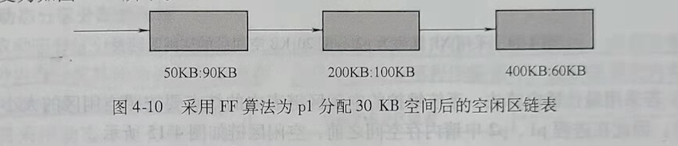

从这个链表中可以看到，为进程p1分配30KB空间后，第一个起始地址为20KB、大小为120KB的分区因给进程p1划分了30KB空间，变为起始地址为50KB，大小为90KB的空闲分区。若在此后，进程p2申请20KB空间，则空闲分区链中的第一个分区大小也满足p2的需要，从起始地址为50KB、大小为90KB的空闲分区中再划分20KB空间分配给p2后，系统空闲区链变为如图4-11所示。

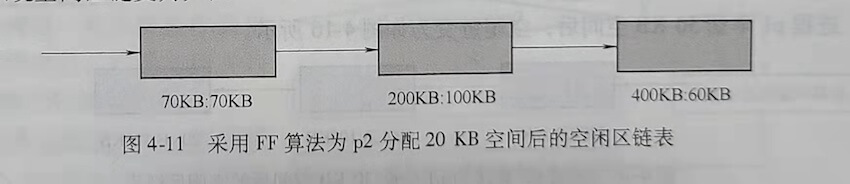

2) 若采用循环首次适应算法。系统维护的空闲区链表中要增加一个循环指针，每次为进程分配内存都从循环指针指向的结点对应的空闲分区开始。

初始空闲区链表为如图4-12所示。


进程p1申请30KB空间后，循环指针移到下一个结点，下一次分配空闲区时，从循环指针指向的结点开始搜索适合进程请求的空闲分区。系统为进程p1分配30KB空间后，系统空闲分区链表变为如图4-13所示。

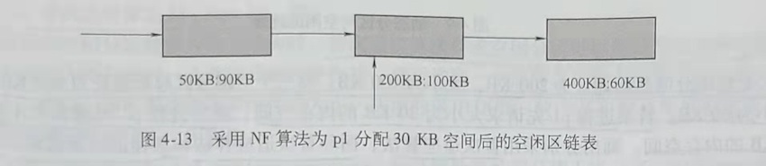

此后，p2再申请20KB空间，由于循环指针指向起始地址为200KB、大小为100KB的分区对应的结点，因此系统从该结点开始搜索大小大于或等于20KB的空闲分区，从中划分出20KB空间给进程p2，为进程p2分配20KB空间后，循环指针后移，系统空闲分区链变为如图4-14所示。


3) 若采用最佳适应算法。系统维护的空闲区链表中的结点要按照空闲区的大小由小到大排序，因此在进程p1、p2申请内存空间之前，空闲区链如图4-15所示。

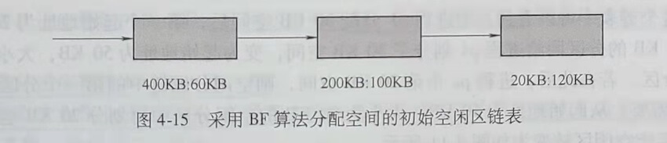

进程p1申请30KB空间后，空闲链变为如图4-16所示。

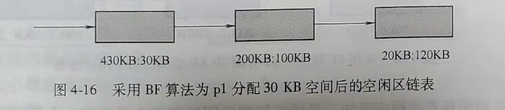

该链表在每一次分配空间后都要重新排序，以保证空闲分区链是按分区大小递增的顺序排序的。

此后，系统再为p2分配20KB空间后，系统空闲分区链表变为如图4-17所示。

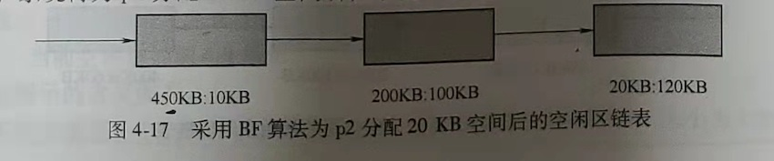

为了更好地说明问题，假设进程p1申请30KB空间后，p2申请大小为110KB的空间，在图4-16所示的链表中查找大小合适的空闲区，只有起始地址为20KB、大小为120KB的分区能满足进程p2的请求。系统从该分区中划分110KB的空间给进程p2，之后该分区剩余10KB的小分区作为新的空闲分区。空闲分区链变为如图4-18所示。


对空闲分区链重新排序，得到的空闲分区链如图4-19所示。


#### 4. 动态分区分配的流程

<span style="border-bottom:2px solid; black;">采取动态分区分配的内存管理方式，内存分配功能由内存分配程序完成，内存分配程序采用某种内存分配算法为进程分配内存。内存不再被应用程序需要时，由系统调用内存回收程序回收原来被占用的内存分区</span>。下面说明采用动态分区分配时内存分配的流程和内存回收的流程。

##### (1) 内存分配流程

如果进程申请的内存空间大小为u.size，当前结点对应的空闲分区大小为m.size，size是系统规
定的一个阈值。当系统接收到申请内存的请求后，按照如图4-20所示的流程分配空闲分区。


1) 检索空闲分区链。找到满足条件m.size≥u.size的空闲区(可以采用首次适应算法、循环首次适应算法或最佳适应算法)。

2) 如果m.size-u.size≤size，则直接把该空闲分区分配给进程。否则，从m.size中划出大小为u，size的空间分配给进程，把剩余的大小为m.size-u.size的空闲空间作为新的空闲分区。

3) 将分配给进程的分区起始地址返回给内存分配程序的调用者

4) 修改空闲分区链表。

##### (2) 内存回收流程

<span style="border-bottom:2px solid; black;">内存回收的任务是释放被占用的内存区域，如果被释放的内存空间与其他空闲分区在地址上相邻接，还需要进行空间合并</span>。

下面以采用动态分区链管理空闲分区的情况为例，说明内存回收的流程。

1) 释放一块连续的内存区域。

2) 如果被释放区域与其他空闲区间相邻，则合并空闲区。

3) 修改空闲分区链。

<span style="border-bottom:2px solid; black;">如果被释放的内存区域（回收区）与其他任何的空闲区都不相邻，则为该回收区建立一个空闲区链的结点</span>。使新建结点的起始地址字段等于回收区起始地址，空闲分区大小字段等于回收区大小。根据内存分配程序使用的算法要求（按地址递增顺序或按空闲分区大小由小到大排序)，把新建结点插入空闲分区链的适当位置。

如果被释放区域与其他空闲区间相邻，需要进行空间合并，在进行空间合并时需要考虑
以下3种情况。


1) 仅回收区的前面有相邻的空闲分区，如图4-21a所示。在这种情况下，把回收区与
空闲分区R1合并成一个空闲分区，把空闲链中与R1对应的结点的分区起始地址作为新空
闲区的起始地址，将该结点的分区大小字段修改为空闲分区R1与回收区大小之和。

2) 仅回收区的后面有相邻的空闲分区，如图4-21b所示。在这种情况下，把回收区与空闲分区R2合并成一个空闲分区。把空闲链中与R2对应的结点的分区起始地址改为回收区起始地址，将该结点的分区大小字段修改为空闲分区R2与回收区大小之和。

3) 回收区的前、后都有相邻的空闲分区，如图4-21c所示。在这种情况下，把回收区与空闲分区R1、R2合并成一个空闲分区。把空闲链中与R1对应的结点的分区起始地址作为合并后新空闲分区的起始地址，将该结点的分区大小字段修改为空闲分区R1、R2与回收区三者大小之和，删去与R2分区对应的空闲分区结点。当然，也可以修改分区R2对应的结点，而删去R1对应的结点。还可以为新合并的空闲分区建立一个新的结点，插入空闲分区链表，删除R1和R2对应的分区结点。

为了进一步说明回收流程来看下面的例题。

例4-2：当前空闲链如图4-22所示。

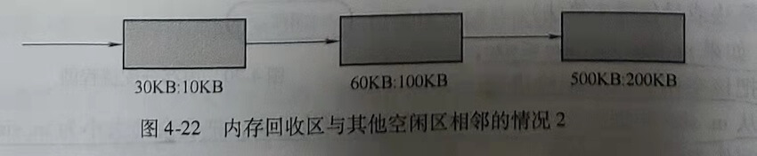

空闲链结点分别对应起始地址为30KB，大小为10KB；起始地址为60KB，大小为100KB；起始地址为500KB，大小为200KB的空闲分区。

假如系统采用首次适应算法分配内存，请画出分别回收如表4-3中所示的空闲区之后的空闲链。

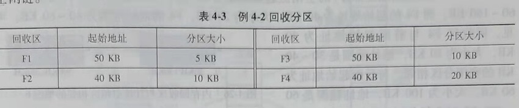

**解答**：

当回收区是F1时，F1前面的空闲区起始地址为30KB，大小为10KB，地址范围是30~40KB。F1后面（高地址部分）的空闲区起始地址为60KB，大小为100KB，地址范围是60~160KB。而F1的起始地址为50KB，大小为5KB，F1的地址范围为50~55KB。可见，回收区F1前后都没有相邻的空闲分区，因此，要为回收F1创建新的空闲分区链表结点，结点的起始地址字段为F1的起始地址50KB，结点的空闲分区大小字段为F1的大小5KB。按首次适应算法的要求，将该结点按空闲分区起始地址递增的顺序排序插入，得到回收F1后的系统空闲分区链表如图4-23所示。

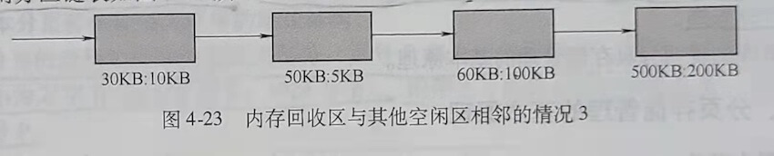

当回收区是F2时，F2前面的空闲区起始地址为30KB，大小为10KB，地址范围是30~40KB。F2后面（高地址部分）的空闲区起始地址为60KB，大小为100KB，地址范围是60~160KB。而F2的起始地址为40KB，大小为10KB，F2的地址范围为40~50KB。可见，回收区F2与前面起始地址为30KB，大小为10KB，地址范围是30~40KB的空闲分区相邻。因此，将该空闲分区与F2合并，合并后的空闲区起始地址为30KB，大小为20KB，得到回收F2后的系统空闲分区链表如图4-24所示。


当回收区是F3时，F3前面的空闲区起始地址为30KB，大小为10KB，地址范围是30~40KB。F3后面（高地址部分）的空闲区起始地址为60KB，大小为1O0KB，地址范围是60~160KB。而F3的起始地址为50KB，大小为10KB，F3的地址范围为50~60KB。可见，回收区F3与后面起始地址为60KB，大小为100KB，地址范围是60~160KB的空闲分区相邻。因此，将该空闲分区与F3合并，合并后的空闲区起始地址为50KB，大小为110KB。得到回收3后的系统空闲分区链表如图4-25所示。


当回收区是F4时，F4前面的空闲区起始地址为30KB，大小为10KB，地址范围是30~40KB。F4后面（高地址部分）的空闲区起始地址为60KB，大小为100KB，地址范围是60~160KB。而F4的起始地址为40KB，大小为20KB，F4的地址范围为40~60KB。可见，回收区F4与前面起始地址为30KB，大小为10KB，地址范围是30~40KB的空闲分区相邻。与后面起始地址为60KB，大小为100KB，地址范围是60~160KB的空闲分区也相邻。因此，将F4前后两个空闲分区与F4合并，合并后的空闲区起始地址为30KB，大小为130KB。得到回收F4后的系统空闲分区链表如图4-26所示。

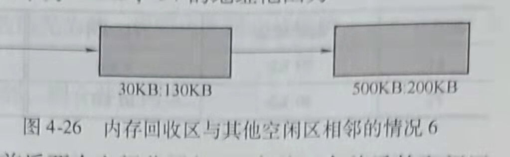

