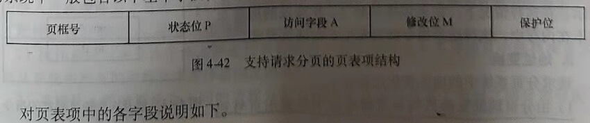
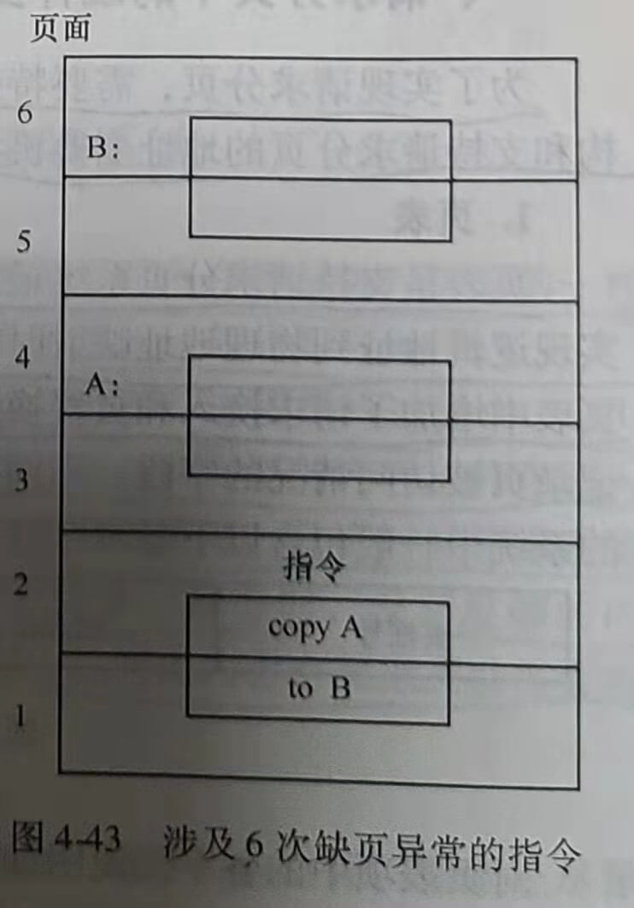
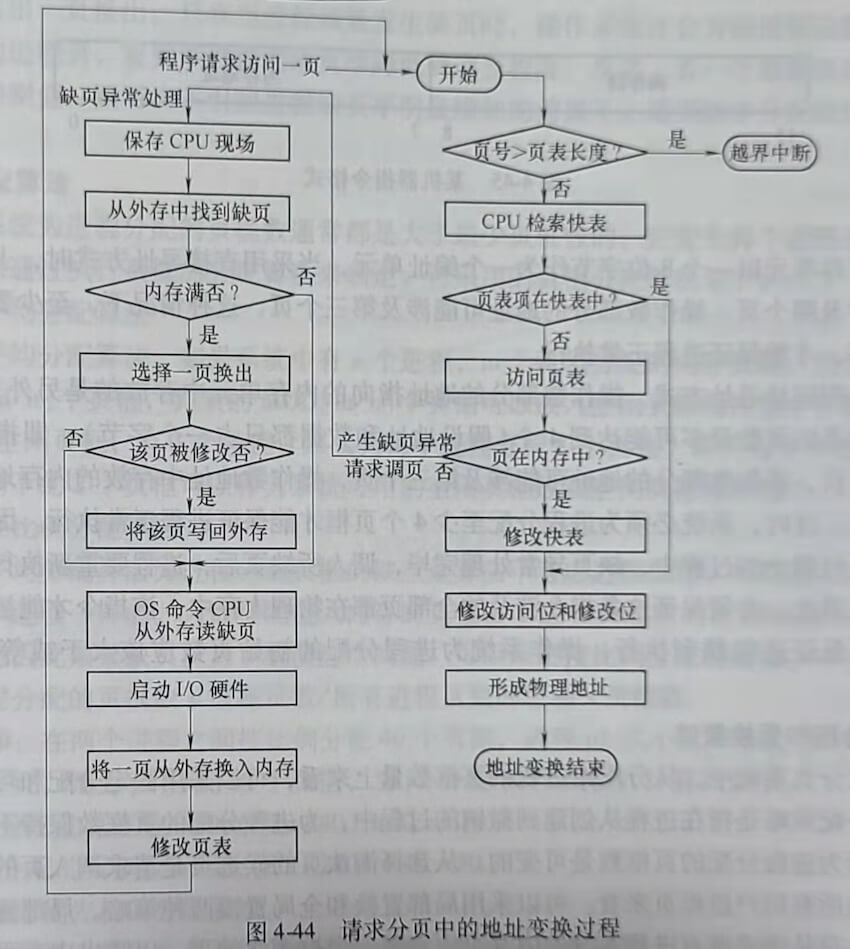
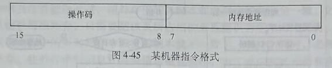
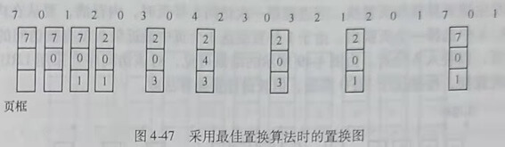
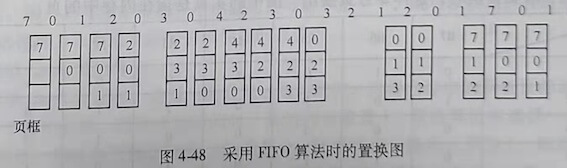
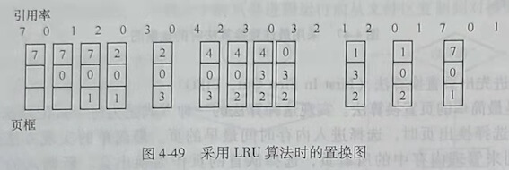
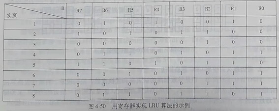
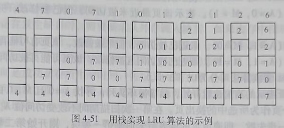

## 第五节 基于分页的虚拟存储系统
 
虚拟存储器是指具有请求调入功能和置换功能，能从逻辑上对内存容量进行扩充的一种存储器系统。在虚拟存储器系统中，进程无需全部装入，只要装入一部分即可运行。

虚拟存储技术实现的基本思想是，只把进程的一部分装入内存。进程执行过程中，CPU访问内存时如果发现所访问的内容不在内存中，则通过异常处理将所需要的内容从外存调入内存。也就是说先将进程的一部分装入内存，其余的部分什么时候需要，什么时候请求系统装入，这就是请求调入。如果在请求系统装入进程在外存中的某一部分时，没有足够的内存，则由操作系统选择一部分内存中的进程内容换出到外存，以腾出内存空间把当前需要装入的内容调入内存，这就是置换。

虚拟存储技术至少能带来以下3点好处。

1) 提高内存利用率。因为虚拟存储技术允许只把进程的一部分装入内存，原则上尽量把必须或常用的部分装入内存。

2) 提高多道程序度。因为只把每个进程的一部分装人内存，因此可以在内存中装人更多的进程。

3) 把逻辑地址空间和物理地址空间分开，使程序员不用关心物理内存的容量对编程的限制。

虚拟存储系统具有以下几个主要特征。

1) 离散性。离散性是指进程可以分散地存储在物理内存中。分页、分段和段页式存储都属于离散的内存管理方式。离散性是实现虚拟存储管理的基础。

2) 多次性。多次性是指不必把进程一次性全部装入内存，可以先将执行当前进程所必需的部分代码和数据装入内存，其余部分等进程运行需要时再装入，可以将进程分多次装入内存。

3) 对换性。对换性是指在内存中的进程可以换出，以腾出内存空间换入外存中的进程。为了提高内存的利用率，为程序员提供足够大的虚拟空间，在进程运行期间，系统可以将内存中暂时不用的程序代码或数据换出到外存，以后需要这些程序和代码时再由系统调入内存。

4) 虚拟性。虚拟性是指虚拟存储系统为用户提供了比实际物理内存大的逻辑内存空间，使程序员不必在编程时受物理内存空间大小的限制。虚拟性是实现虚拟存储系统的最重要的目标。

请求分页系统是最基本、最常用的虚拟存储系统的实现方式。其基本原理是，把进程的
逻辑地址空间分成大小相同的页，操作系统创建进程时只把进程的一部分页调入内存。进程运行过程中访问内存，若发现所访问的页不在内存中，则产生一个缺页异常信号，系统响应缺页异常，请求调入缺页。若调入缺页时内存已满，则需要先从内存中选择一个或若干个页换出到外存空间，以腾出内存空间容纳请求调入的缺页。本节将详细说明请求分页存储管理的实现原理。

### 一、请求分页中的硬件支持

为了实现请求分页，需要特殊的页表（相对于基本分页存储的页表而言）、缺页异常机构和支持请求分页的地址变换机构。

#### 1. 页表

页表是支持请求分页系统最重要的数据结构，其作用是记录描述页的各种数据、包括在实现逻辑地址到物理地址映射时需要的页号与页框号的对应关系。除了页号和页框号之外，页表中增加了请求换入和页置换时需要的数据。例如，表示页是否在内存中的状态位，以及记录页被访问情况的字段。不同的操作系统可能为页表项定义不同的字段，在支持请求分页的系统中一般包含以下基本字段，页表项的构成如图4-42所示。

1) 页框号：存放页所在的页框号。

2) 状态位P：用来标识页是否在内存中。例如，可以规定P为0时表示页不在内存中，需要请求调页；P为1时表示页在内存中，可以获取该页所在的页框号。

3) 访问字段A：用于记录页最近被访问的情况。A中可以存放页最近被访问的次数，也可以存放最近未被访问的时间长度。也可以简单地用A=1表示页最近被访问过，用A=0表示页最近没有被访问过。操作系统实现置换程序时需要根据A的值来选择被换出的页，出于效率的考虑，系统总是希望根据A的值把最近、最久未访问的页换出到外存。

4) 修改位M：用于标识页最近是否被修改过。由于内存中的每个页在外存中都保存有一个副本，如果页没有被修改过，则外存中的页副本和内存中的页完全一致。因此，换出页时就不用把页信息写回外存，只需要把该页所占用的页框标识为空闲可用即可。如果页最近被修改过，那么内存中的页和外存中该页的副本就不一致了。在换出页时，必须把最近修改过的页写回外存。往外存中写信息，需要请求磁盘操作，为了减少系统开销和启动磁盘的次数，在进行页置换时，尽量选择最近没有被修改过的页。

5) 保护位：用于标识页的访问权限，比如，该位值为1，表示页是既可读又可写的；该位为0，表示页是只读的。

#### 2. 缺页异常机构

缺页异常机构的主要作用是在访问内存过程中发现缺页时产生缺页异常信号，使CP中断当前控制流的执行，转去执行操作系统的缺页异常处理程序，完成请求调页。具体过程
如下。

1) 分页硬件通过页表完成逻辑地址到物理地址的映射时，通过检查页表中的状态位P，判断当前被访问的页是否在内存中。如果不在，则产生缺页异常信号。

2) 执行操作系统的缺页异常处理过程。先在内存中为请求调入的页找一个空闲页框。然后，调度磁盘操作，把需要的页装入找到的空闲页框中。

3) 修改页表，更新已经调入页的存在位、在内存中的页框号、访问位和保护位等字段的值。

4) 重新开始执行因缺页而被中断的指令。

缺页异常发生时，系统保存了被中断的进程状态，包括寄存器和程序计数器的内容。所以，缺页异常处理完成返回时，可以按照与中断前完全相同的位置和地址重新开始执行进程。

由于单条指令可能涉及多个不同的页，所以，从理论上说，执行单条指令的过程中可能发生多次缺页异常。例如指令：copy A to B，指令本身可能涉及两个不同的页，A、B两个变量也可能分别涉及不同的页，如图4-43所示。在这种情况下，如果该指令和A、B涉及的所有页都不在内存中，执行这条指令就会发生6次缺页异常。

#### 3. 地址变换

请求分页系统中的地址变化过程如下

1) 由分页地址变换机构从逻辑地址中分离出页号和页内偏移地址。

2) 以页号为索引查找快表，若快表中有该页的页表项，则读出页框号，计算物理地址。

3) 若快表中无该页信息，转到内存页表中查找。若页表中的状态位P显示该页已调入内存，则从相应的页表项读出页所在的页框号，并计算物理地址，然后把该页表项写入快表。

4) 若该页尚未调入内存，则产生缺页异常，请求操作系统从外存中把该页调入内存然后修改页表，重新执行被中断的指令。该过程可以用图4-44来表示。

### 二、页分配策略

本节要解决的问题是：

1) 只要装入进程的一部分页就可以运行进程，那么究竟为进程分配多少个页框，在内存中装入进程的多少个页呢？我们通过阐述最小页框数，也就是至少要为进程分配多少个页框才能使进程正常运行，回答上述问题。

2) 操作系统在需要请求调入并进行页置换时，是从缺页进程本身的页中选择淘汰页，还是从系统中所有的进程页中选择被淘汰的页？

3) 采用什么样的算法为不同的进程分配页框？系统如何在多个进程之间合理分配页框数？

下面对上述问题进行详细阐述

#### 1. 最少页框数

最少页框数，是指能保证进程正常运行所需要的最少的页框数。如果系统为进程分配的页框数少于这个值，进程将无法正常运行。保证进程正常运行所需要的最少页框数与进程的大小没有关系，它与计算机的硬件结构有关，取决于指令的格式、功能和寻址方式。

例如，一个支持16位指令格式的机器，用高8位表示操作码，低8位表示操作数，如图4-45所示。

如果内存单元以一个8位字节作为一个编址单元，当采用直接寻址方式时，上面的指令本身可能涉及两个页，操作数部分的地址可能涉及第三个页，这种情况下，至少要为进程分配3个页框，才能保证进程正常执行。

如果采用间接寻址方式，操作数部分的地址指向的内存单元中存放的是另外一个地址，这时指令涉及的页数最多可能达到4个（假设地址和数据都只占一个字节），即指令本身可能涉及两个页，操作数部分的地址可能涉及第三个页，操作数地址中存放的内存地址可能涉及第四个页。这时，系统必须为进程分配至少4个页框才能保证进程正常执行。因为缺页异常发生在执行指令的过程中，缺页异常处理完毕，调入所缺页后，进程要重新执行原来被中断的指令。因此，必须保证这条指令涉及的全部页都在物理内存中，该指令才能被顺利执行完毕。为了保证进程顺利执行，操作系统为进程分配的初始页数应该大于或等于最少页框数。

#### 2. 页分配和置换策略

在请求分页系统中，从分配给进程的页框数量上来看，可以采用固定分配和可变分配策略。固定分配策略是指在进程从创建到撤销的过程中，为进程分配的页框数保持不变，而可变分配是指为进程分配的页框数是可变的。从选择淘汰页的候选页是请求调入页的进程页还是系统中的所有用户进程页来看，可以采用局部置换和全局置换两种策略。局部置换是指发生置换时，只从请求调页进程本身的内存页中选择一个被淘汰的页，以腾出内存页框，装入请求调入的页。全局置换是指置换发生时，从系统中所有进程的内存页中选择被淘汰的页。固定分配和可变分配策略、局部置换和全局置换两种策略在实际系统中可以组合成以下3种页分配和置换策略。

##### (1) 固定分配局部置换

在进程创建时为每个进程分配一定数量的页框，在进程运行期间，进程拥有的页框数不再改变。当进程发生缺页时，系统从该进程在内存中的页中选择一页换出，然后再调入请求的页，以保证分配给该进程的内存空间保持不变。

##### (2) 可变分配全局置换

这是在操作系统中被广泛使用的策略。在采用这种策略时，先为系统中的每个进程分配一定数量的页框，同时，操作系统保持一个空闲页框队列。当某进程发生缺页时，由系统从
空闲页框队列中取出一个页框分配给该进程，并将欲调入的缺页装入其中。任何产生缺页的进程都可以由系统获得新的页框，以增加本进程在物理内存中的页数。当系统，总空闲页框数小于一个规定的阀值时，操作系统会从内存中选择一些页调出，以增加系统的空闲页框数，调出的页可能是系统中任何一个进程的页。

##### (3) 可变分配局部置换

进程创建时，为进程分配一定数目的页框。当进程发生缺页时，只允许从该进程在内存中的页中选出一页换出。只有当进程频繁发生缺页时，操作系统才会为该进程追加页框，以装入更多的进程页，直到该进程的缺页率降低到适当程度。反之，若一个进程在运行过程中的缺页率特别低，则可在不引起进程缺页率明显增加的前提下，适当减少分配给该进程的页框数。

#### 3. 分配算法

操作系统为进程分配的页框数通常都是大于最少页框数的，究竟为每个进程分配多少个页框，可以通过执行页框的分配算法来确定。可采用的页框分配算法如下。

##### (1) 平均分配算法

采用平均分配算法，如果系统中有n个进程，m个可供分配的内存页框，则为每个进程分配INT[m/n]个页框，其余的MOD[m/n]个页框可以放入空闲页框缓冲池中。例如，系统中有26个空闲页框，有3个进程，那么为每个进程分配8个页框，即共为3个进程分配24个页框，剩下的2个页框可以作为系统可用的空闲页框放在空闲页框缓冲池中。

##### (2) 按比例分配算法

采用平均分配算法为进程分配页框的缺点是算法不考虑进程规模，可能使大进程分配到的页框与小进程一样多。大进程能进入内存的页数占本进程页总数的比例远远小于小进程，大进程可能因此频繁缺页。为了解决这个问题，可以采用按比例分配的算法。

为进程分配的页框数=进程页数/所有进程页数的总和×页框数。

**例4-10**：在两个进程之间按比例分配40个页框，进程p1大小为80页，另一个进程p2大小为240页，则为p1分配10个页框，为p2分配30个页框。计算式如下

为p1分配的页框数=80/(80+240)×40=10。

为p2分配的页框数=240/(80+240)×40=30。

##### (3) 考虑优先权的分配算法。

这种分配算法的思想是为优先权高的进程分配较多的页框数，为优先权低的进程分配较少的页框数。

### 三、页调入策略

实现请求分页的虚拟存储系统，还需要解决系统应在何时、从何处调入所需页的问题。当系统产生缺页异常，调入请求页的同时可以只把该页调入内存，也可以在调入该页的同时，把与该页相邻的页也调入内存。外存中的页可以存放于对换区，也可能在文件区。

#### 1. 何时调入页

系统可以设计成只有在进程需要时才将页调入内存。在一种极端的情况下，进程的所有页都不在内存中就开始执行进程。当操作系统将指令指针指向进程的第一条指令时，由于所在的页不在内存中，立即产生缺页异常。当完成缺页异常处理，指令所在的页调入内存后，进程继续执行，执行过程中不断发生缺页异常，并不断将所缺页调人内存。当调入足够多的页后，多数需要的页都在内存中了，进程执行将不再出现缺页。这种策略有利于提高内存的
利用率，但是对系统的时间性能不利。

大多数系统都采用预先调入页的策略，将预计不久之后会被访问的页预先调入内存，而不是缺哪一页时再调入该页。在实际系统中，通常是在调入缺页时，把与所缺页相邻的若干页也调入内存。

#### 2. 从何处调入页

##### (1) 从对换区调入

当系统拥有足够的对换空间时，若发生缺页请求，则从对换区调入页。从对换区调入页比从文件区调入页的速度快。对换区中的页是进程运行前从文件区复制到对换区的。

##### (2) UNIX方式

进程运行前，与进程有关的程序代码、数据等都存放在文件区，所以，没有被访问过的页都直接从文件区调入。换出页都存放在对换区，曾经运行过而又被换出的页从对换区中调入。对于可以共享的页，如果已经由于其他进程的需要而被调入内存，就无需再次从外存调入。

#### 3. 页调入过程

请求调页和页调入的过程如图4-46所示。

### 四、页置换算法

本小节主要阐述页置换算法，同时介绍抖动及缺页率的相关问题。页置换算法是从内存页中选择换出页的算法。

#### 1. 最佳置换算法和先进先出置换算法

##### (1) 最佳置换算法(Optimal page-Replacement Algorithm)

最佳置换算法是Belady于1966年提出的一种页置换算法，该算法选择以后永远不会被访问的页或者在未来最长时间内不再被访问的页作为换出页。因此，该算法主要用于理论研究。例如，如果知道一个算法不是最优，但是与最优相比最坏情况下的缺页率比最佳置换算法最多高10%，平均缺页率与最佳置换算法相比最多高5%，可以此说明该置换算法的性能。

假定系统为某进程分配了3个页框，并考虑有以下的页引用序列。

7,0,1,2,0,3,0,4,2,3,0,3,2,1,2,0,1,7,0,1

进程运行时，先将7、0、1这3个页装入内存。当进程访问2号页时，由于2号页不在内存中，将产生缺页异常，请求调入2号页。由于3个页框已满，需要选择一个换出页，以腾出空闲页框装入2号页。若操作系统根据最佳置换算法选择被换出的页，由于7号页是未来最长时间不会被访问的页，所以选择7号页作为换出页，然后将2号页调入内存。访问完2号页后，访问0号页，由于该页已在内存中，所以不会产生缺页异常。当进程访问3号页时，因为3号页不在内存中，又要产生缺页异常，并且由于内存满，又要执行页置换算法选择换出页。根据最佳置换算法，这次选择2、0、1这3个页中的1号页换出，因为1号页是未来最长时间不会被访问的页，所以换出1号页，调入3号页。图4-47所示是采用最佳置换算法的置换图。由图可见，在此例中，采用最佳置换算法发生了6次页置换。

##### (2) 先进先出页置换算法(First In First Out,FIFO)

FIFO是最简单的页置换算法。实现这种算法的一种方式是为每个页记录该页调入内存的时间，当选择换出页时，选择进入内存时间最早的页。最简单的实现方法是创建一个FIFO的队列来管理内存中的所有页，选择队首的页作为换出页。新调入的页被加入到队尾。

FIFO算法实现简单，但是效率较低，会导致较高的缺页率。因为FIFO算法不考虑页被引用的频繁程度，例如有的页刚被换出，可能立刻又要被访问。在进程中有些页经常被访问，如包含全局变量、常用函数等的页，FIFO算法不能保证这些经常被访问的页不被换出。

仍然采用上面的例子来说明采用FIFO算法进行页置换的过程。如图4-48所示，当进程第一次访问2号页时，将把7号页换出，因为它是最早被调入内存的。访问0号页时，因为0号页已经在内存中，所以不会产生缺页异常，也不会发生页置换。当第一次访问3号页时，因为内存中的3个页2、0、1中，0号页是最早被调入内存中的，所以选择0号页作为淘汰页。由图4-48可见，在该例中，利用FIFO算法时，进行了12次页置换，比最佳置换算法的置换次数高一倍。

#### 2. 最近最久未使用LRU置换算法

FIFO算法实现简单，但是导致很高的缺页率和置换次数，性能较差。而最佳置换算法有最低的页置换次数，性能很好，却难以实现。因此，这里试图用“最近的历史”来预测“最近的将来”，实现最佳置换算法的近似算法。LU算法是广泛使用的性能较好的算法。

##### (1) LRU(Least Recently Used,LRU)算法的描述

LRU置换算法是选择最近最久未使用的页换出（最近最久未使用的页在最近的将来被访问的可能性也比较小)。该算法赋于每个页一个访问字段，用来记录一个页自上次被访问以来所经历的时间。当需要淘汰一个页时，选择现有页中t值最大的页换出。

仍然采用上面的例子来说明采用LU算法进行页置换的过程。当进程第一次访问2号页时，由于内存满，需要从7、0、1这3个页中选择一页换出，由于7号页是最近最久没有被访问的页，所以选择7号页换出。当进程第二次访问0号页时，由于0号页已在内存中，所以不会发生缺页异常和页置换。当进程第一次访问3号页时，内存满，要从在内存中的3个页2、0、1中选择一个页换出，由于1号页是这3个页中最近最久没有被访问的页，所以换出1号页，以装入3号页。由图4-49所示的结果可见，对该访问序列采用LRU置换算法发生了9次置换，性能优于FIFO算法，但较最佳置换算法差。

##### (2)LRU算法的实现

LRU算法是常用的页置换算法，性能较好，也有较好的实现方法。其实现主要解决两个问题，一是内存中的各个页各有多久时间未被进程访问；二是如何快速地知道哪一页是最近最久未使用的页。其可行的实现方法如下。

1) 寄存器。

为每个在内存中的页配置一个移位寄存器，可表示为R=Rn-1...R2R1R0。当进程访问某页框时，要将相应的寄存器的最高位置成1。此时，每隔一定时间将寄存器右移一位。如果把位寄存器的数看作是一个页对应的整数，那么具有最小数值的寄存器所对应的页就是最近最久未使用的页。图4-50所示的例子说明了一个具有8个页的进程，通过为每个页配备一个8位寄存器实现LRU算法的情况。在这个例子中，3号页的8位寄存器值最小。所以发生缺页、需要置换时，选择3号页换出。图中的实页是指在内存中的页。

2) 栈。

可利用一个特殊的栈来保存当前使用的各个页的页号。每当进程访问某页时，便将该页的页号从栈中移出，将它压入栈顶。因此，栈顶始终是最新被访问页的编号，而栈底则是最近最久未使用的页号。

图4-51所示的例子中，页访问序列为4,7,0,7,1,0,1,2,1,2,6，在访间6号页时发生缺页。此时栈底的页为4，是最近最久没有被访问的页，将4号页换出，调入6号页。

3) 计数器。

为每个页表项增加一个时间字段，并为CPU增加一个逻辑时钟或计数器。每次访问内存中的某个页时，就增加这个页对应的页表项的时间字段的值，每次置换时选择时间字段值最小的页作为换出页。

#### 3. 其他置换算法

计算机系统要提供足够的硬件来支持LRU算法是比较困难的，许多系统在实现时都采用LRU的近似算法，如附加引用位算法、简单Clok算法和改进型Clok算法等。

##### (1) 附加引用位算法

采用这种算法时，为每个内存中的页增加一个8位的字节，每隔一段时间（如100ms)，操作系统把每个页自己的访问位（请求分页管理的页表项中的A字段）移到8字节附加引用位的最高位，将其他位向右移，并抛弃最低位。进行页置换时，选择附加引用位值最小的页换出。因为具有最小附加引用位值的页可能不止一个，既可以换出所有这些页，也可以按FIFO选择部分具有最小附加引用位值的页换出。

##### (2) 简单Clock置换算法

利用简单Clok算法时，为每一页设置一位访问位，再将内存中的所有页都通过链接指针链接成一个循环队列。当某页被访问时，其访问位被置1。置换算法在选择一页换出时、按照FIFO算法，检查各页的访问位。如果是0，就选择该页换出；若为1，则重新将它置O，暂不换出而给该页第二次驻留内存的机会，再按照FIFO算法检查下一个页。

当检查到队列中的最后一个页时，若其访问位仍为1，则再返回到队首去重新从第一个页开始检查。

##### (3) 改进型Clock算法

简单Clock算法在选择一个换出页时，不考虑该页被修改的情况，而选择最近既没有被访问过又没有被修改过的页换出，能大大提高页置换的效率。在将一个页换出时，如果该页已被修改过，便应将它重新写到磁盘上，但如果该页未被修改过，则不必将它写回磁盘。换而言之，修改过的页在换出时所付出的时间开销将比未修改过的页开销大。在改进型C1ock算法中，除了必须考虑页的使用情况外，还考虑了置换代价这一因素，这样选择换出页时，既要是未使用过的页，又要是未被修改过的页。把同时满足这两个条件的页作为首选的淘汰页。改进型Clock算法描述如下。

在该算法中，由访问位A和修改位M可以组合成下面4种类型的页。

1) 第1类(A=0,M=0)。表示该页最近既未被访问，又未被修改，是最佳换出页。

2) 第2类(A=0,M=1)。表示该页最近未被访问，但已被修改，并不是很好的换出页。

3) 第3类(A=1,M=0)。最近已被访问，但未被修改，该页有可能再被访问。

4) 第4类(A=1,M=1)。最近已被访问且被修改，该页可能再被访问。

改进型Clok置换算法可分为以下3步。

1) 从指针所指示的当前位置开始，扫描循环队列，寻找A=0且M=0的第一类页。将所遇到的第一个页作为所选中的换出页。在第一次扫描期间不改变访问位A。

2) 如果第一步失败，即遍历页的链表后未遇到第一类页，则开始第二轮扫描。寻找A=0且M=1的第二类页，将所遇到的第一个这类页作为换出页。在第二轮扫描期间，将所有经过的页的访问位A置0。

3) 如果第二步也失败，即未找到第二类页，则将指针返回到开始的位置。然后再次寻找A=0且M=0的第一类页，如果仍失败，再寻找A=0且M=1的页，此时就一定能找到被换出的页。

改进型Clok置换算法最坏情况下，需4次扫描页队列，才能选中被换出的页。

##### (4) 最少使用置换算法(Least Frequently Used Page--Replacement Algorithm,LFU)

这种算法选择最近时期内使用次数最少的页作为淘汰页。这种算法为每个页保留一个用于记录页被访问次数的计数器，每次选择其访问计数器值最小的页换出。这种算法可能存在的问题是：有些页在进程开始时被访问的次数很多，但以后这些页不再被访问，这些页不应该长时间留在内存中，而应该在不再被访问时被换出。解决这个问题的方法之一是定期地将计数器右移，以形成指数衰减的平均使用次数。

##### (5) 页缓冲算法

页缓冲算法采用FIFO算法选择换出页，并为换出页建立两个链表，被换出的页要放入两个链表中的一个。如果页没有被修改过，则将其放入空闲页链表中。如果页被修改过，则将其放入已修改页的链表中。页在内存中并不做物理上的移动，而只是将页表中的表项移到上述两个链表之一中。

空闲页链表实际上是一个空闲页框链表，其中的每个页框都是空闲的，因此可以在其中装入程序或者数据。当需要读入一个页时，便可利用空闲页框链表中的第一个页框来装入该页。当有一个没有被修改的页要换出时，实际上并不将它换出内存，而是把该页所在的页框挂在空闲页链表的末尾。在置换一个已修改的页时，将其所在的页框挂在修改页链表的末尾。采用这种方式可以使没有被修改的页和已经被修改的页都留在内存中。当进程以后再次需要访问这些页时，就不用从磁盘而只需从内存中再次使这些页回到进程在内存的驻留集中，使这些页所在的页框成为“被占用”状态即可，由此减小了请求调入和页置换的开销。

已修改页的链表周期性地或者当已修改页的数量达到一定阈值时被延迟写人磁盘，减少了换
出时写磁盘的时间开销。

### 五、请求分页系统的性能分析

前面已经阐述了基于请求分页的存储管理的基本原理，在设计和选择虚拟存储管理的策略和算法时，不可避免地要考虑访存的性能。请求调入和置换技术都是以时间换空间的技术，如何在应用这种技术时尽量提高时间性能是在设计系统时需要考虑的问题。

#### 1. 缺页率对有效访问时间的影响

进程执行中访存发生缺页时，需要请求从外存调入缺页。如果内存中没有空闲页框，还需要进行页置换，调入缺页后，指令需要重新执行。因此，一旦发生缺页，进程会存在因为访存而带来的时间延迟。下面分析缺页率对有效访问时间的影响。

有效访问时间是成功访存所用的时间。假设P为缺页率，ma为存储器访问时间。这里根据实际系统的可能性，取ma=100 ns=0.1μs。缺页异常服务时间、缺页读入时间及进程重新执行时间近似地取25ms是合理的。由此：

有效访问时间=（1-P)×ma+P×缺页异常时间。

缺页异常时间=缺页异常服务时间+缺页读人时间+进程重新执行时间≈25ms(毫秒)=25000μs(微秒)

所以，有效访问时间=0.1×(1-P)+25000×P=0.1+24999.9×P

由上式可见，有效访问时间正比于缺页率。下面以实例数据说明缺页率对有效访问时间的影响。

**例4-11**：
P=0时 有效访问时间=0.1us

P=1/1000时 有效访问时间=0.1+24999.9×1/1000=0.1+24.9999≈25μs

可见，缺页率P=1/1000时，有效访问时间延长为P=0时的250倍。

**例4-12**：要使有效访问时间延长不超过10%，缺页率P为多少？

因为P=0时，有效访问时间=0.1μs。

P不为0时，有效访问时间为(0.1+24999.9P)μs。

P不为0时比P为0延长的时间为：(0.1+24999.9P)-0.1=24999.9P

要使 24999.9p/0.1<10% 必须使P<0.000.0004

即要使有效访问时间延长不超过10%，缺页率应该小于250万分之一。

#### 2. 工作集

##### (1) 基本原理

引入工作集机制是为了能有效降低缺页率，从而提高访存的时间效率。程序在运行时对页的访问是不均匀的，即往往在某段时间内的访问仅局限于较少的若干个页，而在另一段时间内，则又可能仅局限于访问另一些较少的页。若能预知程序在某段时间间隔内要访问哪些页，并能将它们提前调入内存，将会大大降低缺页率，从而减少置换次数，提高CPU的利用率。工作集就是在某段时间间隔△里，进程实际要访问的页的集合。要使缺页少发生，必须使程序的工作集全部在内存中。

用W(t,△)表示当时间间隔为△时t时刻的工作集。

1) △太大，工作集中的页太多，影响存储器利用率。

2) △太小，工作集中的页太少，缺页率高。

3) W(t,△)与t相关，不同的t对应不同的工作集。即程序运行的过程中，运行到不同的时刻，需要访问的页不同。

##### (2) Windows NT的工作集机制

1) 进程被第一次创建时，为进程指定了一个最小工作集和一个最大工作集。最小工作集是进程正常运行需要调入内存的最小页数。当内存有足够的空间时，可以为进程分配足够的空间以装入它的最大工作集。

2) 当某进程在内存中的页数小于最大工作集时，若发生缺页，系统从空闲页框队列中取一页框分配给该进程。

3) 当某进程在内存中的页数等于最大工作集时，若发生缺页，系统从该进程的页中按FIFO的原则，换出一个该进程的页。

4) 当空闲页框队列中空闲页的数量减到一个最低值时，系统检查所有进程，对工作集大于最小工作集的进程，淘汰该进程的一些页，使该进程的工作集等于最小工作集。

#### 3. 抖动产生的原因和预防方法

##### (1) 抖动

多道程序度太高，使运行进程的大部分时间都用于进行页的换入、换出，而几乎不能完成任何有效工作的状态称为抖动。引起系统抖动的主要原因是系统中的进程数量太多，每个进程能分配到的页框太少，以至于进程运行过程中频繁请求调页。

##### (2) 抖动的预防

可以采用以下方法预防抖动的发生。

1) 采取局部置换策略。当进程发现缺页后，仅在进程自己的内存空间范围内置换页，不允许从其他进程获得新的页框。

2) 在CPU调度程序中引入工作集算法。只有当每个进程在内存中都有足够大的驻留集时，才能再从外存中调入新的作业。

3) 挂起若干进程。为了预防抖动，挂起若干进程，腾出进程占用的空间。