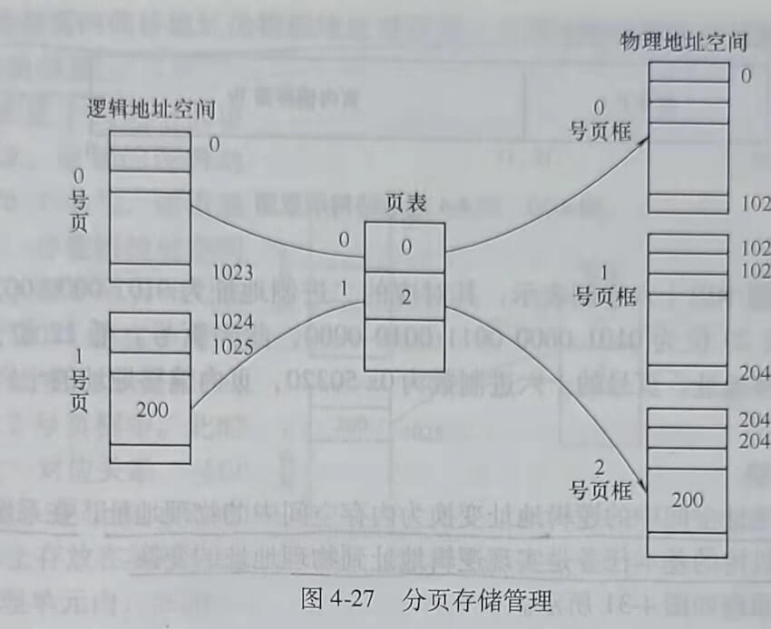
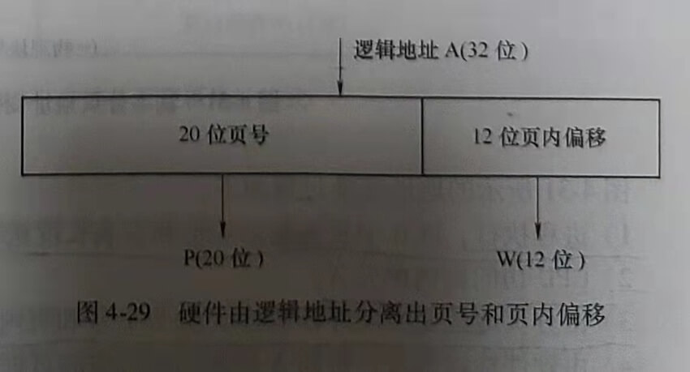
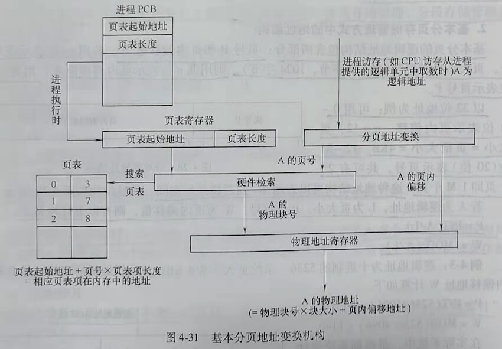
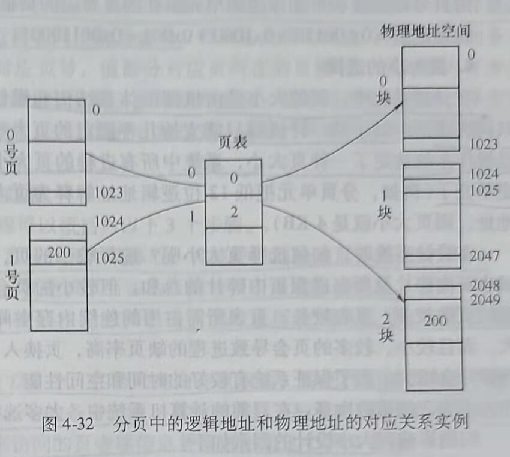
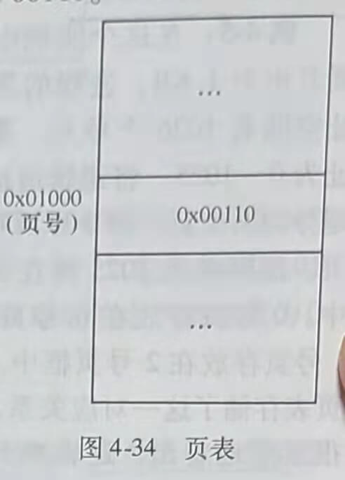
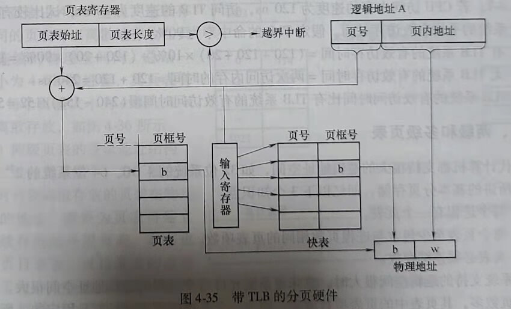
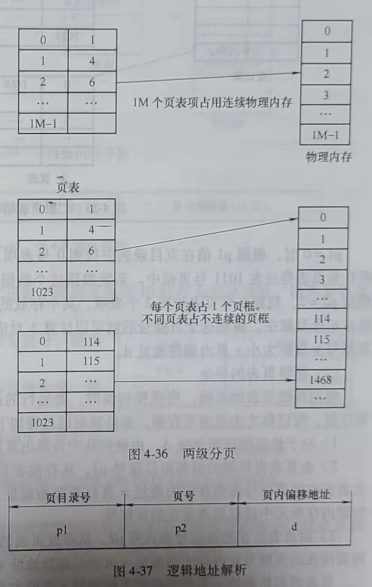
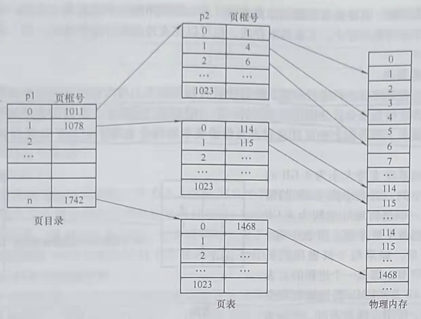
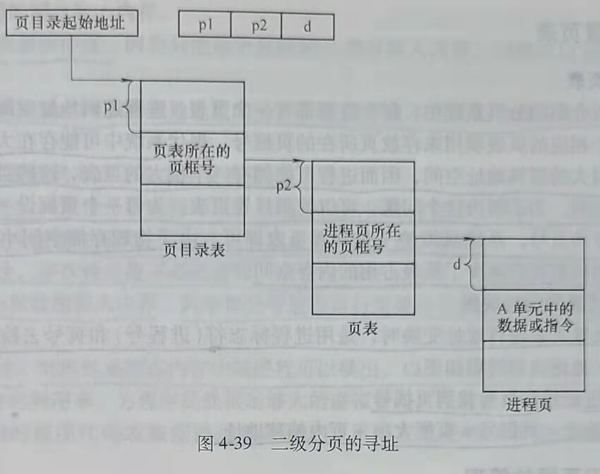

## 第四节 基本分页存储管理方式

把进程离散地存储在内存中物理地址不连续的区域中，这种内存管理方式称为离散内存管理方式。为了支持虚拟内存管理，需要引入离散内存管理方式。根据离散内存管理分配内存空间的基本单位的不同，将其分为3种不同的管理方式：分页存储管理、分段存储管理和段页式在储管理。

本节详细说明分页存储管理的基本原理。

### 一、分页存储管理的基本原理

#### 1.基本概念

##### (1) 页(Page)

将一个进程的逻辑地址空间分成若于个大小相等的片，称为页。

##### (2) 页框(Page Frame)

将物理内存空间分成与页大小相同的若干个存储块，称为页框或页帧。

##### (3) 分页存储

在为进程分配内存时，以页框为单位将进程中的若干页分别装入多个可以不相邻接的页框中。如图4-27所示，一个进程的逻辑地址空间包括两个页：0号页和1号页。0号页存放在0号页框中，1号页存放在2号页框中。

##### (4) 页内碎片

进程的最后一页一般装不满一个页框，而形成了不可利用的碎片，称为“页内碎片”是一种内部碎片。

##### (5) 页表(Page Table)

页表是系统为进程建立的数据结构，页表的作用是实现从页号到页框号的映射，在进程地址空间内的所有页(0~n)，依次在页表中有一个页表项，其中记录了相应页在内存中对应的页框号。如图4-27所示，一个进程的逻辑地址空间划分成了两个页：0号页和1号页。0号页存放在0号页框中，1号页存放在2号页框中。该进程的页表中有两个表项，0号表项中存放了页框号0，指示0号页存放在0号页框中。1号表项中存了页框号2，指示1号页存放在2号页框中。在基本的分页机制中，每个进程有一个页表，进程的每一个页在页表中有一个对应的页表项。页表在内存中连续存放。

#### 2. 基本分页存储管理方式中的地址结构

基本分页的逻辑地址结构包含两部分：页号P和页内偏移量W。若用m位表示逻辑地址，页大小为2^n字节（如512字节，1024字节），则用低n位表示页内偏移量W,用高m-n位表示页号P。

以32位地址为例：可用0~11位表示页内偏移，n=12，页大小=页框大小=4KB。12~31位(20位)表示页号，共可有2^20个页即1M个页。这种地址结构可以表示4G的逻辑地址空间，地址结构如图4-28所示。

若A为逻辑地址，L为页大小，P为页号，W为页内偏移量，则有以下计算关系。

P=INT(A/L)

W=MOD (A/L)

**例4-3**：逻辑地址为十进制的5236，系统页大小为4KB,该逻辑地址所在的页号P和页内偏移地址W计算如下。

P=INT(5236/4096)=1

W=M0D(5236/4096)=1140

在实际系统中，是根据系统设计好的页大小和地址结构，由硬件从逻辑地址A中分离出页号和页内偏移地址。若系统的地址结构为32位，页大小为4KB，则硬件将逻辑地址A的高20位解释为页号，低12位解释为页内偏移，如图4-29所示。

**例4-4**：已知逻辑地址A为0x503200A0，若地址结构如图4-28所示，请问该地址对应的页号和页内偏移地址分别是什么？

逻辑地址A在题中以十六进制表示，其对应的二进制地址为0101 0000 0011 0010 0000 0000 1010 0000,高20位为0101 0000 0011 0010 0000，此为页号。低12位为0000 1010
0000，此为页内偏移地址。页号的十六进制数为0x50320，页内偏移地址的十六进制数为0xA0。

#### 3. 分页地址变换

为了能将用户地址空间中的逻辑地址变换为内存空间中的物理地址，在系统中必须设置地址变换机构，该机构的基本任务是实现逻辑地址到物理地址的变换。

分页地址变换原理如图4-31所示。

图4-31所示的地址变换过程如下。

1) 进程执行，PCB中页表起始地址和页表长度送CPU的页表寄存器

2) CPU访问逻辑单元A。

3) 由分页地址变换硬件自动将A分为页号和页内偏移两部分

4) 由硬件检索页表，得到A所在的页对应的页框号

页号对应的页表项起始地址=页表起始地址+页表项长度×页号（页表项中存有页框号)。从该地址指示的内存单元中读取页框号

5) 页框号和页内偏移地址送物理地址寄存器，计算物理地址。物理地址=页框大小×页框号+页内偏移量。

**例4-5**：在这个实例中假定页大小为1KB，进程的逻辑地址空间有1026个单元，逻辑地址为0~1025。将逻辑地址空间划分为两个页，即0号页和1号页。逻辑单元1025落在1号页中。0号页存放在0号页框中，1号页存放在2号页框中。此时页表存储了这一对应关系。可以很显然地看出，逻辑单元1025中的内容实际上存放在物理地址为2049的物理单元内，如图4-
32所示。

当执行汇编指令Move eax，(1025)时，如何根据程序中给出的逻辑单元1025计算出对应的物理地址呢？

1) 计算页号p。

由题意可知，页大小为1KB,即1024个字节。

P=INT(A/L)=INT(1025/1024)=1。

2) 搜索页表可知，1号页存放在2号页框中。

3) 页内偏移地址W=M0D(A/L)=M0D(1025/1024)=1。

4) 逻辑单元1025所对应的物理单元地址=页框号×页框大小+页内偏移地址=2×1024+1=2049。

由图4-32可见逻辑单元1025内存放整数200，逻辑单元1025相应的物理内存地址为2049。

**例4-6**：某计算机系统按字节编址，采用一级页表的分页存储管理方式，分页逻辑地址格式如图4-33所示。

页表如图4-34所示。

请问逻辑地址0x01000001经过地址转换后的物理地址是什么？

**解答**：

由题中给出的地址结构可知：硬件将逻辑地址的高20位解释为页号，低12位解释为页内偏移。逻辑地址0x 0100 0001的二进制表示为0000 0001 0000 0000 0000 0000 0000 0001。该逻辑地址的高20位为0000 0001 0000 0000 0000，此为页号，其十六进制表示为0x01000。该逻辑地址的低12位为0000 0000 0001，此为页内偏移，其十六进制表示为0x001。由页号检索页表可知该逻辑单元所在的页对应的页框号为0x00110。

物理地址=0x00110×0x1000+0x001=0x00110001

#### 4.页大小的选择

在分页系统中，页的大小是由机器的体系结构和操作系统共同决定的。对于某一种机器只能支持几种固定的页大小，一旦操作系统选定了一种页大小，系统中所有进程的页大小就固定不变了（例如，分页单元把低12位逻辑地址解释为页内偏移地址，则页大小就是4KB)。

在设计系统时，如何选择页大小呢？选择较小的页，可以减小页内碎片及所有进程页内碎片的总和。但较小的页会使进程的页数较多，页表较长，页表所需占用的连续内存空间比较大。而且较小、较多的页会导致进程的缺页率高，页换入、换出频繁。若选择较大的页，页内碎片会增大。为了保证系统有较好的时间和空间性能，要慎重选择大小合适的页，一般页的大小为2的整数次幂。在目前的计算机系统中，大多选择4KB大小的页。

归纳影响页大小设计的因素如下。

##### (1)管理内存的开销

选择较小的页，会导致进程被划分为较多的页，页表过长，占用大量内存空间。同时，进程的缺页率和置换率都会比较高，内存管理的时间开销相对大。

##### (2)内存的利用率

选择较小的页，有利于提高内存的利用率，但存在(1)所述的缺点。选择较大的页，可克服(1)所述的缺点，但页内碎片大，空间利用率降低。

页大小一般是2的整数次幂，大小为512B~4KB。现在硬件可以支持多种不同的页大小，页大小可以选择4KB、16KB、2MB、4MB、8MB和16MB等。如果系统支持的通常是大作业，可以选择较大的页。而支持较小的交互式应用的系统可以选择较小的页，现在的交互式系统大多选择4KB的页。

### 二、快表

页表的硬件实现有多种方法，最为简单的一种方法就是将页表存放在一组专用寄存器中，进程调度程序选中新的进程执行时，更新这组寄存器的值，把当前进程的页表装入寄存器。操作系统使用特权级指令装入或修改页表寄存器的值。早期的DEC PDP-11就采用这种结构。但是，目前使用的计算机系统都允许非常大的进程页表，一个页表中的表项可能多达上百万个，把这么大的页表存放在寄存器中显然是不合适的，所以，现在的计算机系统基本上都把页表存放在内存中。在这种情况下，CPU要访问内存读写数据或读取指令，必须访问两次内存。第一次访问内存，从内存页表中获取访存单元所在的页框号，以形成访存单元的物理地址。第二次访存是根据计算出的物理地址实现对内存单元的访问，读写数据或读取指令。每一次的有效访存都必须要访问页表，因此访问页表的效率很重要。而两次访存都有时间开销，为了减少CPU在有效访存上的时间开销，提高访存速度，在硬件上引入了快表机制。

#### 1. 什么是快表

快表也称转换后援缓冲(Translation Look-aside Buffer,TLB)，是为了提高CPU访存速度而采用的专用缓存，用来存放最近被访问过的页表项。TLB是关联的快速闪存。TLB的条目由两部分组成：键和值。键部分对应页号，值部分对应页所在的页框号。当关联内存查找TLB中的页表项时，会同时与所有键进行比较，如果找到条目，就得到相应的值域，从而得到页的页框号。这种查找方式比较快，但是硬件比较昂贵。通常，TLB的条目数很有限，在64~1024个之间。

#### 2. 引入TLB之后的地址变换过程

引入TLB之后的地址变换过程可以概括为以下3个步骤。

1) CPU产生分页的逻辑地址页号和页内偏移后，将该逻辑地址的页号提交给TLB。

2) 查找TLB,如果找到页号，则把该页所在的页框号用于形成物理地址。否则(TLB失效)查找内存页表，从内存页表中找到相应的页表项，读取页所在的页框号，以形成物理地址。

3) 如果所查找的页表项不在TLB中，在访问完内存页表后，要把找到的页表项中的页号和页框号写到TLB中。如果TLB中的条目已满，系统会根据某种策略（如最近最少使用替换)选择一个TLB中的条目，用刚访问的页表项信息替换选中的这个TLB条目。

有些系统中允许TLB中的某些条目是固定不变的，也就是说这些条目是永远不会被更新和替换的。这些被固定的TLB条目通常是与操作系统内核代码相关的条目。

带TLB的分页硬件如图4-35所示。

使用TLB还有一个很重要的问题是，TLB是系统中所有进程公用的一套硬件缓存，如何保证在发生进程切换后，新的当前进程不会错用了TLB中保存的旧进程的页表项？下面用一个实例来说明这个问题。系统中有两个进程p1和p2，进程p1的1号页存放在第100号页框中，在进程p1的页表中有一个相应的页表项如下。

|页号|页框号|
|:-|:-|
|1|100|

进程p2的1号页存放在200号页框中，在进程2的页表中有一个相应的页表项如下。

|页号|页框号|
|:-|:-|
|1|200|

当进程p1在CPU上运行时，页表项【1,1O0】在进程访问过1号页后会存入TLB。当TLB中还存留有进程p1的页表项【1,1O0】时，如果发生进程切换，p2开始在CPU上运行。当CPU访问进程p2的1号页时，如何保证不会错误地找到【1,100】这个条目，而能正确地找到【1,200】这个条目？

解决途径如下。

1) 每当进程切换时就刷新一次TLB,保证TLB中只有当前进程的页表项。

2) 在每个TLB页表项中保存地址空间标识符(Address-Space Identifier,ASID)。ASID用来唯一标识进程。当TLB试图命中一个页表项时，为了确保这个页表项属于当前进程，TLB会确保当前进程的ASID与被查找的TLB页表项的ASID相同。

#### 3. 引入TLB的性能分析

在TLB中找到某一个页号对应的页表项的百分比称为TLB命中率。当能在TLB中找到所需要的页表项时，有效访存时间等于一次访问TLB的时间加上一次访问内存的时间。当没有在TLB中找到所需要的页表项时，访存时间等于一次访问TLB的时间加上两次访问内存（一次访问内存页表，一次访问内存读写数据或指令）的时间。

下面以一个实例来说明引入TLB对改善有效访存速度所起的作用。

**例4-7**：若CPU访问内存的速度为120ns，访问TLB的速度为20ns，试比较有TLB和无TLB系统的平均有效访存时间。假定TLB的命中率为90%。

1) 有TLB系统的有效访存时间=(120+120+20)×10%+(120+20)×90%=152ns

2) 无TLB系统的有效访存时间=两次访问内存的时间=120+120=240ns

无TLB系统的有效访问时间比有TLB系统的有效访问时间慢(240-152)/152=57.9%。

### 三、两级和多级页表

现代计算机都支持很大的逻辑地址空间，如32位系统的4GB，64位系统的224TB。使用前面所讲的基本分页存储，回忆以下3个知识点。

1) 每个进程有一个页表。

2) 每个页表至少包含与进程页数相同的页表项数

3) 页表必须连续存放。

当系统支持的逻辑空间很大时，意味着系统允许每个进程的逻辑地址空间很大。大进程包含的页数多，其页表中的页表项数就多。因为一个系统的页表项长度是固定的，所以，页表项数越多，页表的长度越大，存放页表所需要的连续地址空间也越大。大多数系统都支持32位逻辑地址空间，即4GB的逻辑地址空间。随着计算机硬件的更新换代，逻辑地址空间和物理内存空间都会更大。如果系统支持的页大小为4KB，那么在32位系统中每个进程可以拥有4GB/4KB=1M个页。相应的，页表中有至少需要1M个页表项，如果每个页表项的长度为4个字节（存放一个页表项需要4个字节的物理内存空间），那么一个进程的页表需要1M×4B=4MB的连续物理空间来存放。从系统性能考虑，不希望用这么大的连续地址空间存放页表，解决的办法就是把页表再分页，形成两级或多级页表。由此，可以将页表离散地存放在物理内存中。页表离散存放，也可以在支持虚拟存储管理时，将一部分页表存放在外存中。

#### 1. 两级页表

两级页表是将页表再进行分页，使每个页表分页的大小与内存页框的大小相同，并为它们编号。将这些页表分页分别放入不同的、不一定相邻的页框中为离散分配的页表再建立一张外层页表，本书称之为页目录表，页目录表中的每个表项中记录了页表分页所在的页框号。

以前面系统支持大小为4GB的逻辑地址空间、页大小为4KB的情况为例，一个逻辑地址空间为4GB的进程，拥有1M个页，页表中有1M个页表项，如果每个页表项的长度为4个字节，那么一个进程需要1M×4B=4MB的连续物理空间来存放。使用二级页表时，把4M大小的页表分成1024个页表分页，这1024个页表分页中包含的是页表项，本书中把这种页表分页称为页表。每个页表占4KB空间，连续存放。不同的页表可以离散地存放在页框号不连续的物理空间内。总结一下，大小为4GB的进程，其页表有1K个，每个页表大小为4KB，1K个页表离散存放，如图4-36所示。

##### (1) 两级页表的逻辑地址结构

在二级分页系统中，为了能在地址映射时得到离散存放的页表在物理内存中的地址，需要为页表再建立一个连续存放的外层页表，本书也称之为页目录表。页目录表的表项
中存放了每一个页表在物理内存中所在的页框号。为了能实现逻辑地址到物理地址的映射，必须把要访问的逻辑地址解析成如图4-37所示的结构。

页目录号p1实际上是一个索引值，根据p1从页目录表中找到页表所在的页框号。页号p2是页表中的偏移量，根据p2可以知道应该从页表的第p2项中找到进程页所在的页框号。

根据如图4-38所示的实例做简单说明：如果由逻辑地址A得到p1=0，p2=2，那么A所在的进程页存放在哪个页框中？

p1=0时，根据p1值在页目录表中找到0号表项，该表项中存放的页框号是1011，说明0号页表存放在1011号页框中。系统根据这个数据，可以在内存中找到0号页表。然后根据p2=2，找到0号页表的第2个表项。其中存放的页框号是6，说明A所在的进程页存放在6号页框中。得到这个页框号后就可以计算A对应的物理地址了。物理地址=A所在的页框号×页框大小+页内偏移地址d。

##### (2) 两级页表的寻址

使用两级页表的系统，当进程切换时，要运行的进程的页目录表起始地址被写入CPU寄存器，可以称之为页表寄存器，地址映射的过程如下。

1) 对于给定的逻辑地址A，由硬件从中分离出页目录号p1、页号p2和页内地址d。

2) 由页表寄存器的值和页目录号p1，从存放页目录的页框中找到页表所在的页框号。页表所在的页框号在内存中的地址=页目录起始地址+p1×页表项长度，从该地址指示的物理内存单元中读取页表所在的页框号。

3) 由页表所在的页框号和页号p2，从存放页表的页框中找到进程页所在的页框号。进程页所在的页框号在内存中的地址=页表的起始地址+p2×页表项长度。

页表的起始地址=页表所在的页框块号×页框大小。

4) A的物理地址=进程页所在的页框号×页框大小+页内地址d。

可以结合图4-39理解上述寻址过程。

**例4-8**：某系统逻辑地址和物理地址均为32位，采用两级分页，页大小为4KB，地址
结构如图4-40所示。

已知逻辑地址为0x00801004，2号页表如图4-41所示。求其对应的物理地址。

答案：逻辑地址0x00801004的二进制地址为0000 0000 1000 0000 0001 0000 0000 0100

由图中给出的地址结构可知，取二进制逻辑地址的高10位作为页目录号，得到页目录号为0x2。

取二进制逻辑地址的中间10位作为页号，得到页号为1。

取二进制逻辑地址的低12位作为页内偏移，得到页内偏移值为0x4。

由2号页表可得到页号为1的页表项中存放的页框号为0x208,即进程页所在的页框号。

逻辑地址0x00801004对应的物理地址为：0x208×0x1000+0x4=0x208004。

##### (3) 减少页表占用内存的方法

为了减少页表所占内存，可以将当前所需要的页目录表和页表存放在内存中，其余页表存放在外存中，当所需页表不在内存中时，产生中断，将请求的页表调入内存。

#### 2. 多级页表结构

对于64位的机器，使用二级页表，仍存在连续占用大量内存的问题，可以采用多级页表结构，将外层页表再分若干页，然后为外层页表建立连续存放的索引表。

**例4-9**：64位机器若仍然采用二级页表，页表项占4个字节，页大小为4KB,低12位表示页内偏移，中间10位表示页表项在页表中的表项号，那么外层页号就可以使用42位。表示系统中可以有2^42个页表分页，外层页表就有4096G个页表项，需要4×4096G字节的连续物理内存来存放外层页表。因此，需要对外层页表再进行分页，建立更外层的页表，形成多级页表。

### 四、反置页表

#### 1. 反置页表

在前面所介绍的分页系统中，每个进程都有一个页表，进程逻辑地址空间的每个页在页表中都有一个相应的页表项用来存放页所在的页框号。现代系统中可能存在大量进程，每个进程都允许很大的逻辑地址空间，因而进程可能拥有一个很大的页表，这些页表会占用大量的物理内存空间。为了解决这个问题，可以使用反置页表，为每一个页框设一个表项，表项中存放进程号和页号，系统只维护一张反置页表即可。由于物理存储空间小于逻辑存储空间，所以使用反置页表减少了页表占用的内存空间。

##### 2. 反置页表的地址映射

在利用反置页表进行地址变换时，是用进程标志符（进程号）和页号去检索反置页表以获取页框号。地址映射过程如下。

1) 根据进程号和页号找到页框号。

2) 物理地址=页框号×页框大小+页内偏移地址。

### 五、空闲页框的管理

操作系统需要跟踪和记录空闲页框的信息，下面介绍两种管理空闲页框的方式。

#### 1. 使用位图管理空闲页框

使用位图管理空闲页框时，使位图中的每一位对应一个页框，具有N个页框的内存需要至少有N个二进制位的位图。当某个二进制位对应的页框被占用时，将该位置1。当该页框空闲时，该位置0。当操作系统为进程分配页框时，检索位图，找对应位为0的页框分配给进程（具体实现时用0表示空闲，1表示被占用，反之也可）。

#### 2. 使用空闲页框的链表

使用空闲页框链表时，系统维护记录空闲页框信息的链表。空闲页框链表可以按地址递增的顺序排序，每个结点中包含页框的地址信息、指向后面结点的指针和指向前面结点的指针。

