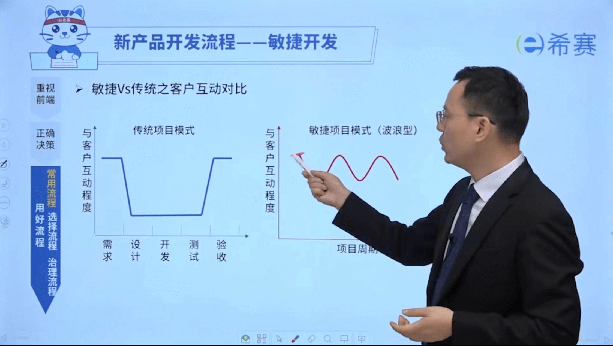
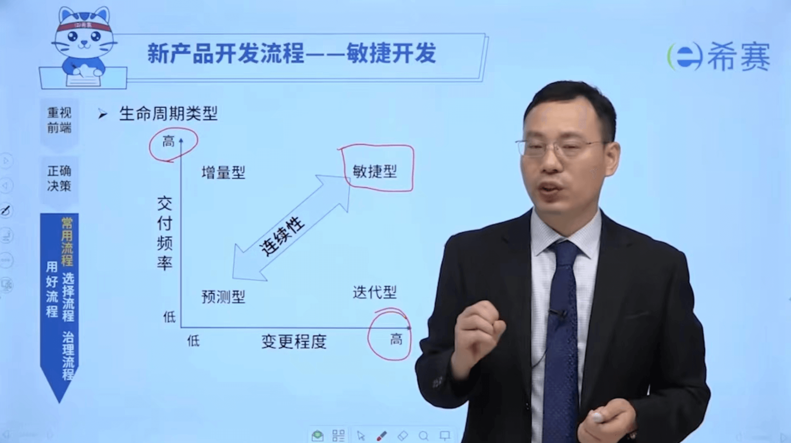
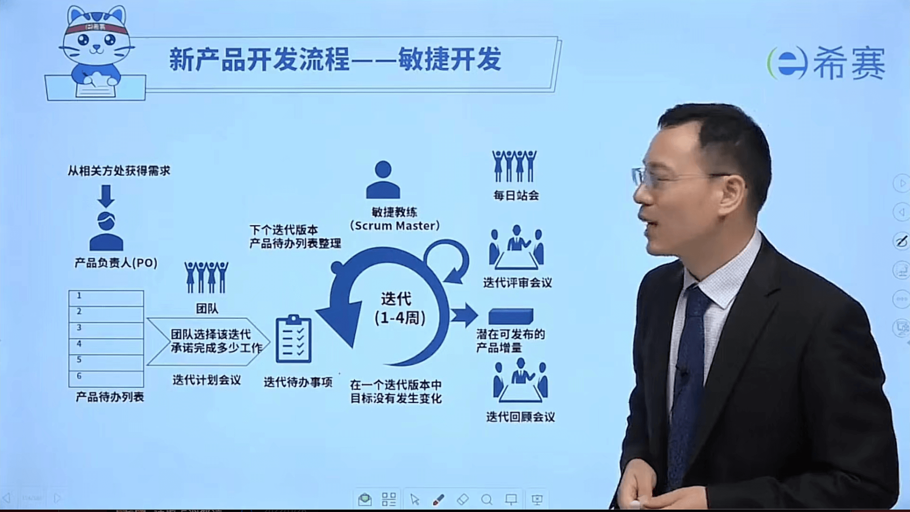

# 敏捷开发

在传统开发中，如果变更需求，需有走需求变更流程，当频繁出现需求时，这个流程走起来时非常辛苦，很有可能导致变更不控制，项目就容易失控，这样是谁都不愿意看到的，新产品开发流程--敏捷开发就这样产生了。

## 敏捷方法Vs传统方法

<table>
	<tr>
		<th>传统的写作方式</th>
		<th>敏捷的写作方式</th>
	</tr>
	<tr>
		<td>确定主题</td>
		<td>与读者微博、论坛互动</td>
	</tr>
	<tr>
		<td>整理大纲、搭建框架</td>
		<td>确定主题</td>
	</tr>
	<tr>
		<td>书写内容</td>
		<td>与读者互动、收集反馈</td>
	</tr>
	<tr>
		<td>设计、排版、校对</td>
		<td>试写第一章</td>
	</tr>
	<tr>
		<td>出版</td>
		<td>与读者互动、收集反馈</td>
	</tr>
	<tr>
		<td>与读者见面</td>
		<td>试写第二章</td>
	</tr>
	<tr>
		<td>收集反馈，在版本</td>
		<td>...</td>
	</tr>
	<tr>
		<td></td>
		<td>初步设计、排版</td>
	</tr>
	<tr>
		<td></td>
		<td>与读者互动、收集反馈</td>
	</tr>
	<tr>
		<td></td>
		<td>出版</td>
	</tr>
</table>

  

传统方法的问题：需求不是一尘不变的，等做完了发现不是产品想要的。

敏捷方法的好处：早期交付，较低成本；增加与客户的交互，降低产品不适用的风险；传统方法开发到一半的时候，代码不可用，而敏捷已交付的可用。

## 生命周期类型

  

敏捷型：交付频率高、变更程度高。技术不确定、需求确定或者技术确定、需求不确定的项目适用于敏捷开发。

## 敏捷思维

4大价值观，12大原则，2000多实践。

敏捷思维模式由价值观定义，以原则为指导，并在许多不同的实践中来体现。敏捷实践者根据自身需求选择不同的实践。

## 敏捷宣言

通过运用此法及帮助他人运用此法，我们正在探寻更好的软件开发方法。在这项工作中，我们看重“个体以及互动”胜过“流程和工具”，“可工作的软件”胜过“完整的文档”，“客户合作”胜过“合同谈判”，“响应变化”胜过“遵循计划”。

## 4大价值观

以人为本（个体以及互动）、以价值为导向（可工作的软件）、合作共赢（客户合作）、拥抱变化（响应变化）。

## 12条原则

1.通过早期和持续交付有价值的软件，实现客户满意度。  
2.欢迎不断变化的需求，即使是在项目开发的后期。要善于利用需求变更，帮助客户获得竞争优势。  
3.不断交付可用的软件，周期通常是几周，越短越好。  
4.项目过程中，业务人员与开发人员必须在一起工作。  
5.项目必须围绕那些有内在动力的个人而建立，他们应该受到信任。  
6.面对面交谈是最好的沟通方式。  
7.可用性是衡量进度的主要指标。  
8.提倡可持续的开发，保持稳定的进展速度。  
9.不断关注技术是否优秀，设计是否良好。  
10.简单性至关重要，尽最大可能减少不必要的工作。  
11.最好的架构、要求和设计，来自团队内部自发的认识。  
12.团队要定期反思如何更有效，并相应地进行调整。  

## Scrum

  

3个支柱：透明性、检验、适应。  
3个角色：产品负责人、敏捷教练、敏捷团队。
3个工件：产品代办事项列表、冲刺待办事项列表、可交付产品增量。  
5个事件：冲刺、冲刺规划会议、每日站会、迭代评审会议、迭代回顾会议。

## 参考链接
 
[敏捷开发入门教程](https://www.ruanyifeng.com/blog/2019/03/agile-development.html)  
抖音@希赛项目管理  